# Pokémon Changes

This document exists as a reference guide to the changes made to Pokémon within Sacred Gold and Storm Silver. All changes (bar Evolutions, which have their own document) are listed in here, including changes to abilities, level-up moves, stats, types and others.

Notation is the following…

1. () = New
1. {} = Replaces Original
1. [] = Shifts from Original Position
1. \* = Level Up Moves Revamped

In an ability context, if {} is used then it refers to which ability has been replaced by the new one, otherwise it's just an addition. For level-up moves, it is explanatory with the prior definitions.

Remember: Use Ctrl+F to find a Pokémon easily! If a Pokémon is missing from the document, then no changes have been applied to it.

Also an important note: the move relearner, together with the move deleter has been moved to the top left house in Cianwood City. There are also some changes to moves:

1. Cut is a 60-power Grass move
1. Strength is a 60-power Rock move with a 10% chance of reducing the foe's Attack.
1. Rock Smash is a 60-power Fighting move with a 30% chance of reducing Defense.
1. All Black and White upgrades to moves have been added where possible, too.

---

## Kanto Pokémon

**#001 Bulbasaur**


Ability:

```
+ Chlorophyll
```

Level Up Moves:

```
+ Sludge (17)
+ Nature Power (29)
+ Power Whip (43)
```

**#002 Ivysaur**


Ability:

```
+ Chlorophyll
```

Level Up Moves:

```
+ Sludge (18)
+ Nature Power (34)
+ Power Whip (49)
```

**#003 Venusaur**


Ability:

```
+ Chlorophyll
```

Level Up Moves:

```
+ Sludge (18)
+ Nature Power (34)
+ Power Whip (60)
```

**#004 Charmander**


Ability:

```
+ Solar Power
```

Level Up Moves:

```
+ Metal Claw (13)
```

**#005 Charmeleon**


Ability:

```
+ Solar Power
```

Level Up Moves:

```
+ Metal Claw (13)
```

**#006 Charizard**


Ability:

```
+ Solar Power
```

Level Up Moves:

```
+ Metal Claw (13)
+ Belly Drum (36)
+ Outrage (73)
```

**#007 Squirtle**


Ability:

```
+ Rain Dish
```

Level Up Moves:

```
+ Zen Headbutt (31)
+ Water Spout (43)
```

**#008 Wartortle**


Ability:

```
+ Rain Dish
```

Level Up Moves:

```
+ Aqua Jet (16)
+ Zen Headbutt (36)
+ Water Spout (52)
```

**#009 Blastoise**


Ability:

```
+ Rain Dish
```

Level Up Moves:

```
+ Aqua Jet (16)
+ Zap Cannon (36)
+ Zen Headbutt (39)
+ Water Spout (67)
```

**#010 Caterpie**

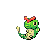

Ability:

```
+ Run Away
```

Level Up Moves:

```
+ Bug Bite (1)
+ Snore (1)
```

**#012 Butterfree**


Ability:

```
+ Tinted Lens
```

Level Up Moves:

```
+ Gust (10)
+ Air Cutter (16)
+ Giga Drain (20)
+ Air Slash (26)
+ Baton Pass (32)
+ Psychic (38)
```

Stat Changes:

```
+ Special Attack (100)
+ Special Defense (100)
+ Speed (80)
+ Total (435)
```

Base Experience Change:

```
+ 160 >> 180
```

**#013 Weedle**


Ability:

```
+ Run Away
```

Level Up Moves:

```
+ Bug Bite (1)
```

**#015 Beedrill**


Ability:

```
+ Sniper
```

Level Up Moves:

```
+ Twinneedle (10)
+ Aerial Ace (16)
+ Cross Poison (16)
+ Night Slash (22)
+ X-Scissor (31)
+ Drill Peck (37)
+ Megahorn (43)
```

Stat Changes:

```
+ Attack (100)
+ Special Defense (90)
+ Speed (95)
+ Total (435)
```

Base Experience Change:

```
+ 159 >> 179
```

**#016 Pidgey**


Level Up Moves:

```
+ Gust [1]
+ Pluck (9)
+ Brave Bird (53)
```

**#017 Pidgeotto**


Level Up Moves:

```
+ Gust [1]
+ Pluck (9)
+ Brave Bird (62)
```

**#018 Pidgeot**


Stat Changes:

```
+ HP (103)
+ Attack (91)
+ Total (500)
```

Level Up Moves:

```
+ Razor Wind (1)
+ Gust (1)
+ Pluck (9)
+ Close Combat (36)
+ Brave Bird (68)
```

Base Experience Change:

```
+ 172 >> 194
```

**#019 Rattata**


Ability:

```
+ Hustle {1}
```

Level Up Moves:

```
+ Flame Wheel {25}
+ Reversal (37)
```

**#020 Raticate**


Stat Changes:

```
+ HP (65)
+ Attack (91)
+ Speed (107)
+ Total (443)
```

Ability:

```
+ Hustle {1}
```

Level Up Moves:

```
+ Fire Fang
+ Thunder Fang
+ Ice Fang (20)
+ Reversal (49)
```

**#021 Spearow**


Ability:

```
+ Sniper
```

Level Up Moves:

```
+ Pursuit [1]
+ SonicBoom (13)
+ Tailwind (41)
```

**#022 Fearow**


Stat Changes:

```
+ Attack (95)
+ Speed (105)
+ Total (452)
```

Ability:

```
+ Sniper
```

Level Up Moves:

```
+ Pursuit [1]
+ SonicBoom (13)
+ Tailwind (53)
+ Megahorn (59)
```

Base Experience Change:

```
+ 162 >> 169
```

**#023 Ekans**


Level Up Moves:

```
+ Poison Tail (23)
```

**#024 Arbok**


Stat Changes:

```
+ Attack (91)
+ Speed (86)
+ Total (450)
```

Level Up Moves:

```
+ Poison Tail (25)
```

Base Experience Change:

```
+ 147 >> 163
```

**#025 Pikachu**


Stat Changes:

```
+ Attack (65)
+ Special Attack (60)
+ Speed (95)
+ Total (325)
```

Ability:

```
+ Lightningrod
```

Level Up Moves:

```
+ Charge (1)
+ Volt Tackle (49)
```

Base Experience Change:

```
+ 82 >> 92
```

**#026 Raichu**


Stat Changes:

```
+ Attack (100)
+ Special Attack (100)
+ Speed (121)
+ Total (516)
```

Ability:

```
+ Lightningrod
```

Level Up Moves:

```
+ Volt Tackle (49)
```

Base Experience Change:

```
+ 122 >> 179
```

**#027 Sandshrew**


Level Up Moves:

```
+ Super Fang (41)
+ Earthquake (45)
```

**#028 Sandslash**


Level Up Moves:

```
+ Super Fang (57)
+ Earthquake (65)
```

**#029 Nidoran F**


Level Up Moves:

```
+ Super Fang (47)
```

**#030 Nidorina**


Level Up Moves:

```
+ Super Fang (65)
```

**#031 Nidoqueen**


Stat Changes:

```
+ HP (100)
+ Total (505)
```

**#032 Nidoran M**


Level Up Moves:

```
+ Super Fang (47)
```

**#033 Nidorino**


Level Up Moves:

```
+ Super Fang (65)
```

**#034 Nidoking**


Stat Changes:

```
+ Attack (97)
+ Special Attack (90)
+ Total (505)
```

**#035 Clefairy**


Level Up Moves:

```
+ Aromatherapy (49)
```

**#036 Clefable**


Ability:

```
+ Unaware {1}
```

Level Up Moves:

```
+ Softboiled (1)
```

**#037 Vulpix**


Ability:

```
+ Forewarn
```

TM:

```
+ Compatibility with TM53
+ Energy Ball.
```

Level Up Moves:

```
+ Hypnosis (14)
```

**#038 Ninetales**


Ability:

```
+ Drought
```

TM:

```
+ Compatibility with TM53
+ Energy Ball.
```

Level Up Moves:

```
+ Morning Sun (1)
```

**#039 Jigglypuff**


Ability:

```
+ Soundproof
```

Level Up Moves:

```
+ Pound [1]
+ Defense Curl [7]
+ Perish Song (53)
+ Wish (57)
```

**#040 Wigglytuff**


Stat Changes:

```
+ HP (148)
+ Defense (55)
+ Special Attack (85)
+ Special Defense (65)
+ Total (450)
```

Ability:

```
+ Soundproof
```

Level Up Moves:

```
+ Wish (46)
```

Base Experience Change:

```
+ 109 >> 129
```

**#041 Zubat**


Ability:

```
+ Anticipation
```

Level Up Moves:

```
+ Wing Attack [1]
+ Hypnosis {17}
+ Nasty Plot (45)
+ Brave Bird (49)
```

**#042 Golbat**


Ability:

```
+ Anticipation
```

Level Up Moves:

```
+ Wing Attack [1]
+ Hypnosis {17}
+ Nasty Plot (57)
+ Brave Bird (63)
```

**#043 Oddish**


Ability:

```
+ Run Away
```

Level Up Moves:

```
+ Razor Leaf (11)
+ Nature Power (19)
+ Teeter Dance (45)
```

**#044 Gloom**


Ability:

```
+ Stench
```

Level Up Moves:

```
+ Razor Leaf (11)
+ Nature Power (19)
+ Drain Punch (21)
+ Teeter Dance (59)
```

**#045 Vileplume**


Stat Changes:

```
+ Special Attack (110)
+ Special Defense (100)
+ Total (500)
```

Ability:

```
+ Effect Spore
```

Level Up Moves:

```
+ Earth Power (41)
```

Base Experience Change:

```
+ 184 >> 192
```

**#046 Paras**


Level Up Moves:

```
+ Leech Life [1]
+ Bug Bite {11}
+ Cross Poison (22)
```

**#047 Parasect**


Stat Changes:

```
+ Attack (115)
+ Defense (100)
+ Total (445)
```

Level Up Moves:

```
+ Fury Cutter {1}
+ Bug Bite {11}
+ Cross Poison (22)
```

**#048 Venonat**


Level Up Moves:

```
+ Signal Beam [19]
+ Baton Pass {35}
```

**#049 Venomoth**


Type Change:

```
+ Bug / Poison >> Bug / Psychic
```

Ability:

```
+ Poison Heal {1}
```

TM:

```
+ Compatibility with TM04
+ Calm Mind.
```

Stat Change:

```
+ Special Attack (115)
+ Total (475)
```

Level Up Moves:

```
+ Signal Beam (19)
+ Ominous Wind {31}
+ Baton Pass {37}
+ Giga Drain {41}
+ Sludge Bomb {47}
```

**#051 Dugtrio**


Stat Changes:

```
+ Attack (100)
+ Total (425)
```

**#053 Persian**


Stat Changes:

```
+ Attack (90)
+ Total (460)
```

Level Up Moves:

```
+ Hypnosis (1)
```

**#054 Psyduck**


Level Up Moves:

```
+ Hypnosis (52)
+ Psychic (57)
+ Petal Dance (61)
```

**#055 Golduck**


Level Up Moves:

```
+ Cross Chop (33)
+ Hypnosis (62)
+ Psychic (68)
+ Petal Dance (73)
```

**#057 Primeape**


Level Up Moves:

```
+ Fire Punch (28)
+ Ice Punch (28)
+ Thunder Punch (28)
```

**#058 Growlithe**


Level Up Moves:

```
+ Ember [1]
+ Double Kick {6}
```

**#059 Arcanine**


Level Up Moves:

```
+ Close Combat (1)
+ Flare Blitz (50)
```

**#060 Poliwag**


Level Up Moves:

```
+ Mud Shot (13)
```

**#061 Poliwhirl**


TM:

```
+ Compatibility with TM60
+ Drain Punch.
```

Level Up Moves:

```
+ Mud Shot (13)
+ Metronome (25)
```

**#062 Poliwrath**


Stat Changes:

```
+ Attack (95)
+ Defense (100)
+ Total (515)
```

TM:

```
+ Compatibility with TM60
+ Drain Punch.
```

Level Up Moves:

```
+ Ice Punch (23)
+ Drain Punch (33)
+ Close Combat (63)
```

**#063 Abra**


Ability:

```
+ Magic Guard {2}
```

**#064 Kadabra**


Ability:

```
+ Magic Guard {2}
```

Level Up Moves:

```
+ Gravity (48)
```

**#065 Alakazam**


Ability:

```
+ Magic Guard {2}
```

Level Up Moves:

```
+ Gravity (48)
+ Aura Sphere (52)
```

**#066 Machop**


Level Up Moves:

```
+ Rock Throw (16)
+ Rock Slide (28)
+ Stone Edge (40)
```

**#067 Machoke**


Level Up Moves:

```
+ Rock Throw (16)
+ Rock Slide (28)
+ Stone Edge (44)
+ Scary Face [48]
```

**#068 Machamp**


Level Up Moves:

```
+ Bullet Punch (1)
+ Rock Throw (16)
+ Rock Slide (28)
+ Stone Edge (44)
+ Scary Face [48]
```

**#069 Bellsprout**


Ability:

```
+ Gluttony
```

Level Up Moves:

```
+ Razor Leaf [9]
+ Power Whip (39)
```

**#070 Weepinbell**


Ability:

```
+ Gluttony
```

Level Up Moves:

```
+ Razor Leaf [9]
+ Power Whip (39)
```

**#071 Victreebel**


Stat Changes:

```
+ Attack (115)
+ Special Attack (110)
+ Total (500)
```

Ability:

```
+ Gluttony
```

Level Up Moves:

```
+ Weather Ball (1)
+ Crunch (33)
```

Base Experience Change:

```
+ 191 >> 199
```

**#072 Tentacool**


Level Up Moves:

```
+ Acupressure (47)
```

**#073 Tentacruel**


Level Up Moves:

```
+ Acupressure (62)
```

**#074 Geodude**


Level Up Moves:

```
+ Hammer Arm (43)
```

**#075 Graveler**


Level Up Moves:

```
+ Hammer Arm (54)
```

**#076 Golem**


Level Up Moves:

```
+ Fire Punch
+ Ice Punch
+ Thunder Punch (1)
+ Hammer Arm (54)
```

**#077 Ponyta**


Ability:

```
+ Flame Body {1}
```

Level Up Moves:

```
+ Double Kick (1)
+ Hypnosis (50)
+ Jump Kick (54)
```

**#078 Rapidash**


Ability:

```
+ Flame Body {1}
```

Level Up Moves:

```
+ Double Kick (1)
+ Hypnosis (65)
+ Jump Kick (74)
```

**#081 Magnemite**


Level Up Moves:

```
+ Signal Beam (57)
```

**#082 Magneton**


Level Up Moves:

```
+ Signal Beam (64)
```

**#083 Farfetch’d**


Type Change:

```
+ Normal / Flying >> Fighting / Flying
```

Ability:

```
+ Super Luck {1}
```

TM:

```
+ Compatibility with TM31
+ Brick Break.
```

Base Experience Change:

```
+ 94 >> 144
```

Level Up Moves:

```
+ A total revamp…1: Peck1: Sand-Attack1: Leer4: Fury Cutter7: Fury Attack10: Knock Off13: Aerial Ace16: Slash19: Revenge22: Swords Dance25: Agility28: Close Combat31: Night Slash34: False Swipe37: Poison Jab40: Psycho Cut43: Leaf Blade46: Brave Bird
```

Stat Changes:

```
+ Also a revamp…HP:Atk:Def:Spd:SpDef:SpAtk:Total:
```

52 >> 55

65 >> 110

55 >> 55

60 >> 105

62 >> 65

58 >> 60

352 >> 450

**#084 Doduo**


Ability:

```
+ Tangled Feet {1}
```

Level Up Moves:

```
+ Jump Kick (51)
+ Brave Bird (56)
```

**#085 Dodrio**


Ability:

```
+ Tangled Feet {1}
```

Level Up Moves:

```
+ Jump Kick (61)
+ Brave Bird (68)
```

**#087 Dewgong**


Stat Changes:

```
+ Special Attack (80)
+ Total (485)
```

**#088 Grimer**


Level Up Moves:

```
+ Curse (54)
```

**#089 Muk**


Level Up Moves:

```
+ Shadow Punch (38)
+ Curse (75)
```

**#090 Shellder**


Level Up Moves:

```
+ BubbleBeam (1)
```

**#092 Gastly**


Level Up Moves:

```
+ Night Shade [1]
+ Ominous Wind (15)
+ Icy Wind (43)
+ Nightmare [47]
```

**#093 Haunter**


Level Up Moves:

```
+ Night Shade [1]
+ Ominous Wind (15)
+ Icy Wind (55)
+ Nightmare [60]
```

**#094 Gengar**


Level Up Moves:

```
+ Night Shade [1]
+ Ominous Wind (15)
+ Icy Wind (55)
+ Nightmare [60]
+ Aura Sphere (65)
```

**#095 Onix**


Stat Changes:

```
+ Attack (80)
+ Total (420)
```

Base Experience Change:

```
+ 108 >> 128
```

**#096 Drowzee**


Level Up Moves:

```
+ Dream Eater (12)
```

**#097 Hypno**


Level Up Moves:

```
+ Dream Eater (12)
```

**#098 Krabby**


Ability:

```
+ Shed Skin {2}
```

TM:

```
+ Compatibility with TM65
+ Shadow Claw and HM07
+ Waterfall.
```

Level Up Moves:

```
+ BubbleBeam [1]
+ Crabhammer [15]
+ Crush Claw {41}
+ Cross Chop (49)
```

**#099 Kingler**


Ability:

```
+ Shed Skin {2}
```

TM:

```
+ Compatibility with TM08 Bulk Up
+ TM65
+ Shadow Claw and HM07
+ Waterfall.
```

Level Up Moves:

```
+ Superpower (1)
+ BubbleBeam [1]
+ Hammer Arm (28)
+ Crush Claw {56}
+ Cross Chop (69)
```

**#100 Voltorb**


Ability:

```
+ Aftermath {1}
```

Level Up Moves:

```
+ Signal Beam (50)
```

**#101 Electrode**


Ability:

```
+ Aftermath {1}
```

TM:

```
+ Compatibility with TM53
+ Energy Ball & HM05
+ Whirlpool.
```

Level Up Moves:

```
+ Ice Ball (1)
+ Signal Beam (62)
```

**#102 Exeggcute**


Level Up Moves:

```
+ Mega Drain (3)
+ Confusion [14]
+ Giga Drain {27}
```

**#103 Exeggutor**


Level Up Moves:

```
+ Nature Power (57)
```

**#104 Cubone**


Ability:

```
+ Battle Armor {2}
```

Level Up Moves:

```
+ Sing (47)
+ Perish Song (47)
```

**#105 Marowak**


Ability:

```
+ Battle Armor {2}
```

Stat Changes:

```
+ Speed (70)
+ Total (450)
```

Level Up Moves:

```
+ Fire Punch (1)
+ Ice Punch (1)
+ Thunder Punch (1)
+ Sing (57)
+ Perish Song (57)
```

Base Experience Change:

```
+ 124 >> 140
```

**#106 Hitmonlee**


Level Up Moves:

```
+ Bounce (61)
```

**#107 Hitmonchan**


Level Up Moves:

```
+ Drain Punch (61)
```

**#108 Lickitung**


Ability:

```
+ Cloud Nine {2}
```

Level Up Moves:

```
+ Belly Drum (57)
+ Hammer Arm (61)
```

**#109 Koffing**


Level Up Moves:

```
+ Pain Split (55)
+ Destiny Bond (59)
+ Gunk Shot (64)
```

**#110 Weezing**


Level Up Moves:

```
+ Pain Split (69)
+ Destiny Bond (77)
+ Gunk Shot (85)
```

**#111 Rhyhorn**


Ability:

```
+ Reckless {1}
```

Level Up Moves:

```
+ Crunch (53)
```

**#112 Rhydon**


Ability:

```
+ Reckless {1}
```

Level Up Moves:

```
+ Crunch (53)
```

**#113 Chansey**


Level Up Moves:

```
+ Counter {27}
+ Fling (50)
```

**#115 Kangaskhan**

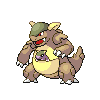

Level Up Moves:

```
+ Elemental Punches (1)
+ Double-Edge (53)
```

**#117 Seadra**


Stat Changes:

```
+ HP (65)
+ Attack (75)
+ Special Defense (75)
+ Total (490)
```

Level Up Moves:

```
+ DragonBreath (32)
```

**#119 Seaking**


Stat Changes:

```
+ Attack (102)
+ Speed (88)
+ Total (480)
```

Level Up Moves:

```
+ Aqua Tail (33)
```

**#120 Staryu**


Level Up Moves:

```
+ Water Gun [1]
+ Rapid Spin [6]
+ Recover [10]
+ Camouflage [15]
+ Psybeam (19)
```

**#121 Starmie**


Level Up Moves:

```
+ Aura Sphere (52)
```

**#123 Scyther**


Level Up Moves:

```
+ Bug Bite {33}
+ Night Slash (65)
```

**#124 Jynx**


Ability:

```
+ Dry Skin {1}
+ Filter {2}
```

Stat Changes:

```
+ Special Attack (120)
+ Total (460)
```

Level Up Moves:

```
+ Aura Sphere (60)
+ Psycho Boost (66)
```

**#125 Electabuzz**


Ability:

```
+ Vital Spirit
```

Level Up Moves:

```
+ Volt Tackle (65)
```

**#126 Magmar**


Ability:

```
+ Vital Spirit
```

Level Up Moves:

```
+ Magma Storm (62)
```

**#127 Pinsir**


Level Up Moves:

```
+ Megahorn (57)
+ Close Combat (62)
```

**#128 Tauros**


Level Up Moves:

```
+ Megahorn (62)
+ Double-Edge (69)
```

**#129 Magikarp**


Level Up Moves:

```
+ Bubble (1)
+ Reversal (1)
+ Tackle [1]
+ Flail [15]
+ Bounce (30)
```

**#130 Gyarados**


Level Up Moves:

```
+ Crunch (50)
+ Outrage (53)
```

**#131 Lapras**


Level Up Moves:

```
+ Dragon Dance {55}
+ Sheer Cold [61]
+ Outrage (67)
```

**#133 Eevee***


TM:

```
+ Compatibility with TM86
+ Grass Knot.
```

Level Up Moves:

```
+ Tail Whip (1)
+ Tackle (1)
+ Helping Hand (1)
+ Sand-Attack (3)
+ Bite (8)
+ Growl (13)
+ Quick Attack (18)
+ Yawn (23)
+ Baton Pass (28)
+ Take Down (33)
+ Wish (38)
+ Last Resort (43)
+ Trump Card (48)
```

**#134 Vaporeon***


Ability:

```
+ Hydration
```

TM:

```
+ Compatibility with TM86
+ Grass Knot.
```

Level Up Moves:

```
+ Tail Whip (1)
+ Tackle (1)
+ Helping Hand (1)
+ Sand-Attack (3)
+ Bite (8)
+ Water Gun (13)
+ Quick Attack (18)
+ Water Pulse (23)
+ Aurora Beam (28)
+ Aqua Ring (33)
+ Heal Bell (38)
+ Last Resort (43)
+ Haze (48)
+ Acid Armor (53)
+ Hydro Pump (58)
+ Muddy Water (63)
+ Rest (68)
```

**#135 Jolteon***


Ability:

```
+ Quick Feet
```

TM:

```
+ Compatibility with TM86
+ Grass Knot.
```

Level Up Moves:

```
+ Tail Whip (1)
+ Tackle (1)
+ Helping Hand (1)
+ Sand-Attack (3)
+ Double Kick (8)
+ Thundershock (13)
+ Quick Attack (18)
+ Shock Wave (23)
+ Pin Missile (28)
+ Thunder Fang (33)
+ Detect (38)
+ Last Resort (43)
+ Thunder Wave (48)
+ Agility (53)
+ Thunder (58)
+ Discharge (63)
+ Volt Tackle (68)
```

**#136 Flareon***


Ability:

```
+ Guts
```

TM:

```
+ Compatibility with TM80
+ Rock Slide
+ TM71
+ Stone Edge
+ TM86
+ Grass Knot.
```

Stat Changes:

```
+ HP (110)
+ Attack (130)
+ Defense (65)
+ Special Atttack (60)
+ Special Defense (65)
+ Speed (95)
+ Total (525)
```

Level Up Moves:

```
+ Tail Whip (1)
+ Tackle (1)
+ Helping Hand (1)
+ Sand-Attack (3)
+ Bite (8)
+ Ember (13)
+ Quick Attack (18)
+ Flame Wheel (23)
+ Fire Spin (28)
+ Fire Fang (33)
+ Superpower (38)
+ Last Resort (43)
+ Smog (48)
+ Scary Face (53)
+ Flare Blitz (58)
+ Lava Plume (63)
+ Fire Blast (68)
```

**#137 Porygon**


Level Up Moves:

```
+ Gravity (68)
```

**#138 Omanyte**


Level Up Moves:

```
+ Earth Power (58)
```

**#139 Omastar**


Level Up Moves:

```
+ Earth Power (75)
```

**#143 Snorlax**


Level Up Moves:

```
+ Slack Off (54)
+ Double-Edge (60)
+ Selfdestruct (63)
```

**#144 Articuno**


Ability:

```
+ Snow Cloak
```

**#145 Zapdos**

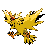

Ability:

```
+ LightningRod
```

**#146 Moltres**


Ability:

```
+ Flame Body
```

**#147 Dratini**


Ability:

```
+ Marvel Scale
```

**#148 Dragonair**


Ability:

```
+ Marvel Scale
```

**#149 Dragonite**


Ability:

```
+ Marvel Scale
```

**#150 Mewtwo**


Ability:

```
+ Magic Guard
```

**#151 Mew**


Ability:

```
+ Magic Guard
```

---

## Johto Pokémon

**#152 Chikorita**


Ability:

```
+ Natural Cure
```

Level Up Moves:

```
+ Grasswhistle (15)
+ Leaf Storm (48)
```

**#153 Bayleef**


Ability:

```
+ Natural Cure
```

Level Up Moves:

```
+ Grasswhistle (15)
+ Nature Power (16)
+ Leaf Storm (58)
```

**#154 Meganium**


Ability:

```
+ Natural Cure
```

Level Up Moves:

```
+ Grasswhistle (15)
+ Nature Power (16)
+ Earth Power (32)
+ Leaf Storm (72)
```

**#155 Cyndaquil**


Ability:

```
+ Flash Fire
```

**#156 Quilava**


Ability:

```
+ Flash Fire
```

**#157 Typhlosion**


Ability:

```
+ Flash Fire
```

Level Up Moves:

```
+ Thunder Punch (36)
+ Earth Power (63)
```

**#158 Totodile**


Ability:

```
+ Guts
```

Level Up Moves:

```
+ Dragon Dance (52)
```

**#159 Croconaw**


Ability:

```
+ Guts
```

Level Up Moves:

```
+ Dragon Dance (60)
```

**#160 Feraligatr**


Ability:

```
+ Intimidate
```

Level Up Moves:

```
+ Ice Punch (1)
+ Dragon Dance (76)
```

**#161 Sentret**


Ability:

```
+ Pickup {1}
```

Level Up Moves:

```
+ Dizzy Punch (1)
+ Super Fang (50)
```

**#162 Furret**


Ability:

```
+ Scrappy {1}
```

Stat Changes:

```
+ Attack (86)
+ Speed (108)
+ Total (443)
```

Level Up Moves:

```
+ Dizzy Punch (1)
+ Elemental Punches (15)
+ Super Fang (60)
```

Base Experience Change:

```
+ 116 >> 126
```

**#163 Hoothoot**


Ability:

```
+ Tinted Lens {2}
```

Level Up Moves:

```
+ Peck (1)
+ Air Cutter {9}
+ Nasty Plot (53)
```

**#163 Hoothoot**


Ability:

```
+ Tinted Lens {2}
```

TM:

```
+ Compatibility with TM70
+ Flash.
```

Level Up Moves:

```
+ Peck (1)
+ Air Cutter {9}
+ Nasty Plot (53)
```

**#164 Noctowl**


Ability:

```
+ Tinted Lens {2}
```

TM:

```
+ Compatibility with TM70
+ Flash.
```

Stat Changes:

```
+ Special Attack (86)
+ Total (452)
```

Level Up Moves:

```
+ Heat Wave (1)
+ Peck (1)
+ Air Cutter {9}
+ Nasty Plot (62)
```

**#165 Ledyba**


Stat Changes:

```
+ Attack (40)
+ Special Attack (20)
```

Level Up Moves:

```
+ Bug Bite (1)
```

**#166 Ledian**


Ability:

```
+ Iron Fist {1}
```

Stat Changes:

```
+ Attack (95)
+ Special Attack (35)
+ Total (430)
```

Level Up Moves:

```
+ Bug Bite [1]
+ Thunder Punch (1)
+ Ice Punch (1)
+ Dizzy Punch (18)
```

**#167 Spinarak**


Ability:

```
+ Sniper {1}
```

Level Up Moves:

```
+ Bug Bite (1)
```

**#168 Ariados**


Ability:

```
+ Sniper {1}
```

Stat Changes:

```
+ Speed (80)
+ Total (430)
```

**#169 Crobat**


Ability:

```
+ Anticipation
```

Level Up Moves:

```
+ Wing Attack [1]
+ Hypnosis {17}
+ Nasty Plot (57)
+ Brave Bird (63)
```

**#170 Chinchou**


Ability:

```
+ Water Absorb {2}
```

**#171 Lanturn**


Ability:

```
+ Water Absorb {2}
```

Stat Changes:

```
+ Special Attack (86)
+ Special Defense (86)
+ Total (480)
```

**#172 Pichu**


Ability:

```
+ Lightningrod
```

Level Up Moves:

```
+ Sing (23)
+ Petal Dance (24)
+ Wish (29)
```

**#173 Cleffa**


Level Up Moves:

```
+ Metronome (19)
+ Petal Dance (22)
```

**#174 Igglybuff**


Level Up Moves:

```
+ Metronome (21)
+ Petal Dance (25)
+ Mimic (29)
```

**#175 Togepi**


Ability:

```
+ Super Luck {1}
```

Level Up Moves:

```
+ Metronome [1]
+ Softboiled (6)
+ Yawn [14]
+ Encore [18]
+ Tri-Attack (21)
```

**#176 Togetic**


Ability:

```
+ Super Luck {1}
```

Level Up Moves:

```
+ Metronome [1]
+ Softboiled (6)
+ Yawn [14]
+ Encore [18]
+ Tri-Attack (21)
```

**#177 Natu**


Level Up Moves:

```
+ Air Cutter (1)
+ Confusion (1)
+ Extrasensory (15)
+ Miracle Eye [18]
+ MeFirst [21]
+ Confuse Ray [24]
+ Air Slash (50)
```

**#178 Xatu**


Stat Changes:

```
+ Special Attack (100)
+ Speed (100)
+ Total (480)
```

Level Up Moves:

```
+ Air Cutter (1)
+ Confusion (1)
+ Extrasensory (15)
+ Miracle Eye [18]
+ MeFirst [21]
+ Confuse Ray [24]
+ Air Slash (64)
```

**#179 Mareep**


Level Up Moves:

```
+ Charge (1)
```

**#180 Flaaffy**


Level Up Moves:

```
+ Charge (1)
```

**#181 Ampharos**


TM:

```
+ Compatibility with TM59
+ Dragon Pulse and TM91
+ Flash Cannon.
```

Level Up Moves:

```
+ Tail Glow (1)
+ Charge (1)
```

**#182 Bellossom**


Stat Changes:

```
+ Special Attack (100)
+ Special Defense (110)
+ Total (500)
```

Ability:

```
+ Own Tempo
```

Level Up Moves:

```
+ Earth Power (38)
```

Base Experience Change:

```
+ 184 >> 192
```

**#183 Marill**


Stat Changes:

```
+ Special Attack (50)
+ Total (280)
```

**#184 Azumarill**


Stat Changes:

```
+ HP (110)
+ Special Attack (90)
+ Total (450)
```

Level Up Moves:

```
+ Superpower (1)
+ Ice Punch (1)
+ Aqua Jet (18)
```

**#185 Sudowoodo**


Stat Changes:

```
+ HP (75)
+ Attack (115)
+ Defense (130)
+ Special Defense (80)
+ Total (460)
```

Level Up Moves:

```
+ Selfdestruct (53)
```

**#186 Politoed**


Stat Changes:

```
+ Defense (85)
+ Speed (75)
+ Total (515)
```

Ability:

```
+ Drizzle {2}
```

**#187 Hoppip**


Level Up Moves:

```
+ Aromatherapy (46)
```

**#188 Skiploom**


Level Up Moves:

```
+ Aromatherapy (56)
```

**#189 Jumpluff**


Level Up Moves:

```
+ Aromatherapy (56)
```

**#190 Aipom**


Level Up Moves:

```
+ Fake Out (46)
```

**#191 Sunkern**


Level Up Moves:

```
+ Morning Sun (49)
```

**#192 Sunflora**


Stat Change:

```
+ Defense (90)
+ Special Attack (125)
+ Special Defense (95)
+ Total (490)
```

Level Up Moves:

```
+ Earth Power (47)
```

Base Experience Change:

```
+ 146 >> 196
```

**#193 Yanma**


Level Up Moves:

```
+ Air Cutter {11}
+ Signal Beam (20)
+ Supersonic [23]
```

**#194 Wooper**


Ability:

```
+ Unaware {1}
```

Level Up Moves:

```
+ Aqua Tail (26)
+ Recover (51)
```

**#195 Quagsire**


Ability:

```
+ Unaware {1}
```

Stat Change:

```
+ Attack
+ Defense (95)
+ Total (450)
```

Level Up Moves:

```
+ Aqua Tail (27)
+ Recover (60)
```

**#196 Espeon**


Ability:

```
+ Magic Guard
```

Level Up Moves:

```
+ Tail Whip (1)
+ Tackle (1)
+ Helping Hand (1)
+ Sand-Attack (3)
+ Swift (8)
+ Confusion (13)
+ Quick Atttack (18)
+ Power Gem (23)
+ Psybeam (28)
+ Future Sight (33)
+ Fake Tears (38)
+ Last Resort (43)
+ Psych Up (48)
+ Psychic (53)
+ Morning Sun (58)
+ Power Swap (63)
+ Aura Sphere (68)
```

**#197 Umbreon**


Ability:

```
+ Magic Guard
```

TM:

```
+ Compatibility with TM86
+ Grass Knot.
```

Level Up Moves:

```
+ Tail Whip (1)
+ Tackle (1)
+ Helping Hand (1)
+ Sand-Attack (3)
+ Confuse Ray (8)
+ Pursuit (13)
+ Quick Attack (18)
+ Tickle (23)
+ Feint Attack (28)
+ Assurance (33)
+ Payback (38)
+ Last Resort (43)
+ Mean Look (48)
+ Screech (53)
+ Moonlight (58)
+ Guard Swap (63)
+ Power Trick (68)
```

**#198 Murkrow**


Level Up Moves:

```
+ Beat Up (49)
+ Brave Bird (53)
```

**#199 Slowking**


Level Up Moves:

```
+ Aura Sphere (61)
```

**#200 Misdreavus**


Level Up Moves:

```
+ Hypnosis (54)
+ Nasty Plot (58)
+ Destiny Bond (63)
```

**#201 Unown**


Level Up Moves:

```
+ Secret Power (11)
+ Nature Power (21)
+ AncientPower (31)
+ CosmicPower (41)
+ Earth Power (51)
```

Stat Changes:

```
+ HP (68)
+ Attack (92)
+ Defense (68)
+ Special Attack (92)
+ Special Defense (68)
+ Speed (68)
+ Total (456)
```

Base Experience Change:

```
+ 61 >> 100
```

**#202 Wobbuffet**


Level Up Moves:

```
+ Mimic (15)
```

**#203 Girafarig**


Stat Changes:

```
+ Special Attack (110)
+ Speed (105)
+ Total (495)
```

Level Up Moves:

```
+ Nasty Plot (50)
```

**#204 Pineco**


Level Up Moves:

```
+ Counter (48)
```

**#205 Forretress**


Level Up Moves:

```
+ Counter (73)
```

**#206 Dunsparce**


Stat Changes:

```
+ HP (105)
+ Attack (80)
+ Total (440)
```

Level Up Moves:

```
+ Horn Drill (57)
```

**#207 Gligar**


Ability:

```
+ Immunity {2}
```

**#208 Steelix**


Stat Change:

```
+ Attack (90)
+ Total (515)
```

**#209 Snubbull**


Level Up Moves:

```
+ Lovely Kiss (55)
+ Close Combat (61)
```

**#210 Granbull**


Level Up Moves:

```
+ Lovely Kiss (67)
+ Close Combat (75)
```

**#211 Qwilfish**


Ability:

```
+ Intimidate {2}
```

Level Up Moves:

```
+ Pain Split (61)
```

Stat Changes:

```
+ Attack (100)
+ Special Attack (80)
+ Total (460)
```

Base Experience Change:

```
+ 100 >> 109
```

**#212 Scizor**

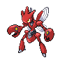

Level Up Moves:

```
+ Bug Bite {33}
+ Night Slash (65)
```

**#213 Shuckle**


Ability:

```
+ Solid Rock {1}
```

**#214 Heracross**


Level Up Moves:

```
+ Bug Bite (3)
+ Horn Drill (61)
```

**#215 Sneasel**


Ability:

```
+ Technician {2}
```

Level Up Moves:

```
+ Faint Attack [13]
+ Ice Fang (17)
+ Ice Punch (32)
+ Slash [36]
+ Crunch (46)
+ Ice Shard [50]
```

**#216 Teddiursa**


Ability:

```
+ Honey Gather {2]
```

**#217 Ursaring**


Level Up Moves:

```
+ Crunch (30)
+ Close Combat (76)
```

**#218 Slugma**


Level Up Moves:

```
+ Power Gem (49)
```

**#219 Magcargo**


Stat Changes:

```
+ Defense (135)
+ Special Attack (115)
+ Special Defense (115)
```

Ability:

```
+ Solid Rock {1}
```

Level Up Moves:

```
+ Power Gem (56)
```

Base Experience:

```
+ 154 >> 171
```

**#220 Swinub**


Ability:

```
+ Thick Fat {1}
```

Level Up Moves:

```
+ Ice Shard (52)
```

**#221 Piloswine**


Ability:

```
+ Thick Fat {1}
```

Level Up Moves:

```
+ Ice Shard (73)
```

**#222 Corsola**


Stat Changes:

```
+ Defense (115)
+ Special Attack (105)
+ Special Defense (110)
+ Total (475)
```

Base Experience Change:

```
+ 113 >> 128
```

Level Up Moves:

```
+ Spikes
+ Toxic Spikes (57)
```

**#224 Octillery**


Level Up Moves:

```
+ Seed Bomb (1)
```

**#225 Delibird**


Ability:

```
+ Technician {2}
```

TM:

```
+ Compatibility with TM89
+ U-turn.
```

Stat Changes:

```
+ HP (50)
+ Attack (95)
+ Defense (55)
+ Special Attack (105)
+ Special Defense (55)
+ Speed (115)
+ Total (475)
```

Level Up Moves:

```
+ Pay Day (1)
+ Pluck (8)
+ Mist (15)
+ Quick Attack (22)
+ Baton Pass (29)
+ Air Slash (36)
+ Seed Bomb (43)
+ Fake Out (50)
+ Blizzard (57)
+ Nasty Plot (64)
+ Tailwind (71)
```

**#226 Mantine**


TM:

```
+ Compatibility with HM02
+ Fly.
```

Level Up Moves:

```
+ Mirror Coat (53)
```

**#227 Skarmory**


Ability:

```
+ Rock Head {2}
```

Level Up Moves:

```
+ Drill Peck {39}
+ Brave Bird (48)
```

**#228 Houndour**


Level Up Moves:

```
+ Bite [9]
+ Smog [17]
+ Dark Pulse (56)
```

**#229 Houndoom**


Ability:

```
+ Intimidate {1}
```

Level Up Moves:

```
+ Bite [9]
+ Smog [17]
+ Dark Pulse (64)
```

**#230 Kingdra**


Level Up Moves:

```
+ DragonBreath (32)
+ Outrage (65)
```

**#231 Phanpy**


Level Up Moves:

```
+ Seed Bomb (46)
```

**#232 Donphan**


Level Up Moves:

```
+ Ice Shard (54)
+ Head Smash (60)
+ Giga Impact [68]
```

**#233 Porygon2**


Level Up Moves:

```
+ Gravity (73)
```

**#234 Stantler**


Stat Changes:

```
+ Attack (100)
+ Total (470)
```

Level Up Moves:

```
+ Megahorn (59)
```

**#235 Smeargle**


Stat Changes:

```
+ Speed (110)
+ Total (285)
```

**#238 Smoochum**


Ability:

```
+ Hydration {1}
+ Filter {2}
```

**#239 Elekid**


Ability:

```
+ Vital Spirit
```

**#240 Magby**


Ability:

```
+ Vital Spirit
```

**#241 Miltank**


Level Up Moves:

```
+ Hammer Arm (62)
+ Double-Edge (69)
```

**#242 Blissey**


Level Up Moves:

```
+ Counter {27}
+ Fling [50]
```

**#243 Raikou**


Ability:

```
+ Volt Absorb
```

Level Up Moves:

```
+ Aura Sphere
+ ExtremeSpeed
+ Weather Ball
+ Zap Cannon (1)
```

**#244 Entei**


Ability:

```
+ Flash Fire
```

Level Up Moves:

```
+ Flare Blitz
+ ExtremeSpeed
+ Howl
+ Crush Claw (1)
```

**#245 Suicune**


Ability:

```
+ Water Absorb
```

Level Up Moves:

```
+ Air Slash
+ ExtremeSpeed
+ Sheer Cold
+ Aqua Ring (1)
```

**#246 Larvitar**


Ability:

```
+ Battle Armor
```

**#247 Pupitar**


Ability:

```
+ Battle Armor
```

**#248 Tyranitar**


Ability:

```
+ Battle Armor
```

Level Up Moves:

```
+ Dragon Dance (55)
```

**#251 Celebi**


Ability:

```
+ Magic Guard
```

Level Up Moves:

```
+ Nasty Plot (100)
```

---

## Hoenn Pokémon

**#252 Treecko**


Ability:

```
+ Unburden
```

**#253 Grovyle**


Ability:

```
+ Unburden
```

**#254 Sceptile**


Ability:

```
+ Unburden
```

Level Up Moves:

```
+ Thunder Punch (1)
+ Low Kick (1)
+ DragonBreath (36)
```

**#255 Torchic**


Ability:

```
+ Speed Boost
```

**#256 Combusken**


Ability:

```
+ Speed Boost
```

**#257 Blaziken**


Ability:

```
+ Speed Boost
```

Level Up Moves:

```
+ Thunder Punch (1)
+ Hi Jump Kick (1)
```

**#258 Mudkip**


Ability:

```
+ Damp
```

Level Up Moves:

```
+ Foresight [1]
+ Yawn {19}
```

**#259 Marshtomp**


Ability:

```
+ Damp
```

Level Up Moves:

```
+ Foresight [1]
+ Yawn {20}
```

**#260 Swampert**


Ability:

```
+ Damp
```

Level Up Moves:

```
+ Ice Punch (1)
+ Counter (1)
+ Mirror Coat (1)
+ Foresight [1]
+ Yawn {20}
```

**#261 Poochyena**


Level Up Moves:

```
+ Odor Sleuth [1]
+ Crunch [{17}]
+ Super Fang (53)
```

**#262 Mightyena**


Stat Changes:

```
+ Attack (105)
+ Speed (80)
+ Total (445)
```

Level Up Moves:

```
+ Odor Sleuth [1]
+ Crunch [{17}]
+ Elemental Fangs (20)
+ Super Fang (67)
```

**#264 Linoone**


Stat Changes:

```
+ Attack (90)
+ Speed (105)
+ Total (445)
```

Level Up Moves:

```
+ ExtremeSpeed {23}
```

**#265 Wurmple**


Ability:

```
+ Run Away
```

Level Up Moves:

```
+ Poison Sting [1]
+ Bug Bite [1]
```

**#267 Beautifly**


Stat Changes:

```
+ Special Attack (105)
+ Special Defense (65)
+ Speed (85)
+ Total (435)
```

Ability:

```
+ Shield Dust
```

Level Up Moves:

```
+ Stun Spore [15]
+ Air Cutter (17)
+ Signal Beam (22)
+ Sleep Powder (29)
+ Air Slash (44)
```

**#269 Dustox**


Stat Changes:

```
+ Special Attack (65)
+ Special Defense (105)
+ Speed (85)
+ Total (435)
```

Ability:

```
+ Compoundeyes
```

Level Up Moves:

```
+ Protect [15]
+ Confuse Ray (17)
+ Signal Beam (22)
+ Reflect (31)
+ Tailwind (44)
```

**#270 Lotad**


Level Up Moves:

```
+ Water Gun (1)
+ Leech Seed (9)
+ Razor Leaf (22)
```

**#271 Lombre**


Level Up Moves:

```
+ Water Gun (1)
+ Leech Seed (9)
+ Razor Leaf (22)
```

**#272 Ludicolo**


Level Up Moves:

```
+ Elemental Punches (1)
+ Teeter Dance (49)
```

**#273 Seedot**


Level Up Moves:

```
+ Bullet Seed (1)
+ Quick Attack (1)
+ Seed Bomb (17)
```

**#274 Nuzleaf**


Level Up Moves:

```
+ Quick Attack (1)
+ Razor Leaf [14]
+ Faint Attack [19]
+ Low Kick (22)
+ Fake Out [31]
+ Dark Pulse (34)
```

**#275 Shiftry**


Level Up Move:

```
+ Heat Wave (1)
+ Ominous Wind (1)
+ Icy Wind (1)
+ Leaf Blade (49)
```

**#276 Taillow**


Ability:

```
+ Scrappy
```

Level Up Moves:

```
+ Brave Bird (62)
```

**#277 Swellow**


Stat Changes:

```
+ HP (70)
+ Attack (95)
+ Total (450)
```

Ability:

```
+ Scrappy
```

Level Up Moves:

```
+ ExtremeSpeed (22)
+ Brave Bird (73)
```

**#278 Wingull**


Ability:

```
+ Rain Dish
```

**#279 Pelipper**


Stat Changes:

```
+ Defense (120)
+ Special Attack (95)
+ Total (460)
```

Level Up Moves:

```
+ Air Slash {43}
```

**#280 Ralts**


Stat Changes:

```
+ Special Attack (65)
+ Total (218)
```

Level Up Moves:

```
+ Extrasensory (19)
```

**#281 Kirlia**


Stat Changes:

```
+ Special Attack (95)
+ Total (308)
```

Level Up Moves:

```
+ Extrasensory (19)
```

**#282 Gardevoir**


Level Up Moves:

```
+ Extrasensory (19)
+ Aura Sphere (73)
```

**#283 Surskit**


Ability:

```
+ Rain Dish
```

TM:

```
+ Compatibility with HM03
+ Surf.
```

**#284 Masquerain**


Type Change:

```
+ Bug / Flying >> Bug / Water
```

Ability:

```
+ Levitate {1}
+ Levitate
```

Stat Change:

```
+ Special Attack (100)
+ Special Defense (102)
+ Speed (90)
+ Total (484)
```

Base Experience Change:

```
+ 128 >> 158
```

Level Up Moves:

```
+ Air Cutter {22}
+ Hydro Pump (67)
```

**#285 Shroomish**


Level Up Moves:

```
+ Tackle [1]
+ Bullet Seed (5)
```

**#286 Breloom**


Ability:

```
+ Technician {1}
```

Level Up Moves:

```
+ Thunder Punch (1)
+ Bullet Seed (5)
+ Spore (49)
```

**#287 Slakoth**


Ability:

```
+ Slow Start
```

**#288 Vigoroth**


Level Up Moves:

```
+ Night Slash (18)
```

**#289 Slaking**


Ability:

```
+ Slow Start
```

Level Up Moves:

```
+ Elemental Punches (1)
+ Night Slash (18)
```

**#290 Nincada**


Level Up Moves:

```
+ Bug Bite (1)
```

**#291 Ninjask**


Level Up Moves:

```
+ Night Slash (59)
+ ExtremeSpeed (66)
```

**#293 Whismur**


Level Up Moves:

```
+ Fake Tears (1)
```

**#294 Loudred**


Ability:

```
+ Scrappy
```

**#295 Exploud**


Ability:

```
+ Scrappy
```

Level Up Moves:

```
+ Hammer Arm (80)
```

**#298 Azurill**


Level Up Moves:

```
+ Sing (22)
```

**#299 Nosepass**


Stat Changes:

```
+ Special Attack (65)
+ Total (395)
```

Level Up Moves:

```
+ Block [17]
+ AncientPower (21)
+ Earth Power [37]
+ Sandstorm [79]
```

**#301 Delcatty**


Stat Changes:

```
+ Attack (65)
+ Special Attack (95)
+ Speed (90)
+ Total (450)
```

Level Up Moves:

```
+ Wish (43)
```

**#302 Sableye**


Ability:

```
+ Steadfast {1}
```

Stat Changes:

```
+ HP (60)
+ Attack (95)
+ Defense (95)
+ Special Defense (85)
+ Total (450)
```

Base Experience Change:

```
+ 98 >> 118
```

Level Up Moves:

```
+ Recover (60)
```

**#303 Mawile**


Stat Changes:

```
+ HP (60)
+ Attack (105)
+ Defense (90)
+ Special Defense (90)
+ Total (450)
```

Base Experience Change:

```
+ 98 >> 118
```

Level Up Moves:

```
+ Iron Head [31]
+ Baton Pass [56]
+ Metal Burst (61)
```

**#304 Aron**


Level Up Moves:

```
+ Head Smash (49)
```

**#305 Lairon**


Level Up Moves:

```
+ Head Smash (62)
```

**#306 Aggron**


Level Up Moves:

```
+ Superpower (1)
+ Head Smash (73)
```

**#307 Meditite**


Level Up Moves:

```
+ Psycho Cut {22}
+ Zen Headbutt (50)
```

**#308 Medicham**


Level Up Moves:

```
+ Bullet Punch (1)
+ Psycho Cut {22}
+ Zen Headbutt (63)
```

**#311 Plusle**


Ability:

```
+ Static
```

Stat Changes:

```
+ Defense (50)
+ Special Attack (90)
+ Special Defense (85)
+ Speed (115)
+ Total (450)
```

**#312 Minun**


Ability:

```
+ Static
```

Stat Changes:

```
+ Attack (50)
+ Special Attack (85)
+ Special Defense (90)
+ Speed (115)
+ Total (450)
```

**#313 Volbeat**


Type Change:

```
+ Bug >> Bug / Electric
```

Stat Change:

```
+ HP (80)
+ Attack (73 >> 30)
+ Defense (60)
+ Special Attack (100)
+ SpecialDefense (90)
+ Speed (90)
+ Total (450)
```

Level Up Moves:

```
+ Double Team (1)
+ ThunderShock (5)
+ Helping Hand {[29]}
+ Thunderbolt (33)
+ Baton Pass (49)
```

**#314 Illumise**


Type Change:

```
+ Bug >> Bug / Electric
```

Stat Change:

```
+ HP (80)
+ Attack (47 >> 30)
+ Defense (60)
+ Special Attack (90)
+ SpecialDefense (100)
+ Speed (90)
+ Total (450)
```

Level Up Moves:

```
+ Sweet Scent [1]
+ Wish [1]
+ ThunderShock (5)
+ Silver Wind (21)
+ HelpingHand {[29]}
+ Thunderbolt (33)
+ Baton Pass (49)
```

**#315 Roselia**


Level Up Moves:

```
+ Sleep Powder (49)
+ Leaf Storm (52)
```

**#316 Gulpin**


Level Up Moves:

```
+ Pain Split (59)
```

**#317 Swalot**


Stat Changes:

```
+ Attack (83)
+ Special Attack (83)
+ Total (487)
```

Level Up Moves:

```
+ Pain Split (73)
```

**#318 Carvanha**


Ability:

```
+ Speed Boost
```

Level Up Moves:

```
+ Dark Pulse (43)
+ Hydro Pump (45)
```

**#319 Sharpedo**


Ability:

```
+ Speed Boost
```

Level Up Moves:

```
+ Dark Pulse (55)
+ Hydro Pump (60)
```

**#320 Wailmer**


Ability:

```
+ Pressure {1}
```

Level Up Moves:

```
+ Fissure (51)
```

**#321 Wailord**


Ability:

```
+ Pressure {1}
```

Level Up Moves:

```
+ Fissure (70)
```

**#322 Numel**


Ability:

```
+ Own Tempo {1}
```

**#323 Camerupt**


Ability:

```
+ Anger Point {1}
```

**#324 Torkoal**

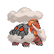

Stat Changes:

```
+ Attack (100)
+ Special Attack (100)
+ Total (500)
```

Level Up Moves:

```
+ Yawn (59)
+ Earth Power (64)
+ Eruption (67)
```

**#325 Spoink**


Level Up Moves:

```
+ Confusion (1)
+ Extrasensory {26}
```

**#326 Grumpig**


Level Up Moves:

```
+ Confusion (1)
+ Extrasensory {26}
```

**#327 Spinda**


Stat Changes:

```
+ All Stats (80)
+ Total (480)
```

Base Experience:

```
+ 85 >> 129
```

Level Up Moves:

```
+ Fake Out (60)
```

**#328 Trapinch**


Level Up Moves:

```
+ Bug Bite (1)
```

**#329 Vibrava**


Level Up Moves:

```
+ Earth Power (57)
+ Dragon Dance (65)
+ Outrage (73)
+ Hyper Beam [81]
```

**#330 Flygon**


Stat Changes:

```
+ Attack (110)
+ Special Attack (100)
+ Total (550)
```

Level Up Moves:

```
+ Earth Power (57)
+ Dragon Dance (65)
+ Outrage (73)
+ Hyper Beam [81]
```

**#331 Cacnea**


Ability:

```
+ Water Absorb
```

Level Up Moves:

```
+ Needle Arm [25]
+ Ingrain [45]
+ Teeter Dance (61)
```

**#332 Cacturne**


Ability:

```
+ Water Absorb
```

Level Up Moves:

```
+ Thunder Punch (1)
+ Needle Arm [25]
+ Ingrain [53]
+ Teeter Dance (77)
```

**#333 Swablu**


Ability:

```
+ Cloud Nine
```

Level Up Moves:

```
+ Pluck {1}
```

**#334 Altaria**


Stat Changes:

```
+ Special Attack (90)
+ Defense (100)
+ Total (520)
```

Ability:

```
+ Cloud Nine
```

Level Up Moves:

```
+ Outrage (78)
```

**#335 Zangoose**


Level Up Moves:

```
+ Elemental Punches (1)
+ ExtremeSpeed (57)
```

**#336 Seviper**


Level Up Moves:

```
+ Gunk Shot (59)
```

**#337 Lunatone**


Stat Changes:

```
+ Special Attack (115)
+ Total (460)
```

Level Up Moves:

```
+ Moonlight (1)
+ Power Gem (27)
+ Earth Power (38)
+ Hydro Pump (49)
```

**#338 Solrock**


Stat Changes:

```
+ Attack (115)
+ Total (460)
```

Level Up Moves:

```
+ Morning Sun (1)
+ Zen Headbutt (27)
+ Iron Head (38)
+ Flare Blitz (49)
```

**#339 Barboach**


Level Up Moves:

```
+ Dragon Dance (51)
```

**#340 Whiscash**


Level Up Moves:

```
+ Dragon Dance (63)
```

**#341 Corphish**

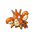

Ability:

```
+ Adaptability {1}
```

Level Up Moves:

```
+ Crabhammer [20]
+ Dragon Dance {38}
+ Superpower (57)
```

**#342 Crawdaunt**


Ability:

```
+ Adaptability {1}
```

Level Up Moves:

```
+ Crabhammer [20]
+ Dragon Dance {44}
+ Superpower (73)
```

**#343 Baltoy**


Level Up Moves:

```
+ Gravity (81)
```

**#344 Claydol**


TM:

```
+ Compatibility with HM02
+ Fly.
```

Level Up Moves:

```
+ Gravity (97)
```

**#345 Lileep**


Ability:

```
+ Storm Drain
```

Level Up Moves:

```
+ Recover (71)
+ Earth Power (78)
```

**#346 Cradily**


Ability:

```
+ Storm Drain
```

Level Up Moves:

```
+ Recover (86)
+ Earth Power (96)
```

**#347 Anorith**


Ability:

```
+ Swift Swim
```

**#348 Armaldo**


Ability:

```
+ Swift Swim
```

Level Up Moves:

```
+ Aqua Tail (40)
+ Superpower (79)
```

**#349 Feebas**


Ability:

```
+ Adaptability
```

Level Up Moves:

```
+ Water Pulse (20)
+ Hypnosis (25)
```

**#350 Milotic**


Ability:

```
+ Cute Charm
```

Level Up Moves:

```
+ Mirror Coat (53)
```

**#351 Castform**


Stat Change:

```
+ Special Attack (110)
+ Special Defense (80)
+ Speed (80)
+ Total (480)
```

**#352 Kecleon**


Stat Change:

```
+ HP (80)
+ Attack (100)
+ Defense (80)
+ Total (480)
```

Level Up Moves:

```
+ Fake Out (61)
+ Recover (67)
```

**#353 Shuppet**


Stat Change:

```
+ Special Attack (73)
+ Total (305)
```

Level Up Moves:

```
+ Pain Split (53)
+ Gunk Shot (57)
```

**#354 Banette**


Stat Change:

```
+ Special Attack (103)
+ Total (475)
```

Level Up Moves:

```
+ Pain Split (74)
+ Gunk Shot (82)
```

**#357 Tropius**


Stat Changes:

```
+ HP (110)
+ Attack (90)
+ Defense (90)
+ Special Attack (90)
+ Special Defense (90)
+ Speed (65)
+ Total (535)
```

Base Experience Change:

```
+ 169 >> 200
```

Level Up Moves:

```
+ Leaf Blade {31}
+ Outrage (65)
+ Dragon Dance (69)
```

**#358 Chimecho**


Stat Changes:

```
+ Special Attack (110)
+ Special Defense (100)
+ Speed (90)
+ Total (485)
```

Level Up Moves:

```
+ Hypnosis (52)
+ Recover (55)
+ Hyper Voice (58)
```

**#359 Absol**


Level Up Moves:

```
+ Megahorn (71)
```

**#362 Glalie**


Ability:

```
+ Levitate {1
+ 2}
```

TM:

```
+ Compatibility with TM71
+ Stone Edge
+ TM80
+ Rock Slide
+ HM04
+ Strength andHM06 Rock Smash.
```

Type Change:

```
+ Ice >> Ice / Rock
```

Stat Change:

```
+ Attack (100)
+ Defense (120)
+ Special Defense (80 >> 60)
+ Speed (80 >> 60)
+ Total (500)
```

Level Up Moves:

```
+ Head Smash (42)
+ Rock Wrecker (67)
```

**#365 Walrein**


Level Up Moves:

```
+ Curse {7}
+ Super Fang (44)
```

**#366 Clamperl**


Level Up Moves:

```
+ Muddy Water (26)
```

**#369 Relicanth**


Level Up Moves:

```
+ Water Gun [1]
+ Zen Headbutt (29)
+ everything in between = level – 8.
```

**#370 Luvdisc**


Ability:

```
+ Hydration
```

Stat Change:

```
+ HP (55)
+ Defense (60)
+ Special Attack (100)
+ Special Defense (80)
+ Speed (125)
+ Total (450)
```

Item Rate:

```
+ Heart Scale (50% >> 100%)
```

Base Experience:

```
+ 110 >> 141
```

**#371 Bagon**

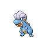

Level Up Moves:

```
+ Dragon Dance (60)
+ Outrage (65)
```

**#372 Shelgon**


Level Up Moves:

```
+ Dragon Dance (66)
+ Outrage (71)
```

**#373 Salamence**


Level Up Moves:

```
+ Hydro Pump (1)
+ Dragon Dance (79)
+ Outrage (87)
```

**#374 Beldum**


Ability:

```
+ Rock Head
```

Level Up Moves:

```
+ Headbutt (10)
+ Zen Headbutt (20)
+ Iron Head (30)
```

**#375 Metang**


Ability:

```
+ Iron Fist
```

**#376 Metagross**


Ability:

```
+ Iron Fist
```

Level Up Moves:

```
+ Thunder Punch (1)
+ Ice Punch (1)
```

**#377 Regirock**

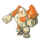

Ability:

```
+ Sturdy
```

**#378 Regice**


Ability:

```
+ Ice Body
```

**#379 Registeel**


Ability:

```
+ Sturdy
```

**#385 Jirachi**

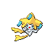

Ability:

```
+ Magic Guard
```

---

## Sinnoh Pokémon

**#387 Turtwig**


Ability:

```
+ Shell Armor
```

Level Up Moves:

```
+ Seed Bomb (49)
```

**#388 Grotle**


Ability:

```
+ Shell Armor
```

Level Up Moves:

```
+ Seed Bomb (57)
```

**#389 Torterra**


Ability:

```
+ Shell Armor
```

Level Up Moves:

```
+ Seed Bomb (63)
```

**#390 Chimchar**


Ability:

```
+ Iron Fist
```

**#391 Monferno**

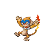

Ability:

```
+ Iron Fist
```

**#392 Infernape**


Ability:

```
+ Iron Fist
```

Level Up Moves:

```
+ Fire Punch (1)
+ Thunder Punch (1)
```

**#393 Piplup**


Ability:

```
+ Hustle
```

**#394 Prinplup**


Ability:

```
+ Hustle
```

**#395 Empoleon**


Ability:

```
+ Hustle
```

**#396 Starly**


Level Up Moves:

```
+ Double-Edge (41)
```

**#397 Staravia**


Ability:

```
+ Reckless
```

Level Up Moves:

```
+ Double-Edge (48)
```

**#398 Staraptor**


Ability:

```
+ Reckless
```

Level Up Moves:

```
+ Double-Edge (57)
```

Stat Changes:

```
+ HP (90)
+ Defense (75)
+ Special Defense (65)
+ Total (500)
```

**#399 Bidoof**


Level Up Moves:

```
+ Double-Edge (49)
```

**#400 Bibarel**


Stats:

```
+ HP (89)
+ Attack (95)
+ Special Attack (67)
+ Total (442)
```

Level Up Moves:

```
+ Aqua Tail {15}
+ Double-Edge (58)
```

**#401 Kricketot**


Ability:

```
+ Run Away
```

Level Up Moves:

```
+ Bug Bite [1]
```

**#402 Kricketune**


Ability:

```
+ Technician
```

Stat Changes:

```
+ Attack (96)
+ Defense (59)
+ Speed (74)
+ Special Defense (59)
+ Total (420)
```

**#403 Shinx**


Ability:

```
+ Guts {1}
```

Level Up Moves:

```
+ Bite [1]
+ Thunder Wave (17)
+ Volt Tackle (45)
```

**#404 Luxio**


Type Change:

```
+ Electric >> Electric / Dark
```

Ability:

```
+ Guts {1}
```

Level Up Moves:

```
+ Night Slash {18}
+ Volt Tackle (53)
```

**#405 Luxray**


Type Change:

```
+ Electric >> Electric / Dark
```

Stat Change:

```
+ Speed (82)
+ Total (535)
```

Level Up Moves:

```
+ Night Slash {18}
+ Volt Tackle (63)
```

**#406 Budew**


Ability:

```
+ Leaf Guard
```

Level Up Moves:

```
+ Extrasensory (19)
```

**#407 Roserade**


Ability:

```
+ Technician
```

Level Up Moves:

```
+ Petal Dance (39)
```

**#408 Cranidos**


Ability:

```
+ Reckless
```

Level Up Moves:

```
+ Crunch (47)
+ Hammer Arm (53)
```

**#409 Rampardos**


Ability:

```
+ Reckless
```

Level Up Moves:

```
+ Crunch (61)
+ Hammer Arm (70)
```

**#410 Shieldon**


Ability:

```
+ Soundproof
```

**#411 Bastiodon**


Ability:

```
+ Soundproof
```

Level Up Moves:

```
+ Magnet Rise (1)
```

**#412 Burmy**


Level Up Moves:

```
+ Tackle
+ Bug Bite
+ Hidden Power [1]
+ String Shot (9)
+ Snore (18)
```

**#413 Wormadam**


Stat Changes:

```
+ Special Attack (99)
+ Special Defense (125)
+ Total (464) [Plant Cloak]
```

Stat Changes:

```
+ Attack (99)
+ Defense (125)
+ Total (464) [Sandy Cloak]
```

Stat Changes:

```
+ Defense (115)
+ Special Defense (115)
+ Total (464) [Trash Cloak]
```

Ability:

```
+ Leaf Guard [Plant Cloak]
```

Ability:

```
+ Sand Veil [Sandy Cloak]
```

Ability:

```
+ Sturdy [Trash Cloak]
```

**#414 Mothim**


Ability:

```
+ Tinted Lens
```

Stat Changes:

```
+ Special Attack (109)
+ Speed (91)
+ Total (464)
```

Level Up Moves:

```
+ Air Cutter {20}
+ Giga Drain {26}
```

**#415 Combee**


Ability:

```
+ Hustle
```

Level Up Moves:

```
+ Tailwind (16)
+ Endeavor (19)
```

**#416 Vespiquen**


Ability:

```
+ Intimidate
```

TM:

```
+ Compatibility with HM02
+ Fly.
```

Level Up Moves:

```
+ Toxic [13]
+ Attack Order [21]
+ Heal Order [27]
+ Toxic [37]
+ DefendOrder [39]
+ Air Slash (45)
```

**#417 Pachirisu**


Ability:

```
+ Volt Absorb {1}
```

Stat Change:

```
+ Special Attack (100)
+ Total (460)
```

Level Up Moves:

```
+ Discharge [21]
+ Swift [25]
+ Sweet Kiss [29]
+ Fake Tears (41)
+ Uproar (45)
```

**#418 Buizel**


Ability:

```
+ Technician
```

Level Up Moves:

```
+ Aqua Tail (28)
+ Agility [54]
```

**#419 Floatzel**


Ability:

```
+ Technician
```

Level Up Moves:

```
+ Low Kick (1)
+ Aqua Tail (29)
+ Agility [60]
```

**#421 Cherrim**

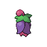

Stat Changes:

```
+ Special Attack (107)
+ Total (470)
```

Level Up Moves:

```
+ Weather Ball (1)
```

**#422 Shellos**


Level Up Moves:

```
+ Earth Power (56)
```

**#423 Gastrodon**


Level Up Moves:

```
+ Earth Power (68)
```

**#424 Ambipom**


Level Up Moves:

```
+ Elemental Punches (1)
+ Fake Out (46)
```

**#425 Drifloon**


Level Up Moves: Hypnosis (48), Destiny Bond (53), Tailwind (58)

**#426 Drifblim**


Level Up Moves:

```
+ Air Cutter (28)
+ Hypnosis (58)
+ Destiny Bond (65)
+ Tailwind (72)
```

**#427 Buneary**


Ability:

```
+ Limber {1}
```

Level Up Moves:

```
+ Fake Out (19)
+ Sky Uppercut (29)
+ Heal Bell (39)
```

**#428 Lopunny**


Ability:

```
+ Limber {1}
```

Level Up Moves:

```
+ Fake Out (19)
+ Sky Uppercut (29)
+ Heal Bell (39)
```

**#429 Mismagius**


Stat Changes:

```
+ Special Attack (110)
+ Special Defense (110)
+ Speed (110)
+ Total (510)
```

Level Up Moves:

```
+ Icy Wind (25)
+ Magical Leaf [35]
+ Hypnosis (45)
+ Destiny Bond (55)
```

**#430 Honchkrow**


Stat Changes:

```
+ HP (105)
+ Total (510)
```

Level Up Moves:

```
+ Brave Bird (65)
```

**#431 Glameow**


Level Up Moves:

```
+ Bite (11)
+ Super Fang (49)
```

**#432 Purugly**


Stat Changes:

```
+ HP (100)
+ Attack (86)
+ Total (485)
```

Level Up Moves:

```
+ Bite (11)
+ Super Fang (61)
```

**#433 Chingling**


Level Up Moves:

```
+ Hypnosis (25)
+ Hyper Voice (29)
+ Recover (33)
```

**#434 Stunky**


Level Up Moves:

```
+ Sucker Punch (48)
```

**#435 Skuntank**


Stat Changes:

```
+ Special Attack (77)
+ Total (485)
```

Level Up Moves:

```
+ Sucker Punch (58)
```

**#436 Bronzor**


Stat Changes:

```
+ Attack (34)
+ Total (310)
```

Level Up Moves:

```
+ Night Shade (16)
+ Rollout (21)
+ Curse (24)
```

**#437 Bronzong**


TM:

```
+ Compatibility with HM02
+ Fly.
```

Level Up Moves:

```
+ Night Shade (16)
+ Rollout (21)
+ Curse (24)
```

**#440 Happiny**


Level Up Moves:

```
+ Wish (15)
+ Seismic Toss (18)
+ Last Resort (21)
```

**#441 Chatot**


Ability:

```
+ Soundproof {1}
```

Stat Changes:

```
+ Special Attack (112)
+ Speed (111)
+ Total (451)
```

Level Up Moves:

```
+ Nasty Plot (49)
+ Heat Wave (53)
+ Air Slash (57)
```

Max Experience:

```
+ 1,059,860 >> 800,000
```

Base Experience:

```
+ 107 >> 144
```

**#442 Spiritomb**


Level Up Moves:

```
+ Shadow Sneak (55)
+ Pain Split (61)
```

**#443 Gible**


Ability:

```
+ Rough Skin
```

Level Up Moves:

```
+ Outrage (43)
```

**#444 Gabite**


Ability:

```
+ Rough Skin
```

Level Up Moves:

```
+ Outrage (58)
```

**#445 Garchomp**


Ability:

```
+ Rough Skin
```

Level Up Moves:

```
+ Outrage (65)
+ ExtremeSpeed (75)
```

**#446 Munchlax**


Level Up Moves:

```
+ Slack Off (54)
+ Double-Edge (60)
+ Selfdestruct (63)
```

**#447 Riolu**


Level Up Moves:

```
+ Vacuum Wave (34)
+ Crunch (39)
```

**#448 Lucario**


Level Up Moves:

```
+ Blaze Kick (56)
+ Hi Jump Kick (60)
```

**#449 Hippopotas**


Level Up Moves:

```
+ Slack Off (56)
+ Superpower (62)
```

**#450 Hippowdon**


Level Up Moves:

```
+ Slack Off (70)
+ Superpower (80)
```

**#452 Drapion**


Level Up Moves:

```
+ Night Slash (40)
```

**#453 Croagunk**


TM:

```
+ Compatibility with TM60
+ Drain Punch.
```

Level Up Moves:

```
+ Cross Chop (33)
+ Gunk Shot (49)
```

**#454 Toxicroak**


TM:

```
+ Compatibility with TM60
+ Drain Punch.
```

Level Up Moves:

```
+ Thunder Punch
+ Ice Punch (1)
+ Cross Chop (33)
+ Gunk Shot (59)
```

**#455 Carnivine**


Type Change:

```
+ Grass >> Grass / Dark
```

Stat Changes:

```
+ Attack (120)
+ Speed (86)
+ Total (480)
```

TM:

```
+ Compatibility with TM12
+ Taunt
+ TM41
+ Torment and TM79
+ Dark Pulse.
```

Level Up Moves:

```
+ Poison Fang (7)
+ Bullet Seed (14)
+ Sleep Powder (19)
+ Stun Spore (24)
+ Seed Bomb (34)
+ Bug Bite (44)
```

**#457 Lumineon**


Stat Changes:

```
+ Special Attack (89)
+ Speed (101)
+ Total (490)
```

Level Up Moves:

```
+ Psybeam (1)
+ Ominous Wind (1)
```

**#458 Mantyke**


Level Up Moves:

```
+ Mirror Coat (53)
```

**#459 Snover**


Ability:

```
+ Soundproof
```

Level Up Moves:

```
+ Seed Bomb (51)
```

**#460 Abomasnow**


Ability:

```
+ Soundproof
```

Stat Changes:

```
+ HP (100)
+ Attack (100)
+ Special Attack (100)
+ Total (520)
```

Level Up Moves:

```
+ Seed Bomb (69)
```

**#461 Weavile**


Ability:

```
+ Technician {2}
```

Level Up Moves:

```
+ Faint Attack [13]
+ Ice Fang (17)
+ Ice Punch (32)
+ Crunch (46)
+ DarkPulse [50]
```

**#462 Magnezone**


Level Up Moves:

```
+ Signal Beam (64)
```

**#463 Lickilicky**


Ability:

```
+ Cloud Nine {2}
```

Level Up Moves:

```
+ Belly Drum (61)
+ Hammer Arm (65)
```

**#464 Rhyperior**


Ability:

```
+ Reckless {1}
```

Level Up Moves:

```
+ Crunch (53)
```

**#465 Tangrowth**


Level Up Moves:

```
+ Leaf Storm (60)
```

**#466 Electivire**


Type Change:

```
+ Electric >> Electric / Fighting
```

Ability:

```
+ Vital Spirit
```

Level Up Moves:

```
+ Cross Chop {43}
+ Close Combat {58}
+ Volt Tackle (67)
+ Giga Impact [76]
```

**#467 Magmortar**


Ability:

```
+ Vital Spirit
```

Level Up Moves:

```
+ Cross Chop {43}
+ Aura Sphere {58}
+ Magma Storm (67)
+ Hyper Beam [76]
```

**#468 Togekiss**


Level Up Moves:

```
+ Heat Wave (1)
```

**#469 Yanmega**


Level Up Moves:

```
+ Air Cutter {11}
+ Signal Beam (20)
+ Supersonic [23]
```

**#470 Leafeon**


Ability:

```
+ Natural Cure
```

Level Up Moves:

```
+ Tail Whip (1)
+ Tackle (1)
+ Helping Hand (1)
+ Sand-Attack (3)
+ Syntehsis (8)
+ Razor Leaf (13)
+ Quick Attack (18)
+ Aromatherapy (23)
+ Magical Leaf (28)
+ Giga Drain (33)
+ Psycho Cut (38)
+ Last Resort (43)
+ Grasswhistle (48)
+ Sunny Day (53)
+ Leaf Blade (58)
+ Swords Dance (63)
+ Wood Hammer (68)
```

**#471 Glaceon**


Ability:

```
+ Serene Grace
```

TM:

```
+ Compatibility with TM86
+ Grass Knot.
```

Level Up Moves:

```
+ Tail Whip (1)
+ Tackle (1)
+ Helping Hand (1)
+ Sand-Attack (3)
+ Bite (8)
+ Icy Wind (13)
+ Quick Attack (18)
+ Aurora Beam (23)
+ Ice Shard (28)
+ Ice Fang (33)
+ Earth Power (38)
+ Last Resort (43)
+ Mirror Coat (48)
+ Hail (53)
+ Blizzard (58)
+ Barrier (63)
+ Sheer Cold (68)
```

**#472 Gliscor**


Ability:

```
+ Poison Heal {2}
```

**#473 Mamoswine**


Ability:

```
+ Thick Fat {1}
```

Level Up Moves:

```
+ Ice Shard (73)
```

**#474 Porygon-Z**


Level Up Moves:

```
+ Gravity (73)
```

**#475 Gallade**


Level Up Moves:

```
+ Elemental Punches (1)
```

**#476 Probopass**


Stat Changes:

```
+ Special Attack (85)
+ Total (535)
```

Level Up Moves:

```
+ Block [17]
+ AncientPower (21)
+ Earth Power [37]
+ Sandstorm [79]
```

**#478 Froslass**


Ability:

```
+ Levitate {1
+ 2}
```

Stat Change:

```
+ Special Attack (100)
+ Total (500)
```

Level Up Moves:

```
+ Head Smash (42)
+ Aura Sphere (67)
```

**#479 Rotom**


Type Change:

```
+ Rotom forms changed to their 5th gen type combos.
```

Stat Change:

```
+ Special Attack (105)
+ Speed (101)
+ Total (460)
```

**#479 Rotom Fan**


Stat Change:

```
+ Defense (92)
+ Special Defense (92)
+ Speed (116)
```

Ability:

```
+ Motor Drive
```

**#485 Heatran**

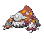

Ability:

```
+ Flame Body
```

**#486 Regigigas**


Ability:

```
+ Pressure
```

**#489 Phione**


Stat Change:

```
+ HP (85)
+ Attack (85)
+ Defense (85)
+ Special Attack (85)
+ Special Defense (85)
+ Speed (85)
+ Total (510)
```

**#493 Arceus**


Item Change:

```
+ It’s a secret!
```

Level Up Moves:

```
+ It’s a secret!
```

