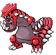

# Special Event Guide

This document details the legendary encounters in the games as well as a few other one-time encounters such as Rotom and Spiritomb.

The information detailed here is relevant to most of the 'discovering' sections in the game; unless you are positive you want to spoil yourself on how to get some of these rarer Pokémon, move away from this document now.

Note that for newly added event encounters, you have endless opportunities to catch them unless otherwise specified.

---

## Non-Legendary Encounters

### #479 Rotom

**Requirements:**

1. Plain Badge

**Guide:**

1. Obtaining Rotom is fairly simple; once you earn your Plain Badge from Whitney, return to New Bark Town and interact with the TV on the bottom floor of your house
2. You will be asked if you want to thump it, á la Diamond & Pearl; choose Yes to encounter a Level 20 Rotom
3. Note that if you wish to change Rotom's form prior to reaching Saffron City properly, there is a thief in the bottom of the Goldenrod Mart behind a box who will teleport you to the appropriate room.

### #442 Spiritomb

**Requirements:**

1. An Odd Keystone

**Guide:**

1. The only thing you need to get this Pokémon is an Odd Keystone; Cynthia will give you one as you are on your way to Goldenrod City
2. With a keystone in hand, return to Azalea Town and stand on the top of the ladder into Slowpoke Well, and press A
3. You will be asked if you want to throw the keystone into the well; choose Yes to encounter a Level 20 Spiritomb
4. Note that the keystone is consumed immediately, so defeating the Spiritomb will not let you immediately retry without another Odd Keystone
5. Further Odd Keystones can be obtained from the captain of the S.S
6. Aqua after obtaining the Earth Badge.

### #185 Sudowoodo

**Requirements:**

1. None, storyline.

**Guide:**

1. Sudowoodo, being there to begin with, has not changed much from the original Heart Gold and Soul Silver; get the Plain Badge, get the SquirtBottle, and toss some water on it
2. The only difference is that it is now Level 25, as opposed to its original Level 20.

### #131 Lapras

**Requirements:**

1. Friday
1. Fog Badge

**Guide:**

1. Lapras has also not changed; once you get the Fog Badge from Morty you are able to catch one every Friday
2. The only difference is that Lapras is now Level 25, instead of its original Level 20.

### #130 Gyarados

**Requirements:**

1. None, storyline.

**Guide:**

1. The Red Gyarados has also changed very little
2. The main difference is that it is now Level 40 instead of Level 30.

### #143 Snorlax

**Requirements:**

1. Kanto Radio Card Expansion

**Guide:**

1. Snorlax has changed slightly in that its position has moved; although this is not reflected in the image, Snorlax is now a couple steps right of the entrance to Diglett's Cave, which means it only blocks your route to the rest of Route 11
2. Aside from that, it's mostly the same, with the exception of it now being Level 60.

---

## Psuedo-Legend Encounters

**Requirements:**

1. Earth Badge

**Guide:**

1. Once you get the Earth Badge, you can collect a special gift! If you go to the radio in Tohjo Falls, you will be notified that you are able to turn on a channel, and will be given a choice of five
2. The one you pick will cause a particular Pokémon to appear at Level 60 in its shiny form
3. The options correlate as follows: Sixteen Hours

### #149 Dragonite

The Black Rock

### #248 Tyranitar

Menacing Boom

### #373 Salamence

Cross Attack

### #376 Metagross

Jaws on Land

### #445 Garchomp

---

## Gifted Pokémon

### #133 Eevee

**Requirements:**

1. None; storyline.

**Guide:**

1. This is not missable; when you first reach Mr
2. Pokémon's house you will see Cynthia standing outside of it
3. After talking to her, she will gift you with a Level 5 Eevee
4. You will obtain an evolution item for Eevee from the sage at Sprout Tower, and its first elemental attack is learned at Level 13
5. Further Eevee are available from the Celadon Game Corner later in the game.

### #351 Castform

**Requirements:**

1. Enter Ecruteak Pokémon Center.

**Guide:**

1. Castform replaces the Eevee that Bill gave you previously; all other rules are the same
2. It comes at Level 25, and is attached with a Mystic Water (as usual..)

### #447 Riolu

**Requirements:**

1. Reach Mahogany Town.

**Guide:**

1. Once you get to Mahogany Town, you will find Riley and Buck situated in one of the houses
2. Talk to Riley and he'll give you an Egg that hatches into a Riolu if there is a free slot n your party.

### #148 Dragonair

**Requirements:**

1. Return to Dragon's Den afterwards.

**Guide:**

1. As usual, you are able to receive a Dragon with ExtremeSpeed from the Elder
2. The only difference is that it's now a Level 45 Dragonair who is also holding a Draco Plate.

Surfing & Flying Pikachu

**Requirements:**

1. Reach Cianwood
1. Have a Pokémon whose happiness is

maximum.

**Guide:**

1. On the beach of Cianwood City you will find the younger Caitlin; though she doesn't introduce herself, she will comment on a Pikachu she found and how it needs a good Trainer to take care of it
2. If you have a Pokémon behind you whose happiness is 255 (i.e
3. the maximum possible) then she will happily hand the Pikachu over if you have room in your party.

Tyrogue is unchanged apart from it now

being equipped with a Fist Plate when

received as a gift. Further Tyrogue can be

obtained from Celadon Game Corner.

Togepi, Spearow and Shuckle are totally

unchanged from their HG/SS events.

---

## Starters

### #001 Bulbasaur, #004 Charmander, #007 Squirtle

  

**Requirements:**

1. Reach Violet City…

**Guide:**

1. Your first opportunity to obtain a Kanto starter will be in Violet City; in the Pokémon Center you will see a Juggler
2. If you talk to him, he'll ask you a series of four questions; answer all correctly and you'll be able to choose one of the three
3. Once you reach Kanto, if you go to Route 12 and into the house where the Super Rod was previously, you will find Professor Oak
4. Show him your Kanto starter (evolution doesn't matter) and you'll receive the two you didn't pick
5. (N.B.: This replaces the original Kanto starter event.)

### #152 Chikorita, #155 Cyndaquil, #158 Totodile

  

**Requirements:**

1. Start the game…

**Guide:**

1. The Johto starters remain in place in this game, so you'll pick one at the start as usual
2. Once you reach Saffron City, you will find Professor Elm in Silph Co
3. Talk to him with two free slots in your party and you'll automatically receive the other two Johto starters that you didn't pick.

### #252 Treecko, #255 Torchic, #258 Mudkip

  

**Requirements:**

1. Reach Azalea Town…

**Guide:**

1. A Hoenn starter is first available in the Azalea Town Pokémon Center for correctly answering the quiz questions
2. You can then obtain the other two from Steven in Pewter City later on, by showing him the Hoenn starter you did pick (evolved is fine).

### #387 Turtwig, #390 Chimchar, #393 Piplup

  

**Requirements:**

1. Reach Goldenrod City…

**Guide:**

1. Your first Sinnoh starter will be obtainable via a quiz given to you by the Juggler in the city's Pokémon Center
2. After you beat the Elite Four, come back to the archaeological building and talk to Cynthia; show her your Sinnoh starter (evolved is fine) and she will give you the other two that you didn't choose initially.

---

## Legendary Pokémon

### #144 Articuno, #145 Zapdos

 

**Requirements:**

1. 16 badges (Zapdos only).

**Guide:**

1. These birds are obtained the same as in HG/SS
2. The difference is that they are now ten levels higher i.e
3. Level 60.

### #146 Moltres

**Requirements:**

1. 16 badges.
1. Heatran caught.

**Guide:**

1. Moltres has been moved again; this time you will find it within the Cinnabar Gym after you have captured Heatran (see its section on how to do so)
2. As with its relations, it is Level 60.

### #150 Mewtwo

**Requirements:**

1. 16 badges.

**Guide:**

1. Mewtwo is in the same position as normal
2. Its main difference is that it is now Level 75
3. Check back in the same spot after capturing Mewtwo for a special surprise!

### #151 Mew

**Requirements:**

1. 16 badges.

**Guide:**

1. Mew is found in Viridian Forest; when you first enter you will find it in the position as shown in the picture on the left side of the forest
2. When you talk to it, it Teleports to the center-north of the forest
3. Talk to it again and it'll Teleport to the center-south; talk to it once more to get it to Teleport to a small alcove between the trees just south of the northern exit
4. Talk to it again to battle it; it is Level 45.

### #243 Raikou, #244 Entei, #245 Suicune

  

**Requirements:**

1. Enter bottom of Burned Tower.
1. See around the region (Suicune only).

**Guide:**

1. These beasts are exactly the same as HG/SS
2. No changes to level or anything, so just do as you normally would.

### #249 Lugia, #250 Ho-oh

 

**Requirements:**

1. Depends on your game…

**Guide:**

1. Lugia and Ho-oh are also unchanged, save for the fact that the first one you encounter is now Level 50 instead of Level 45.

### #251 Celebi

**Requirements:**

1. Sixteen badges
1. Obtain Azure Flute

**Guide:**

1. To get Celebi you must interact with the shrine while having the Azure Flute in

your inventory. To do this, you must give

the Magma Stone (location of which is

shown in Heatran's section) to a woman in one of the houses in Lavender Town; she'll

give you an Azure Flute in exchange. Once you choose to use the flute, Celebi will

appear and attack – note that this is one of the legendaries who you get ONLY one

chance to battle, regardless of the result of the fight. It comes at Level 45.

### #377 Regirock, #378 Regice, #379 Registeel

  

**Requirements:**

1. Defeat the Elite Four.

**Guide:**

1. Once you become the Champion, head over to Olivine Harbour
2. Oak will congratulate you and give you the Lock Capsule as a gift
3. Take this item to Cynthia in Goldenrod City and she'll cause a reaction that releases the three Regi Pokémon for you to battle
4. You can find Regirock on the bottom floor of Mt
5. Mortar, Regice on the second to bottom floor of Ice Path, and Registeel in the Blackthorn Side of Dark Cave
6. All three are encountered at Level 40.

### #380 Latias, #381 Latios

 

**Requirements:**

1. Depends on your version…

**Guide:**

1. The first Lati you encounter depends on what version you're playing; as usual, when you collect the Poké Doll from the fan club in Vermilion City, Steven will appear and inform you about the legends
2. At this point Latias (for SG players) or Latios (for SS players) will start moving around the Kanto region at Level 35 as usual
3. Once you have caught your roamer, go to Steven in Pewter City and show the legendary to him
4. The Enigma Crystal he has starts reacting as a result, and he'll give it to you
5. Take this Enigma Crystal to Goldenrod City and talk to the guy to the left of Cynthia; he'll polish it up and reveal it to be a Soul Dew
6. Return to Vermilion City and talk to the plaque on the raised bit; with the Soul Dew in your inventory you will have the option to challenge the other Lati, though as the game warns you this is a one-time encounter
7. If you select Yes, the other Lati will appear and you'll engage in battle with it; it will be at Level 40.

### #383 Groudon, #382 Kyogre, #384 Rayquaza

  

**Requirements:**

1. Defeat Red.

**Guide:**

1. Catching the titans is mostly the same as in HG/SS but things have been streamlined a bit
2. Once you defeat Red, return to Pallet Town to get a monologue about the Legendary Trainer tale from Professor Oak
3. Afterwards, visit Mr
4. Pokémon and he'll give you the Red Orb (this is regardless of version)
5. Go to Route 47 and enter the Embedded Tower and you'll see Groudon there
6. Once you capture it, the Red Orb automatically changes into the Blue Orb
7. Re-enter the room and you'll see Kyogre
8. After catching that, the Blue Orb will morph into the Jade Orb
9. Re-enter the room again to find Rayquaza
10. Rayquaza's level has been shifted up to Level 75.

### #385 Jirachi

**Requirements:**

1. Sixteen badges
1. Obtain Azure Flute

**Guide:**

1. Once you get Rock Climb from Professor Oak, you will find one of the Kimono Girls standing outside the Dance Theater in Ecruteak
2. She will inform you about Jirachi, and how they sense it is in Johto somewhere
3. To be more specific, Jirachi is located right at the back of Mt
4. Mortar, near where the Karate King is
5. If you have the Azure Flute (the method is detailed in Celebi's section) then you can talk to it to wake it up
6. Once you do so, it will ask what wish you want; you can pick only one
7. You have a choice between $300,000, a maxed Coin Case, a large amount of Rare Candies or a battle with a Level 45 Jirachi
8. This will be your only chance to capture it, so I would recommend the last option…

### #386 Deoxys

**Requirements:**

1. Sixteen badges.

**Guide:**

1. Obtaining Deoxys is as simple as standing in a certain spot on Route 3; if you go to the center of the four meteors then you will be informed that your Pokémon 'senses something'
2. If you do this after getting the Earth Badge between midnight and 4am inclusive, Deoxys will make an appearance and attack you
3. It will be at Level 60.

### #480 Uxie, #481 Mesprit, #482 Azelf

  

**Requirements:**

1. Complete the Power Plant event.

**Guide:**

1. The key to obtaining these three is though the use of the Red Chain, which you will automatically receive from the manager of the Power Plant once you give him the Machine Part back
2. Take the Red Chain to Cynthia in Goldenrod City and she will give you the option to teleport to Sinjoh Ruins
3. Once you do so, head to the Mystri Stage and you'll already find Uxie, Mesprit and Azelf there
4. All three are encountered at Level 50.

### #483 Dialga, #484 Palkia, #487 Giratina

  

**Requirements:**

1. Obtain the Earth Badge.
1. Capture the pixie trio.

**Guide:**

1. Once you get the Earth Badge and Uxie, Mesprit and Azelf are all captured, stand in the center of the stage and it will 'judge' you to be ready to face Dialga, Palkia and Giratina
2. The screen will fade out and come back in with their appearance on the stage; all three are encountered at Level 70
3. After capturing each one, you will get their respective Orb item as well (e.g
4. capturing Dialga gives you the Adamant Orb.)

### #485 Heatran

**Requirements:**

1. Sixteen badges.

**Guide:**

1. Heatran is found at the top of Cinnabar; to be more specific, the Magma Stone is found there
2. If you Rock Climb up you will find an item ball there (where the Magmarizer was in the original Heart Gold & Soul Silver)
3. Pick it up to receive the Magma Stone; Heatran will automatically appear at the top of the island as a result
4. Talk to it to encounter it at Level 70
5. Capturing Heatran also allows you to capture Moltres—and don't forget to trade your Magma Stone for the Azure Flute in Lavender Town!

### #486 Regigigas

**Requirements:**

1. Sixteen badges.
1. The capture of the other Regi.

**Guide:**

1. Regigigas took up Moltres' old property, but has barricaded the room
2. Just outside the entrance to Regigigas' room you will find a tablet; it will say something about bodies of rock, ice and steel
3. If you interact with the tablet with Regirock, Regice and Registeel in your party, it will shatter and give you access to the room
4. Rock Climb down and talk to Regigigas to encounter it; it appears at Level 75
5. Note that for those of you playing the full version of the game, it's no longer restricted by Slow Start!

### #488 Cresselia

**Requirements:**

1. Sixteen badges.

**Guide:**

1. Once you obtain the Earth Badge, walk into the bed in your room in New Bark Town to try to sleep
2. The player will suffer from a 'nightmare' that will leave them unable to rest (i.e
3. your Pokémon are not healed)
4. After this occurs, take a trip to Mt
5. Moon
6. If you go at any point when the Clefairy are not dancing - after activating the aforementioned event - you will find Cresselia sitting in the pond
7. Challenge it to get a chance at capturing it; it is at Level 50
8. Note that capturing it will reward you with the Lunar Wing, which is key to obtaining Darkrai.

### #489 Phione

**Requirements:**

1. Nothing in particular…

**Guide:**

1. Although Phione isn't a legend, I felt I may as well put it here with the others anyway
2. Getting Phione is fairly simple; as the girl at the shore of Route 40 will tell you, schools of Phione cross the seas
3. This translates to you having a 2% chance of encountering a Level 30 Phione each time you find a Wild Pokémon on the water of Route 40 or Route 41
4. Note that every other findable Pokémon by Surf can also be found at Level 30, so Repels won't work in this case! Once you get a Phione, show it to the girl who mentioned them on the shore to receive five Heart Scales!

### #490 Manaphy

**Requirements:**

1. Obtain the Earth Badge.

**Guide:**

1. Obtaining Manaphy is fairly simple; once you get the Earth Badge you will find a Kimono Girl on the beach of Route 40
2. Talk to her and she'll mention how she's picked up a special Egg, and asks if you want to take hold of it
3. Accept and she will give you a Manaphy Egg, complete with the usual special design! Just walk around for a while and it'll hatch into Manaphy.

### #491 Darkrai

**Requirements:**

1. Sixteen badges.
1. Capturing Cresselia.

**Guide:**

1. After capturing Cresselia, you should obtain the Lunar Wing
2. With it in hand, return to your room in New Bark Town and attempt to sleep again
3. This time, the effect of the Lunar Wing will kick in, causing Darkrai to reveal itself and attack! It appears at Level 50, and you can do this as many times as you wish.

### #492 Shaymin

**Requirements:**

1. Sixteen badges.
1. Have the Azure Flute.

**Guide:**

1. Once you get the Earth Badge, talk to the younger girl in the Flower Shop in Goldenrod and she'll mention Shaymin
2. Go to National Park and it will be sitting in the grass
3. Talk to it; if you have the Azure Flute you will be asked if you want to play it
4. If you agree, then Shaymin will calm down and challenge you to a battle; it is at Level 45.

### #493 Arceus

Capturing Arceus is the main objective of Sacred Gold & Storm Silver, so if you do manage to capture it, you will have officially completed the hack (and there will be text in the game reflecting as such). However, due to this, it's an incredibly tough Pokémon to capture!

**Requirements:**

1. The first requirement is that you must have captured each and every other available Pokémon. That means you will need to obtain 492 different Pokémon species before being allowed to challenge Arceus, and they aren't all wild! You can use features such as the Meridian and Pastoral Sounds and the Game Corner to speed things up, but there will be some Pokémon that you either have to evolve or breed to actually get everything on the list.
1. The second requirement is that you need to obtain all sixteen of the Plate items, which have been dotted around the regions in a sort of Treasure Hunt. The locations for these will be detailed below…

**Guide:**

1. Once both of these requirements have been fulfilled, head to the Mystri Stage
2. Assuming there is nothing else on the stage (which there shouldn't be, given that you need to capture everything to even try Arceus) then walk to the center and a check will be performed; if you have all sixteen Plate items in your inventory and your Pokédex is as full as can be, you will be given one chance to battle Arceus
3. Note that if you run or knock it out, this will be considered as the 'bad ending', and a quick reset will be needed to try again as the credits will automatically play after the game regardless of whether you run from Arceus, knock it out or capture it
4. Capturing Arceus will also lock you out of Sinjoh Ruins, but there's nothing to do afterwards, anyway…

**Plates:**

You will of course need sixteen Plates, one for each non-Normal type. Their locations are generally related to their elements; you might find them on the ground somewhere, or they might have been picked up by someone who doesn't know what they do… at any rate, a list is below if you're truly stuck.

1. Flame Plate: There's a dirt pile in Bellchime Trail hidden between some trees. Check it to obtain the Plate.
1. Splash Plate: In the main room of the S.S. Aqua there is a guy on the left side who wants to see Phione. Show him a Phione and he'll want to see a Manaphy. Show him Manaphy and he'll give you the Splash Plate.
1. Icicle Plate: There is a snow pile somewhat hidden behind a wall in the snowy outside of Sinjoh Ruins. Check it to obtain the Icicle Plate.
1. Toxic Plate: After obtaining the Hive Badge, go to Elm's lab in New Bark Town and interact with the bin. You will find and obtain the Toxic Plate.
1. Mind Plate: Visit Mr. Psychic's house in Saffron City; there is a new character who wishes to see a Psychic Pokémon that has reached stage two (i.e. the final form of a three-stage evolution line). Talk to him with Alakazam, Gardevoir, Gallade or Metagross at the front of your party to receive the Mind Plate.
1. Zap Plate: Once you get the Power Plant up and running again, check the bookcase to the bottom-right of the room to get the Zap Plate.
1. Meadow Plate: On Route 39 there is a girl by some trees having trouble with her dance moves; if you talk to her with a Bellossom behind you, she will ask if you will let it dance for her. Do so and she'll thank you with both a TM53 and the Meadow Plate.
1. Fist Plate: Obtain the Tyrogue from the Karate King in Mt. Mortar; it is equipped with the Fist Plate.
1. Sky Plate: There is a pile of snow directly in front of Red at the top of Mt. Silver; check it to get the Sky Plate.
1. Earth Plate: Return to Diglett's Cave with Rock Climb and check one of the higher areas to find the Earth Plate in an item ball.
1. Insect Plate: In National Park, there is a trainer in the center-north who will say something about the ground beneath him being hard. Interact with the spot he was on when in the Bug Catching Contest and you will obtain the Insect Plate.
1. Stone Plate: To the right of Pewter Museum there should be a pile of dirt; check it to obtain the Stone Plate. (If the pile isn't there for some reason before you obtain the Plate, it's located as far to the bottom-right corner as you can go before jumping over the ledge.)
1. Spooky Plate: In Lavender Town's cemetery there is a woman who asks if you would pay your respects to her Pokémon. Agree to do so and she'll give you the Spooky Plate as thanks.
1. Draco Plate: Obtain the Dragonair from the Dragon's Den Elder. It is equipped with the Draco Plate.
1. Dread Plate: In Olivine Lighthouse there is a woman who asks for 15 Poké Balls and a Destiny Knot; the Destiny Knot is obtainable in an item ball on Route 27. If you talk to her with both and agree to your request, she'll fail to make an item and run off. You don't get your given items back, but she does drop the Dread Plate behind her.
1. Iron Plate: Steven will give you this one automatically when he explains the Plates inthe gatehouse between Ecruteak City and Route 38.

---

## Final Notes

Good luck with your legendary hunting!

N.B.: The original design for the Mind Plate was as a reward for capturing all 28 forms of Unown, but this got changed due to it being a bit too tedious to be worthwhile. Consider yourselves lucky!

