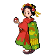
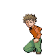
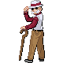

# Trainer Pokémon

!!! tip

	For a more comprehensive list of trainers, please refer to the [Wild Encounters]() page.

1. Important trainers have their entire roster listed including species, levels, items, moves.
1. Some trainers have a (!) next to their name. This means that they have further rosters via the Pokegear.
1. The Rival Silver at the Pokemon League has (MW) next the name. This eans he's only battleable on Monday and Wednesday.
1. As the note above mentioned, some trainers have a letter and time stamp next to their name (Ex. M10a-8p). This means they can only be rematched on that certain day and time stamp.
1. Bug Catcher Wade's rematch battles 1 and 2 are swapped (probably a bug). Keep that in mind if you ever rematch him.
1. Bird Keeper Jose's first rematch battle is using the base game roster (probably a bug).
1. The Gym Leader rematches have their day and time. Put that there in case you wanted to fight them outside the Battle Marathon.

---

## Cherrygrove City

<h3>Important Trainers</h3>

**Passerby Boy**

=== "Totodile"

	<pre><code><b><a href='/sgss-wiki/pokemon/chikorita/'>Chikorita</a></b> @ None
	<b>Ability:</b> Overgrow
	<b>Level:</b> 5
	<b>Moves:</b>
	1. Tackle
	2. Growl
	3. —
	4. —</code></pre>

=== "Chikorita"

	<pre><code><b><a href='/sgss-wiki/pokemon/cyndaquil/'>Cyndaquil</a></b> @ None
	<b>Ability:</b> Blaze
	<b>Level:</b> 5
	<b>Moves:</b>
	1. Tackle
	2. Leer
	3. —
	4. —</code></pre>

=== "Cyndaquil"

	<pre><code><b><a href='/sgss-wiki/pokemon/totodile/'>Totodile</a></b> @ None
	<b>Ability:</b> Torrent
	<b>Level:</b> 5
	<b>Moves:</b>
	1. Scratch
	2. Leer
	3. —
	4. —</code></pre>

---

## Route 30

<h3>Generic Trainers</h3>

1. Youngster Joey (!)
	1. Lv. 7 Rattata
1. Aroma Lady Julia
	1. Lv. 6 Budew
	2. Lv. 6 Sentret
	3. Lv. 6 Seedot
	4. Lv. 6 Cherubi
1. Idol Carly
	1. Lv. 6 Jigglypuff
	2. Lv. 6 Clefairy
	3. Lv. 6 Skitty

<h3>Rematches</h3>

1. Youngster Joey (M10a-8p)
	1. Lv. 48 Raticate
1. Youngster Joey (M10a-8p)
	1. Lv. 56 Raticate
1. Youngster Joey (M10a-8p)
	1. Lv. 72 Raticate

---

## Route 31

<h3>Generic Trainers</h3>

1. Bug Catcher Wade (!)
	1. Lv. 7 Spinarak
	2. Lv. 7 Surskit
	3. Lv. 7 Ledyba
	4. Lv. 7 Nincada

<h3>Rematches</h3>

1. Bug Catcher Wade (T8p-5a)
	1. Lv. 52 Ariados
	2. Lv. 52 Ledian
	3. Lv. 52 Masquerain
	4. Lv. 52 Ninjask
1. Bug Catcher Wade (T8p-5a)
	1. Lv. 46 Ariados
	2. Lv. 46 Ledian
	3. Lv. 46 Masquerain
	4. Lv. 46 Ninjask
1. Bug Catcher Wade (T8p-5a)
	1. Lv. 68 Ariados
	2. Lv. 68 Ledian
	3. Lv. 68 Masquerain
	4. Lv. 68 Ninjask

---

## Sprout Tower

<h3>Generic Trainers</h3>

1. Sage Nico
	1. Lv. 8 Sunkern
	2. Lv. 8 Bellsprout
	3. Lv. 8 Ralts
	4. Lv. 8 Bellsprout
1. Sage Chow
	1. Lv. 9 Bellsprout
	2. Lv. 9 Poliwag
	3. Lv. 9 Exeggcute
1. Sage Edmond
	1. Lv. 10 Mareep
	2. Lv. 10 Oddish
	3. Lv. 10 Hoothoot
1. Sage Jin
	1. Lv. 12 Bellsprout
1. Sage Neal
	1. Lv. 11 Psyduck
	2. Lv. 11 Natu
	3. Lv. 11 Bulbasaur
1. Sage Troy
	1. Lv. 12 Abra
	2. Lv. 12 Hoothoot
	3. Lv. 12 Hoppip
	4. Lv. 12 Exeggcute
1. Elder Li
	1. Lv. 12 Bellsprout
	2. Lv. 12 Chingling
	3. Lv. 12 Cherubi
	4. Lv. 14 Hoothoot

---

## Ruins of Alph

<h3>Generic Trainers</h3>

1. Psychic Nathan
	1. Lv. 30 Girafarig

---

## Violet City (Gym)

<h3>Generic Trainers</h3>

1. Bird Keeper Abe
	1. Lv. 11 Spearow
	2. Lv. 11 Pidgey
	3. Lv. 11 Doduo
1. Bird Keeper Rod
	1. Lv. 11 Tailow
	2. Lv. 11 Wingull
	3. Lv. 11 Natu
	4. Lv. 11 Zubat

<h3>Important Trainers</h3>

**Leader Falkner**

<pre><code><b><a href='/sgss-wiki/pokemon/doduo/'>Doduo</a></b> @ None
<b>Ability:</b> Early Bird
<b>Level:</b> 12
<b>Moves:</b>
1. Aerial Ace
2. Roost
3. Quick Attack
4. Growl  <b><a href='/sgss-wiki/pokemon/farfetchd/'>Farfetch'd</a></b> @ None
<b>Ability:</b> Inner Focus
<b>Level:</b> 12
<b>Moves:</b>
1. Aerial Ace
2. Roost
3. Fury Attack
4. Poison Jab  <b><a href='/sgss-wiki/pokemon/chatot/'>Chatot</a></b> @ None
<b>Ability:</b> Tangled Feet
<b>Level:</b> 12
<b>Moves:</b>
1. Roost
2. Agility
3. Chatter
4. Uproar  <b><a href='/sgss-wiki/pokemon/murkrow/'>Murkrow</a></b> @ Oran Berry
<b>Ability:</b> Super Luck
<b>Level:</b> 14
<b>Moves:</b>
1. Roost
2. Aerial Ace
3. Haze
4. Feint Attack  <b><a href='/sgss-wiki/pokemon/swablu/'>Swablu</a></b> @ Power Herb
<b>Ability:</b> Natural Cure
<b>Level:</b> 14
<b>Moves:</b>
1. Roost
2. Mirror Move
3. Aerial Ace
4. Solar Beam  <b><a href='/sgss-wiki/pokemon/pidgeotto/'>Pidgeotto</a></b> @ Oran Berry
<b>Ability:</b> Tangled Feet
<b>Level:</b> 15
<b>Moves:</b>
1. Roost
2. Aerial Ace
3. Tackle
4. Mud Slap</code></pre>

---

## Route 32

<h3>Generic Trainers</h3>

1. Parasol Lady Joan
	1. Lv. 14 Mareep
	2. Lv. 14 Drifloon
1. Ruin Maniac Gordon
	1. Lv. 14 Sandshrew
	2. Lv. 14 Onix
1. Picnicker Liz (!)
	1. Lv. 14 Nidoran♀
	2. Lv. 14 Ponyta
1. Fisherman Henry
	1. Lv. 14 Poliwag
	2. Lv. 14 Remoraid
	3. Lv. 14 Goldeen
1. Fisherman Justin
	1. Lv. 10 Magikarp
	2. Lv. 10 Magikarp
	3. Lv. 15 Magikarp
	4. Lv. 15 Feebas
1. Fisherman Ralph (!)
	1. Lv. 14 Goldeen
	2. Lv. 14 Qwilfish
1. Camper Roland
	1. Lv. 14 Nidoran♂
	2. Lv. 14 Diglett
	3. Lv. 14 Pikachu
1. Ace Trainer Peter
	1. Lv. 14 Staravia
	2. Lv. 14 Oddish
	3. Lv. 14 Elekid
	4. Lv. 16 Nidorino

<h3>Rematches</h3>

1. Picnicker Liz (Th10a-8p)
	1. Lv. 47 Rapidash
	2. Lv. 47 Nidoqueen
1. Picnicker Liz (Th10a-8p)
	1. Lv. 53 Victreebel
	2. Lv. 53 Rapidash
	3. Lv. 53 Nidoqueen
1. Picnicker Liz (Th10a-8p)
	1. Lv. 68 Victreebel
	2. Lv. 68 Rapidash
	3. Lv. 68 Nidoqueen
1. Fisherman Ralph (W4a-10a)
	1. Lv. 46 Seaking
	2. Lv. 46 Qwilfish
1. Fisherman Ralph (W4a-10a)
	1. Lv. 53 Qwilfish
	2. Lv. 53 Seaking
1. Fisherman Ralph (W4a-10a)
	1. Lv. 69 Qwilfish
	2. Lv. 69 Seaking

---

## Union Cave

<h3>Generic Trainers</h3>

1. Firebreather Ray
	1. Lv. 16 Vulpix
1. Hiker Daniel
	1. Lv. 16 Onix
1. Hiker Russel
	1. Lv. 14 Geodude
	2. Lv. 15 Nosepass
1. Firebreather Bill
	1. Lv. 14 Koffing
	2. Lv. 14 Magby
	3. Lv. 14 Charmander
1. Poke Maniac Larry
	1. Lv. 15 Slowpoke
	2. Lv. 15 Cubone
1. Hiker Leonard
	1. Lv. 26 Makuhita
	2. Lv. 29 Hariyama
1. Hiker Phillip
	1. Lv. 27 Nosepass
	2. Lv. 27 Graveler
	3. Lv. 29 Golem
1. Poke Maniac Andrew
	1. Lv. 29 Marowak
	2. Lv. 29 Lickilicky
1. Poke Maniac Calvin
	1. Lv. 30 Kangaskhan
1. Ace Trainer Gwen
	1. Lv. 30 Grovyle
	2. Lv. 30 Marshtomp
	3. Lv. 30 Combusken
1. Ace Trainer Nick
	1. Lv. 30 Charmeleon
	2. Lv. 30 Wartortle
	3. Lv. 30 Ivysaur
1. Ace Trainer Emma
	1. Lv. 30 Monferno
	2. Lv. 30 Prinplup
	3. Lv. 30 Grotle

---

## Route 33

<h3>Generic Trainers</h3>

1. Hiker Anthony (!)
	1. Lv. 16 Geodude
	2. Lv. 16 Machop

<h3>Rematches</h3>

1. Hiker Anthony (F8p-5a)
	1. Lv. 46 Graveler
	2. Lv. 46 Machoke
1. Hiker Anthony (F8p-5a)
	1. Lv. 52 Golem
	2. Lv. 52 Machamp
	3. Lv. 52 Nosepass
1. Hiker Anthony (F8p-5a)
	1. Lv. 68 Golem
	2. Lv. 68 Machamp
	3. Lv. 68 Probopass

---

## Slowpoke Well

<h3>Generic Trainers</h3>

1. Team Rocket Grunt
	1. Lv. 16 Rattata
	2. Lv. 16 Zubat
	3. Lv. 16 Ekans
1. Team Rocket Grunt
	1. Lv. 17 Grimer
	2. Lv. 17 Geodude
	3. Lv. 17 Poochyena
1. Team Rocket Grunt
	1. Lv. 18 Cacnea
	2. Lv. 18 Nidorina

<h3>Important Trainers</h3>

**Executive Proton**

<pre><code><b><a href='/sgss-wiki/pokemon/voltorb/'>Voltorb</a></b> @ None
<b>Ability:</b> Aftermath
<b>Level:</b> 17
<b>Moves:</b>
1. Spark
2. Screech
3. Self Destruct
4. Toxic  <b><a href='/sgss-wiki/pokemon/cacnea/'>Cacnea</a></b> @ None
<b>Ability:</b> Sand Veil
<b>Level:</b> 17
<b>Moves:</b>
1. Needle Arm
2. Sucker Punch
3. Leer
4. Toxic  <b><a href='/sgss-wiki/pokemon/zubat/'>Zubat</a></b> @ None
<b>Ability:</b> Inner Focus
<b>Level:</b> 17
<b>Moves:</b>
1. Wing Attack
2. Giga Drain
3. Supersonic
4. Toxic  <b><a href='/sgss-wiki/pokemon/koffing/'>Koffing</a></b> @ None
<b>Ability:</b> Levitate
<b>Level:</b> 18
<b>Moves:</b>
1. Sludge Bomb
2. Self Destruct
3. Flamethrower
4. Toxic</code></pre>

---

## Azalea Town (Gym)

<h3>Generic Trainers</h3>

1. Bug Catcher Al
	1. Lv. 17 Combee
	2. Lv. 17 Pineco
	3. Lv. 17 Kricketune
1. Bug Catcher Benny
	1. Lv. 18 Paras
	2. Lv. 18 Nincada
	3. Lv. 18 Ledian
	4. Lv. 18 Skorupi
1. Bug Catcher Josh
	1. Lv. 20 Wormadam
1. Twins Amy & Mimi
	1. Lv. 18 Illumise
	2. Lv. 18 Volbeat
	3. Lv. 18 Dustox
	4. Lv. 18 Beautifly

<h3>Important Trainers</h3>

**Leader Bugsy**

<pre><code><b><a href='/sgss-wiki/pokemon/butterfree/'>Butterfree</a></b> @ Damp Rock
<b>Ability:</b> Compound Eyes
<b>Level:</b> 18
<b>Moves:</b>
1. U-Turn
2. Rain Dance
3. Confusion
4. Air Cutter  <b><a href='/sgss-wiki/pokemon/yanma/'>Yanma</a></b> @ None
<b>Ability:</b> Compound Eyes
<b>Level:</b> 18
<b>Moves:</b>
1. U-Turn
2. Detect
3. Air Cutter
4. Ancient Power  <b><a href='/sgss-wiki/pokemon/beedrill/'>Beedrill</a></b> @ None
<b>Ability:</b> Swarm
<b>Level:</b> 18
<b>Moves:</b>
1. U-Turn
2. Twineedle
3. Sludge Bomb
4. Cut  <b><a href='/sgss-wiki/pokemon/heracross/'>Heracross</a></b> @ Damp Rock
<b>Ability:</b> Guts
<b>Level:</b> 19
<b>Moves:</b>
1. Aerial Ace
2. Counter
3. Bug Bite
4. Rain Dance  <b><a href='/sgss-wiki/pokemon/pinsir/'>Pinsir</a></b> @ None
<b>Ability:</b> Mold Breaker
<b>Level:</b> 19
<b>Moves:</b>
1. Vital Throw
2. Fury Cutter
3. Knock Off
4. Bind  <b><a href='/sgss-wiki/pokemon/scyther/'>Scyther</a></b> @ Sitrus Berry
<b>Ability:</b> Technician
<b>Level:</b> 21
<b>Moves:</b>
1. U-Turn
2. Quick Attack
3. Wing Attack
4. Swords Dance</code></pre>

---

## Azalea Town

<h3>Important Trainers</h3>

**Rival Silver**

=== "Totodile"

	<pre><code><b><a href='/sgss-wiki/pokemon/bayleef/'>Bayleef</a></b> @ None
	<b>Ability:</b> Torrent
	<b>Level:</b> 21
	<b>Moves:</b>
	1. Synthesis
	2. Reflect
	3. Nature Power
	4. Grass Whistle  <b><a href='/sgss-wiki/pokemon/murkrow/'>Murkrow</a></b> @ None
	<b>Ability:</b> Insomnia
	<b>Level:</b> 19
	<b>Moves:</b>
	1. Wing Attack
	2. Astonish
	3. Haze
	4. Pursuit  <b><a href='/sgss-wiki/pokemon/gastly/'>Gastly</a></b> @ None
	<b>Ability:</b> Levitate
	<b>Level:</b> 18
	<b>Moves:</b>
	1. Lick
	2. Curse
	3. Spite
	4. Mean Look  <b><a href='/sgss-wiki/pokemon/kadabra/'>Kadabra</a></b> @ None
	<b>Ability:</b> Synchronize
	<b>Level:</b> 18
	<b>Moves:</b>
	1. Kinesis
	2. Disable
	3. Confusion
	4. Teleport</code></pre>

=== "Chikorita"

	<pre><code><b><a href='/sgss-wiki/pokemon/quilava/'>Quilava</a></b> @ None
	<b>Ability:</b> Blaze
	<b>Level:</b> 21
	<b>Moves:</b>
	1. Flame Wheel
	2. Quick Attack
	3. Ember
	4. Smokescreen  <b><a href='/sgss-wiki/pokemon/murkrow/'>Murkrow</a></b> @ None
	<b>Ability:</b> Insomnia
	<b>Level:</b> 19
	<b>Moves:</b>
	1. Wing Attack
	2. Astonish
	3. Haze
	4. Pursuit  <b><a href='/sgss-wiki/pokemon/gastly/'>Gastly</a></b> @ None
	<b>Ability:</b> Levitate
	<b>Level:</b> 18
	<b>Moves:</b>
	1. Lick
	2. Curse
	3. Spite
	4. Mean Look  <b><a href='/sgss-wiki/pokemon/kadabra/'>Kadabra</a></b> @ None
	<b>Ability:</b> Synchronize
	<b>Level:</b> 18
	<b>Moves:</b>
	1. Kinesis
	2. Disable
	3. Confusion
	4. Teleport</code></pre>

=== "Cyndaquil"

	<pre><code><b><a href='/sgss-wiki/pokemon/croconaw/'>Croconaw</a></b> @ None
	<b>Ability:</b> Overgrow
	<b>Level:</b> 21
	<b>Moves:</b>
	1. Rage
	2. Bite
	3. Scary Face
	4. Ice Fang  <b><a href='/sgss-wiki/pokemon/murkrow/'>Murkrow</a></b> @ None
	<b>Ability:</b> Insomnia
	<b>Level:</b> 19
	<b>Moves:</b>
	1. Wing Attack
	2. Astonish
	3. Haze
	4. Pursuit  <b><a href='/sgss-wiki/pokemon/gastly/'>Gastly</a></b> @ None
	<b>Ability:</b> Levitate
	<b>Level:</b> 18
	<b>Moves:</b>
	1. Lick
	2. Curse
	3. Spite
	4. Mean Look  <b><a href='/sgss-wiki/pokemon/kadabra/'>Kadabra</a></b> @ None
	<b>Ability:</b> Synchronize
	<b>Level:</b> 18
	<b>Moves:</b>
	1. Kinesis
	2. Disable
	3. Confusion
	4. Teleport</code></pre>

---

## Route 34

<h3>Generic Trainers</h3>

1. Gentleman Samuel
	1. Lv. 20 Electrike
	2. Lv. 20 Cranidos
1. Socialite Brandon
	1. Lv. 20 Snubbull
	2. Lv. 20 Spoink
1. Picnicker Gina (!)
	1. Lv. 18 Hoppip
	2. Lv. 19 Skiploom
	3. Lv. 20 Ivysaur
1. Youngster Ian (!)
	1. Lv. 19 Mankey
	2. Lv. 19 Bonsly
	3. Lv. 19 Nidorino
1. Policeman Keith
	1. Lv. 20 Growlithe
1. Camper Todd (!)
	1. Lv. 20 Buizel

<h3>Rematches</h3>

1. Picnicker Gina (Su10a-8p)
	1. Lv. 47 Skiploom
	2. Lv. 47 Venusaur
	3. Lv. 47 Jumpluff
1. Picnicker Gina (Su10a-8p)
	1. Lv. 53 Jumpluff
	2. Lv. 53 Jumpluff
	3. Lv. 53 Venusaur
1. Picnicker Gina (Su10a-8p)
	1. Lv. 68 Jumpluff
	2. Lv. 68 Jumpluff
	3. Lv. 68 Venusaur
1. Youngster Ian (Sa4a-10a)
	1. Lv. 46 Primeape
	2. Lv. 46 Sudowoodo
	3. Lv. 46 Nidoking
1. Youngster Ian (Sa4a-10a)
	1. Lv. 52 Primeape
	2. Lv. 52 Sudowoodo
	3. Lv. 54 Nidoking
1. Youngster Ian (Sa4a-10a)
	1. Lv. 68 Primeape
	2. Lv. 68 Sudowoodo
	3. Lv. 68 Dugtrio
	4. Lv. 72 Nidoking
1. Camper Todd (Sa4a-10a)
	1. Lv. 45 Graveler
	2. Lv. 45 Golem
	3. Lv. 48 Floatzel
1. Camper Todd (Sa4a-10a)
	1. Lv. 52 Golem
	2. Lv. 52 Floatzel
	3. Lv. 52 Lairon
	4. Lv. 52 Magcargo
1. Camper Todd (Sa4a-10a)
	1. Lv. 68 Golem
	2. Lv. 68 Aggron
	3. Lv. 68 Floatzel
	4. Lv. 68 Magcargo

---

## Goldenrod Tunnel

<h3>Generic Trainers</h3>

1. PKMN Trainer Lyra
	1. Lv. 21 Nidorina
	2. Lv. 21 Marill
	3. Lv. 21 Roselia
	4. Lv. 23 Ninetales
1. PKMN Trainer Ethan
	1. Lv. 21 Nidorino
	2. Lv. 21 Marill
	3. Lv. 21 Tangela
	4. Lv. 23 Arcanine
1. Poke Maniac Donald
	1. Lv. 20 Slowpoke
	2. Lv. 20 Omanyte
	3. Lv. 20 Cubone
1. Super Nerd Teru
	1. Lv. 19 Magnemite
	2. Lv. 19 Voltorb
	3. Lv. 19 Porygon
1. Poke Maniac Issac
	1. Lv. 22 Lickitung
1. Super Nerd Eric
	1. Lv. 20 Grimer
	2. Lv. 20 Bronzor
	3. Lv. 20 Kabuto

<h3>Important Trainers</h3>

**Lyra**

<pre><code><b><a href='/sgss-wiki/pokemon/nidorina/'>Nidorina</a></b> @ None
<b>Ability:</b> Poison Point
<b>Level:</b> 21
<b>Moves:</b>
1. Double Kick
2. Blizzard
3. Aerial Ace
4. Thunder  <b><a href='/sgss-wiki/pokemon/marill/'>Marill</a></b> @ None
<b>Ability:</b> Thick Fat
<b>Level:</b> 21
<b>Moves:</b>
1. Bubble Beam
2. Double Team
3. Blizzard
4. Focus Punch  <b><a href='/sgss-wiki/pokemon/roselia/'>Roselia</a></b> @ None
<b>Ability:</b> Natural Cure
<b>Level:</b> 21
<b>Moves:</b>
1. Magical Leaf
2. Leech Seed
3. Grass Knot
4. Stun Spore  <b><a href='/sgss-wiki/pokemon/ninetales/'>Ninetales</a></b> @ Sitrus Berry
<b>Ability:</b> Flash Fire
<b>Level:</b> 23
<b>Moves:</b>
1. Flamethrower
2. Safeguard
3. Confuse Ray
4. Ominous Wind</code></pre>

**Ethan**

<pre><code><b><a href='/sgss-wiki/pokemon/nidorino/'>Nidorino</a></b> @ None
<b>Ability:</b> Poison Point
<b>Level:</b> 21
<b>Moves:</b>
1. Double Kick
2. Blizzard
3. Peck
4. Thunder  <b><a href='/sgss-wiki/pokemon/marill/'>Marill</a></b> @ None
<b>Ability:</b> Thick Fat
<b>Level:</b> 21
<b>Moves:</b>
1. Bubble Beam
2. Double Team
3. Blizzard
4. Focus Punch  <b><a href='/sgss-wiki/pokemon/tangela/'>Tangela</a></b> @ None
<b>Ability:</b> Chlorophyll
<b>Level:</b> 21
<b>Moves:</b>
1. Sleep Powder
2. Growth
3. Grass Knot
4. Solar Beam  <b><a href='/sgss-wiki/pokemon/arcanine/'>Arcanine</a></b> @ Sitrus Berry
<b>Ability:</b> Intimidate
<b>Level:</b> 23
<b>Moves:</b>
1. Heat Wave
2. Rock Smash
3. Roar
4. Iron Head</code></pre>

---

## Goldenrod City (Gym)

<h3>Generic Trainers</h3>

1. Beauty Victoria
	1. Lv. 20 Whismur
	2. Lv. 20 Teddiursa
	3. Lv. 20 Snubbull
	4. Lv. 20 Loudred
1. Beauty Samantha
	1. Lv. 20 Meowth
	2. Lv. 20 Munchlax
	3. Lv. 20 Kecleon
1. Lass Carrie
	1. Lv. 20 Furret
	2. Lv. 20 Bibarel
	3. Lv. 20 Raticate
	4. Lv. 20 Dunsparce
1. Lass Cathy
	1. Lv. 21 Jigglypuff
	2. Lv. 21 Happiny
	3. Lv. 21 Clefairy

<h3>Important Trainers</h3>

**Leader Whitney**

<pre><code><b><a href='/sgss-wiki/pokemon/lickitung/'>Lickitung</a></b> @ None
<b>Ability:</b> Own Tempo
<b>Level:</b> 21
<b>Moves:</b>
1. Power Whip
2. Disable
3. Body Slam
4. Attract  <b><a href='/sgss-wiki/pokemon/lopunny/'>Lopunny</a></b> @ None
<b>Ability:</b> Limber
<b>Level:</b> 21
<b>Moves:</b>
1. Attract
2. Jump Kick
3. Agility
4. Dizzy Punch  <b><a href='/sgss-wiki/pokemon/stantler/'>Stantler</a></b> @ None
<b>Ability:</b> Intimidate
<b>Level:</b> 21
<b>Moves:</b>
1. Hypnosis
2. Stomp
3. Zen Headbutt
4. Attract  <b><a href='/sgss-wiki/pokemon/wigglytuff/'>Wigglytuff</a></b> @ None
<b>Ability:</b> Cute Charm
<b>Level:</b> 22
<b>Moves:</b>
1. Ice Beam
2. Wish
3. Psychic
4. Attract  <b><a href='/sgss-wiki/pokemon/clefable/'>Clefable</a></b> @ Sitrus Berry
<b>Ability:</b> Magic Guard
<b>Level:</b> 22
<b>Moves:</b>
1. Water Pulse
2. Reflect
3. Charge Beam
4. Attract  <b><a href='/sgss-wiki/pokemon/miltank/'>Miltank</a></b> @ Lum Berry
<b>Ability:</b> Scrappy
<b>Level:</b> 22
<b>Moves:</b>
1. Milk Drink
2. Body Slam
3. Rollout
4. Attract</code></pre>

---

## Route 46

<h3>Generic Trainers</h3>

1. Hiker Bailey
	1. Lv. 20 Geodude
	2. Lv. 20 Geodude
	3. Lv. 20 Geodude
	4. Lv. 20 Geodude
	5. Lv. 20 Geodude
1. Camper Ted
	1. Lv. 24 Parasect
1. Picnicker Erin (!)
	1. Lv. 22 Ponyta
	2. Lv. 22 Pikachu

<h3>Rematches</h3>

1. Picnicker Erin (Sa8p-5a)
	1. Lv. 45 Rapidash
	2. Lv. 45 Pikachu
1. Picnicker Erin (Sa8p-5a)
	1. Lv. 53 Raichu
	2. Lv. 53 Sunflora
	3. Lv. 53 Rapidash
1. Picnicker Erin (Sa8p-5a)
	1. Lv. 68 Cherrim
	2. Lv. 68 Sunflora
	3. Lv. 68 Raichu
	4. Lv. 68 Rapidash

---

## Route 35

<h3>Generic Trainers</h3>

1. Bird Keeper Bryan
	1. Lv. 20 Hoothoot
	2. Lv. 20 Noctowl
1. Lady Kim
	1. Lv. 20 Skiploom
	2. Lv. 20 Combusken
1. Camper Elliot
	1. Lv. 20 Sandshrew
	2. Lv. 20 Flaaffy
1. Picnicker Brook
	1. Lv. 20 Pichu
	2. Lv. 20 Pikachu
1. Camper Ivan
	1. Lv. 20 Diglett
	2. Lv. 20 Zigzagoon
	3. Lv. 20 Linoone
1. Juggler Irwin
	1. Lv. 12 Voltorb
	2. Lv. 16 Voltorb
	3. Lv. 20 Voltorb
	4. Lv. 24 Voltorb
1. Firebreather Walt (!)
	1. Lv. 18 Stunky
	2. Lv. 21 Magmar
1. Policeman Dirk
	1. Lv. 22 Houndour
	2. Lv. 22 Mightyena
1. Bug Catcher Arnie (!)
	1. Lv. 21 Paras
	2. Lv. 21 Venonat

<h3>Rematches</h3>

1. Firebreather Walt (M10a-8p)
	1. Lv. 45 Skuntank
	2. Lv. 45 Magmar
1. Firebreather Walt (M10a-8p)
	1. Lv. 53 Skuntank
	2. Lv. 53 Magmortar
1. Firebreather Walt (M10a-8p)
	1. Lv. 66 Weezing
	2. Lv. 66 Skuntank
	3. Lv. 66 Magmortar
1. Bug Catcher Arnie (T4a-10a)
	1. Lv. 47 Venomoth
	2. Lv. 47 Parasect
1. Bug Catcher Arnie (T4a-10a)
	1. Lv. 54 Venomoth
	2. Lv. 54 Parasect
1. Bug Catcher Arnie (T4a-10a)
	1. Lv. 68 Ninjask
	2. Lv. 68 Shedinja
	3. Lv. 68 Venomoth
	4. Lv. 68 Parasect

---

## National Park

<h3>Generic Trainers</h3>

1. Pokefan Beverly
	1. Lv. 23 Granbull
1. School Kid Jack (!)
	1. Lv. 20 Oddish
	2. Lv. 20 Croagunk
	3. Lv. 20 Phanpy
	4. Lv. 20 Skitty
1. Pokefan William
	1. Lv. 19 Mime Jr.
	2. Lv. 22 Sudowoodo
1. Lass Krise (!)
	1. Lv. 19 Oddish
	2. Lv. 21 Gloom

<h3>Rematches</h3>

1. School Kid Jack (M4a-10a)
	1. Lv. 44 Gloom
	2. Lv. 46 Skitty
	3. Lv. 46 Donphan
	4. Lv. 48 Toxicroak
1. School Kid Jack (M4a-10a)
	1. Lv. 54 Vileplume
	2. Lv. 52 Toxicroak
	3. Lv. 52 Donphan
	4. Lv. 54 Delcatty
1. School Kid Jack (M4a-10a)
	1. Lv. 68 Vileplume
	2. Lv. 66 Toxicroak
	3. Lv. 68 Delcatty
	4. Lv. 72 Donphan
1. Lass Krise (Su4a-10a)
	1. Lv. 48 Vileplume
	2. Lv. 48 Marowak
1. Lass Krise (Su4a-10a)
	1. Lv. 53 Vileplume
	2. Lv. 53 Marowak
1. Lass Krise (Su4a-10a)
	1. Lv. 68 Vileplume
	2. Lv. 68 Marowak
	3. Lv. 68 Kangaskhan

---

## Route 36

<h3>Generic Trainers</h3>

1. Psychic Mark
	1. Lv. 19 Ralts
	2. Lv. 20 Kirlia
	3. Lv. 21 Kadabra
1. School Kid Alan (!)
	1. Lv. 21 Tangela
	2. Lv. 21 Quagsire

<h3>Rematches</h3>

1. School Kid Alan (W10a-8p)
	1. Lv. 47 Tangela
	2. Lv. 47 Quagsire
1. School Kid Alan (W10a-8p)
	1. Lv. 52 Xatu
	2. Lv. 52 Tangrowth
	3. Lv. 52 Yanmega
	4. Lv. 52 Quagsire
1. School Kid Alan (W10a-8p)
	1. Lv. 68 Xatu
	2. Lv. 68 Tangrowth
	3. Lv. 68 Yanmega
	4. Lv. 68 Quagsire

---

## Route 37

<h3>Generic Trainers</h3>

1. Twins Tori & Til
	1. Lv. 24 Plusle
	2. Lv. 24 Minun
1. Beauty Callie
	1. Lv. 24 Gloom
	2. Lv. 25 Cloyster
1. Parasol Lady Kassandra
	1. Lv. 24 Weepinbell
	2. Lv. 25 Starmie
1. Psychic Greg
	1. Lv. 23 Gastly
	2. Lv. 25 Drowzee

---

## Burned Tower

<h3>Generic Trainers</h3>

1. Firebreather Ned
	1. Lv. 25 Koffing
	2. Lv. 25 Numel
	3. Lv. 25 Quilava
1. Firebreather Richard
	1. Lv. 25 Magby
	2. Lv. 25 Slowpoke
	3. Lv. 25 Charmeleon

<h3>Important Trainers</h3>

**Rival Silver**

=== "Totodile"

	<pre><code><b><a href='/sgss-wiki/pokemon/magby/'>Magby</a></b> @ None
	<b>Ability:</b> Flame Body
	<b>Level:</b> 24
	<b>Moves:</b>
	1. Ember
	2. Feint Attack
	3. Smokescreen
	4. Fire Spin  <b><a href='/sgss-wiki/pokemon/bayleef/'>Bayleef</a></b> @ None
	<b>Ability:</b> Torrent
	<b>Level:</b> 27
	<b>Moves:</b>
	1. Reflect
	2. Magical Leaf
	3. Nature Power
	4. Natural Gift  <b><a href='/sgss-wiki/pokemon/murkrow/'>Murkrow</a></b> @ None
	<b>Ability:</b> Insomnia
	<b>Level:</b> 25
	<b>Moves:</b>
	1. Night Shade
	2. Haze
	3. Wing Attack
	4. Assurance  <b><a href='/sgss-wiki/pokemon/haunter/'>Haunter</a></b> @ None
	<b>Ability:</b> Levitate
	<b>Level:</b> 25
	<b>Moves:</b>
	1. Ominous Wind
	2. Confuse Ray
	3. Shadow Punch
	4. Sucker Punch  <b><a href='/sgss-wiki/pokemon/kadabra/'>Kadabra</a></b> @ None
	<b>Ability:</b> Synchronize
	<b>Level:</b> 26
	<b>Moves:</b>
	1. Psybeam
	2. Miracle Eye
	3. Disable
	4. Confusion</code></pre>

=== "Chikorita"

	<pre><code><b><a href='/sgss-wiki/pokemon/elekid/'>Elekid</a></b> @ None
	<b>Ability:</b> Static
	<b>Level:</b> 24
	<b>Moves:</b>
	1. Light Screen
	2. Shock Wave
	3. Swift
	4. Low Kick  <b><a href='/sgss-wiki/pokemon/quilava/'>Quilava</a></b> @ None
	<b>Ability:</b> Blaze
	<b>Level:</b> 27
	<b>Moves:</b>
	1. Defense Curl
	2. Flame Wheel
	3. Quick Attack
	4. Ember  <b><a href='/sgss-wiki/pokemon/murkrow/'>Murkrow</a></b> @ None
	<b>Ability:</b> Insomnia
	<b>Level:</b> 25
	<b>Moves:</b>
	1. Night Shade
	2. Haze
	3. Wing Attack
	4. Assurance  <b><a href='/sgss-wiki/pokemon/haunter/'>Haunter</a></b> @ None
	<b>Ability:</b> Levitate
	<b>Level:</b> 25
	<b>Moves:</b>
	1. Ominous Wind
	2. Confuse Ray
	3. Shadow Punch
	4. Sucker Punch  <b><a href='/sgss-wiki/pokemon/kadabra/'>Kadabra</a></b> @ None
	<b>Ability:</b> Synchronize
	<b>Level:</b> 26
	<b>Moves:</b>
	1. Psybeam
	2. Miracle Eye
	3. Disable
	4. Confusion</code></pre>

=== "Cyndaquil"

	<pre><code><b><a href='/sgss-wiki/pokemon/elekid/'>Elekid</a></b> @ None
	<b>Ability:</b> Static
	<b>Level:</b> 24
	<b>Moves:</b>
	1. Light Screen
	2. Shock Wave
	3. Swift
	4. Low Kick  <b><a href='/sgss-wiki/pokemon/croconaw/'>Croconaw</a></b> @ None
	<b>Ability:</b> Overgrow
	<b>Level:</b> 27
	<b>Moves:</b>
	1. Flail
	2. Ice Fang
	3. Scary Face
	4. Bite  <b><a href='/sgss-wiki/pokemon/murkrow/'>Murkrow</a></b> @ None
	<b>Ability:</b> Insomnia
	<b>Level:</b> 25
	<b>Moves:</b>
	1. Night Shade
	2. Haze
	3. Wing Attack
	4. Assurance  <b><a href='/sgss-wiki/pokemon/haunter/'>Haunter</a></b> @ None
	<b>Ability:</b> Levitate
	<b>Level:</b> 25
	<b>Moves:</b>
	1. Ominous Wind
	2. Confuse Ray
	3. Shadow Punch
	4. Sucker Punch  <b><a href='/sgss-wiki/pokemon/kadabra/'>Kadabra</a></b> @ None
	<b>Ability:</b> Synchronize
	<b>Level:</b> 26
	<b>Moves:</b>
	1. Psybeam
	2. Miracle Eye
	3. Disable
	4. Confusion</code></pre>

---

## Ecruteak City (City)

<h3>Generic Trainers</h3>

1. Team Rocket Grunt
	1. Lv. 25 Koffing
	2. Lv. 25 Golbat
1. Kimono Girl Zuki
	1. Lv. 50 Umbreon
1. Kimono Girl Naoko
	1. Lv. 50 Espeon
1. Kimono Girl Izumi
	1. Lv. 50 Leafeon
1. Kimono Girl Misa
	1. Lv. 50 Glaceon
1. Kimono Girl Miki
	1. Lv. 50 Flareon
1. Kimono Girl Sayo
	1. Lv. 50 Jolteon
1. Kimono Girl Kuni
	1. Lv. 50 Vaporeon

<h3>Important Trainers</h3>

**Kimono Girls**

<pre><code><b><a href='/sgss-wiki/pokemon/umbreon/'>Umbreon</a></b> @ None
<b>Ability:</b> Synchronize
<b>Level:</b> 50
<b>Moves:</b>
1. Toxic
2. Confuse Ray
3. Protect
4. Dark Pulse  <b><a href='/sgss-wiki/pokemon/espeon/'>Espeon</a></b> @ None
<b>Ability:</b> Synchronize
<b>Level:</b> 50
<b>Moves:</b>
1. Morning Sun
2. Psychic
3. Shadow Ball
4. Grass Knot  <b><a href='/sgss-wiki/pokemon/leafeon/'>Leafeon</a></b> @ None
<b>Ability:</b> Leaf Guard
<b>Level:</b> 50
<b>Moves:</b>
1. Leaf Blade
2. X-Scissor
3. Swords Dance
4. Synthesis  <b><a href='/sgss-wiki/pokemon/glaceon/'>Glaceon</a></b> @ None
<b>Ability:</b> Snow Cloak
<b>Level:</b> 50
<b>Moves:</b>
1. Blizzard
2. Shadow Ball
3. Ice Shard
4. Water Pulse  <b><a href='/sgss-wiki/pokemon/flareon/'>Flareon</a></b> @ None
<b>Ability:</b> Flash Fire
<b>Level:</b> 50
<b>Moves:</b>
1. Sunny Day
2. Fire Blast
3. Quick Attack
4. Bite  <b><a href='/sgss-wiki/pokemon/jolteon/'>Jolteon</a></b> @ None
<b>Ability:</b> Volt Absorb
<b>Level:</b> 50
<b>Moves:</b>
1. Shadow Ball
2. Thunder
3. Thunder Wave
4. Double Team  <b><a href='/sgss-wiki/pokemon/vaporeon/'>Vaporeon</a></b> @ None
<b>Ability:</b> Water Absorb
<b>Level:</b> 50
<b>Moves:</b>
1. Hydro Pump
2. Ice Beam
3. Quick Attack
4. Acid Armor</code></pre>

---

## Ecruteak City (Gym)

<h3>Generic Trainers</h3>

1. Medium Georgina
	1. Lv. 26 Gastly
	2. Lv. 26 Duskull
	3. Lv. 26 Shuppet
1. Medium Grace
	1. Lv. 27 Haunter
	2. Lv. 27 Sableye
1. Medium Edith
	1. Lv. 26 Drifloon
	2. Lv. 26 Misdreavus
	3. Lv. 26 Froslass
1. Medium Martha
	1. Lv. 28 Drifblim

<h3>Important Trainers</h3>

**Leader Morty**

<pre><code><b><a href='/sgss-wiki/pokemon/duskull/'>Duskull</a></b> @ None
<b>Ability:</b> Levitate
<b>Level:</b> 27
<b>Moves:</b>
1. Shadow Ball
2. Confuse Ray
3. Will-O-Wisp
4. Shadow Sneak  <b><a href='/sgss-wiki/pokemon/shuppet/'>Shuppet</a></b> @ None
<b>Ability:</b> Insomnia
<b>Level:</b> 27
<b>Moves:</b>
1. Shadow Ball
2. Icy Wind
3. Swagger
4. Embargo  <b><a href='/sgss-wiki/pokemon/haunter/'>Haunter</a></b> @ None
<b>Ability:</b> Levitate
<b>Level:</b> 28
<b>Moves:</b>
1. Shadow Ball
2. Hypnosis
3. Dream Eater
4. Mean Look  <b><a href='/sgss-wiki/pokemon/misdreavus/'>Misdreavus</a></b> @ None
<b>Ability:</b> Levitate
<b>Level:</b> 28
<b>Moves:</b>
1. Shadow Ball
2. Power Gem
3. Will-O-Wisp
4. Mean Look  <b><a href='/sgss-wiki/pokemon/sableye/'>Sableye</a></b> @ None
<b>Ability:</b> Steadfast
<b>Level:</b> 28
<b>Moves:</b>
1. Recover
2. Shadow Claw
3. Torment
4. Aerial Ace  <b><a href='/sgss-wiki/pokemon/gengar/'>Gengar</a></b> @ Sitrus Berry
<b>Ability:</b> Levitate
<b>Level:</b> 29
<b>Moves:</b>
1. Hypnosis
2. Shadow Ball
3. Thunderbolt
4. Giga Drain</code></pre>

---

## Route 38

<h3>Generic Trainers</h3>

1. Sailor Harry
	1. Lv. 29 Kingler
	2. Lv. 29 Quagsire
1. Lass Dana (!)
	1. Lv. 28 Psyduck
	2. Lv. 30 Ampharos
1. Beauty Valerie
	1. Lv. 27 Skiploom
	2. Lv. 27 Roselia
	3. Lv. 27 Vileplume
1. School Kid Chad (!)
	1. Lv. 28 Mr. Mime
	2. Lv. 28 Sudowoodo
1. Bird Keeper Toby
	1. Lv. 27 Doduo
	2. Lv. 27 Chatot
	3. Lv. 27 Swellow

<h3>Rematches</h3>

1. Lass Dana (Th8p-5a)
	1. Lv. 48 Ampharos
	2. Lv. 48 Golduck
1. Lass Dana (Th8p-5a)
	1. Lv. 52 Golduck
	2. Lv. 52 Ampharos
1. Lass Dana (Th8p-5a)
	1. Lv. 69 Golduck
	2. Lv. 69 Ampharos
1. School Kid Chad (F4a-10a)
	1. Lv. 46 Mr. Mime
	2. Lv. 46 Sudowoodo
1. School Kid Chad (F4a-10a)
	1. Lv. 53 Mr. Mime
	2. Lv. 53 Sudowoodo
1. School Kid Chad (F4a-10a)
	1. Lv. 68 Mr. Mime
	2. Lv. 68 Sudowoodo

---

## Route 39

<h3>Generic Trainers</h3>

1. Cowgirl Tay-Tay
	1. Lv. 29 Ponyta
	2. Lv. 29 Tauros
1. Rancher Bobbie
	1. Lv. 28 Aipom
	2. Lv. 28 Ponyta
	3. Lv. 28 Miltank
1. Pokefan Derek
	1. Lv. 28 Cleffa
	2. Lv. 28 Clefairy
	3. Lv. 28 Clefable
1. Pokefan Ruth
	1. Lv. 28 Igglybuff
	2. Lv. 28 Jigglypuff
	3. Lv. 28 Wigglytuff

---

## Olivine City (City)

<h3>Generic Trainers</h3>

1. Beauty Charlotte
	1. Lv. 30 Bellossom

---

## Olivine City (Lighthouse)

<h3>Generic Trainers</h3>

1. Gentleman Alfred (!)
	1. Lv. 30 Noctowl
	2. Lv. 30 Arcanine
1. Sailor Huey (!)
	1. Lv. 31 Crawdaunt
1. Bird Keeper Theo
	1. Lv. 32 Dodrio
1. Gentleman Preston
	1. Lv. 30 Ninetales
	2. Lv. 30 Nidoking
1. Lass Connie
	1. Lv. 31 Azumarill
1. Sailor Kent
	1. Lv. 29 Wartortle
	2. Lv. 29 Pelipper
1. Bird Keeper Dennis
	1. Lv. 29 Swablu
	2. Lv. 29 Staravia
	3. Lv. 29 Fearow
1. Sailor Terrell
	1. Lv. 32 Politoed
1. Sailor Roberto
	1. Lv. 29 Wingull
	2. Lv. 29 Machoke

<h3>Rematches</h3>

1. Gentleman Alfred (T10a-8p)
	1. Lv. 46 Noctowl
	2. Lv. 46 Nidoking
	3. Lv. 46 Arcanine
1. Gentleman Alfred (T10a-8p)
	1. Lv. 52 Noctowl
	2. Lv. 52 Nidoking
	3. Lv. 52 Arcanine
1. Gentleman Alfred (T10a-8p)
	1. Lv. 68 Noctowl
	2. Lv. 68 Nidoking
	3. Lv. 68 Arcanine
1. Sailor Huey (W8p-5a)
	1. Lv. 46 Sharpedo
	2. Lv. 46 Crawdaunt
1. Sailor Huey (W8p-5a)
	1. Lv. 52 Sharpedo
	2. Lv. 52 Crawdaunt
1. Sailor Huey (W8p-5a)
	1. Lv. 68 Sharpedo
	2. Lv. 72 Crawdaunt

---

## Route 40

<h3>Generic Trainers</h3>

1. Swimmer Simon
	1. Lv. 28 Staryu
	2. Lv. 28 Tentacool
	3. Lv. 28 Qwilfish
1. Swimmer Elaine
	1. Lv. 29 Luvdisc
	2. Lv. 29 Corsola
	3. Lv. 29 Octillery
1. Swimmer Randall
	1. Lv. 28 Carvanha
	2. Lv. 28 Wailmer
	3. Lv. 28 Clamperl
	4. Lv. 28 Barboach
1. Swimmer Paula
	1. Lv. 29 Finneon
	2. Lv. 29 Lanturn

---

## Route 41

<h3>Generic Trainers</h3>

1. Swimmer George
	1. Lv. 33 Gyarados
1. Swimmer Susie
	1. Lv. 34 Dewgong
1. Swimmer Berke
	1. Lv. 31 Qwilfish
	2. Lv. 31 Mantine
	3. Lv. 31 Lombre
1. Swimmer Matthew
	1. Lv. 33 Seaking
1. Swimmer Kaylee
	1. Lv. 32 Lumineon
	2. Lv. 32 Seadra
1. Swimmer Ronald
	1. Lv. 31 Whiscash
	2. Lv. 31 Floatzel
1. Swimmer Denise
	1. Lv. 33 Milotic
1. Swimmer Wendy
	1. Lv. 32 Marill
	2. Lv. 32 Psyduck
	3. Lv. 32 Sealeo
1. Swimmer Charlie
	1. Lv. 30 Seel
	2. Lv. 30 Spheal
	3. Lv. 30 Tentacruel
1. Swimmer Kara
	1. Lv. 33 Golduck

---

## Cianwood City (City)

<h3>Important Trainers</h3>

**Mystery Man Eusine**

<pre><code><b><a href='/sgss-wiki/pokemon/hypno/'>Hypno</a></b> @ None
<b>Ability:</b> Insomnia
<b>Level:</b> 34
<b>Moves:</b>
1. Psychic
2. Hypnosis
3. Focus Blast
4. Nasty Plot  <b><a href='/sgss-wiki/pokemon/rotom/'>Rotom</a></b> @ None
<b>Ability:</b> Levitate
<b>Level:</b> 34
<b>Moves:</b>
1. Thunderbolt
2. Shadow Ball
3. Will-O-Wisp
4. Double Team  <b><a href='/sgss-wiki/pokemon/electrode/'>Electrode</a></b> @ None
<b>Ability:</b> Aftermath
<b>Level:</b> 34
<b>Moves:</b>
1. Screech
2. Sonic Boom
3. Thunder
4. Explosion  <b><a href='/sgss-wiki/pokemon/jumpluff/'>Jumpluff</a></b> @ None
<b>Ability:</b> Chlorophyll
<b>Level:</b> 34
<b>Moves:</b>
1. Leech Seed
2. Cotton Spore
3. Reflect
4. Aerial Ace</code></pre>

---

## Cianwood City (Gym)

<h3>Generic Trainers</h3>

1. Black Belt Yoshi
	1. Lv. 32 Mankey
	2. Lv. 32 Meditite
	3. Lv. 32 Riolu
1. Black Belt Nob
	1. Lv. 31 Machoke
	2. Lv. 31 Monferno
	3. Lv. 31 Heracross
	4. Lv. 31 Combusken
1. Black Belt Lao
	1. Lv. 32 Croagunk
	2. Lv. 32 Machop
	3. Lv. 32 Tyrogue
1. Black Belt Lung
	1. Lv. 32 Hitmonlee
	2. Lv. 32 Hitmonchan
	3. Lv. 32 Hitmontop

<h3>Important Trainers</h3>

**Leader Chuck**

<pre><code><b><a href='/sgss-wiki/pokemon/primeape/'>Primeape</a></b> @ None
<b>Ability:</b> Anger Point
<b>Level:</b> 34
<b>Moves:</b>
1. Substitute
2. Focus Punch
3. Thunder Punch
4. Rock Slide  <b><a href='/sgss-wiki/pokemon/breloom/'>Breloom</a></b> @ None
<b>Ability:</b> Poison Heal
<b>Level:</b> 33
<b>Moves:</b>
1. Spore
2. Mach Punch
3. Bullet Seed
4. Focus Punch  <b><a href='/sgss-wiki/pokemon/hariyama/'>Hariyama</a></b> @ None
<b>Ability:</b> Thick Fat
<b>Level:</b> 33
<b>Moves:</b>
1. Fake Out
2. Whirlwind
3. Cross Chop
4. Earthquake  <b><a href='/sgss-wiki/pokemon/hitmonlee/'>Hitmonlee</a></b> @ None
<b>Ability:</b> Reckless
<b>Level:</b> 34
<b>Moves:</b>
1. Fake Out
2. Rock Slide
3. Bounce
4. High Jump Kick  <b><a href='/sgss-wiki/pokemon/hitmonchan/'>Hitmonchan</a></b> @ None
<b>Ability:</b> Iron Fist
<b>Level:</b> 34
<b>Moves:</b>
1. Substitute
2. Focus Punch
3. Fire Punch
4. Ice Punch  <b><a href='/sgss-wiki/pokemon/poliwrath/'>Poliwrath</a></b> @ Sitrus Berry
<b>Ability:</b> Water Absorb
<b>Level:</b> 35
<b>Moves:</b>
1. Hypnosis
2. Focus Punch
3. Surf
4. Ice Punch</code></pre>

---

## Cliff Edge Gate

<h3>Generic Trainers</h3>

1. Team Rocket Grunt
	1. Lv. 33 Golbat
	2. Lv. 33 Mightyena
	3. Lv. 33 Cacturne
1. Team Rocket Grunt
	1. Lv. 34 Raticate
	2. Lv. 34 Lairon
1. Team Rocket Grunt
	1. Lv. 33 Seviper
	2. Lv. 33 Camerupt
	3. Lv. 33 Piloswine
	4. Lv. 33 Beedrill

---

## Route 47

<h3>Generic Trainers</h3>

1. Team Rocket Grunt
	1. Lv. 34 Rhyhorn
	2. Lv. 34 Ariados
	3. Lv. 34 Lickilicky
1. Team Rocket Grunt
	1. Lv. 34 Drowzee
	2. Lv. 34 Swalot
	3. Lv. 34 Sharpedo
1. Team Rocket Grunt
	1. Lv. 35 Murkrow
	2. Lv. 35 Nidoqueen
	3. Lv. 35 Nuzleaf
1. Team Rocket Grunt
	1. Lv. 35 Gloom
	2. Lv. 35 Loudred
	3. Lv. 35 Octillery
1. Team Rocket Grunt
	1. Lv. 35 Houndour
	2. Lv. 35 Gligar
	3. Lv. 35 Persian
1. Team Rocket Grunt
	1. Lv. 35 Snover
	2. Lv. 35 Vibrava
	3. Lv. 35 Fearow
1. Team Rocket Grunt
	1. Lv. 36 Noctowl
	2. Lv. 36 Graveler
	3. Lv. 36 Magneton
1. Team Rocket Grunt
	1. Lv. 36 Electrode
	2. Lv. 36 Venomoth
	3. Lv. 36 Misdreavus
1. Hiker Devin
	1. Lv. 36 Nosepass
	2. Lv. 38 Probopass
1. Camper Grant
	1. Lv. 37 Sandslash
	2. Lv. 37 Dugtrio
	3. Lv. 37 Jumpluff
1. Double Team Thom & Kae
	1. Lv. 38 Magmortar
	2. Lv. 38 Electivire
1. Young Couple Duff & Eda
	1. Lv. 37 Cloyster
	2. Lv. 37 Butterfree
1. PKMN Trainer Mira
	1. Lv. 35 Porygon2
	2. Lv. 35 Togetic
	3. Lv. 35 Alakazam
1. PKMN Trainer Buck
	1. Lv. 35 Umbreon
	2. Lv. 35 Torkoal
	3. Lv. 36 Claydol
1. PKMN Trainer Cheryl
	1. Lv. 35 Drifblim
	2. Lv. 35 Wobbuffet
	3. Lv. 35 Blissey
1. PKMN Trainer Marley
	1. Lv. 35 Sneasel
	2. Lv. 35 Ninjask
	3. Lv. 36 Arcanine

<h3>Important Trainers</h3>

**Executive Ariana**

<pre><code><b><a href='/sgss-wiki/pokemon/arbok/'>Arbok</a></b> @ None
<b>Ability:</b> Intimidate
<b>Level:</b> 37
<b>Moves:</b>
1. Gunk Shot
2. Seed Bomb
3. Crunch
4. Earthquake  <b><a href='/sgss-wiki/pokemon/jynx/'>Jynx</a></b> @ None
<b>Ability:</b> Dry Skin
<b>Level:</b> 37
<b>Moves:</b>
1. Lovely Kiss
2. Blizzard
3. Psychic
4. Fake Tears  <b><a href='/sgss-wiki/pokemon/vileplume/'>Vileplume</a></b> @ None
<b>Ability:</b> Chlorophyll
<b>Level:</b> 37
<b>Moves:</b>
1. Petal Dance
2. Sludge Bomb
3. Drain Punch
4. Sleep Powder  <b><a href='/sgss-wiki/pokemon/honchkrow/'>Honchkrow</a></b> @ None
<b>Ability:</b> Insomnia
<b>Level:</b> 38
<b>Moves:</b>
1. Brave Bird
2. Dark Pulse
3. Swagger
4. Icy Wind</code></pre>

---

## Cliff Cave

<h3>Important Trainers</h3>

**Executive Petrel**

<pre><code><b><a href='/sgss-wiki/pokemon/raticate/'>Raticate</a></b> @ None
<b>Ability:</b> Hustle
<b>Level:</b> 36
<b>Moves:</b>
1. Hyper Fang
2. Super Fang
3. Crunch
4. Flame Wheel  <b><a href='/sgss-wiki/pokemon/skuntank/'>Skuntank</a></b> @ None
<b>Ability:</b> Stench
<b>Level:</b> 36
<b>Moves:</b>
1. Poison Jab
2. Flamethrower
3. Night Slash
4. Double-Edge  <b><a href='/sgss-wiki/pokemon/golbat/'>Golbat</a></b> @ None
<b>Ability:</b> Inner Focus
<b>Level:</b> 36
<b>Moves:</b>
1. Wing Attack
2. Poison Fang
3. Super Fang
4. Hypnosis  <b><a href='/sgss-wiki/pokemon/weezing/'>Weezing</a></b> @ None
<b>Ability:</b> Levitate
<b>Level:</b> 37
<b>Moves:</b>
1. Sludge Bomb
2. Pain Split
3. Fire Blast
4. Thunder</code></pre>

---

## Safari Zone Gate

<h3>Generic Trainers</h3>

1. Team Rocket Grunt
	1. Lv. 37 Scyther
	2. Lv. 37 Mawile
	3. Lv. 37 Granbull
1. PKMN Trainer Riley
	1. Lv. 37 Absol
	2. Lv. 37 Lucario
	3. Lv. 37 Ursaring

<h3>Important Trainers</h3>

**Executive Archer**

<pre><code><b><a href='/sgss-wiki/pokemon/zangoose/'>Zangoose</a></b> @ None
<b>Ability:</b> Immunity
<b>Level:</b> 38
<b>Moves:</b>
1. Crush Claw
2. Close Combat
3. X-Scissor
4. Detect  <b><a href='/sgss-wiki/pokemon/gyarados/'>Gyarados</a></b> @ None
<b>Ability:</b> Intimidate
<b>Level:</b> 38
<b>Moves:</b>
1. Waterfall
2. Bounce
3. Ice Fang
4. Dragon Dance  <b><a href='/sgss-wiki/pokemon/houndoom/'>Houndoom</a></b> @ None
<b>Ability:</b> Intimidate
<b>Level:</b> 39
<b>Moves:</b>
1. Fire Blast
2. Feint Attack
3. Will-O-Wisp
4. Thunder Fang</code></pre>

---

## Olivine City (Gym)

<h3>Important Trainers</h3>

**Leader Jasmine**

<pre><code><b><a href='/sgss-wiki/pokemon/metang/'>Metang</a></b> @ None
<b>Ability:</b> Clear Body
<b>Level:</b> 37
<b>Moves:</b>
1. Earthquake
2. Metal Claw
3. Psychic
4. Bullet Punch  <b><a href='/sgss-wiki/pokemon/forretress/'>Forretress</a></b> @ None
<b>Ability:</b> Sturdy
<b>Level:</b> 38
<b>Moves:</b>
1. Gyro Ball
2. Payback
3. Explosion
4. Bug Bite  <b><a href='/sgss-wiki/pokemon/bronzong/'>Bronzong</a></b> @ Damp Rock
<b>Ability:</b> Heatproof
<b>Level:</b> 38
<b>Moves:</b>
1. Hypnosis
2. Rain Dance
3. Psychic
4. Gyro Ball  <b><a href='/sgss-wiki/pokemon/magneton/'>Magneton</a></b> @ None
<b>Ability:</b> Magnet Pull
<b>Level:</b> 39
<b>Moves:</b>
1. Thunderbolt
2. Flash Cannon
3. Magnet Rise
4. Thunder Wave  <b><a href='/sgss-wiki/pokemon/skarmory/'>Skarmory</a></b> @ None
<b>Ability:</b> Rock Head
<b>Level:</b> 39
<b>Moves:</b>
1. Steel Wing
2. Fly
3. Toxic
4. Protect  <b><a href='/sgss-wiki/pokemon/steelix/'>Steelix</a></b> @ Sitrus Berry
<b>Ability:</b> Sturdy
<b>Level:</b> 40
<b>Moves:</b>
1. Earthquake
2. Iron Tail
3. Stone Edge
4. Screech</code></pre>

---

## Route 42

<h3>Generic Trainers</h3>

1. Fisherman Tully (!)
	1. Lv. 37 Qwilfish
	2. Lv. 37 Octillery
1. Poke Maniac Shane
	1. Lv. 38 Nidoqueen
	2. Lv. 38 Slowbro
1. Hiker Benjamin
	1. Lv. 37 Graveler
	2. Lv. 37 Sudowoodo
	3. Lv. 37 Forretress

<h3>Rematches</h3>

1. Fisherman Tully (Su10a-8p)
	1. Lv. 46 Qwilfish
	2. Lv. 46 Octillery
1. Fisherman Tully (Su10a-8p)
	1. Lv. 54 Qwilfish
	2. Lv. 54 Octillery
	3. Lv. 54 Seaking
1. Fisherman Tully (Su10a-8p)
	1. Lv. 68 Qwilfish
	2. Lv. 68 Octillery
	3. Lv. 68 Seaking

---

## Mt. Mortar

<h3>Generic Trainers</h3>

1. Poke Maniac Harrison
	1. Lv. 38 Lickitung
	2. Lv. 38 Kangaskhan
	3. Lv. 38 Magneton
1. Super Nerd Markus
	1. Lv. 39 Slowbro
1. Super Nerd Hugh
	1. Lv. 48 Kingdra
1. Black Belt Kiyo
	1. Lv. 50 Hitmonlee
	2. Lv. 50 Hitmonchan

---

## Route 43

<h3>Generic Trainers</h3>

1. Camper Spencer
	1. Lv. 38 Parasect
	2. Lv. 38 Raticate
	3. Lv. 38 Loudred
1. Picnicker Tiffany (!)
	1. Lv. 39 Clefairy
	2. Lv. 39 Chansey
1. Poke Maniac Brent (!)
	1. Lv. 39 Raichu
	2. Lv. 39 Nidoking
1. Poke Maniac Beckett
	1. Lv. 38 Graveler
	2. Lv. 38 Vibrava
	3. Lv. 38 Venusaur
1. Fisherman Marvin
	1. Lv. 39 Huntail
	2. Lv. 39 Gorebyss
	3. Lv. 39 Tentacruel
1. Poke Maniac Ron
	1. Lv. 40 Gastrodon

<h3>Rematches</h3>

1. Picnicker Tiffany (T10a-8p)
	1. Lv. 44 Cleffa
	2. Lv. 46 Clefairy
	3. Lv. 48 Clefable
	4. Lv. 48 Chansey
1. Picnicker Tiffany (T10a-8p)
	1. Lv. 44 Cleffa
	2. Lv. 48 Clefairy
	3. Lv. 52 Clefable
	4. Lv. 52 Blissey
1. Picnicker Tiffany (T10a-8p)
	1. Lv. 68 Clefable
	2. Lv. 64 Clefable
	3. Lv. 66 Clefable
	4. Lv. 68 Blissey
1. Poke Maniac Brent (M4a-10a)
	1. Lv. 46 Wormadam
	2. Lv. 46 Raichu
	3. Lv. 46 Nidoking
1. Poke Maniac Brent (M4a-10a)
	1. Lv. 53 Gyarados
	2. Lv. 53 Wormadam
	3. Lv. 53 Nidoking
	4. Lv. 53 Nidoqueen
1. Poke Maniac Brent (M4a-10a)
	1. Lv. 68 Gyarados
	2. Lv. 68 Nidoking
	3. Lv. 68 Wormadam
	4. Lv. 68 Nidoqueen

---

## Team Rocket HQ

<h3>Generic Trainers</h3>

1. Team Rocket Grunt (x5)
	1. Lv. 37 Koffing
	2. Lv. 38 Golbat
	3. Lv. 38 Primeape
1. Team Rocket Grunt (x5)
	1. Lv. 39 Raticate
	2. Lv. 39 Muk
1. Team Rocket Grunt
	1. Lv. 39 Arbok
	2. Lv. 39 Magcargo
1. Scientist Gregg
	1. Lv. 37 Magnemite
	2. Lv. 37 Magneton
	3. Lv. 39 Porygon
1. Team Rocket Grunt
	1. Lv. 39 Weepinbell
	2. Lv. 39 Dustox
	3. Lv. 40 Venomoth
1. Team Rocket Grunt
	1. Lv. 40 Kingler
	2. Lv. 40 Shelgon
1. Scientist Ross
	1. Lv. 40 Koffing
	2. Lv. 40 Porygon2
	3. Lv. 40 Electrode
	4. Lv. 40 Weezing
1. Team Rocket Grunt
	1. Lv. 41 Gloom
	2. Lv. 41 Cloyster
1. Scientist Mitch
	1. Lv. 43 Ditto
1. Team Rocket Grunt
	1. Lv. 42 Raticate
	2. Lv. 42 Bibarel
1. Team Rocket Grunt
	1. Lv. 42 Wobbuffet
1. Team Rocket Grunt
	1. Lv. 41 Hypno
	2. Lv. 41 Muk
	3. Lv. 41 Magnezone
1. PKMN Trainer Lance
	1. Lv. 44 Dragonair
	2. Lv. 44 Aerodactyl

<h3>Important Trainers</h3>

**Executive Petrel**

<pre><code><b><a href='/sgss-wiki/pokemon/skuntank/'>Skuntank</a></b> @ None
<b>Ability:</b> Stench
<b>Level:</b> 41
<b>Moves:</b>
1. Poison Jab
2. Flamethrower
3. Dig
4. Protect  <b><a href='/sgss-wiki/pokemon/raticate/'>Raticate</a></b> @ None
<b>Ability:</b> Hustle
<b>Level:</b> 41
<b>Moves:</b>
1. Super Fang
2. Double-Edge
3. Crunch
4. Quick Attack  <b><a href='/sgss-wiki/pokemon/toxicroak/'>Toxicroak</a></b> @ None
<b>Ability:</b> Anticipation
<b>Level:</b> 41
<b>Moves:</b>
1. Cross Chop
2. Sucker Punch
3. X-Scissor
4. Stone Edge  <b><a href='/sgss-wiki/pokemon/crobat/'>Crobat</a></b> @ None
<b>Ability:</b> Inner Focus
<b>Level:</b> 41
<b>Moves:</b>
1. U-Turn
2. Sludge Bomb
3. Attract
4. Aerial Ace  <b><a href='/sgss-wiki/pokemon/weezing/'>Weezing</a></b> @ None
<b>Ability:</b> Levitate
<b>Level:</b> 43
<b>Moves:</b>
1. Sludge Bomb
2. Fire Blast
3. Thunder
4. Dark Pulse</code></pre>

**Executive Ariana**

<pre><code><b><a href='/sgss-wiki/pokemon/arbok/'>Arbok</a></b> @ None
<b>Ability:</b> Intimidate
<b>Level:</b> 42
<b>Moves:</b>
1. Earthquake
2. Fire Fang
3. Crunch
4. Thunder Fang  <b><a href='/sgss-wiki/pokemon/vileplume/'>Vileplume</a></b> @ None
<b>Ability:</b> Chlorophyll
<b>Level:</b> 42
<b>Moves:</b>
1. Giga Drain
2. Growth
3. Sleep Powder
4. Sludge Bomb  <b><a href='/sgss-wiki/pokemon/honchkrow/'>Honchkrow</a></b> @ None
<b>Ability:</b> Insomnia
<b>Level:</b> 43
<b>Moves:</b>
1. Brave Bird
2. Thunder Wave
3. Dark Pulse
4. Night Shade</code></pre>

---

## Mahogany Town (Gym)

<h3>Generic Trainers</h3>

1. Boarder Patton
	1. Lv. 41 Swinub
	2. Lv. 41 Snorunt
	3. Lv. 41 Smoochum
1. Skier Diana
	1. Lv. 42 Seel
	2. Lv. 42 Delibird
1. Boarder Deandre
	1. Lv. 42 Cloyster
	2. Lv. 42 Piloswine
	3. Lv. 42 Jynx
1. Boarder Gerardo
	1. Lv. 42 Sneasel
	2. Lv. 43 Sealeo
1. Skier Jill
	1. Lv. 42 Snover
	2. Lv. 42 Glalie
	3. Lv. 42 Glaceon

<h3>Important Trainers</h3>

**Leader Pryce**

<pre><code><b><a href='/sgss-wiki/pokemon/abomasnow/'>Abomasnow</a></b> @ None
<b>Ability:</b> Snow Warning
<b>Level:</b> 42
<b>Moves:</b>
1. Blizzard
2. Seed Bomb
3. Focus Blast
4. Ice Shard  <b><a href='/sgss-wiki/pokemon/froslass/'>Froslass</a></b> @ None
<b>Ability:</b> Levitate
<b>Level:</b> 42
<b>Moves:</b>
1. Blizzard
2. Shadow Ball
3. Thunderbolt
4. Ice Shard  <b><a href='/sgss-wiki/pokemon/glalie/'>Glalie</a></b> @ None
<b>Ability:</b> Levitate
<b>Level:</b> 42
<b>Moves:</b>
1. Spikes
2. Ice Shard
3. Explosion
4. Blizzard  <b><a href='/sgss-wiki/pokemon/dewgong/'>Dewgong</a></b> @ Chesto Berry
<b>Ability:</b> Thick Fat
<b>Level:</b> 43
<b>Moves:</b>
1. Sleep Talk
2. Blizzard
3. Surf
4. Rest  <b><a href='/sgss-wiki/pokemon/lapras/'>Lapras</a></b> @ Sitrus Berry
<b>Ability:</b> Water Absorb
<b>Level:</b> 43
<b>Moves:</b>
1. Perish Song
2. Blizzard
3. Thunderbolt
4. Whirlpool  <b><a href='/sgss-wiki/pokemon/mamoswine/'>Mamoswine</a></b> @ White Herb
<b>Ability:</b> Snow Cloak
<b>Level:</b> 43
<b>Moves:</b>
1. Earthquake
2. Stone Edge
3. Superpower
4. Ice Shard</code></pre>

---

## Radio Tower

<h3>Generic Trainers</h3>

1. Team Rocket Grunt
	1. Lv. 42 Raticate
	2. Lv. 42 Beedrill
1. Team Rocket Grunt
	1. Lv. 43 Arbok
	2. Lv. 43 Weezing
1. Team Rocket Grunt
	1. Lv. 41 Houndour
	2. Lv. 41 Mightyena
	3. Lv. 41 Dunsparce
	4. Lv. 41 Swalot
1. Team Rocket Grunt
	1. Lv. 43 Golbat
	2. Lv. 43 Muk
1. Team Rocket Grunt
	1. Lv. 42 Grimer
	2. Lv. 42 Bronzor
	3. Lv. 42 Rhydon
1. Team Rocket Grunt
	1. Lv. 42 Machop
	2. Lv. 43 Sandslash
	3. Lv. 43 Graveler
	4. Lv. 43 Machoke
1. Scientist Garett
	1. Lv. 43 Kadabra
	2. Lv. 43 Magneton
	3. Lv. 43 Bronzong
1. Team Rocket Grunt
	1. Lv. 44 Muk
1. Team Rocket Grunt
	1. Lv. 42 Glameow
	2. Lv. 43 Nidoqueen
	3. Lv. 43 Delcatty
1. Team Rocket Grunt
	1. Lv. 43 Nidorino
	2. Lv. 43 Electrode
	3. Lv. 43 Loudred
1. Scientist Trenton
	1. Lv. 44 Porygon2
	2. Lv. 44 Exeggutor
1. Team Rocket Grunt
	1. Lv. 43 Marowak
	2. Lv. 43 Victreebel

<h3>Important Trainers</h3>

**Executive Petrel**

<pre><code><b><a href='/sgss-wiki/pokemon/raticate/'>Raticate</a></b> @ None
<b>Ability:</b> Hustle
<b>Level:</b> 44
<b>Moves:</b>
1. Double-Edge
2. Flame Wheel
3. Crunch
4. Toxic  <b><a href='/sgss-wiki/pokemon/skuntank/'>Skuntank</a></b> @ None
<b>Ability:</b> Stench
<b>Level:</b> 44
<b>Moves:</b>
1. Toxic
2. Explosion
3. Crunch
4. Protect  <b><a href='/sgss-wiki/pokemon/tangrowth/'>Tangrowth</a></b> @ None
<b>Ability:</b> Chlorophyll
<b>Level:</b> 44
<b>Moves:</b>
1. Toxic
2. Protect
3. Power Whip
4. Earthquake  <b><a href='/sgss-wiki/pokemon/toxicroak/'>Toxicroak</a></b> @ None
<b>Ability:</b> Anticipation
<b>Level:</b> 44
<b>Moves:</b>
1. Cross Chop
2. Toxic
3. Protect
4. Stone Edge  <b><a href='/sgss-wiki/pokemon/hypno/'>Hypno</a></b> @ None
<b>Ability:</b> Insomnia
<b>Level:</b> 44
<b>Moves:</b>
1. Disable
2. Toxic
3. Protect
4. Psychic  <b><a href='/sgss-wiki/pokemon/weezing/'>Weezing</a></b> @ Sitrus Berry
<b>Ability:</b> Levitate
<b>Level:</b> 45
<b>Moves:</b>
1. Sludge Bomb
2. Protect
3. Destiny Bond
4. Toxic</code></pre>

**Executive Proton**

<pre><code><b><a href='/sgss-wiki/pokemon/electrode/'>Electrode</a></b> @ None
<b>Ability:</b> Aftermath
<b>Level:</b> 45
<b>Moves:</b>
1. Rain Dance
2. Thunder
3. Explosion
4. Protect  <b><a href='/sgss-wiki/pokemon/weezing/'>Weezing</a></b> @ None
<b>Ability:</b> Levitate
<b>Level:</b> 45
<b>Moves:</b>
1. Thunder
2. Sludge Bomb
3. Psybeam
4. Will-O-Wisp  <b><a href='/sgss-wiki/pokemon/cacturne/'>Cacturne</a></b> @ None
<b>Ability:</b> Sand Veil
<b>Level:</b> 45
<b>Moves:</b>
1. Needle Arm
2. Sucker Punch
3. Focus Blast
4. Thunder Punch  <b><a href='/sgss-wiki/pokemon/tauros/'>Tauros</a></b> @ None
<b>Ability:</b> Intimidate
<b>Level:</b> 45
<b>Moves:</b>
1. Take Down
2. Zen Headbutt
3. Earthquake
4. Payback  <b><a href='/sgss-wiki/pokemon/camerupt/'>Camerupt</a></b> @ None
<b>Ability:</b> Anger Point
<b>Level:</b> 45
<b>Moves:</b>
1. Earth Power
2. Fire Blast
3. Protect
4. Stone Edge  <b><a href='/sgss-wiki/pokemon/crobat/'>Crobat</a></b> @ Sitrus Berry
<b>Ability:</b> Inner Focus
<b>Level:</b> 46
<b>Moves:</b>
1. Cross Poison
2. Brave Bird
3. Heat Wave
4. X-Scissor</code></pre>

**Executive Ariana**

<pre><code><b><a href='/sgss-wiki/pokemon/jynx/'>Jynx</a></b> @ None
<b>Ability:</b> Dry Skin
<b>Level:</b> 45
<b>Moves:</b>
1. Ice Beam
2. Psychic
3. Lovely Kiss
4. Shadow Ball  <b><a href='/sgss-wiki/pokemon/arbok/'>Arbok</a></b> @ None
<b>Ability:</b> Intimidate
<b>Level:</b> 45
<b>Moves:</b>
1. Earthquake
2. Gunk Shot
3. Thunder Fang
4. Ice Fang  <b><a href='/sgss-wiki/pokemon/purugly/'>Purugly</a></b> @ None
<b>Ability:</b> Thick Fat
<b>Level:</b> 45
<b>Moves:</b>
1. Body Slam
2. Protect
3. Aerial Ace
4. Hypnosis  <b><a href='/sgss-wiki/pokemon/vileplume/'>Vileplume</a></b> @ Big Root
<b>Ability:</b> Chlorophyll
<b>Level:</b> 45
<b>Moves:</b>
1. Giga Drain
2. Sleep Powder
3. Drain Punch
4. Sludge Bomb  <b><a href='/sgss-wiki/pokemon/milotic/'>Milotic</a></b> @ None
<b>Ability:</b> Marvel Scale
<b>Level:</b> 45
<b>Moves:</b>
1. Surf
2. Sleep Talk
3. Toxic
4. Rest  <b><a href='/sgss-wiki/pokemon/honchkrow/'>Honchkrow</a></b> @ Sitrus Berry
<b>Ability:</b> Insomnia
<b>Level:</b> 47
<b>Moves:</b>
1. Sucker Punch
2. Roost
3. Brave Bird
4. Thunder Wave</code></pre>

**Executive Archer**

<pre><code><b><a href='/sgss-wiki/pokemon/zangoose/'>Zangoose</a></b> @ None
<b>Ability:</b> Immunity
<b>Level:</b> 46
<b>Moves:</b>
1. Close Combat
2. Disable
3. Shadow Claw
4. Crush Claw  <b><a href='/sgss-wiki/pokemon/drapion/'>Drapion</a></b> @ Sitrus Berry
<b>Ability:</b> Battle Armor
<b>Level:</b> 46
<b>Moves:</b>
1. Earthquake
2. Crunch
3. Cross Poison
4. Aqua Tail  <b><a href='/sgss-wiki/pokemon/scizor/'>Scizor</a></b> @ None
<b>Ability:</b> Swarm
<b>Level:</b> 46
<b>Moves:</b>
1. X-Scissor
2. Swords Dance
3. Bullet Punch
4. Superpower  <b><a href='/sgss-wiki/pokemon/machamp/'>Machamp</a></b> @ None
<b>Ability:</b> Guts
<b>Level:</b> 46
<b>Moves:</b>
1. Cross Chop
2. Earthquake
3. Stone Edge
4. Payback  <b><a href='/sgss-wiki/pokemon/gyarados/'>Gyarados</a></b> @ None
<b>Ability:</b> Intimidate
<b>Level:</b> 46
<b>Moves:</b>
1. Waterfall
2. Bounce
3. Ice Fang
4. Earthquake  <b><a href='/sgss-wiki/pokemon/houndoom/'>Houndoom</a></b> @ Focus Sash
<b>Ability:</b> Intimidate
<b>Level:</b> 48
<b>Moves:</b>
1. Fire Blast
2. Dark Pulse
3. Sunny Day
4. Solar Beam</code></pre>

**Rocket Boss Giovanni**

<pre><code><b><a href='/sgss-wiki/pokemon/persian/'>Persian</a></b> @ None
<b>Ability:</b> Limber
<b>Level:</b> 48
<b>Moves:</b>
1. Hypnosis
2. Fake Out
3. Slash
4. Night Slash  <b><a href='/sgss-wiki/pokemon/kangaskhan/'>Kangaskhan</a></b> @ None
<b>Ability:</b> Early Bird
<b>Level:</b> 48
<b>Moves:</b>
1. Double-Edge
2. Low Kick
3. Sucker Punch
4. Earthquake  <b><a href='/sgss-wiki/pokemon/tauros/'>Tauros</a></b> @ None
<b>Ability:</b> Intimidate
<b>Level:</b> 48
<b>Moves:</b>
1. Earthquake
2. Double-Edge
3. Stone Edge
4. Payback  <b><a href='/sgss-wiki/pokemon/nidoqueen/'>Nidoqueen</a></b> @ None
<b>Ability:</b> Poison Point
<b>Level:</b> 49
<b>Moves:</b>
1. Earth Power
2. Toxic
3. Ice Beam
4. Protect  <b><a href='/sgss-wiki/pokemon/nidoking/'>Nidoking</a></b> @ None
<b>Ability:</b> Poison Point
<b>Level:</b> 50
<b>Moves:</b>
1. Earthquake
2. Ice Beam
3. Thunderbolt
4. Superpower  <b><a href='/sgss-wiki/pokemon/rhyperior/'>Rhyperior</a></b> @ Sitrus Berry
<b>Ability:</b> Reckless
<b>Level:</b> 50
<b>Moves:</b>
1. Earthquake
2. Megahorn
3. Stone Edge
4. Hammer Arm</code></pre>

---

## Goldenrod City (City)

<h3>Generic Trainers</h3>

1. Team Rocket Grunt
	1. Lv. 45 Persian
1. Team Rocket Grunt
	1. Lv. 43 Rhyhorn
	2. Lv. 43 Haunter
	3. Lv. 43 Venomoth
1. Burglar Duncan
	1. Lv. 43 Magmar
	2. Lv. 43 Grimer
	3. Lv. 44 Magcargo
1. Burglar Orson
	1. Lv. 43 Growlithe
	2. Lv. 43 Koffing
	3. Lv. 44 Rapidash
1. Team Rocket Grunt
	1. Lv. 44 Skarmory
	2. Lv. 44 Piloswine
1. Team Rocket Grunt
	1. Lv. 44 Doduo
	2. Lv. 44 Dodrio
1. Team Rocket Grunt
	1. Lv. 45 Exploud
1. Team Rocket Grunt
	1. Lv. 44 Tauros
	2. Lv. 44 Weezing
1. Team Rocket Grunt
	1. Lv. 44 Hitmonlee
	2. Lv. 44 Steelix

<h3>Important Trainers</h3>

**Rival Silver**

=== "Totodile"

	<pre><code><b><a href='/sgss-wiki/pokemon/seadra/'>Seadra</a></b> @ None
	<b>Ability:</b> Poison Point
	<b>Level:</b> 44
	<b>Moves:</b>
	1. Surf
	2. Focus Energy
	3. Ice Beam
	4. Dragon Breath  <b><a href='/sgss-wiki/pokemon/magmar/'>Magmar</a></b> @ None
	<b>Ability:</b> Flame Body
	<b>Level:</b> 44
	<b>Moves:</b>
	1. Flamethrower
	2. Will-O-Wisp
	3. Focus Blast
	4. Psychic  <b><a href='/sgss-wiki/pokemon/meganium/'>Meganium</a></b> @ None
	<b>Ability:</b> Overgrow
	<b>Level:</b> 46
	<b>Moves:</b>
	1. Seed Bomb
	2. Reflect
	3. Swords Dance
	4. Body Slam  <b><a href='/sgss-wiki/pokemon/honchkrow/'>Honchkrow</a></b> @ None
	<b>Ability:</b> Insomnia
	<b>Level:</b> 45
	<b>Moves:</b>
	1. Drill Peck
	2. Toxic
	3. Protect
	4. Roost  <b><a href='/sgss-wiki/pokemon/gengar/'>Gengar</a></b> @ None
	<b>Ability:</b> Levitate
	<b>Level:</b> 45
	<b>Moves:</b>
	1. Shadow Ball
	2. Giga Drain
	3. Thunder
	4. Hypnosis  <b><a href='/sgss-wiki/pokemon/alakazam/'>Alakazam</a></b> @ None
	<b>Ability:</b> Synchronize
	<b>Level:</b> 45
	<b>Moves:</b>
	1. Psychic
	2. Shock Wave
	3. Energy Ball
	4. Thunder Wave</code></pre>

=== "Chikorita"

	<pre><code><b><a href='/sgss-wiki/pokemon/seadra/'>Seadra</a></b> @ None
	<b>Ability:</b> Poison Point
	<b>Level:</b> 44
	<b>Moves:</b>
	1. Surf
	2. Focus Energy
	3. Ice Beam
	4. Dragon Breath  <b><a href='/sgss-wiki/pokemon/electabuzz/'>Electabuzz</a></b> @ None
	<b>Ability:</b> Static
	<b>Level:</b> 44
	<b>Moves:</b>
	1. Thunderbolt
	2. Thunder Wave
	3. Psychic
	4. Focus Blast  <b><a href='/sgss-wiki/pokemon/typhlosion/'>Typhlosion</a></b> @ None
	<b>Ability:</b> Blaze
	<b>Level:</b> 46
	<b>Moves:</b>
	1. Flamethrower
	2. Focus Blast
	3. Rock Slide
	4. Shadow Claw  <b><a href='/sgss-wiki/pokemon/honchkrow/'>Honchkrow</a></b> @ None
	<b>Ability:</b> Insomnia
	<b>Level:</b> 45
	<b>Moves:</b>
	1. Drill Peck
	2. Toxic
	3. Protect
	4. Roost  <b><a href='/sgss-wiki/pokemon/gengar/'>Gengar</a></b> @ None
	<b>Ability:</b> Levitate
	<b>Level:</b> 45
	<b>Moves:</b>
	1. Shadow Ball
	2. Giga Drain
	3. Thunder
	4. Hypnosis  <b><a href='/sgss-wiki/pokemon/alakazam/'>Alakazam</a></b> @ None
	<b>Ability:</b> Synchronize
	<b>Level:</b> 45
	<b>Moves:</b>
	1. Psychic
	2. Shock Wave
	3. Energy Ball
	4. Thunder Wave</code></pre>

=== "Cyndaquil"

	<pre><code><b><a href='/sgss-wiki/pokemon/magmar/'>Magmar</a></b> @ None
	<b>Ability:</b> Flame Body
	<b>Level:</b> 44
	<b>Moves:</b>
	1. Flamethrower
	2. Will-O-Wisp
	3. Focus Blast
	4. Psychic  <b><a href='/sgss-wiki/pokemon/electabuzz/'>Electabuzz</a></b> @ None
	<b>Ability:</b> Static
	<b>Level:</b> 44
	<b>Moves:</b>
	1. Thunderbolt
	2. Thunder Wave
	3. Psychic
	4. Focus Blast  <b><a href='/sgss-wiki/pokemon/feraligatr/'>Feraligatr</a></b> @ None
	<b>Ability:</b> Torrent
	<b>Level:</b> 46
	<b>Moves:</b>
	1. Waterfall
	2. Crunch
	3. Ice Fang
	4. Swords Dance  <b><a href='/sgss-wiki/pokemon/honchkrow/'>Honchkrow</a></b> @ None
	<b>Ability:</b> Insomnia
	<b>Level:</b> 45
	<b>Moves:</b>
	1. Drill Peck
	2. Toxic
	3. Protect
	4. Roost  <b><a href='/sgss-wiki/pokemon/gengar/'>Gengar</a></b> @ None
	<b>Ability:</b> Levitate
	<b>Level:</b> 45
	<b>Moves:</b>
	1. Shadow Ball
	2. Giga Drain
	3. Thunder
	4. Hypnosis  <b><a href='/sgss-wiki/pokemon/alakazam/'>Alakazam</a></b> @ None
	<b>Ability:</b> Synchronize
	<b>Level:</b> 45
	<b>Moves:</b>
	1. Psychic
	2. Shock Wave
	3. Energy Ball
	4. Thunder Wave</code></pre>

---

## Route 44

<h3>Generic Trainers</h3>

1. Psychic Phil
	1. Lv. 45 Xatu
	2. Lv. 45 Girafarig
	3. Lv. 45 Espeon
1. Fisherman Wilton (!)
	1. Lv. 44 Wailmer
	2. Lv. 46 Wailmer
	3. Lv. 48 Wailord
1. Poke Maniac Zach
	1. Lv. 47 Slowking
1. Fisherman Edgar
	1. Lv. 45 Octillery
	2. Lv. 45 Politoed
1. Ace Trainer Cybil
	1. Lv. 46 Ampharos
	2. Lv. 46 Bellossom
	3. Lv. 46 Empoleon
1. Ace Trainer Allen
	1. Lv. 45 Tropius
	2. Lv. 45 Quagsire
	3. Lv. 45 Charizard
	4. Lv. 45 Raichu
1. Bird Keeper Vance (!)
	1. Lv. 45 Noctowl
	2. Lv. 45 Pidgeot

<h3>Rematches</h3>

1. Fisherman Wilton (Th4a-10a)
	1. Lv. 47 Wailmer
	2. Lv. 48 Wailmer
	3. Lv. 49 Wailord
1. Fisherman Wilton (Th4a-10a)
	1. Lv. 53 Wailmer
	2. Lv. 55 Wailord
	3. Lv. 55 Wailord
1. Fisherman Wilton (Th4a-10a)
	1. Lv. 68 Wailord
	2. Lv. 68 Wailord
	3. Lv. 68 Wailord
1. Bird Keeper Vance (W8p-5a)
	1. Lv. 48 Noctowl
	2. Lv. 48 Pidgeot
1. Bird Keeper Vance (W8p-5a)
	1. Lv. 52 Pidgeot
	2. Lv. 52 Staraptor
	3. Lv. 52 Noctowl
1. Bird Keeper Vance (W8p-5a)
	1. Lv. 67 Pidgeot
	2. Lv. 67 Staraptor
	3. Lv. 67 Noctowl

---

## Route 45

<h3>Generic Trainers</h3>

1. Hiker Erik
	1. Lv. 46 Golem
	2. Lv. 46 Probopass
1. Ace Trainer Ryan
	1. Lv. 47 Swellow
	2. Lv. 47 Electivire
1. Hiker Parry (!)
	1. Lv. 47 Steelix
1. Ace Trainer Kelly
	1. Lv. 46 Azumarill
	2. Lv. 46 Ninetales
	3. Lv. 46 Togekiss
1. Black Belt Kenji
	1. Lv. 46 Hariyama
1. Hiker Timothy
	1. Lv. 46 Dugtrio
	2. Lv. 46 Rhydon
1. Hiker Michael
	1. Lv. 47 Sudowoodo

<h3>Rematches</h3>

1. Hiker Parry (F10a-8p)
	1. Lv. 50 Steelix
	2. Lv. 50 Golem
1. Hiker Parry (F10a-8p)
	1. Lv. 55 Steelix
	2. Lv. 55 Golem
1. Hiker Parry (F10a-8p)
	1. Lv. 72 Steelix
	2. Lv. 68 Golem

---

## Blackthorn City (Gym)

<h3>Generic Trainers</h3>

1. Ace Trainer Paulo
	1. Lv. 46 Dratini
	2. Lv. 46 Bagon
	3. Lv. 46 Seadra
1. Ace Trainer Lola
	1. Lv. 47 Dragonair
	2. Lv. 47 Gabite
1. Ace Trainer Cody
	1. Lv. 47 Vibrava
	2. Lv. 47 Altaria
1. Ace Trainer Fran
	1. Lv. 48 Flygon
1. Ace Trainer Mike
	1. Lv. 48 Shelgon

<h3>Important Trainers</h3>

**Leader Clair**

<pre><code><b><a href='/sgss-wiki/pokemon/dragonair/'>Dragonair</a></b> @ None
<b>Ability:</b> Shed Skin
<b>Level:</b> 48
<b>Moves:</b>
1. Thunder Wave
2. Surf
3. Fire Blast
4. Dragon Pulse  <b><a href='/sgss-wiki/pokemon/dragonair/'>Dragonair</a></b> @ None
<b>Ability:</b> Shed Skin
<b>Level:</b> 48
<b>Moves:</b>
1. Extreme Speed
2. Aqua Tail
3. Outrage
4. Dragon Pulse  <b><a href='/sgss-wiki/pokemon/gyarados/'>Gyarados</a></b> @ None
<b>Ability:</b> Intimidate
<b>Level:</b> 48
<b>Moves:</b>
1. Dragon Dance
2. Outrage
3. Waterfall
4. Earthquake  <b><a href='/sgss-wiki/pokemon/altaria/'>Altaria</a></b> @ None
<b>Ability:</b> Natural Cure
<b>Level:</b> 48
<b>Moves:</b>
1. Roost
2. Ice Beam
3. Flamethrower
4. Dragon Pulse  <b><a href='/sgss-wiki/pokemon/salamence/'>Salamence</a></b> @ White Herb
<b>Ability:</b> Intimidate
<b>Level:</b> 50
<b>Moves:</b>
1. Hydro Pump
2. Draco Meteor
3. Fire Blast
4. Dragon Pulse  <b><a href='/sgss-wiki/pokemon/kingdra/'>Kingdra</a></b> @ Sitrus Berry
<b>Ability:</b> Sniper
<b>Level:</b> 50
<b>Moves:</b>
1. Hydro Pump
2. Blizzard
3. Swagger
4. Dragon Pulse</code></pre>

---

## Dragon's Den

<h3>Generic Trainers</h3>

1. Ace Trainer Kobe
	1. Lv. 47 Dragonair
1. Ace Trainer Piper
	1. Lv. 46 Gabite
	2. Lv. 46 Dragonair
	3. Lv. 46 Shelgon
1. Twins Clea & Gil
	1. Lv. 47 Vibrava
	2. Lv. 47 Altaria

<h3>Important Trainers</h3>

**Leader Clair**

<pre><code><b><a href='/sgss-wiki/pokemon/gyarados/'>Gyarados</a></b> @ None
<b>Ability:</b> Intimidate
<b>Level:</b> 76
<b>Moves:</b>
1. Dragon Dance
2. Stone Edge
3. Earthquake
4. Waterfall  <b><a href='/sgss-wiki/pokemon/salamence/'>Salamence</a></b> @ None
<b>Ability:</b> Intimidate
<b>Level:</b> 76
<b>Moves:</b>
1. Outrage
2. Hydro Pump
3. Draco Meteor
4. Dragon Pulse  <b><a href='/sgss-wiki/pokemon/kingdra/'>Kingdra</a></b> @ None
<b>Ability:</b> Sniper
<b>Level:</b> 78
<b>Moves:</b>
1. Dragon Dance
2. Waterfall
3. Outrage
4. Draco Meteor</code></pre>

**Champion Lance**

<pre><code><b><a href='/sgss-wiki/pokemon/charizard/'>Charizard</a></b> @ None
<b>Ability:</b> Blaze
<b>Level:</b> 84
<b>Moves:</b>
1. Sunny Day
2. Overheat
3. Fire Blast
4. Air Slash  <b><a href='/sgss-wiki/pokemon/flygon/'>Flygon</a></b> @ None
<b>Ability:</b> Levitate
<b>Level:</b> 84
<b>Moves:</b>
1. Outrage
2. Earthquake
3. U-Turn
4. Thunder Punch  <b><a href='/sgss-wiki/pokemon/dragonite/'>Dragonite</a></b> @ None
<b>Ability:</b> Inner Focus
<b>Level:</b> 88
<b>Moves:</b>
1. Agility
2. Outrage
3. Fire Blast
4. Earthquake</code></pre>

**Rival Silver**

=== "Totodile"

	<pre><code><b><a href='/sgss-wiki/pokemon/meganium/'>Meganium</a></b> @ None
	<b>Ability:</b> Overgrow
	<b>Level:</b> 78
	<b>Moves:</b>
	1. Swords Dance
	2. Reflect
	3. Seed Bomb
	4. Earthquake  <b><a href='/sgss-wiki/pokemon/kingdra/'>Kingdra</a></b> @ None
	<b>Ability:</b> Swift Swim
	<b>Level:</b> 77
	<b>Moves:</b>
	1. Surf
	2. Ice Beam
	3. Dragon Pulse
	4. Double Team  <b><a href='/sgss-wiki/pokemon/magmortar/'>Magmortar</a></b> @ None
	<b>Ability:</b> Flame Body
	<b>Level:</b> 77
	<b>Moves:</b>
	1. Flamethrower
	2. Psychic
	3. Thunderbolt
	4. Focus Blast</code></pre>

=== "Chikorita"

	<pre><code><b><a href='/sgss-wiki/pokemon/typhlosion/'>Typhlosion</a></b> @ None
	<b>Ability:</b> Blaze
	<b>Level:</b> 78
	<b>Moves:</b>
	1. Eruption
	2. Fire Blast
	3. Focus Blast
	4. Earthquake  <b><a href='/sgss-wiki/pokemon/kingdra/'>Kingdra</a></b> @ None
	<b>Ability:</b> Swift Swim
	<b>Level:</b> 77
	<b>Moves:</b>
	1. Surf
	2. Ice Beam
	3. Dragon Pulse
	4. Double Team  <b><a href='/sgss-wiki/pokemon/electivire/'>Electivire</a></b> @ None
	<b>Ability:</b> Motor Drive
	<b>Level:</b> 77
	<b>Moves:</b>
	1. Thunder Punch
	2. Ice Punch
	3. Earthquake
	4. Brick Break</code></pre>

=== "Cyndaquil"

	<pre><code><b><a href='/sgss-wiki/pokemon/feraligatr/'>Feraligatr</a></b> @ None
	<b>Ability:</b> Torrent
	<b>Level:</b> 78
	<b>Moves:</b>
	1. Aqua Tail
	2. Ice Fang
	3. Earthquake
	4. Rock Slide  <b><a href='/sgss-wiki/pokemon/magmortar/'>Magmortar</a></b> @ None
	<b>Ability:</b> Flame Body
	<b>Level:</b> 77
	<b>Moves:</b>
	1. Flamethrower
	2. Psychic
	3. Thunderbolt
	4. Focus Blast  <b><a href='/sgss-wiki/pokemon/electivire/'>Electivire</a></b> @ None
	<b>Ability:</b> Motor Drive
	<b>Level:</b> 77
	<b>Moves:</b>
	1. Thunder Punch
	2. Ice Punch
	3. Earthquake
	4. Brick Break</code></pre>

---

## Route 27

<h3>Generic Trainers</h3>

1. Ace Trainer Megan
	1. Lv. 48 Jumpluff
	2. Lv. 48 Roserade
	3. Lv. 48 Venusaur
	4. Lv. 48 Exeggutor
1. Ace Trainer Blake
	1. Lv. 49 Magnezone
	2. Lv. 49 Lanturn
	3. Lv. 49 Alakazam
1. Ace Trainer Brian
	1. Lv. 48 Ninetales
	2. Lv. 48 Mismagius
	3. Lv. 48 Dusknoir
	4. Lv. 48 Weezing
1. Bird Keeper Jose (!)
	1. Lv. 48 Farfetch'd
	2. Lv. 48 Chatot
1. Psychic Eli
	1. Lv. 47 Gallade
	2. Lv. 47 Banette
	3. Lv. 47 Girafarig
1. Ace Trainer Reena (!)
	1. Lv. 47 Hypno
	2. Lv. 47 Butterfree
	3. Lv. 47 Vileplume
	4. Lv. 47 Gastrodon
	5. Lv. 47 Forretress

<h3>Rematches</h3>

1. Bird Keeper Jose (Sa8p-5a)
	1. Lv. 44 Farfetch'd
1. Bird Keeper Jose (Sa8p-5a)
	1. Lv. 55 Farfetch'd
	2. Lv. 55 Chatot
1. Bird Keeper Jose (Sa8p-5a)
	1. Lv. 68 Farfetch'd
	2. Lv. 68 Chatot
	3. Lv. 68 Altaria
1. Ace Trainer Reena (Su4a-10a)
	1. Lv. 49 Hypno
	2. Lv. 49 Butterfree
	3. Lv. 49 Vileplume
	4. Lv. 49 Gastrodon
	5. Lv. 49 Forretress
1. Ace Trainer Reena (Su4a-10a)
	1. Lv. 53 Hypno
	2. Lv. 53 Butterfree
	3. Lv. 53 Vileplume
	4. Lv. 53 Gastrodon
	5. Lv. 53 Forretress
1. Ace Trainer Reena (Su4a-10a)
	1. Lv. 68 Hypno
	2. Lv. 68 Butterfree
	3. Lv. 68 Vileplume
	4. Lv. 68 Gastrodon
	5. Lv. 68 Forretress

---

## Route 26

<h3>Generic Trainers</h3>

1. Fisherman Scott
	1. Lv. 47 Gyarados
	2. Lv. 47 Qwilfish
	3. Lv. 47 Wailord
1. Psychic Vernon
	1. Lv. 48 Metang
	2. Lv. 48 Dusclops
	3. Lv. 48 Claydol
1. Ace Trainer Joyce
	1. Lv. 49 Raichu
	2. Lv. 49 Charizard
	3. Lv. 49 Blastoise
	4. Lv. 49 Meganium
1. Ace Trainer Gaven (!)
	1. Lv. 48 Ambipom
	2. Lv. 48 Porygon-Z
	3. Lv. 48 Sceptile
	4. Lv. 48 Ampharos
	5. Lv. 48 Rampardos
1. Ace Trainer Jake
	1. Lv. 50 Ludicolo
	2. Lv. 50 Luxray
	3. Lv. 50 Blaziken
1. Ace Trainer Jamie (!)
	1. Lv. 51 Tauros
	2. Lv. 51 Medicham

<h3>Rematches</h3>

1. Ace Trainer Gaven (Th4a-10a)
	1. Lv. 50 Ambipom
	2. Lv. 50 Porygon-Z
	3. Lv. 50 Sceptile
	4. Lv. 50 Ampharos
	5. Lv. 50 Rampardos
1. Ace Trainer Gaven (Th4a-10a)
	1. Lv. 53 Ambipom
	2. Lv. 53 Porygon-Z
	3. Lv. 53 Sceptile
	4. Lv. 53 Ampharos
	5. Lv. 53 Rampardos
1. Ace Trainer Gaven (Th4a-10a)
	1. Lv. 68 Ambipom
	2. Lv. 68 Porygon-Z
	3. Lv. 68 Sceptile
	4. Lv. 68 Ampharos
	5. Lv. 68 Rampardos
1. Ace Trainer Jamie (F10a-8p)
	1. Lv. 53 Tauros
	2. Lv. 53 Medicham
1. Ace Trainer Jamie (F10a-8p)
	1. Lv. 56 Tauros
	2. Lv. 56 Medicham
1. Ace Trainer Jamie (F10a-8p)
	1. Lv. 72 Tauros
	2. Lv. 72 Medicham

---

## Victory Road

<h3>Important Trainers</h3>

**Rival Silver**

=== "Totodile"

	<pre><code><b><a href='/sgss-wiki/pokemon/kingdra/'>Kingdra</a></b> @ None
	<b>Ability:</b> Swift Swim
	<b>Level:</b> 51
	<b>Moves:</b>
	1. Hydro Pump
	2. Yawn
	3. Dragon Pulse
	4. Ice Beam  <b><a href='/sgss-wiki/pokemon/magmortar/'>Magmortar</a></b> @ None
	<b>Ability:</b> Flame Body
	<b>Level:</b> 51
	<b>Moves:</b>
	1. Fire Blast
	2. Swagger
	3. Thunderbolt
	4. Focus Blast  <b><a href='/sgss-wiki/pokemon/meganium/'>Meganium</a></b> @ None
	<b>Ability:</b> Overgrow
	<b>Level:</b> 53
	<b>Moves:</b>
	1. Swords Dance
	2. Reflect
	3. Seed Bomb
	4. Earthquake  <b><a href='/sgss-wiki/pokemon/honchkrow/'>Honchkrow</a></b> @ None
	<b>Ability:</b> Insomnia
	<b>Level:</b> 50
	<b>Moves:</b>
	1. Drill Peck
	2. Dark Pulse
	3. Nasty Plot
	4. Heat Wave  <b><a href='/sgss-wiki/pokemon/gengar/'>Gengar</a></b> @ None
	<b>Ability:</b> Levitate
	<b>Level:</b> 49
	<b>Moves:</b>
	1. Shadow Ball
	2. Thunderbolt
	3. Destiny Bond
	4. Energy Ball  <b><a href='/sgss-wiki/pokemon/alakazam/'>Alakazam</a></b> @ None
	<b>Ability:</b> Synchronize
	<b>Level:</b> 50
	<b>Moves:</b>
	1. Psychic
	2. Recover
	3. Energy Ball
	4. Focus Blast  <b><a href='/sgss-wiki/pokemon/magmortar/'>Magmortar</a></b> @ None
	<b>Ability:</b> Flame Body
	<b>Level:</b> 51
	<b>Moves:</b>
	1. Fire Blast
	2. Swagger
	3. Thunderbolt
	4. Focus Blast</code></pre>

=== "Chikorita"

	<pre><code><b><a href='/sgss-wiki/pokemon/kingdra/'>Kingdra</a></b> @ None
	<b>Ability:</b> Swift Swim
	<b>Level:</b> 51
	<b>Moves:</b>
	1. Hydro Pump
	2. Yawn
	3. Dragon Pulse
	4. Ice Beam  <b><a href='/sgss-wiki/pokemon/electivire/'>Electivire</a></b> @ None
	<b>Ability:</b> Motor Drive
	<b>Level:</b> 51
	<b>Moves:</b>
	1. Thunder
	2. Ice Punch
	3. Earthquake
	4. Light Screen  <b><a href='/sgss-wiki/pokemon/typhlosion/'>Typhlosion</a></b> @ None
	<b>Ability:</b> Blaze
	<b>Level:</b> 53
	<b>Moves:</b>
	1. Fire Blast
	2. Focus Blast
	3. Thunder Punch
	4. Low Kick  <b><a href='/sgss-wiki/pokemon/honchkrow/'>Honchkrow</a></b> @ None
	<b>Ability:</b> Insomnia
	<b>Level:</b> 50
	<b>Moves:</b>
	1. Drill Peck
	2. Dark Pulse
	3. Nasty Plot
	4. Heat Wave  <b><a href='/sgss-wiki/pokemon/gengar/'>Gengar</a></b> @ None
	<b>Ability:</b> Levitate
	<b>Level:</b> 49
	<b>Moves:</b>
	1. Shadow Ball
	2. Thunderbolt
	3. Destiny Bond
	4. Energy Ball  <b><a href='/sgss-wiki/pokemon/alakazam/'>Alakazam</a></b> @ None
	<b>Ability:</b> Synchronize
	<b>Level:</b> 50
	<b>Moves:</b>
	1. Psychic
	2. Recover
	3. Energy Ball
	4. Focus Blast  <b><a href='/sgss-wiki/pokemon/magmortar/'>Magmortar</a></b> @ None
	<b>Ability:</b> Flame Body
	<b>Level:</b> 51
	<b>Moves:</b>
	1. Fire Blast
	2. Swagger
	3. Thunderbolt
	4. Focus Blast</code></pre>

=== "Cyndaquil"

	<pre><code><b><a href='/sgss-wiki/pokemon/magmortar/'>Magmortar</a></b> @ None
	<b>Ability:</b> Flame Body
	<b>Level:</b> 51
	<b>Moves:</b>
	1. Fire Blast
	2. Swagger
	3. Thunderbolt
	4. Focus Blast  <b><a href='/sgss-wiki/pokemon/electivire/'>Electivire</a></b> @ None
	<b>Ability:</b> Motor Drive
	<b>Level:</b> 51
	<b>Moves:</b>
	1. Thunder
	2. Ice Punch
	3. Earthquake
	4. Light Screen  <b><a href='/sgss-wiki/pokemon/feraligatr/'>Feraligatr</a></b> @ None
	<b>Ability:</b> Torrent
	<b>Level:</b> 53
	<b>Moves:</b>
	1. Waterfall
	2. Crunch
	3. Ice Fang
	4. Earthquake  <b><a href='/sgss-wiki/pokemon/honchkrow/'>Honchkrow</a></b> @ None
	<b>Ability:</b> Insomnia
	<b>Level:</b> 50
	<b>Moves:</b>
	1. Drill Peck
	2. Dark Pulse
	3. Nasty Plot
	4. Heat Wave  <b><a href='/sgss-wiki/pokemon/gengar/'>Gengar</a></b> @ None
	<b>Ability:</b> Levitate
	<b>Level:</b> 49
	<b>Moves:</b>
	1. Shadow Ball
	2. Thunderbolt
	3. Destiny Bond
	4. Energy Ball  <b><a href='/sgss-wiki/pokemon/alakazam/'>Alakazam</a></b> @ None
	<b>Ability:</b> Synchronize
	<b>Level:</b> 50
	<b>Moves:</b>
	1. Psychic
	2. Recover
	3. Energy Ball
	4. Focus Blast  <b><a href='/sgss-wiki/pokemon/magmortar/'>Magmortar</a></b> @ None
	<b>Ability:</b> Flame Body
	<b>Level:</b> 51
	<b>Moves:</b>
	1. Fire Blast
	2. Swagger
	3. Thunderbolt
	4. Focus Blast</code></pre>

---

## Pokemon League

<h3>Generic Trainers</h3>

1. Elite Four Will
	1. Lv. 53 Jynx
	2. Lv. 52 Lunatone
	3. Lv. 52 Solrock
	4. Lv. 54 Slowbro
	5. Lv. 55 Gardevoir
	6. Lv. 55 Xatu
1. Elite Four Koga
	1. Lv. 53 Venomoth
	2. Lv. 52 Weezing
	3. Lv. 52 Toxicroak
	4. Lv. 54 Tentacruel
	5. Lv. 55 Muk
	6. Lv. 55 Crobat
1. Elite Four Bruno
	1. Lv. 53 Hitmontop
	2. Lv. 52 Hitmonlee
	3. Lv. 52 Hitmonchan
	4. Lv. 54 Lucario
	5. Lv. 55 Hariyama
	6. Lv. 55 Machamp
1. Elite Four Karen
	1. Lv. 53 Mightyena
	2. Lv. 52 Spiritomb
	3. Lv. 52 Absol
	4. Lv. 54 Umbreon
	5. Lv. 55 Honchkrow
	6. Lv. 55 Houndoom
1. Champion Lance
	1. Lv. 56 Gyarados
	2. Lv. 54 Garchomp
	3. Lv. 54 Aerodactyl
	4. Lv. 56 Dragonite
	5. Lv. 57 Charizard
	6. Lv. 60 Dragonite
1. Elite Four Will
	1. Lv. 78 Exeggutor
	2. Lv. 78 Bronzong
	3. Lv. 78 Jynx
	4. Lv. 80 Gardevoir
	5. Lv. 80 Slowbro
	6. Lv. 81 Xatu
1. Elite Four Koga
	1. Lv. 78 Toxicroak
	2. Lv. 78 Skuntank
	3. Lv. 78 Venomoth
	4. Lv. 80 Muk
	5. Lv. 80 Swalot
	6. Lv. 81 Crobat
1. Elite Four Bruno
	1. Lv. 78 Hitmontop
	2. Lv. 78 Hitmonlee
	3. Lv. 78 Hitmonchan
	4. Lv. 80 Lucario
	5. Lv. 80 Infernape
	6. Lv. 81 Machamp
1. Elite Four Karen
	1. Lv. 78 Weavile
	2. Lv. 78 Absol
	3. Lv. 78 Shiftry
	4. Lv. 80 Umbreon
	5. Lv. 80 Honchkrow
	6. Lv. 81 Houndoom
1. Champion Lance
	1. Lv. 84 Gyarados
	2. Lv. 80 Garchomp
	3. Lv. 82 Tyranitar
	4. Lv. 84 Flygon
	5. Lv. 84 Charizard
	6. Lv. 88 Dragonite
1. Rival Silver (MW)
	1. Lv. 77 Honchkrow
	2. Lv. 76 Gengar
	3. Lv. 76 Alakazam
	4. Lv. 77 Magmortar
	5. Lv. 77 Kingdra
	6. Lv. 78 Meganium
1. Rival Silver (MW)
	1. Lv. 77 Honchkrow
	2. Lv. 76 Gengar
	3. Lv. 76 Alakazam
	4. Lv. 77 Kingdra
	5. Lv. 77 Electivire
	6. Lv. 78 Typhlosion
1. Rival Silver (MW)
	1. Lv. 77 Honchkrow
	2. Lv. 76 Gengar
	3. Lv. 76 Alakazam
	4. Lv. 77 Magmortar
	5. Lv. 77 Electivire
	6. Lv. 78 Feraligatr

<h3>Important Trainers</h3>

**Rival Silver**

=== "Totodile"

	<pre><code><b><a href='/sgss-wiki/pokemon/kingdra/'>Kingdra</a></b> @ None
	<b>Ability:</b> Swift Swim
	<b>Level:</b> 77
	<b>Moves:</b>
	1. Hydro Pump
	2. Yawn
	3. Dragon Pulse
	4. Ice Beam  <b><a href='/sgss-wiki/pokemon/magmortar/'>Magmortar</a></b> @ None
	<b>Ability:</b> Flame Body
	<b>Level:</b> 77
	<b>Moves:</b>
	1. Fire Blast
	2. Swagger
	3. Thunderbolt
	4. Focus Blast  <b><a href='/sgss-wiki/pokemon/meganium/'>Meganium</a></b> @ None
	<b>Ability:</b> Overgrow
	<b>Level:</b> 78
	<b>Moves:</b>
	1. Swords Dance
	2. Reflect
	3. Seed Bomb
	4. Earthquake  <b><a href='/sgss-wiki/pokemon/honchkrow/'>Honchkrow</a></b> @ None
	<b>Ability:</b> Insomnia
	<b>Level:</b> 77
	<b>Moves:</b>
	1. Drill Peck
	2. Dark Pulse
	3. Nasty Plot
	4. Heat Wave  <b><a href='/sgss-wiki/pokemon/gengar/'>Gengar</a></b> @ None
	<b>Ability:</b> Levitate
	<b>Level:</b> 76
	<b>Moves:</b>
	1. Shadow Ball
	2. Thunderbolt
	3. Destiny Bond
	4. Energy Ball  <b><a href='/sgss-wiki/pokemon/alakazam/'>Alakazam</a></b> @ None
	<b>Ability:</b> Synchronize
	<b>Level:</b> 76
	<b>Moves:</b>
	1. Psychic
	2. Recover
	3. Energy Ball
	4. Focus Blast  <b><a href='/sgss-wiki/pokemon/magmortar/'>Magmortar</a></b> @ None
	<b>Ability:</b> Flame Body
	<b>Level:</b> 77
	<b>Moves:</b>
	1. Fire Blast
	2. Swagger
	3. Thunderbolt
	4. Focus Blast</code></pre>

=== "Chikorita"

	<pre><code><b><a href='/sgss-wiki/pokemon/kingdra/'>Kingdra</a></b> @ None
	<b>Ability:</b> Swift Swim
	<b>Level:</b> 77
	<b>Moves:</b>
	1. Hydro Pump
	2. Yawn
	3. Dragon Pulse
	4. Ice Beam  <b><a href='/sgss-wiki/pokemon/electivire/'>Electivire</a></b> @ None
	<b>Ability:</b> Motor Drive
	<b>Level:</b> 77
	<b>Moves:</b>
	1. Thunder
	2. Ice Punch
	3. Earthquake
	4. Light Screen  <b><a href='/sgss-wiki/pokemon/typhlosion/'>Typhlosion</a></b> @ None
	<b>Ability:</b> Blaze
	<b>Level:</b> 78
	<b>Moves:</b>
	1. Fire Blast
	2. Focus Blast
	3. Thunder Punch
	4. Low Kick  <b><a href='/sgss-wiki/pokemon/honchkrow/'>Honchkrow</a></b> @ None
	<b>Ability:</b> Insomnia
	<b>Level:</b> 77
	<b>Moves:</b>
	1. Drill Peck
	2. Dark Pulse
	3. Nasty Plot
	4. Heat Wave  <b><a href='/sgss-wiki/pokemon/gengar/'>Gengar</a></b> @ None
	<b>Ability:</b> Levitate
	<b>Level:</b> 76
	<b>Moves:</b>
	1. Shadow Ball
	2. Thunderbolt
	3. Destiny Bond
	4. Energy Ball  <b><a href='/sgss-wiki/pokemon/alakazam/'>Alakazam</a></b> @ None
	<b>Ability:</b> Synchronize
	<b>Level:</b> 76
	<b>Moves:</b>
	1. Psychic
	2. Recover
	3. Energy Ball
	4. Focus Blast  <b><a href='/sgss-wiki/pokemon/magmortar/'>Magmortar</a></b> @ None
	<b>Ability:</b> Flame Body
	<b>Level:</b> 77
	<b>Moves:</b>
	1. Fire Blast
	2. Swagger
	3. Thunderbolt
	4. Focus Blast</code></pre>

=== "Cyndaquil"

	<pre><code><b><a href='/sgss-wiki/pokemon/magmortar/'>Magmortar</a></b> @ None
	<b>Ability:</b> Flame Body
	<b>Level:</b> 77
	<b>Moves:</b>
	1. Fire Blast
	2. Swagger
	3. Thunderbolt
	4. Focus Blast  <b><a href='/sgss-wiki/pokemon/electivire/'>Electivire</a></b> @ None
	<b>Ability:</b> Motor Drive
	<b>Level:</b> 77
	<b>Moves:</b>
	1. Thunder
	2. Ice Punch
	3. Earthquake
	4. Light Screen  <b><a href='/sgss-wiki/pokemon/feraligatr/'>Feraligatr</a></b> @ None
	<b>Ability:</b> Torrent
	<b>Level:</b> 78
	<b>Moves:</b>
	1. Waterfall
	2. Crunch
	3. Ice Fang
	4. Earthquake  <b><a href='/sgss-wiki/pokemon/honchkrow/'>Honchkrow</a></b> @ None
	<b>Ability:</b> Insomnia
	<b>Level:</b> 77
	<b>Moves:</b>
	1. Drill Peck
	2. Dark Pulse
	3. Nasty Plot
	4. Heat Wave  <b><a href='/sgss-wiki/pokemon/gengar/'>Gengar</a></b> @ None
	<b>Ability:</b> Levitate
	<b>Level:</b> 76
	<b>Moves:</b>
	1. Shadow Ball
	2. Thunderbolt
	3. Destiny Bond
	4. Energy Ball  <b><a href='/sgss-wiki/pokemon/alakazam/'>Alakazam</a></b> @ None
	<b>Ability:</b> Synchronize
	<b>Level:</b> 76
	<b>Moves:</b>
	1. Psychic
	2. Recover
	3. Energy Ball
	4. Focus Blast  <b><a href='/sgss-wiki/pokemon/magmortar/'>Magmortar</a></b> @ None
	<b>Ability:</b> Flame Body
	<b>Level:</b> 77
	<b>Moves:</b>
	1. Fire Blast
	2. Swagger
	3. Thunderbolt
	4. Focus Blast</code></pre>

**(R1) Elite Four Will**

 Elite Four Will")

<pre><code><b><a href='/sgss-wiki/pokemon/jynx/'>Jynx</a></b> @ None
<b>Ability:</b> Dry Skin
<b>Level:</b> 53
<b>Moves:</b>
1. Ice Beam
2. Psychic
3. Focus Blast
4. Lovely Kiss  <b><a href='/sgss-wiki/pokemon/lunatone/'>Lunatone</a></b> @ None
<b>Ability:</b> Levitate
<b>Level:</b> 52
<b>Moves:</b>
1. Ice Beam
2. Psychic
3. Earth Power
4. Charge Beam  <b><a href='/sgss-wiki/pokemon/solrock/'>Solrock</a></b> @ None
<b>Ability:</b> Levitate
<b>Level:</b> 52
<b>Moves:</b>
1. Zen Headbutt
2. Stone Edge
3. Embargo
4. Earthquake  <b><a href='/sgss-wiki/pokemon/slowbro/'>Slowbro</a></b> @ None
<b>Ability:</b> Oblivious
<b>Level:</b> 54
<b>Moves:</b>
1. Amnesia
2. Surf
3. Flamethrower
4. Psychic  <b><a href='/sgss-wiki/pokemon/gardevoir/'>Gardevoir</a></b> @ None
<b>Ability:</b> Synchronize
<b>Level:</b> 55
<b>Moves:</b>
1. Reflect
2. Psychic
3. Thunderbolt
4. Hypnosis  <b><a href='/sgss-wiki/pokemon/xatu/'>Xatu</a></b> @ Sitrus Berry
<b>Ability:</b> Synchronize
<b>Level:</b> 55
<b>Moves:</b>
1. Heat Wave
2. Air Cutter
3. Psychic
4. Thunder Wave</code></pre>

**(R1) Elite Four Koga**

 Elite Four Koga")

<pre><code><b><a href='/sgss-wiki/pokemon/venomoth/'>Venomoth</a></b> @ None
<b>Ability:</b> Poison Heal
<b>Level:</b> 53
<b>Moves:</b>
1. Bug Buzz
2. Psychic
3. Sleep Powder
4. Giga Drain  <b><a href='/sgss-wiki/pokemon/weezing/'>Weezing</a></b> @ None
<b>Ability:</b> Levitate
<b>Level:</b> 52
<b>Moves:</b>
1. Fire Blast
2. Toxic
3. Protect
4. Thunder  <b><a href='/sgss-wiki/pokemon/toxicroak/'>Toxicroak</a></b> @ None
<b>Ability:</b> Anticipation
<b>Level:</b> 52
<b>Moves:</b>
1. Cross Chop
2. Poison Jab
3. Earthquake
4. Sucker Punch  <b><a href='/sgss-wiki/pokemon/tentacruel/'>Tentacruel</a></b> @ None
<b>Ability:</b> Clear Body
<b>Level:</b> 54
<b>Moves:</b>
1. Swords Dance
2. Poison Jab
3. Waterfall
4. Protect  <b><a href='/sgss-wiki/pokemon/muk/'>Muk</a></b> @ None
<b>Ability:</b> Stench
<b>Level:</b> 55
<b>Moves:</b>
1. Substitute
2. Focus Punch
3. Gunk Shot
4. Rock slide  <b><a href='/sgss-wiki/pokemon/crobat/'>Crobat</a></b> @ Sitrus Berry
<b>Ability:</b> Inner Focus
<b>Level:</b> 55
<b>Moves:</b>
1. Double Team
2. Brave Bird
3. Heat Wave
4. X-Scissor</code></pre>

**(R1) Elite Four Bruno**

 Elite Four Bruno")

<pre><code><b><a href='/sgss-wiki/pokemon/hitmontop/'>Hitmontop</a></b> @ None
<b>Ability:</b> Intimidate
<b>Level:</b> 53
<b>Moves:</b>
1. Counter
2. Fake Out
3. High Jump Kick
4. Sucker Punch  <b><a href='/sgss-wiki/pokemon/hitmonlee/'>Hitmonlee</a></b> @ None
<b>Ability:</b> Limber
<b>Level:</b> 52
<b>Moves:</b>
1. Earthquake
2. Blaze Kick
3. High Jump Kick
4. Stone Edge  <b><a href='/sgss-wiki/pokemon/hitmonchan/'>Hitmonchan</a></b> @ None
<b>Ability:</b> Keen Eye
<b>Level:</b> 52
<b>Moves:</b>
1. Fire Punch
2. Ice Punch
3. High Jump Kick
4. Thunder Punch  <b><a href='/sgss-wiki/pokemon/lucario/'>Lucario</a></b> @ None
<b>Ability:</b> Steadfast
<b>Level:</b> 54
<b>Moves:</b>
1. Aura Sphere
2. Dark Pulse
3. Psychic
4. Extreme Speed  <b><a href='/sgss-wiki/pokemon/hariyama/'>Hariyama</a></b> @ None
<b>Ability:</b> Thick Fat
<b>Level:</b> 55
<b>Moves:</b>
1. Substitute
2. Focus Punch
3. Thunder Punch
4. Payback  <b><a href='/sgss-wiki/pokemon/machamp/'>Machamp</a></b> @ Sitrus Berry
<b>Ability:</b> Guts
<b>Level:</b> 55
<b>Moves:</b>
1. Dynamic Punch
2. Stone Edge
3. Thunder Punch
4. Bullet Punch</code></pre>

**(R1) Elite Four Karen**

 Elite Four Karen")

<pre><code><b><a href='/sgss-wiki/pokemon/mightyena/'>Mightyena</a></b> @ None
<b>Ability:</b> Intimidate
<b>Level:</b> 53
<b>Moves:</b>
1. Attract
2. Super Fang
3. Sucker Punch
4. Fire Fang  <b><a href='/sgss-wiki/pokemon/spiritomb/'>Spiritomb</a></b> @ None
<b>Ability:</b> Pressure
<b>Level:</b> 52
<b>Moves:</b>
1. Embargo
2. Dark Pulse
3. Nasty Plot
4. Silver Wind  <b><a href='/sgss-wiki/pokemon/absol/'>Absol</a></b> @ None
<b>Ability:</b> Pressure
<b>Level:</b> 52
<b>Moves:</b>
1. Sucker Punch
2. Psycho Cut
3. Megahorn
4. Thunder Wave  <b><a href='/sgss-wiki/pokemon/umbreon/'>Umbreon</a></b> @ None
<b>Ability:</b> Synchronize
<b>Level:</b> 54
<b>Moves:</b>
1. Dark Pulse
2. Double Team
3. Protect
4. Toxic  <b><a href='/sgss-wiki/pokemon/honchkrow/'>Honchkrow</a></b> @ None
<b>Ability:</b> Insomnia
<b>Level:</b> 55
<b>Moves:</b>
1. Swagger
2. Thunder Wave
3. Sucker Punch
4. Brave Bird  <b><a href='/sgss-wiki/pokemon/houndoom/'>Houndoom</a></b> @ Sitrus Berry
<b>Ability:</b> Intimidate
<b>Level:</b> 55
<b>Moves:</b>
1. Heat Wave
2. Dark Pulse
3. Nasty Plot
4. Will-O-Wisp</code></pre>

**(R1) Champion Lance**

 Champion Lance")

<pre><code><b><a href='/sgss-wiki/pokemon/gyarados/'>Gyarados</a></b> @ None
<b>Ability:</b> Intimidate
<b>Level:</b> 56
<b>Moves:</b>
1. Aqua Tail
2. Earthquake
3. Stone Edge
4. Payback  <b><a href='/sgss-wiki/pokemon/garchomp/'>Garchomp</a></b> @ None
<b>Ability:</b> Sand Veil
<b>Level:</b> 54
<b>Moves:</b>
1. Earthquake
2. Dragon Claw
3. Fire Fang
4. Aerial ace  <b><a href='/sgss-wiki/pokemon/aerodactyl/'>Aerodactyl</a></b> @ None
<b>Ability:</b> Rock Head
<b>Level:</b> 54
<b>Moves:</b>
1. Stone Edge
2. Tailwind
3. Aerial Ace
4. Torment  <b><a href='/sgss-wiki/pokemon/dragonite/'>Dragonite</a></b> @ None
<b>Ability:</b> Inner Focus
<b>Level:</b> 56
<b>Moves:</b>
1. Draco Meteor
2. Surf
3. Fire Blast
4. Blizzard  <b><a href='/sgss-wiki/pokemon/charizard/'>Charizard</a></b> @ None
<b>Ability:</b> Blaze
<b>Level:</b> 57
<b>Moves:</b>
1. Swords Dance
2. Flare Blitz
3. Aerial Ace
4. Focus Blast  <b><a href='/sgss-wiki/pokemon/dragonite/'>Dragonite</a></b> @ Sitrus Berry
<b>Ability:</b> Inner Focus
<b>Level:</b> 60
<b>Moves:</b>
1. Outrage
2. Wing Attack
3. Earthquake
4. Roost</code></pre>

**(R2) Elite Four Will**

 Elite Four Will")

<pre><code><b><a href='/sgss-wiki/pokemon/exeggutor/'>Exeggutor</a></b> @ White herb
<b>Ability:</b> Chlorophyll
<b>Level:</b> 78
<b>Moves:</b>
1. Sleep Powder
2. Psychic
3. Trick Room
4. Leaf Storm  <b><a href='/sgss-wiki/pokemon/bronzong/'>Bronzong</a></b> @ Light Clay
<b>Ability:</b> Levitate
<b>Level:</b> 78
<b>Moves:</b>
1. Earthquake
2. Psychic
3. Light Screen
4. Reflect  <b><a href='/sgss-wiki/pokemon/jynx/'>Jynx</a></b> @ None
<b>Ability:</b> Filter
<b>Level:</b> 78
<b>Moves:</b>
1. Ice Beam
2. Psychic
3. Focus Blast
4. Lovely Kiss  <b><a href='/sgss-wiki/pokemon/slowbro/'>Slowbro</a></b> @ None
<b>Ability:</b> Own Tempo
<b>Level:</b> 80
<b>Moves:</b>
1. Trick Room
2. Psychic
3. Surf
4. Flamethrower  <b><a href='/sgss-wiki/pokemon/gardevoir/'>Gardevoir</a></b> @ None
<b>Ability:</b> Trace
<b>Level:</b> 80
<b>Moves:</b>
1. Focus Blast
2. Psychic
3. Thunderbolt
4. Will-O-Wisp  <b><a href='/sgss-wiki/pokemon/xatu/'>Xatu</a></b> @ Sitrus Berry
<b>Ability:</b> Early Bird
<b>Level:</b> 81
<b>Moves:</b>
1. Heat Wave
2. Psychic
3. Air Cutter
4. Thunder Wave</code></pre>

**(R2) Elite Four Koga**

 Elite Four Koga")

<pre><code><b><a href='/sgss-wiki/pokemon/toxicroak/'>Toxicroak</a></b> @ None
<b>Ability:</b> Anticipation
<b>Level:</b> 78
<b>Moves:</b>
1. Cross Chop
2. Poison Jab
3. Ice Punch
4. Sucker Punch  <b><a href='/sgss-wiki/pokemon/skuntank/'>Skuntank</a></b> @ None
<b>Ability:</b> Aftermath
<b>Level:</b> 78
<b>Moves:</b>
1. Explosion
2. Sucker Punch
3. Poison Jab
4. Frustration  <b><a href='/sgss-wiki/pokemon/venomoth/'>Venomoth</a></b> @ None
<b>Ability:</b> Tinted Lens
<b>Level:</b> 78
<b>Moves:</b>
1. Bug Buzz
2. Psychic
3. U-Turn
4. Sleep Powder  <b><a href='/sgss-wiki/pokemon/muk/'>Muk</a></b> @ Black Sludge
<b>Ability:</b> Sticky Hold
<b>Level:</b> 80
<b>Moves:</b>
1. Pain Split
2. Payback
3. Gunk Shot
4. Ice Punch  <b><a href='/sgss-wiki/pokemon/swalot/'>Swalot</a></b> @ Leftovers
<b>Ability:</b> Sticky Hold
<b>Level:</b> 80
<b>Moves:</b>
1. Rest
2. Sleep Talk
3. Sludge Bomb
4. Earthquake  <b><a href='/sgss-wiki/pokemon/crobat/'>Crobat</a></b> @ Sitrus Berry
<b>Ability:</b> Anticipation
<b>Level:</b> 81
<b>Moves:</b>
1. Brave Bird
2. Cross Poison
3. U-Turn
4. Heat Wave</code></pre>

**(R2) Elite Four Bruno**

 Elite Four Bruno")

<pre><code><b><a href='/sgss-wiki/pokemon/hitmontop/'>Hitmontop</a></b> @ None
<b>Ability:</b> Technician
<b>Level:</b> 78
<b>Moves:</b>
1. Fake Out
2. Close Combat
3. Mach Punch
4. Stone Edge  <b><a href='/sgss-wiki/pokemon/hitmonlee/'>Hitmonlee</a></b> @ None
<b>Ability:</b> Reckless
<b>Level:</b> 78
<b>Moves:</b>
1. High Jump Kick
2. Stone Edge
3. Blaze Kick
4. Mach Punch  <b><a href='/sgss-wiki/pokemon/hitmonchan/'>Hitmonchan</a></b> @ None
<b>Ability:</b> Iron Fist
<b>Level:</b> 78
<b>Moves:</b>
1. Close Combat
2. Ice Punch
3. Mach Punch
4. Thunder Punch  <b><a href='/sgss-wiki/pokemon/lucario/'>Lucario</a></b> @ None
<b>Ability:</b> Inner Focus
<b>Level:</b> 80
<b>Moves:</b>
1. Close Combat
2. Crunch
3. Ice Punch
4. Extreme Speed  <b><a href='/sgss-wiki/pokemon/infernape/'>Infernape</a></b> @ White Herb
<b>Ability:</b> Iron Fist
<b>Level:</b> 80
<b>Moves:</b>
1. Close Combat
2. Grass Knot
3. Stone Edge
4. Overheat  <b><a href='/sgss-wiki/pokemon/machamp/'>Machamp</a></b> @ Sitrus Berry
<b>Ability:</b> No Guard
<b>Level:</b> 81
<b>Moves:</b>
1. Dynamic Punch
2. Payback
3. Stone Edge
4. Bullet Punch</code></pre>

**(R2) Elite Four Karen**

 Elite Four Karen")

<pre><code><b><a href='/sgss-wiki/pokemon/weavile/'>Weavile</a></b> @ Focus Sash
<b>Ability:</b> Pressure
<b>Level:</b> 78
<b>Moves:</b>
1. Ice Punch
2. Fake Out
3. Low Kick
4. Night Slash  <b><a href='/sgss-wiki/pokemon/absol/'>Absol</a></b> @ None
<b>Ability:</b> Super Luck
<b>Level:</b> 78
<b>Moves:</b>
1. Sucker Punch
2. Psycho Cut
3. Stone Edge
4. Thunder Wave  <b><a href='/sgss-wiki/pokemon/shiftry/'>Shiftry</a></b> @ None
<b>Ability:</b> Early Bird
<b>Level:</b> 78
<b>Moves:</b>
1. Sucker Punch
2. Seed Bomb
3. Low Kick
4. Explosion  <b><a href='/sgss-wiki/pokemon/umbreon/'>Umbreon</a></b> @ Sitrus Berry
<b>Ability:</b> Magic Guard
<b>Level:</b> 80
<b>Moves:</b>
1. Payback
2. Yawn
3. Curse
4. Wish  <b><a href='/sgss-wiki/pokemon/honchkrow/'>Honchkrow</a></b> @ White Herb
<b>Ability:</b> Super Luck
<b>Level:</b> 80
<b>Moves:</b>
1. Brave Bird
2. Thunder Wave
3. Superpower
4. Sucker Punch  <b><a href='/sgss-wiki/pokemon/houndoom/'>Houndoom</a></b> @ Sitrus Berry
<b>Ability:</b> Flash Fire
<b>Level:</b> 81
<b>Moves:</b>
1. Nasty Plot
2. Dark Pulse
3. Fire Blast
4. Hidden Power</code></pre>

**(R2) Champion Lance**

 Champion Lance")

<pre><code><b><a href='/sgss-wiki/pokemon/gyarados/'>Gyarados</a></b> @ Life Orb
<b>Ability:</b> Intimidate
<b>Level:</b> 84
<b>Moves:</b>
1. Aqua Tail
2. Earthquake
3. Stone Edge
4. Bounce  <b><a href='/sgss-wiki/pokemon/garchomp/'>Garchomp</a></b> @ None
<b>Ability:</b> Sand Veil
<b>Level:</b> 80
<b>Moves:</b>
1. Earthquake
2. Dragon Claw
3. Fire Blast
4. Stone Edge  <b><a href='/sgss-wiki/pokemon/tyranitar/'>Tyranitar</a></b> @ White Herb
<b>Ability:</b> Sand Stream
<b>Level:</b> 82
<b>Moves:</b>
1. Stone Edge
2. Crunch
3. Fire Blast
4. Superpower  <b><a href='/sgss-wiki/pokemon/flygon/'>Flygon</a></b> @ Yache Berry
<b>Ability:</b> Levitate
<b>Level:</b> 84
<b>Moves:</b>
1. Outrage
2. U-Turn
3. Earthquake
4. Thunder Punch  <b><a href='/sgss-wiki/pokemon/charizard/'>Charizard</a></b> @ White Herb
<b>Ability:</b> Blaze
<b>Level:</b> 84
<b>Moves:</b>
1. Sunny Day
2. Overheat
3. Focus Blast
4. Air Slash  <b><a href='/sgss-wiki/pokemon/dragonite/'>Dragonite</a></b> @ Sitrus Berry
<b>Ability:</b> Inner Focus
<b>Level:</b> 88
<b>Moves:</b>
1. Agility
2. Outrage
3. Earthquake
4. Fire Blast</code></pre>

---

## S.S. Aqua (First Voyage)

<h3>Generic Trainers</h3>

1. Hiker Noland
	1. Lv. 53 Abomasnow
	2. Lv. 53 Sudowoodo
1. Pokefan Colin
	1. Lv. 55 Delibird
1. Twins Meg & Peg
	1. Lv. 54 Tropius
	2. Lv. 54 Drifblim
1. Firebreather Lyle
	1. Lv. 55 Typhlosion
1. Juggler Fritz
	1. Lv. 53 Mr. Mime
	2. Lv. 53 Scyther
	3. Lv. 53 Jynx
1. Sailor Jeff
	1. Lv. 54 Hariyama
	2. Lv. 54 Golduck
1. Sailor Stanly
	1. Lv. 54 Machamp
	2. Lv. 54 Kingdra
1. Picnicker Debra
	1. Lv. 55 Seaking

---

## S.S. Aqua (Vermilion to Olivine)

<h3>Generic Trainers</h3>

1. Pokefan Georgia
	1. Lv. 51 Furret
	2. Lv. 51 Ampharos
	3. Lv. 51 Espeon
	4. Lv. 51 Meganium
	5. Lv. 51 Bellossom
1. Pokefan Jeremy
	1. Lv. 53 Raichu
	2. Lv. 53 Poliwrath
	3. Lv. 53 Clefable
1. Guitarist Clyde
	1. Lv. 55 Electabuzz
1. Bug Catcher Ken
	1. Lv. 54 Ariados
	2. Lv. 54 Pinsir
1. Poke Maniac Morgan
	1. Lv. 54 Rhydon
	2. Lv. 54 Exeggutor
1. Burglar Corey
	1. Lv. 53 Magmar
	2. Lv. 53 Houndoom
	3. Lv. 53 Weezing
1. Sailor Kenneth
	1. Lv. 55 Kingler
1. School Kid Ricky
	1. Lv. 54 Ambipom
	2. Lv. 54 Dodrio
1. School Kid Nate
	1. Lv. 54 Butterfree
	2. Lv. 54 Haunter
1. Teacher Shirley
	1. Lv. 54 Mawile
	2. Lv. 54 Wigglytuff

---

## S.S. Aqua (Olivine to Vermilion)

<h3>Generic Trainers</h3>

1. Super Nerd Shawn
	1. Lv. 53 Magneton
	2. Lv. 53 Muk
	3. Lv. 53 Zangoose
1. Psychic Rodney
	1. Lv. 54 Kadabra
	2. Lv. 54 Hypno
1. Beauty Cassie
	1. Lv. 54 Jumpluff
	2. Lv. 54 Butterfree
1. Ace Trainer Shaye
	1. Lv. 55 Kangaskhan
	2. Lv. 55 Slaking
	3. Lv. 55 Tauros
1. Ace Trainer Carol
	1. Lv. 55 Togekiss
	2. Lv. 55 Blissey
	3. Lv. 55 Persian
1. Gentleman Edward
	1. Lv. 54 Delcatty
	2. Lv. 54 Arcanine
1. Sailor Garrett
	1. Lv. 55 Kingdra
1. Fisherman Jonah
	1. Lv. 52 Cloyster
	2. Lv. 52 Sharpedo
	3. Lv. 52 Octillery
	4. Lv. 52 Gastrodon
1. Black Belt Wai
	1. Lv. 53 Medicham
	2. Lv. 53 Infernape
	3. Lv. 53 Breloom

---

## Route 6

<h3>Generic Trainers</h3>

1. Picnicker Selina
	1. Lv. 52 Cherubi
	2. Lv. 52 Farfetch'd
	3. Lv. 54 Sceptile
1. Twins Day & Dani
	1. Lv. 56 Minun
	2. Lv. 56 Plusle
1. Camper Virgil
	1. Lv. 43 Slakoth
	2. Lv. 48 Vigoroth
	3. Lv. 53 Slaking

---

## Route 2 (North)

<h3>Generic Trainers</h3>

1. Bug Catcher Ed
	1. Lv. 53 Wormadam
	2. Lv. 53 Wormadam
	3. Lv. 53 Wormadam

---

## Route 3

<h3>Generic Trainers</h3>

1. Youngster Regis
	1. Lv. 57 Crobat
	2. Lv. 57 Electrode
1. Youngster Warren
	1. Lv. 54 Wartortle
	2. Lv. 54 Gligar
	3. Lv. 54 Noctowl
1. Youngster Jimmy
	1. Lv. 55 Cloyster
	2. Lv. 55 Parasect
	3. Lv. 55 Raichu
1. Double Team Zac & Jen
	1. Lv. 59 Poliwrath
	2. Lv. 59 Staraptor
1. Firebreather Otis
	1. Lv. 56 Infernape
	2. Lv. 56 Weezing
	3. Lv. 56 Camerupt
1. Hiker Bruce
	1. Lv. 56 Machoke
	2. Lv. 56 Hippowdon
	3. Lv. 56 Clefable
1. Black Belt Manford
	1. Lv. 58 Medicham
1. Black Belt Ander
	1. Lv. 57 Primeape
	2. Lv. 57 Vigoroth
	3. Lv. 57 Breloom
1. Hiker Dwight
	1. Lv. 56 Magnezone
	2. Lv. 56 Steelix
1. Firebreather Burt
	1. Lv. 57 Weezing
	2. Lv. 57 Magcargo

---

## Pewter City (Gym)

<h3>Generic Trainers</h3>

1. Camper Jerry
	1. Lv. 54 Marowak
	2. Lv. 54 Shuckle
	3. Lv. 54 Rampardos
	4. Lv. 54 Aggron
	5. Lv. 54 Bastiodon
1. Hiker Edwin
	1. Lv. 54 Sudowoodo
	2. Lv. 54 Armaldo
	3. Lv. 54 Cradily
	4. Lv. 54 Rhydon
	5. Lv. 54 Probopass

<h3>Important Trainers</h3>

**Leader Brock**

<pre><code><b><a href='/sgss-wiki/pokemon/omastar/'>Omastar</a></b> @ None
<b>Ability:</b> Shell Armor
<b>Level:</b> 58
<b>Moves:</b>
1. Blizzard
2. Muddy Water
3. Toxic
4. Earth Power  <b><a href='/sgss-wiki/pokemon/relicanth/'>Relicanth</a></b> @ None
<b>Ability:</b> Rock Head
<b>Level:</b> 57
<b>Moves:</b>
1. Head Smash
2. Aqua Tail
3. Earthquake
4. Double-Edge  <b><a href='/sgss-wiki/pokemon/kabutops/'>Kabutops</a></b> @ None
<b>Ability:</b> Battle Armor
<b>Level:</b> 58
<b>Moves:</b>
1. Swords Dance
2. Aqua Tail
3. Stone Edge
4. Aqua Jet  <b><a href='/sgss-wiki/pokemon/golem/'>Golem</a></b> @ Sitrus Berry
<b>Ability:</b> Sturdy
<b>Level:</b> 59
<b>Moves:</b>
1. Earthquake
2. Stone Edge
3. Sucker Punch
4. Explosion  <b><a href='/sgss-wiki/pokemon/sudowoodo/'>Sudowoodo</a></b> @ None
<b>Ability:</b> Rock Head
<b>Level:</b> 59
<b>Moves:</b>
1. Stone Edge
2. Wood Hammer
3. Low Kick
4. Explosion  <b><a href='/sgss-wiki/pokemon/onix/'>Onix</a></b> @ Focus Sash
<b>Ability:</b> Sturdy
<b>Level:</b> 61
<b>Moves:</b>
1. Torment
2. Earthquake
3. Stone Edge
4. Explosion</code></pre>

---

## Mt. Moon

<h3>Important Trainers</h3>

**Rival Silver**

=== "Totodile"

	<pre><code><b><a href='/sgss-wiki/pokemon/kingdra/'>Kingdra</a></b> @ None
	<b>Ability:</b> Swift Swim
	<b>Level:</b> 58
	<b>Moves:</b>
	1. Surf
	2. Ice Beam
	3. Dragon Pulse
	4. Double Team  <b><a href='/sgss-wiki/pokemon/magmortar/'>Magmortar</a></b> @ None
	<b>Ability:</b> Flame Body
	<b>Level:</b> 58
	<b>Moves:</b>
	1. Flamethrower
	2. Psychic
	3. Thunderbolt
	4. Focus Blast  <b><a href='/sgss-wiki/pokemon/meganium/'>Meganium</a></b> @ None
	<b>Ability:</b> Overgrow
	<b>Level:</b> 60
	<b>Moves:</b>
	1. Swords Dance
	2. Reflect
	3. Seed Bomb
	4. Earthquake  <b><a href='/sgss-wiki/pokemon/honchkrow/'>Honchkrow</a></b> @ None
	<b>Ability:</b> Insomnia
	<b>Level:</b> 57
	<b>Moves:</b>
	1. Drill Peck
	2. Sucker Punch
	3. Thunder Wave
	4. Double Team  <b><a href='/sgss-wiki/pokemon/gengar/'>Gengar</a></b> @ None
	<b>Ability:</b> Levitate
	<b>Level:</b> 56
	<b>Moves:</b>
	1. Shadow Ball
	2. Thunderbolt
	3. Sludge Bomb
	4. Focus Blast  <b><a href='/sgss-wiki/pokemon/alakazam/'>Alakazam</a></b> @ None
	<b>Ability:</b> Synchronize
	<b>Level:</b> 56
	<b>Moves:</b>
	1. Shadow Ball
	2. Psychic
	3. Energy Ball
	4. Focus Blast</code></pre>

=== "Chikorita"

	<pre><code><b><a href='/sgss-wiki/pokemon/kingdra/'>Kingdra</a></b> @ None
	<b>Ability:</b> Swift Swim
	<b>Level:</b> 58
	<b>Moves:</b>
	1. Surf
	2. Ice Beam
	3. Dragon Pulse
	4. Double Team  <b><a href='/sgss-wiki/pokemon/electivire/'>Electivire</a></b> @ None
	<b>Ability:</b> Motor Drive
	<b>Level:</b> 58
	<b>Moves:</b>
	1. Thunder Punch
	2. Ice Punch
	3. Earthquake
	4. Brick Break  <b><a href='/sgss-wiki/pokemon/typhlosion/'>Typhlosion</a></b> @ None
	<b>Ability:</b> Blaze
	<b>Level:</b> 60
	<b>Moves:</b>
	1. Eruption
	2. Fire Blast
	3. Focus Blast
	4. Earthquake  <b><a href='/sgss-wiki/pokemon/honchkrow/'>Honchkrow</a></b> @ None
	<b>Ability:</b> Insomnia
	<b>Level:</b> 57
	<b>Moves:</b>
	1. Drill Peck
	2. Sucker Punch
	3. Thunder Wave
	4. Double Team  <b><a href='/sgss-wiki/pokemon/gengar/'>Gengar</a></b> @ None
	<b>Ability:</b> Levitate
	<b>Level:</b> 56
	<b>Moves:</b>
	1. Shadow Ball
	2. Thunderbolt
	3. Sludge Bomb
	4. Focus Blast  <b><a href='/sgss-wiki/pokemon/alakazam/'>Alakazam</a></b> @ None
	<b>Ability:</b> Synchronize
	<b>Level:</b> 56
	<b>Moves:</b>
	1. Shadow Ball
	2. Psychic
	3. Energy Ball
	4. Focus Blast</code></pre>

=== "Cyndaquil"

	<pre><code><b><a href='/sgss-wiki/pokemon/magmortar/'>Magmortar</a></b> @ None
	<b>Ability:</b> Flame Body
	<b>Level:</b> 58
	<b>Moves:</b>
	1. Flamethrower
	2. Psychic
	3. Thunderbolt
	4. Focus Blast  <b><a href='/sgss-wiki/pokemon/electivire/'>Electivire</a></b> @ None
	<b>Ability:</b> Motor Drive
	<b>Level:</b> 58
	<b>Moves:</b>
	1. Thunder Punch
	2. Ice Punch
	3. Earthquake
	4. Brick Break  <b><a href='/sgss-wiki/pokemon/feraligatr/'>Feraligatr</a></b> @ None
	<b>Ability:</b> Torrent
	<b>Level:</b> 60
	<b>Moves:</b>
	1. Aqua Tail
	2. Ice Fang
	3. Earthquake
	4. Rock Slide  <b><a href='/sgss-wiki/pokemon/honchkrow/'>Honchkrow</a></b> @ None
	<b>Ability:</b> Insomnia
	<b>Level:</b> 57
	<b>Moves:</b>
	1. Drill Peck
	2. Sucker Punch
	3. Thunder Wave
	4. Double Team  <b><a href='/sgss-wiki/pokemon/gengar/'>Gengar</a></b> @ None
	<b>Ability:</b> Levitate
	<b>Level:</b> 56
	<b>Moves:</b>
	1. Shadow Ball
	2. Thunderbolt
	3. Sludge Bomb
	4. Focus Blast  <b><a href='/sgss-wiki/pokemon/alakazam/'>Alakazam</a></b> @ None
	<b>Ability:</b> Synchronize
	<b>Level:</b> 56
	<b>Moves:</b>
	1. Shadow Ball
	2. Psychic
	3. Energy Ball
	4. Focus Blast</code></pre>

---

## Route 4

<h3>Generic Trainers</h3>

1. Picnicker Hope
	1. Lv. 57 Ampharos
1. Bird Keeper Hank
	1. Lv. 18 Pidgeotto
	2. Lv. 58 Pidgeot
1. Picnicker Sharon
	1. Lv. 56 Furret
	2. Lv. 56 Roserade
	3. Lv. 59 Rapidash

---

## Route 9

<h3>Generic Trainers</h3>

1. Picnicker Edna
	1. Lv. 58 Cherrim
	2. Lv. 58 Chansey
	3. Lv. 58 Manectric
1. Camper Sid
	1. Lv. 57 Golbat
	2. Lv. 57 Umbreon
	3. Lv. 57 Primeape
1. Camper Dean
	1. Lv. 58 Golduck
	2. Lv. 58 Charmeleon
	3. Lv. 58 Venomoth
1. Hiker Eoin
	1. Lv. 58 Magneton
	2. Lv. 58 Graveler
	3. Lv. 58 Hariyama
1. Picnicker Heidi
	1. Lv. 58 Jumpluff
	2. Lv. 58 Delcatty
1. Hiker Clarke
	1. Lv. 59 Sudowoodo
	2. Lv. 59 Dugtrio

---

## Route 24

<h3>Generic Trainers</h3>

1. Team Rocket Grunt
	1. Lv. 60 Crobat

---

## Route 25

<h3>Generic Trainers</h3>

1. School Kid Dudley
	1. Lv. 53 Oddish
	2. Lv. 56 Gloom
	3. Lv. 59 Vileplume
1. Lass Ellen
	1. Lv. 58 Wigglytuff
	2. Lv. 58 Nidoqueen
1. School Kid Joe
	1. Lv. 57 Yanma
	2. Lv. 57 Vaporeon
	3. Lv. 57 Tangrowth
1. Camper Lloyd
	1. Lv. 58 Nidoking
	2. Lv. 58 Ariados
	3. Lv. 58 Floatzel
1. Lass Laura
	1. Lv. 58 Kirlia
	2. Lv. 58 Altaria
	3. Lv. 58 Pidgeotto
1. Lass Shannon
	1. Lv. 60 Parasect
1. Super Nerd Pat
	1. Lv. 60 Porygon2
1. Ace Trainer Kevin
	1. Lv. 60 Walrein
	2. Lv. 60 Roserade
	3. Lv. 60 Ampharos
	4. Lv. 60 Arcanine

---

## Cerulean City (Gym)

<h3>Generic Trainers</h3>

1. Sailor Parker
	1. Lv. 58 Whiscash
	2. Lv. 58 Corsola
	3. Lv. 58 Kingdra
	4. Lv. 58 Ludicolo
1. Swimmer Diana
	1. Lv. 58 Kingler
	2. Lv. 58 Gyarados
	3. Lv. 58 Dewgong
	4. Lv. 58 Slowking
1. Swimmer Joy
	1. Lv. 58 Cloyster
	2. Lv. 58 Floatzel
	3. Lv. 58 Bibarel
	4. Lv. 58 Relicanth
1. Swimmer Briana
	1. Lv. 57 Seaking
	2. Lv. 57 Sharpedo
	3. Lv. 57 Wailord
	4. Lv. 57 Pelipper
1. Sailor Eddie
	1. Lv. 58 Azumarill
	2. Lv. 58 Octillery
	3. Lv. 58 Mantine
	4. Lv. 58 Poliwrath

<h3>Important Trainers</h3>

**Leader Misty**

<pre><code><b><a href='/sgss-wiki/pokemon/politoed/'>Politoed</a></b> @ None
<b>Ability:</b> Drizzle
<b>Level:</b> 60
<b>Moves:</b>
1. Hydro Pump
2. Hyper Voice
3. Encore
4. Ice Beam  <b><a href='/sgss-wiki/pokemon/lapras/'>Lapras</a></b> @ None
<b>Ability:</b> Shell Armor
<b>Level:</b> 59
<b>Moves:</b>
1. Ice Beam
2. Hydro Pump
3. Thunder
4. Rain Dance  <b><a href='/sgss-wiki/pokemon/lanturn/'>Lanturn</a></b> @ None
<b>Ability:</b> Volt Absorb
<b>Level:</b> 59
<b>Moves:</b>
1. Rain Dance
2. Thunder
3. Signal Beam
4. Surf  <b><a href='/sgss-wiki/pokemon/vaporeon/'>Vaporeon</a></b> @ None
<b>Ability:</b> Water Absorb
<b>Level:</b> 59
<b>Moves:</b>
1. Acid Armor
2. Baton Pass
3. Attract
4. Surf  <b><a href='/sgss-wiki/pokemon/golduck/'>Golduck</a></b> @ None
<b>Ability:</b> Damp
<b>Level:</b> 60
<b>Moves:</b>
1. Water Pulse
2. Psychic
3. Toxic
4. Ice Beam  <b><a href='/sgss-wiki/pokemon/starmie/'>Starmie</a></b> @ Sitrus Berry
<b>Ability:</b> Natural Cure
<b>Level:</b> 62
<b>Moves:</b>
1. Hydro Pump
2. Thunderbolt
3. Ice Beam
4. Psychic</code></pre>

---

## Vermilion City (Gym)

<h3>Generic Trainers</h3>

1. Juggler Horton
	1. Lv. 57 Rotom(H)
	2. Lv. 57 Rotom(W)
	3. Lv. 57 Rotom(Fr)
	4. Lv. 57 Rotom(F)
	5. Lv. 57 Rotom(M)
1. Guitarist Vincent
	1. Lv. 59 Electabuzz
	2. Lv. 59 Electrode
	3. Lv. 59 Magneton
1. Gentleman Gregory
	1. Lv. 60 Manectric
	2. Lv. 60 Luxray

<h3>Important Trainers</h3>

**Leader Lt. Surge**

<pre><code><b><a href='/sgss-wiki/pokemon/magnezone/'>Magnezone</a></b> @ None
<b>Ability:</b> Magnet Pull
<b>Level:</b> 61
<b>Moves:</b>
1. Thunderbolt
2. Flash Cannon
3. Mirror Coat
4. Zap Cannon  <b><a href='/sgss-wiki/pokemon/ampharos/'>Ampharos</a></b> @ None
<b>Ability:</b> Static
<b>Level:</b> 59
<b>Moves:</b>
1. Thunderbolt
2. Focus Blast
3. Fire Punch
4. Signal Beam  <b><a href='/sgss-wiki/pokemon/jolteon/'>Jolteon</a></b> @ None
<b>Ability:</b> Quick Feet
<b>Level:</b> 60
<b>Moves:</b>
1. Thunderbolt
2. Shadow Ball
3. Thunder Wave
4. Swagger  <b><a href='/sgss-wiki/pokemon/electrode/'>Electrode</a></b> @ None
<b>Ability:</b> Static
<b>Level:</b> 61
<b>Moves:</b>
1. Double Team
2. Thunder Wave
3. Thunderbolt
4. Hidden Power  <b><a href='/sgss-wiki/pokemon/electivire/'>Electivire</a></b> @ None
<b>Ability:</b> Vital Spirit
<b>Level:</b> 61
<b>Moves:</b>
1. Thunder Punch
2. Ice Punch
3. Earthquake
4. Cross Chop  <b><a href='/sgss-wiki/pokemon/raichu/'>Raichu</a></b> @ Sitrus Berry
<b>Ability:</b> Lightning Rod
<b>Level:</b> 63
<b>Moves:</b>
1. Thunderbolt
2. Surf
3. Focus Blast
4. Nasty Plot</code></pre>

---

## Route 10

<h3>Generic Trainers</h3>

1. Hiker Jim
	1. Lv. 60 Machamp
	2. Lv. 60 Marowak
1. Pokefan Robert
	1. Lv. 60 Quagsire
	2. Lv. 60 Slowbro

---

## Route 8

<h3>Generic Trainers</h3>

1. Gentleman Milton
	1. Lv. 60 Ninetales
1. Super Nerd Tyrone
	1. Lv. 58 Magneton
	2. Lv. 58 Victreebel
	3. Lv. 58 Electrode
1. Young Couple Moe & Lulu
	1. Lv. 58 Shiftry
	2. Lv. 58 Ludicolo
1. Super Nerd Sam
	1. Lv. 58 Skuntank
	2. Lv. 60 Muk
1. Biker Zeke
	1. Lv. 58 Pinsir
	2. Lv. 58 Scizor
1. Biker Harris
	1. Lv. 60 Flareon
1. Biker Dwayne
	1. Lv. 57 Weezing
	2. Lv. 57 Muk
	3. Lv. 57 Arbok
	4. Lv. 57 Swalot

---

## Route 11

<h3>Generic Trainers</h3>

1. Psychic Fidel
	1. Lv. 60 Xatu
1. Youngster Owen
	1. Lv. 60 Blaziken
1. Youngster Jason
	1. Lv. 59 Fearow
	2. Lv. 59 Crobat
1. Psychic Herman
	1. Lv. 58 Exeggcute
	2. Lv. 58 Chimecho
	3. Lv. 58 Exeggutor

---

## Route 12

<h3>Generic Trainers</h3>

1. Fisherman Kyle (!)
	1. Lv. 58 Goldeen
	2. Lv. 58 Qwilfish
	3. Lv. 59 Seaking
1. Bird Keeper Justin
	1. Lv. 58 Xatu
	2. Lv. 59 Noctowl
1. Fisherman Martin
	1. Lv. 60 Octillery
	2. Lv. 60 Mantine
1. Young Couple Vic & Tara
	1. Lv. 60 Sunflora
	2. Lv. 60 Magmortar
1. Fisherman Stephen
	1. Lv. 58 Quagsire
	2. Lv. 58 Qwilfish
	3. Lv. 58 Tentacruel
1. Bird Keeper Gail
	1. Lv. 58 Fearow
	2. Lv. 58 Chatot
1. Fisherman Barney
	1. Lv. 50 Gyarados
	2. Lv. 84 Magikarp
	3. Lv. 93 Feebas
1. Fisherman Kyler (!)
	1. Lv. 57 Poliwhirl
	2. Lv. 57 Seaking
	3. Lv. 57 Corsola

<h3>Rematches</h3>

1. Fisherman Kyle (W10a-8p)
	1. Lv. 62 Seaking
	2. Lv. 62 Qwilfish
	3. Lv. 62 Seaking
1. Fisherman Kyle (W10a-8p)
	1. Lv. 65 Seaking
	2. Lv. 65 Qwilfish
	3. Lv. 65 Kingler
	4. Lv. 65 Seaking
1. Fisherman Kyle (W10a-8p)
	1. Lv. 68 Seaking
	2. Lv. 68 Qwilfish
	3. Lv. 68 Kingler
	4. Lv. 68 Seaking
1. Fisherman Kyler (Th10a-8p)
	1. Lv. 62 Poliwrath
	2. Lv. 62 Relicanth
	3. Lv. 62 Seaking
	4. Lv. 62 Corsola
1. Fisherman Kyler (Th10a-8p)
	1. Lv. 65 Poliwrath
	2. Lv. 65 Relicanth
	3. Lv. 65 Seaking
	4. Lv. 65 Corsola
1. Fisherman Kyler (Th10a-8p)
	1. Lv. 69 Poliwrath
	2. Lv. 69 Relicanth
	3. Lv. 69 Seaking
	4. Lv. 69 Corsola

---

## Route 13

<h3>Generic Trainers</h3>

1. Bird Keeper Bret
	1. Lv. 59 Farfetch'd
	2. Lv. 59 Staraptor
1. Picnicker Piper
	1. Lv. 58 Grumpig
	2. Lv. 58 Heracross
1. Bird Keeper Perry
	1. Lv. 61 Tropius
1. Young Couple Tim & Sue (!)
	1. Lv. 59 Golduck
	2. Lv. 59 Alakazam
1. Pokefan Joshua
	1. Lv. 54 Pikachu
	2. Lv. 54 Bonsly
	3. Lv. 54 Smoochum
	4. Lv. 54 Magby
	5. Lv. 54 Elekid
	6. Lv. 54 Mime Jr.
1. Pokefan Alex
	1. Lv. 58 Nidoking
	2. Lv. 58 Lopunny
	3. Lv. 58 Slowking
1. Camper Tanner (!)
	1. Lv. 61 Hippowdon
1. Picnicker Ginger
	1. Lv. 60 Masquerain
1. Camper Clark
	1. Lv. 60 Floatzel
1. Hiker Kenny (!)
	1. Lv. 59 Sandslash
	2. Lv. 59 Bronzong
	3. Lv. 59 Golem

<h3>Rematches</h3>

1. Young Couple T&S (F10a-8p)
	1. Lv. 62 Golduck
	2. Lv. 62 Alakazam
1. Young Couple T&S (F10a-8p)
	1. Lv. 66 Golduck
	2. Lv. 66 Alakazam
1. Young Couple T&S (F10a-8p)
	1. Lv. 69 Golduck
	2. Lv. 69 Alakazam
1. Camper Tanner (M8p-5a)
	1. Lv. 63 Sudowoodo
	2. Lv. 63 Hippowdon
1. Camper Tanner (M8p-5a)
	1. Lv. 65 Sudowoodo
	2. Lv. 65 Hippowdon
	3. Lv. 65 Jumpluff
1. Camper Tanner (M8p-5a)
	1. Lv. 69 Sudowoodo
	2. Lv. 69 Hippowdon
	3. Lv. 69 Jumpluff
1. Hiker Kenny (Sa10a-8p)
	1. Lv. 62 Sandslash
	2. Lv. 62 Golem
	3. Lv. 62 Sudowoodo
	4. Lv. 62 Bronzong
1. Hiker Kenny (Sa10a-8p)
	1. Lv. 65 Sandslash
	2. Lv. 65 Golem
	3. Lv. 65 Sudowoodo
	4. Lv. 65 Bronzong
1. Hiker Kenny (Sa10a-8p)
	1. Lv. 68 Sandslash
	2. Lv. 68 Golem
	3. Lv. 68 Steelix
	4. Lv. 68 Sudowoodo
	5. Lv. 68 Bronzong

---

## Route 14

<h3>Generic Trainers</h3>

1. Bird Keeper Josh (!)
	1. Lv. 60 Altaria
1. Pokefan Trevor
	1. Lv. 61 Jumpluff
1. Pokefan Carter
	1. Lv. 60 Venusaur
	2. Lv. 60 Blastoise
	3. Lv. 60 Charizard
1. Bird Keeper Roy
	1. Lv. 59 Togetic
	2. Lv. 59 Dodrio
1. School Kid Connor
	1. Lv. 62 Linoone
1. School Kid Torin (!)
	1. Lv. 57 Sandslash
	2. Lv. 57 Castform
1. Teacher Clarice
	1. Lv. 60 Linoone
	2. Lv. 60 Roserade
1. School Kid Travis
	1. Lv. 58 Glalie

<h3>Rematches</h3>

1. Bird Keeper Josh (T8p-5a)
	1. Lv. 64 Altaria
	2. Lv. 64 Skarmory
1. Bird Keeper Josh (T8p-5a)
	1. Lv. 66 Skarmory
	2. Lv. 66 Altaria
1. Bird Keeper Josh (T8p-5a)
	1. Lv. 70 Skarmory
	2. Lv. 70 Altaria
1. School Kid Torin (W8p-5a)
	1. Lv. 62 Sandslash
	2. Lv. 62 Golbat
	3. Lv. 62 Castform
1. School Kid Torin (W8p-5a)
	1. Lv. 65 Sandslash
	2. Lv. 65 Golbat
	3. Lv. 65 Castform
1. School Kid Torin (W8p-5a)
	1. Lv. 68 Sandslash
	2. Lv. 68 Crobat
	3. Lv. 68 Castform

---

## Route 15

<h3>Generic Trainers</h3>

1. School Kid Billy (!)
	1. Lv. 58 Parasect
	2. Lv. 58 Vespiquen
	3. Lv. 58 Pelipper
1. Teacher Colette
	1. Lv. 60 Togekiss
1. Twins Kay & Tia (!)
	1. Lv. 60 Quagsire
	2. Lv. 60 Quagsire
1. Pokefan Eleanor
	1. Lv. 59 Spinda
	2. Lv. 59 Illumise
1. School Kid Johnny
	1. Lv. 58 Victreebel
	2. Lv. 58 Exeggutor
	3. Lv. 58 Rapidash
1. Pokefan Boone
	1. Lv. 59 Spinda
	2. Lv. 59 Volbeat
1. Teacher Hillary (!)
	1. Lv. 60 Ledian
	2. Lv. 60 Ambipom
1. School Kid Tommy
	1. Lv. 58 Xatu
	2. Lv. 58 Alakazam
1. School Kid Kipp
	1. Lv. 57 Electrode
	2. Lv. 57 Haunter
	3. Lv. 57 Magneton
	4. Lv. 57 Kadabra

<h3>Rematches</h3>

1. School Kid Billy (F8p-5a)
	1. Lv. 63 Parasect
	2. Lv. 63 Vespiquen
	3. Lv. 63 Pelipper
1. School Kid Billy (F8p-5a)
	1. Lv. 65 Parasect
	2. Lv. 65 Vespiquen
	3. Lv. 65 Pelipper
1. School Kid Billy (F8p-5a)
	1. Lv. 66 Mr. Mime
	2. Lv. 66 Vespiquen
	3. Lv. 68 Parasect
	4. Lv. 68 Pelipper
1. Twins Kay & Tia (Sa8p-5a)
	1. Lv. 62 Quagsire
	2. Lv. 62 Quagsire
1. Twins Kay & Tia (Sa8p-5a)
	1. Lv. 66 Quagsire
	2. Lv. 66 Quagsire
1. Twins Kay & Tia (Sa8p-5a)
	1. Lv. 68 Quagsire
	2. Lv. 68 Quagsire
1. Teacher Hillary (Th8p-5a)
	1. Lv. 63 Ambipom
	2. Lv. 63 Ledian
1. Teacher Hillary (Th8p-5a)
	1. Lv. 66 Ambipom
	2. Lv. 66 Ledian
1. Teacher Hillary (Th8p-5a)
	1. Lv. 68 Ambipom
	2. Lv. 68 Ledian

---

## Fuchsia City (Gym)

<h3>Generic Trainers</h3>

1. Picnicker Cindy
	1. Lv. 62 Nidoqueen
1. Camper Barry
	1. Lv. 63 Nidoking
1. Lass Alice
	1. Lv. 60 Tentacruel
	2. Lv. 60 Seviper
	3. Lv. 60 Arbok
1. Lass Linda
	1. Lv. 60 Beedrill
	2. Lv. 60 Victreebel
	3. Lv. 60 Roserade

<h3>Important Trainers</h3>

**Leader Janine**

<pre><code><b><a href='/sgss-wiki/pokemon/ariados/'>Ariados</a></b> @ None
<b>Ability:</b> Sniper
<b>Level:</b> 58
<b>Moves:</b>
1. Bug Bite
2. Agility
3. Spider Web
4. Baton Pass  <b><a href='/sgss-wiki/pokemon/toxicroak/'>Toxicroak</a></b> @ None
<b>Ability:</b> Dry Skin
<b>Level:</b> 58
<b>Moves:</b>
1. Cross Chop
2. Poison Jab
3. Stone Edge
4. Sucker Punch  <b><a href='/sgss-wiki/pokemon/drapion/'>Drapion</a></b> @ Sitrus Berry
<b>Ability:</b> Sniper
<b>Level:</b> 58
<b>Moves:</b>
1. Cross Poison
2. Earthquake
3. Crunch
4. Aqua Tail  <b><a href='/sgss-wiki/pokemon/weezing/'>Weezing</a></b> @ None
<b>Ability:</b> Levitate
<b>Level:</b> 60
<b>Moves:</b>
1. Flamethrower
2. Thunderbolt
3. Will-O-Wisp
4. Pain Split  <b><a href='/sgss-wiki/pokemon/qwilfish/'>Qwilfish</a></b> @ None
<b>Ability:</b> Intimidate
<b>Level:</b> 60
<b>Moves:</b>
1. Surf
2. Poison Jab
3. Thunder Wave
4. Aqua Jet  <b><a href='/sgss-wiki/pokemon/venomoth/'>Venomoth</a></b> @ Sitrus Berry
<b>Ability:</b> Tinted Lens
<b>Level:</b> 64
<b>Moves:</b>
1. Psychic
2. Bug Buzz
3. Sleep Powder
4. Giga Drain</code></pre>

---

## Route 18

<h3>Generic Trainers</h3>

1. Bird Keeper Bob
	1. Lv. 61 Noctowl
1. Bird Keeper Boris
	1. Lv. 59 Doduo
	2. Lv. 59 Pelipper
	3. Lv. 59 Dodrio
1. Biker Charles
	1. Lv. 59 Koffing
	2. Lv. 59 Machoke
	3. Lv. 59 Charmeleon

---

## Route 17

<h3>Generic Trainers</h3>

1. Biker Ernest (!)
	1. Lv. 61 Ursaring
	2. Lv. 61 Zangoose
1. Biker Markey
	1. Lv. 61 Toxicroak
1. Biker Teddy
	1. Lv. 61 Seviper
1. Biker Glenn
	1. Lv. 58 Electrode
	2. Lv. 58 Ninjask
	3. Lv. 58 Magmar
1. Biker Dan
	1. Lv. 59 Swalot
	2. Lv. 59 Weezing
	3. Lv. 59 Aggron
1. Biker Theron
	1. Lv. 60 Gabite
1. Biker Aiden (!)
	1. Lv. 61 Houndoom
1. Biker Joel
	1. Lv. 60 Magmar
	2. Lv. 60 Electabuzz
1. Biker Jacob
	1. Lv. 60 Aerodactyl
	2. Lv. 60 Tentacruel
1. Biker Reese (!)
	1. Lv. 59 Weezing
1. Biker Dale
	1. Lv. 59 Vibrava

<h3>Rematches</h3>

1. Biker Ernest (Su10a-8p)
	1. Lv. 62 Zangoose
	2. Lv. 62 Ursaring
1. Biker Ernest (Su10a-8p)
	1. Lv. 65 Zangoose
	2. Lv. 65 Ursaring
1. Biker Ernest (Su10a-8p)
	1. Lv. 69 Zangoose
	2. Lv. 69 Ursaring
1. Biker Aiden (M4a-10a)
	1. Lv. 63 Houndoom
	2. Lv. 63 Tentacruel
1. Biker Aiden (M4a-10a)
	1. Lv. 66 Houndoom
	2. Lv. 66 Tentacruel
1. Biker Aiden (M4a-10a)
	1. Lv. 68 Houndoom
	2. Lv. 68 Machamp
	3. Lv. 68 Tentacruel
1. Biker Reese (Su8p-5a)
	1. Lv. 62 Arbok
	2. Lv. 62 Weezing
1. Biker Reese (Su8p-5a)
	1. Lv. 66 Arbok
	2. Lv. 66 Weezing
1. Biker Reese (Su8p-5a)
	1. Lv. 69 Arbok
	2. Lv. 69 Weezing

---

## Celadon City (Gym)

<h3>Generic Trainers</h3>

1. Twins Jo & Zoe
	1. Lv. 62 Vileplume
	2. Lv. 62 Victreebel
1. Lass Mchelle
	1. Lv. 61 Venusaur
	2. Lv. 61 Sunflora
	3. Lv. 61 Breloom
1. Beauty Julia
	1. Lv. 62 Abomasnow
	2. Lv. 62 Carnivine
	3. Lv. 62 Parasect
1. Picnicker Tanya
	1. Lv. 61 Exeggutor
	2. Lv. 61 Sceptile

<h3>Important Trainers</h3>

**Leader Erika**

<pre><code><b><a href='/sgss-wiki/pokemon/jumpluff/'>Jumpluff</a></b> @ Heat Rock
<b>Ability:</b> Chlorophyll
<b>Level:</b> 62
<b>Moves:</b>
1. U-Turn
2. Leech Seed
3. Sunny Day
4. Giga Drain  <b><a href='/sgss-wiki/pokemon/meganium/'>Meganium</a></b> @ Power Herb
<b>Ability:</b> Overgrow
<b>Level:</b> 60
<b>Moves:</b>
1. Reflect
2. Light Screen
3. Solar Beam
4. Toxic  <b><a href='/sgss-wiki/pokemon/leafeon/'>Leafeon</a></b> @ None
<b>Ability:</b> Leaf Guard
<b>Level:</b> 60
<b>Moves:</b>
1. Seed Bomb
2. Swords Dance
3. X-Scissor
4. Aerial Ace  <b><a href='/sgss-wiki/pokemon/victreebel/'>Victreebel</a></b> @ None
<b>Ability:</b> Chlorophyll
<b>Level:</b> 63
<b>Moves:</b>
1. Leaf Blade
2. Synthesis
3. Sludge Bomb
4. Weather Ball  <b><a href='/sgss-wiki/pokemon/bellossom/'>Bellossom</a></b> @ Sitrus Berry
<b>Ability:</b> Chlorophyll
<b>Level:</b> 63
<b>Moves:</b>
1. Petal Dance
2. Synthesis
3. Teeter Dance
4. Flash  <b><a href='/sgss-wiki/pokemon/tangrowth/'>Tangrowth</a></b> @ None
<b>Ability:</b> Chlorophyll
<b>Level:</b> 65
<b>Moves:</b>
1. Power Whip
2. Earthquake
3. Focus Blast
4. Sleep Powder</code></pre>

---

## Saffron City (Gym)

<h3>Generic Trainers</h3>

1. Medium Rebecca
	1. Lv. 62 Bronzong
	2. Lv. 62 Claydol
	3. Lv. 62 Gardevoir
1. Psychic Jared
	1. Lv. 63 Hypno
	2. Lv. 63 Girafarig
	3. Lv. 63 Medicham
1. Medium Darcy
	1. Lv. 62 Slowbro
	2. Lv. 62 Mismagius
	3. Lv. 62 Dusclops
	4. Lv. 62 Mr. Mime
1. Psychic Franklin
	1. Lv. 64 Metang
	2. Lv. 64 Xatu

<h3>Important Trainers</h3>

**Leader Sabrina**

<pre><code><b><a href='/sgss-wiki/pokemon/gallade/'>Gallade</a></b> @ None
<b>Ability:</b> Steadfast
<b>Level:</b> 63
<b>Moves:</b>
1. Close Combat
2. Leaf Blade
3. Psycho Cut
4. Skill Swap  <b><a href='/sgss-wiki/pokemon/hypno/'>Hypno</a></b> @ None
<b>Ability:</b> Insomnia
<b>Level:</b> 61
<b>Moves:</b>
1. Nasty Plot
2. Psychic
3. Grass Knot
4. Baton Pass  <b><a href='/sgss-wiki/pokemon/medicham/'>Medicham</a></b> @ None
<b>Ability:</b> Pure Power
<b>Level:</b> 62
<b>Moves:</b>
1. High Jump Kick
2. Zen Headbutt
3. Fake Out
4. Bullet Punch  <b><a href='/sgss-wiki/pokemon/mr-mime/'>Mr. Mime</a></b> @ None
<b>Ability:</b> Filter
<b>Level:</b> 63
<b>Moves:</b>
1. Nasty Plot
2. Psychic
3. Thunderbolt
4. Focus Blast  <b><a href='/sgss-wiki/pokemon/wobbuffet/'>Wobbuffet</a></b> @ None
<b>Ability:</b> Shadow Tag
<b>Level:</b> 63
<b>Moves:</b>
1. Encore
2. Counter
3. Mirror Coat
4. Safeguard  <b><a href='/sgss-wiki/pokemon/alakazam/'>Alakazam</a></b> @ Sitrus Berry
<b>Ability:</b> Magic Guard
<b>Level:</b> 66
<b>Moves:</b>
1. Psychic
2. Calm Mind
3. Focus Blast
4. Signal Beam</code></pre>

---

## Route 19

<h3>Generic Trainers</h3>

1. Swimmer Jerome
	1. Lv. 63 Vaporeon
	2. Lv. 63 Huntail
	3. Lv. 63 Gorebyss
	4. Lv. 63 Slowbro
1. Swimmer Harold
	1. Lv. 64 Seaking
	2. Lv. 64 Kingler
	3. Lv. 64 Kingdra
	4. Lv. 64 Slowking
1. Swimmer Debbie
	1. Lv. 65 Whiscash
1. Swimmer Tucker
	1. Lv. 64 Cloyster
	2. Lv. 64 Omastar

---

## Route 20 (East)

<h3>Generic Trainers</h3>

1. Swimmer Nicole
	1. Lv. 62 Azumarill
	2. Lv. 62 Lapras
	3. Lv. 62 Dewgong
1. Swimmer Lori
	1. Lv. 62 Starmie
	2. Lv. 62 Gyarados
	3. Lv. 62 Milotic
1. Swimmer Elmo
	1. Lv. 63 Poliwrath
	2. Lv. 63 Tentacruel
1. Swimmer Luis
	1. Lv. 64 Pelipper
	2. Lv. 64 Quagsire
1. Camper Pedro
	1. Lv. 65 Linoone

---

## Seafoam Islands

<h3>Generic Trainers</h3>

1. Skier Cady
	1. Lv. 65 Weavile
1. Boarder Shaun
	1. Lv. 63 Cloyster
	2. Lv. 63 Walrein
1. Boarder Bryce
	1. Lv. 63 Dewgong
	2. Lv. 63 Lapras

---

## Route 20 (West)

<h3>Generic Trainers</h3>

1. Picnicker Adrian
	1. Lv. 63 Kirlia
	2. Lv. 63 Torterra
1. Swimmer Leona
	1. Lv. 65 Bibarel
1. Bird Keeper Ernie
	1. Lv. 65 Staraptor
1. Picnicker Cheyenne
	1. Lv. 63 Vibrava
	2. Lv. 63 Empoleon
1. Swimmer Mina
	1. Lv. 63 Luvdisc
	2. Lv. 63 Lumineon
	3. Lv. 63 Octillery
1. Bird Keeper Bert
	1. Lv. 62 Xatu
	2. Lv. 62 Dodrio
1. Swimmer Frankie
	1. Lv. 64 Blastoise

---

## Seafoam Islands (Gym)

<h3>Generic Trainers</h3>

1. Scientist Lowell
	1. Lv. 65 Arcanine
	2. Lv. 65 Rapidash
1. Super Nerd Cary
	1. Lv. 65 Torkoal
	2. Lv. 65 Typhlosion
1. Scientist Linden
	1. Lv. 65 Magmar
	2. Lv. 65 Infernape
1. Super Nerd Waldo
	1. Lv. 65 Camerupt
	2. Lv. 65 Blaziken
1. Super Nerd Merle
	1. Lv. 65 Magcargo
	2. Lv. 65 Houndoom
1. Scientist Daniel
	1. Lv. 65 Charizard
	2. Lv. 65 Ninetales

<h3>Important Trainers</h3>

**Leader Blaine**

<pre><code><b><a href='/sgss-wiki/pokemon/rapidash/'>Rapidash</a></b> @ White Herb
<b>Ability:</b> Flash Fire
<b>Level:</b> 66
<b>Moves:</b>
1. Sunny Day
2. Solar Beam
3. Overheat
4. Megahorn  <b><a href='/sgss-wiki/pokemon/ninetales/'>Ninetales</a></b> @ White Herb
<b>Ability:</b> Drought
<b>Level:</b> 65
<b>Moves:</b>
1. Solar Beam
2. Overheat
3. Confuse Ray
4. Dark Pulse  <b><a href='/sgss-wiki/pokemon/camerupt/'>Camerupt</a></b> @ White Herb
<b>Ability:</b> Solid Rock
<b>Level:</b> 65
<b>Moves:</b>
1. Overheat
2. Earthquake
3. Solar Beam
4. Stone Edge  <b><a href='/sgss-wiki/pokemon/magcargo/'>Magcargo</a></b> @ White Herb
<b>Ability:</b> Flame Body
<b>Level:</b> 66
<b>Moves:</b>
1. Earth Power
2. Recover
3. Solar Beam
4. Overheat  <b><a href='/sgss-wiki/pokemon/arcanine/'>Arcanine</a></b> @ White Herb
<b>Ability:</b> Intimidate
<b>Level:</b> 66
<b>Moves:</b>
1. Flare Blitz
2. Thunder Fang
3. Overheat
4. Protect  <b><a href='/sgss-wiki/pokemon/magmortar/'>Magmortar</a></b> @ White Herb
<b>Ability:</b> Flame Body
<b>Level:</b> 68
<b>Moves:</b>
1. Lava Plume
2. Overheat
3. Thunderbolt
4. Solar Beam</code></pre>

---

## Route 21

<h3>Generic Trainers</h3>

1. Bird Keeper Easton
	1. Lv. 63 Dodrio
	2. Lv. 63 Farfetch'd
	3. Lv. 63 Staraptor
	4. Lv. 63 Altaria
1. Swimmer Esteban
	1. Lv. 64 Golduck
	2. Lv. 64 Starmie
1. Swimmer Duane
	1. Lv. 64 Lumineon
	2. Lv. 64 Ludicolo
1. Fisherman Gideon
	1. Lv. 63 Lanturn
	2. Lv. 63 Mantine
1. Swimmer Tyson
	1. Lv. 64 Quagsire
	2. Lv. 64 Octillery
1. Fisherman Liam
	1. Lv. 65 Gyarados
1. Swimmer Chelan
	1. Lv. 65 Azumarill
1. Fisherman Murphy
	1. Lv. 63 Corsola
	2. Lv. 63 Corsola
	3. Lv. 63 Corsola
	4. Lv. 63 Corsola
1. Bird Keeper Kinsley
	1. Lv. 63 Farfetch'd
	2. Lv. 63 Fearow
	3. Lv. 63 Pelipper
1. Fisherman Arnold
	1. Lv. 64 Slowbro
1. Swimmer Nikki
	1. Lv. 64 Dewgong
	2. Lv. 64 Walrein

---

## Route 1

<h3>Generic Trainers</h3>

1. Ace Trainer Quinn
	1. Lv. 64 Feraligatr
	2. Lv. 64 Kangaskhan
	3. Lv. 64 Lickilicky
1. School Kid Danny
	1. Lv. 62 Mr. Mime
	2. Lv. 62 Camerupt
	3. Lv. 62 Donphan
1. School Kid Sherman
	1. Lv. 63 Furret
	2. Lv. 63 Pidgeot

---

## Route 2 (South)

<h3>Generic Trainers</h3>

1. Bug Catcher Rob (!)
	1. Lv. 60 Scyther
	2. Lv. 60 Pinsir
	3. Lv. 60 Hercross
1. Bug Catcher Doug (!)
	1. Lv. 63 Forretress

<h3>Rematches</h3>

1. Bug Catcher Rob (F4a-10a)
	1. Lv. 63 Scyther
	2. Lv. 63 Pinsir
	3. Lv. 63 Hercross
1. Bug Catcher Rob (F4a-10a)
	1. Lv. 65 Scyther
	2. Lv. 65 Pinsir
	3. Lv. 65 Hercross
1. Bug Catcher Rob (F4a-10a)
	1. Lv. 68 Pinsir
	2. Lv. 68 Scizor
	3. Lv. 68 Heracross
1. Bug Catcher Doug (W4a-10a)
	1. Lv. 65 Forretress
	2. Lv. 65 Forretress
1. Bug Catcher Doug (W4a-10a)
	1. Lv. 67 Forretress
	2. Lv. 67 Forretress
1. Bug Catcher Doug (W4a-10a)
	1. Lv. 69 Forretress
	2. Lv. 69 Forretress

---

## Viridian City (Gym)

<h3>Generic Trainers</h3>

1. Ace Trainer Arabella
	1. Lv. 66 Dugtrio
	2. Lv. 66 Nidoqueen
	3. Lv. 66 Quagsire
1. Ace Trainer Salma
	1. Lv. 66 Sandslash
	2. Lv. 66 Steelix
	3. Lv. 66 Mamoswine
1. Ace Trainer Bonita
	1. Lv. 67 Donphan
	2. Lv. 67 Flygon
1. Double Team Elan & Ida
	1. Lv. 68 Hippowdon
	2. Lv. 68 Claydol

<h3>Important Trainers</h3>

**Leader Blue**

<pre><code><b><a href='/sgss-wiki/pokemon/nidoqueen/'>Nidoqueen</a></b> @ None
<b>Ability:</b> Poison Point
<b>Level:</b> 68
<b>Moves:</b>
1. Earthquake
2. Roar
3. Crunch
4. Toxic Spikes  <b><a href='/sgss-wiki/pokemon/gyarados/'>Gyarados</a></b> @ None
<b>Ability:</b> Intimidate
<b>Level:</b> 66
<b>Moves:</b>
1. Earthquake
2. Aqua Tail
3. Dragon Dance
4. Bounce  <b><a href='/sgss-wiki/pokemon/exeggutor/'>Exeggutor</a></b> @ None
<b>Ability:</b> Chlorophyll
<b>Level:</b> 66
<b>Moves:</b>
1. Leaf Storm
2. Trick Room
3. Sleep Powder
4. Psychic  <b><a href='/sgss-wiki/pokemon/rhyperior/'>Rhyperior</a></b> @ None
<b>Ability:</b> Solid Rock
<b>Level:</b> 68
<b>Moves:</b>
1. Megahorn
2. Stone Edge
3. Thunder Fang
4. Earthquake  <b><a href='/sgss-wiki/pokemon/machamp/'>Machamp</a></b> @ None
<b>Ability:</b> No Guard
<b>Level:</b> 68
<b>Moves:</b>
1. Dynamic Punch
2. Ice Punch
3. Stone Edge
4. Fire Punch  <b><a href='/sgss-wiki/pokemon/tyranitar/'>Tyranitar</a></b> @ Sitrus Berry
<b>Ability:</b> Sand Stream
<b>Level:</b> 70
<b>Moves:</b>
1. Stone Edge
2. Crunch
3. Earthquake
4. Thunder</code></pre>

---

## Viridian Forest

<h3>Generic Trainers</h3>

1. Ace Trainer Cheria
	1. Lv. 75 Tropius
	2. Lv. 75 Manectric
	3. Lv. 75 Swampert
	4. Lv. 75 Togekiss
	5. Lv. 75 Flygon
1. Ace Trainer Donnie
	1. Lv. 75 Rapidash
	2. Lv. 75 Metagross
	3. Lv. 75 Snorlax
	4. Lv. 75 Ludicolo
	5. Lv. 75 Yanmega
1. Ace Trainer Richard
	1. Lv. 75 Roserade
	2. Lv. 75 Magnezone
	3. Lv. 75 Gardevoir
	4. Lv. 75 Kingdra
	5. Lv. 75 Houndoom
1. Ace Trainer Eliza
	1. Lv. 75 Sharpedo
	2. Lv. 75 Sudowoodo
	3. Lv. 75 Blissey
	4. Lv. 75 Dusknoir
	5. Lv. 75 Scizor
1. Ace Trainer Abner
	1. Lv. 75 Miltank
	2. Lv. 75 Aerodactyl
	3. Lv. 75 Drifblim
	4. Lv. 75 Gastrodon
	5. Lv. 75 Exeggutor

---

## Saffron City (Dojo)

<h3>Generic Trainers</h3>

1. Leader Falkner (Sa4-9:59a)
	1. Lv. 68 Fearow
	2. Lv. 64 Pelipper
	3. Lv. 66 Noctowl
	4. Lv. 68 Swellow
	5. Lv. 70 Staraptor
	6. Lv. 72 Pidgeot
1. Leader Bugsy (Th10a–7:59p)
	1. Lv. 70 Yanmega
	2. Lv. 68 Heracross
	3. Lv. 68 Vespiquen
	4. Lv. 69 Pinsir
	5. Lv. 70 Masquerain
	6. Lv. 72 Scizor
1. Leader Whitney (Sa10a–7:59p)
	1. Lv. 71 Stantler
	2. Lv. 69 Blissey
	3. Lv. 69 Lopunny
	4. Lv. 70 Togekiss
	5. Lv. 72 Clefable
	6. Lv. 73 Miltank
1. Leader Morty (T8p-3:59a)
	1. Lv. 72 Drifblim
	2. Lv. 68 Dusknoir
	3. Lv. 70 Banette
	4. Lv. 70 Spiritomb
	5. Lv. 72 Mismagius
	6. Lv. 74 Gengar
1. Leader Chuck (W8p-3:59a)
	1. Lv. 73 Hariyama
	2. Lv. 70 Medicham
	3. Lv. 70 Breloom
	4. Lv. 72 Blaziken
	5. Lv. 73 Primeape
	6. Lv. 75 Poliwrath
1. Leader Jasmine (W10a–7:59p)
	1. Lv. 72 Metagross
	2. Lv. 68 Empoleon
	3. Lv. 68 Aggron
	4. Lv. 70 Skarmory
	5. Lv. 74 Magnezone
	6. Lv. 78 Steelix
1. Leader Pryce (M4-9:59a)
	1. Lv. 72 Abomasnow
	2. Lv. 70 Walrein
	3. Lv. 72 Cloyster
	4. Lv. 74 Dewgong
	5. Lv. 74 Lapras
	6. Lv. 76 Mamoswine
1. Leader Clair (F8p-3:59a)
	1. Lv. 72 Dragonair
	2. Lv. 72 Aerodactyl
	3. Lv. 74 Altaria
	4. Lv. 76 Gyarados
	5. Lv. 76 Salamence
	6. Lv. 78 Kingdra
1. Leader Brock (Sa8p-3:59a)
	1. Lv. 69 Rampardos
	2. Lv. 66 Probopass
	3. Lv. 71 Sudowoodo
	4. Lv. 71 Kabutops
	5. Lv. 71 Omastar
	6. Lv. 73 Steelix
1. Leader Misty (W4-9:59a)
	1. Lv. 68 Politoed
	2. Lv. 68 Gorebyss
	3. Lv. 68 Lanturn
	4. Lv. 68 Quagsire
	5. Lv. 72 Milotic
	6. Lv. 72 Starmie
1. Leader Lt. Surge (F4-9:59a)
	1. Lv. 72 Electrode
	2. Lv. 70 Luxray
	3. Lv. 70 Manectric
	4. Lv. 72 Electivire
	5. Lv. 72 Magnezone
	6. Lv. 74 Raichu
1. Leader Erika (Su4-9:59a)
	1. Lv. 73 Jumpluff
	2. Lv. 72 Roserade
	3. Lv. 73 Tropius
	4. Lv. 75 Bellossom
	5. Lv. 75 Victreebel
	6. Lv. 76 Tangrowth
1. Leader Janine (M10a–7:59p)
	1. Lv. 68 Toxicroak
	2. Lv. 66 Nidoqueen
	3. Lv. 68 Tentacruel
	4. Lv. 70 Ariados
	5. Lv. 70 Drapion
	6. Lv. 72 Venomoth
1. Leader Sabrina (S10a–7:59p)
	1. Lv. 72 Wobbuffet
	2. Lv. 70 Jynx
	3. Lv. 70 Espeon
	4. Lv. 72 Gallade
	5. Lv. 74 Mr. Mime
	6. Lv. 76 Alakazam
1. Leader Blaine (T10a–7:59p)
	1. Lv. 74 Ninetales
	2. Lv. 72 Camerupt
	3. Lv. 72 Torkoal
	4. Lv. 76 Typhlosion
	5. Lv. 76 Rapidash
	6. Lv. 78 Magmortar
1. Leader Blue (Su8p-3:59a)
	1. Lv. 78 Gyarados
	2. Lv. 78 Alakazam
	3. Lv. 80 Tyranitar
	4. Lv. 80 Rhyperior
	5. Lv. 80 Exeggutor
	6. Lv. 82 Arcanine
1. Executive Proton
	1. Lv. 71 Electrode
	2. Lv. 68 Cacturne
	3. Lv. 68 Tauros
	4. Lv. 68 Camerupt
	5. Lv. 71 Weezing
	6. Lv. 73 Crobat
1. Executive Petrel
	1. Lv. 72 Raticate
	2. Lv. 68 Tangrowth
	3. Lv. 70 Skuntank
	4. Lv. 72 Toxicroak
	5. Lv. 73 Hypno
	6. Lv. 75 Weezing
1. Executive Ariana
	1. Lv. 72 Jynx
	2. Lv. 70 Milotic
	3. Lv. 72 Purugly
	4. Lv. 74 Arbok
	5. Lv. 74 Vileplume
	6. Lv. 76 Honchkrow
1. Executive Archer
	1. Lv. 77 Zangoose
	2. Lv. 73 Drapion
	3. Lv. 73 Gyarados
	4. Lv. 75 Scizor
	5. Lv. 75 Machamp
	6. Lv. 78 Houndoom
1. Rocket Boss Giovanni
	1. Lv. 82 Persian
	2. Lv. 76 Kangaskhan
	3. Lv. 76 Rhyperior
	4. Lv. 80 Tyranitar
	5. Lv. 80 Nidoking
	6. Lv. 80 Nidoqueen

---

## Mt. Silver (Cave)

<h3>Important Trainers</h3>

**PKMN Trainer Red**

<pre><code><b><a href='/sgss-wiki/pokemon/pikachu/'>Pikachu</a></b> @ Light Ball
<b>Ability:</b> Static
<b>Level:</b> 94
<b>Moves:</b>
1. Endure
2. Endeavor
3. Thunder
4. Grass Knot  <b><a href='/sgss-wiki/pokemon/espeon/'>Espeon</a></b> @ Light Clay
<b>Ability:</b> Synchronize
<b>Level:</b> 88
<b>Moves:</b>
1. Psychic
2. Grass Knot
3. Reflect
4. Shadow Ball  <b><a href='/sgss-wiki/pokemon/snorlax/'>Snorlax</a></b> @ Chesto Berry
<b>Ability:</b> Immunity
<b>Level:</b> 88
<b>Moves:</b>
1. Rest
2. Sleep Talk
3. Body Slam
4. Crunch  <b><a href='/sgss-wiki/pokemon/venusaur/'>Venusaur</a></b> @ Occa Berry
<b>Ability:</b> Overgrow
<b>Level:</b> 90
<b>Moves:</b>
1. Swords Dance
2. Power Whip
3. Earthquake
4. Sleep Powder  <b><a href='/sgss-wiki/pokemon/charizard/'>Charizard</a></b> @ Passho Berry
<b>Ability:</b> Blaze
<b>Level:</b> 90
<b>Moves:</b>
1. Fire Blast
2. Focus Blast
3. Air Slash
4. Dragon Pulse  <b><a href='/sgss-wiki/pokemon/blastoise/'>Blastoise</a></b> @ Rindo Berry
<b>Ability:</b> Torrent
<b>Level:</b> 90
<b>Moves:</b>
1. Signal Beam
2. Hydro Pump
3. Blizzard
4. Fake Out</code></pre>

---

## Cerulean Cave

<h3>Generic Trainers</h3>

1. Rival Silver
	1. Lv. 100 Lugia
	2. Lv. 100 Ho-oh
	3. Lv. 100 Mewtwo

