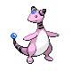
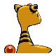

# #181 Ampharos (Light Pokémon)

| Official Artwork | Shiny Artwork |
|------------------|---------------|
|  |  |

**Sacred Gold:** The tail’s tip shines brightly and can be seen from far away. It acts as a beacon for lost people.

**Storm Silver:** The bright light on its tail can be seen far away. It has been treasured since ancient times as a beacon.

---

## Media

### Default Sprites

| Front | Shiny | Back | Shiny |
|-------|-------|------|-------|
|  |  |  |  |

### Female Sprites

| Front | Shiny | Back | Shiny |
|-------|-------|------|-------|
| ? | ? | ? | ? |

### Cries

Latest (Gen VI+):

<audio controls>
<source src='../../assets/cries/ampharos/latest.ogg' type='audio/ogg'>
  Your browser does not support the audio element.
</audio>

Legacy:

<audio controls>
<source src='../../assets/cries/ampharos/legacy.ogg' type='audio/ogg'>
  Your browser does not support the audio element.
</audio>

---

## Pokédex Data

| National № | Type(s) | Height | Weight | Abilities | Local № |
|------------|---------|--------|--------|-----------|---------|
| #181 | {: width="48"} | 1.4 m / 4.6 ft | 61.5 kg / 135.6 lbs | 1. Static 2. Plus | N/A |

---

## Base Stats
|   | HP | Attack | Defense | Sp. Atk | Sp. Def | Speed |
|---|----|--------|---------|---------|---------|-------|
| **Base** | 90 | 75 | 85 | 115 | 90 | 55 |
| **Min** | 290 | 139 | 157 | 211 | 166 | 103 |
| **Max** | 384 | 273 | 295 | 361 | 306 | 229 |

The ranges shown above are for a level 100 Pokémon. Maximum values are based on a beneficial nature, 252 EVs, 31 IVs; minimum values are based on a hindering nature, 0 EVs, 0 IVs.

---

## Forms & Evolutions

!!! warning "WARNING"

    Information on evolutions may not be 100% accurate; differences between evolution methods across generations are not accounted for.

### Forms

Ampharos has no alternate forms.

### Evolution Line

1. [Mareep](mareep.md/)
    1. Level Up: [Flaaffy](flaaffy.md/)
        1. Level Up: [Ampharos](ampharos.md/)

---

## Training

| EV Yield | Catch Rate | Base Friendship | Base Exp. | Growth Rate | Held Items |
|----------|------------|-----------------|-----------|-------------|------------|
| 3 Special Attack | 45 | 70 | 230 | Medium Slow | N/A |

---

## Breeding

| Egg Groups | Egg Cycles | Gender | Dimorphic | Color | Shape |
|------------|------------|--------|-----------|-------|-------|
| 1. Monster 2. Ground | 20 | 50.0% Male 50.0% Female | False | Yellow | Upright |

---

## Moves

!!! warning "WARNING"

    Specific move information may be incorrect. However, the general movepool should be accurate; this includes changes made in Sacred Gold and Storm Silver.

### Level Up Moves

| Lv. | Move | Type | Cat. | Power | Acc. | PP |
| --- | --- | --- | --- | --- | --- | --- |
| 1 | Charge | {: width="48"} | {: width="36"} | — | — | 20 |
| 1 | Fire Punch | {: width="48"} | {: width="36"} | 75 | 100 | 15 |
| 1 | Growl | {: width="48"} | {: width="36"} | — | 100 | 40 |
| 1 | Tackle | {: width="48"} | {: width="36"} | 40 | 100 | 35 |
| 1 | Tail Glow | {: width="48"} | {: width="36"} | — | — | 20 |
| 1 | Thunder Shock | {: width="48"} | {: width="36"} | 40 | 100 | 30 |
| 1 | Thunder Wave | {: width="48"} | {: width="36"} | — | 90 | 20 |
| 5 | Growl | {: width="48"} | {: width="36"} | — | 100 | 40 |
| 10 | Thunder Shock | {: width="48"} | {: width="36"} | 40 | 100 | 30 |
| 14 | Thunder Wave | {: width="48"} | {: width="36"} | — | 90 | 20 |
| 20 | Cotton Spore | {: width="48"} | {: width="36"} | — | 100 | 40 |
| 30 | Thunder Punch | {: width="48"} | {: width="36"} | 75 | 100 | 15 |
| 34 | Discharge | {: width="48"} | {: width="36"} | 80 | 100 | 15 |
| 42 | Signal Beam | {: width="48"} | {: width="36"} | 75 | 100 | 15 |
| 51 | Light Screen | {: width="48"} | {: width="36"} | — | — | 30 |
| 59 | Power Gem | {: width="48"} | {: width="36"} | 80 | 100 | 20 |
| 68 | Thunder | {: width="48"} | {: width="36"} | 110 | 70 | 10 |

### TM Moves

| TM | Move | Type | Cat. | Power | Acc. | PP |
| --- | --- | --- | --- | --- | --- | --- |
| HM04 | Strength | {: width="48"} | {: width="36"} | 60 | 100 | 15 |
| HM06 | Rock Smash | {: width="48"} | {: width="36"} | 60 | 100 | 15 |
| HM08 | Rock Climb | {: width="48"} | {: width="36"} | 90 | 85 | 20 |
| TM01 | Focus Punch | {: width="48"} | {: width="36"} | 150 | 100 | 20 |
| TM06 | Toxic | {: width="48"} | {: width="36"} | — | 90 | 10 |
| TM10 | Hidden Power | {: width="48"} | {: width="36"} | 60 | 100 | 15 |
| TM15 | Hyper Beam | {: width="48"} | {: width="36"} | 150 | 90 | 5 |
| TM16 | Light Screen | {: width="48"} | {: width="36"} | — | — | 30 |
| TM17 | Protect | {: width="48"} | {: width="36"} | — | — | 10 |
| TM18 | Rain Dance | {: width="48"} | {: width="36"} | — | — | 5 |
| TM21 | Frustration | {: width="48"} | {: width="36"} | — | 100 | 20 |
| TM23 | Iron Tail | {: width="48"} | {: width="36"} | 100 | 75 | 15 |
| TM24 | Thunderbolt | {: width="48"} | {: width="36"} | 90 | 100 | 15 |
| TM25 | Thunder | {: width="48"} | {: width="36"} | 110 | 70 | 10 |
| TM27 | Return | {: width="48"} | {: width="36"} | — | 100 | 20 |
| TM31 | Brick Break | {: width="48"} | {: width="36"} | 75 | 100 | 15 |
| TM32 | Double Team | {: width="48"} | {: width="36"} | — | — | 15 |
| TM34 | Shock Wave | {: width="48"} | {: width="36"} | 60 | — | 20 |
| TM42 | Facade | {: width="48"} | {: width="36"} | 70 | 100 | 20 |
| TM43 | Secret Power | {: width="48"} | {: width="36"} | 70 | 100 | 20 |
| TM44 | Rest | {: width="48"} | {: width="36"} | — | — | 5 |
| TM45 | Attract | {: width="48"} | {: width="36"} | — | 100 | 15 |
| TM52 | Focus Blast | {: width="48"} | {: width="36"} | 120 | 70 | 5 |
| TM56 | Fling | {: width="48"} | {: width="36"} | — | 100 | 10 |
| TM57 | Charge Beam | {: width="48"} | {: width="36"} | 50 | 90 | 10 |
| TM58 | Endure | {: width="48"} | {: width="36"} | — | — | 10 |
| TM59 | Dragon Pulse | {: width="48"} | {: width="36"} | 85 | 100 | 10 |
| TM68 | Giga Impact | {: width="48"} | {: width="36"} | 150 | 90 | 5 |
| TM70 | Flash | {: width="48"} | {: width="36"} | — | 100 | 20 |
| TM73 | Thunder Wave | {: width="48"} | {: width="36"} | — | 90 | 20 |
| TM78 | Captivate | {: width="48"} | {: width="36"} | — | 100 | 20 |
| TM82 | Sleep Talk | {: width="48"} | {: width="36"} | — | — | 10 |
| TM83 | Natural Gift | {: width="48"} | {: width="36"} | — | 100 | 15 |
| TM87 | Swagger | {: width="48"} | {: width="36"} | — | 85 | 15 |
| TM90 | Substitute | {: width="48"} | {: width="36"} | — | — | 10 |
| TM91 | Flash Cannon | {: width="48"} | {: width="36"} | 80 | 100 | 10 |

### Egg Moves

Ampharos cannot learn any moves by breeding.
### Tutor Moves

| Move | Type | Cat. | Power | Acc. | PP |
| --- | --- | --- | --- | --- | --- |
| Fire Punch | {: width="48"} | {: width="36"} | 75 | 100 | 15 |
| Thunder Punch | {: width="48"} | {: width="36"} | 75 | 100 | 15 |
| Headbutt | {: width="48"} | {: width="36"} | 70 | 100 | 15 |
| Swift | {: width="48"} | {: width="36"} | 60 | — | 20 |
| Snore | {: width="48"} | {: width="36"} | 50 | 100 | 15 |
| Outrage | {: width="48"} | {: width="36"} | 120 | 100 | 10 |
| Heal Bell | {: width="48"} | {: width="36"} | — | — | 5 |
| Signal Beam | {: width="48"} | {: width="36"} | 75 | 100 | 15 |
| Magnet Rise | {: width="48"} | {: width="36"} | — | — | 10 |

