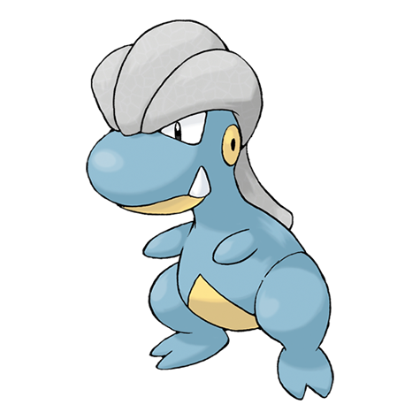
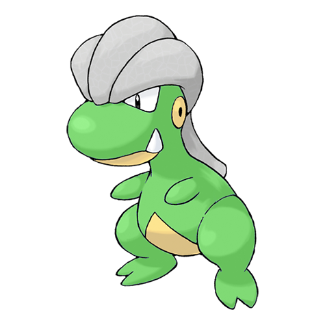
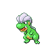
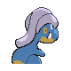
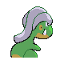

# #371 Bagon (Rock Head Pokémon)

| Official Artwork | Shiny Artwork |
|------------------|---------------|
|  |  |

Its well-developed neck muscles and ironlike head can smash boulders into pieces.

---

## Media

### Default Sprites

| Front | Shiny | Back | Shiny |
|-------|-------|------|-------|
|  |  |  |  |

### Female Sprites

| Front | Shiny | Back | Shiny |
|-------|-------|------|-------|
| ? | ? | ? | ? |

### Cries

Latest (Gen VI+):

<audio controls>
<source src='../../assets/cries/bagon/latest.ogg' type='audio/ogg'>
  Your browser does not support the audio element.
</audio>

Legacy:

<audio controls>
<source src='../../assets/cries/bagon/legacy.ogg' type='audio/ogg'>
  Your browser does not support the audio element.
</audio>

---

## Pokédex Data

| National № | Type(s) | Height | Weight | Abilities | Local № |
|------------|---------|--------|--------|-----------|---------|
| #371 | {: width="48"} | 0.6 m / 2.0 ft | 42.1 kg / 92.8 lbs | 1. Rock Head 2. Sheer Force | N/A |

---

## Base Stats
|   | HP | Attack | Defense | Sp. Atk | Sp. Def | Speed |
|---|----|--------|---------|---------|---------|-------|
| **Base** | 45 | 75 | 60 | 40 | 30 | 50 |
| **Min** | 200 | 139 | 112 | 76 | 58 | 94 |
| **Max** | 294 | 273 | 240 | 196 | 174 | 218 |

The ranges shown above are for a level 100 Pokémon. Maximum values are based on a beneficial nature, 252 EVs, 31 IVs; minimum values are based on a hindering nature, 0 EVs, 0 IVs.

---

## Forms & Evolutions

!!! warning "WARNING"

    Information on evolutions may not be 100% accurate; differences between evolution methods across generations are not accounted for.

### Forms

Bagon has no alternate forms.

### Evolution Line

1. [Bagon](bagon.md/)
    1. Level Up: [Shelgon](shelgon.md/)
        1. Level Up: [Salamence](salamence.md/)

---

## Training

| EV Yield | Catch Rate | Base Friendship | Base Exp. | Growth Rate | Held Items |
|----------|------------|-----------------|-----------|-------------|------------|
| 1 Attack | 45 | 35 | 60 | Slow | Dragon Fang (5%) |

---

## Breeding

| Egg Groups | Egg Cycles | Gender | Dimorphic | Color | Shape |
|------------|------------|--------|-----------|-------|-------|
| 1. Dragon | 40 | 50.0% Male 50.0% Female | False | Blue | Humanoid |

---

## Moves

!!! warning "WARNING"

    Specific move information may be incorrect. However, the general movepool should be accurate; this includes changes made in Sacred Gold and Storm Silver.

### Level Up Moves

| Lv. | Move | Type | Cat. | Power | Acc. | PP |
| --- | --- | --- | --- | --- | --- | --- |
| 1 | Rage | {: width="48"} | {: width="36"} | 20 | 100 | 20 |
| 5 | Bite | {: width="48"} | {: width="36"} | 60 | 100 | 25 |
| 10 | Leer | {: width="48"} | {: width="36"} | — | 100 | 30 |
| 16 | Headbutt | {: width="48"} | {: width="36"} | 70 | 100 | 15 |
| 20 | Focus Energy | {: width="48"} | {: width="36"} | — | — | 30 |
| 25 | Ember | {: width="48"} | {: width="36"} | 40 | 100 | 25 |
| 31 | Dragon Breath | {: width="48"} | {: width="36"} | 60 | 100 | 20 |
| 35 | Zen Headbutt | {: width="48"} | {: width="36"} | 80 | 90 | 15 |
| 40 | Scary Face | {: width="48"} | {: width="36"} | — | 100 | 10 |
| 46 | Crunch | {: width="48"} | {: width="36"} | 80 | 100 | 15 |
| 50 | Dragon Claw | {: width="48"} | {: width="36"} | 80 | 100 | 15 |
| 55 | Double Edge | {: width="48"} | {: width="36"} | 120 | 100 | 15 |
| 60 | Dragon Dance | {: width="48"} | {: width="36"} | — | — | 20 |
| 65 | Outrage | {: width="48"} | {: width="36"} | 120 | 100 | 10 |

### TM Moves

| TM | Move | Type | Cat. | Power | Acc. | PP |
| --- | --- | --- | --- | --- | --- | --- |
| HM01 | Cut | {: width="48"} | {: width="36"} | 60 | 95 | 30 |
| HM04 | Strength | {: width="48"} | {: width="36"} | 60 | 100 | 15 |
| HM06 | Rock Smash | {: width="48"} | {: width="36"} | 60 | 100 | 15 |
| TM02 | Dragon Claw | {: width="48"} | {: width="36"} | 80 | 100 | 15 |
| TM05 | Roar | {: width="48"} | {: width="36"} | — | — | 20 |
| TM06 | Toxic | {: width="48"} | {: width="36"} | — | 90 | 10 |
| TM10 | Hidden Power | {: width="48"} | {: width="36"} | 60 | 100 | 15 |
| TM11 | Sunny Day | {: width="48"} | {: width="36"} | — | — | 5 |
| TM17 | Protect | {: width="48"} | {: width="36"} | — | — | 10 |
| TM18 | Rain Dance | {: width="48"} | {: width="36"} | — | — | 5 |
| TM21 | Frustration | {: width="48"} | {: width="36"} | — | 100 | 20 |
| TM27 | Return | {: width="48"} | {: width="36"} | — | 100 | 20 |
| TM31 | Brick Break | {: width="48"} | {: width="36"} | 75 | 100 | 15 |
| TM32 | Double Team | {: width="48"} | {: width="36"} | — | — | 15 |
| TM35 | Flamethrower | {: width="48"} | {: width="36"} | 90 | 100 | 15 |
| TM38 | Fire Blast | {: width="48"} | {: width="36"} | 110 | 85 | 5 |
| TM39 | Rock Tomb | {: width="48"} | {: width="36"} | 60 | 95 | 15 |
| TM40 | Aerial Ace | {: width="48"} | {: width="36"} | 60 | — | 20 |
| TM42 | Facade | {: width="48"} | {: width="36"} | 70 | 100 | 20 |
| TM43 | Secret Power | {: width="48"} | {: width="36"} | 70 | 100 | 20 |
| TM44 | Rest | {: width="48"} | {: width="36"} | — | — | 5 |
| TM45 | Attract | {: width="48"} | {: width="36"} | — | 100 | 15 |
| TM58 | Endure | {: width="48"} | {: width="36"} | — | — | 10 |
| TM59 | Dragon Pulse | {: width="48"} | {: width="36"} | 85 | 100 | 10 |
| TM65 | Shadow Claw | {: width="48"} | {: width="36"} | 70 | 100 | 15 |
| TM78 | Captivate | {: width="48"} | {: width="36"} | — | 100 | 20 |
| TM80 | Rock Slide | {: width="48"} | {: width="36"} | 75 | 90 | 10 |
| TM82 | Sleep Talk | {: width="48"} | {: width="36"} | — | — | 10 |
| TM83 | Natural Gift | {: width="48"} | {: width="36"} | — | 100 | 15 |
| TM87 | Swagger | {: width="48"} | {: width="36"} | — | 85 | 15 |
| TM90 | Substitute | {: width="48"} | {: width="36"} | — | — | 10 |

### Egg Moves

| Move | Type | Cat. | Power | Acc. | PP |
| --- | --- | --- | --- | --- | --- |
| Thrash | {: width="48"} | {: width="36"} | 120 | 100 | 10 |
| Hydro Pump | {: width="48"} | {: width="36"} | 110 | 80 | 5 |
| Dragon Rage | {: width="48"} | {: width="36"} | — | 100 | 10 |
| Twister | {: width="48"} | {: width="36"} | 40 | 100 | 20 |
| Dragon Dance | {: width="48"} | {: width="36"} | — | — | 20 |
| Dragon Rush | {: width="48"} | {: width="36"} | 100 | 75 | 10 |
| Shadow Claw | {: width="48"} | {: width="36"} | 70 | 100 | 15 |
| Fire Fang | {: width="48"} | {: width="36"} | 65 | 95 | 15 |

### Tutor Moves

| Move | Type | Cat. | Power | Acc. | PP |
| --- | --- | --- | --- | --- | --- |
| Headbutt | {: width="48"} | {: width="36"} | 70 | 100 | 15 |
| Snore | {: width="48"} | {: width="36"} | 50 | 100 | 15 |
| Mud Slap | {: width="48"} | {: width="36"} | 20 | 100 | 10 |
| Outrage | {: width="48"} | {: width="36"} | 120 | 100 | 10 |
| Fury Cutter | {: width="48"} | {: width="36"} | 40 | 95 | 20 |
| Twister | {: width="48"} | {: width="36"} | 40 | 100 | 20 |
| Zen Headbutt | {: width="48"} | {: width="36"} | 80 | 90 | 15 |
| Draco Meteor | {: width="48"} | {: width="36"} | 130 | 90 | 5 |

