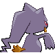
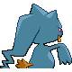

# #354 Banette (Marionette Pokémon)

| Official Artwork | Shiny Artwork |
|------------------|---------------|
|  |  |

This Pokémon developed from an abandoned doll that amassed a grudge. It is seen in dark alleys.

---

## Media

### Default Sprites

| Front | Shiny | Back | Shiny |
|-------|-------|------|-------|
|  |  |  |  |

### Cries

Latest (Gen VI+):

<audio controls>
<source src='../../assets/cries/banette/latest.ogg' type='audio/ogg'>
  Your browser does not support the audio element.
</audio>

Legacy:

<audio controls>
<source src='../../assets/cries/banette/legacy.ogg' type='audio/ogg'>
  Your browser does not support the audio element.
</audio>

---

## Pokédex Data

| National № | Type(s) | Height | Weight | Abilities | Local № |
|------------|---------|--------|--------|-----------|---------|
| #354 | {: width="48"} | 1.1 m / 3.6 ft | 12.5 kg / 27.6 lbs | 1. Insomnia 2. Frisk | N/A |

---

## Base Stats
|   | HP | Attack | Defense | Sp. Atk | Sp. Def | Speed |
|---|----|--------|---------|---------|---------|-------|
| **Base** | 64 | 115 | 65 | 103 | 63 | 65 |
| **Min** | 238 | 211 | 121 | 189 | 117 | 121 |
| **Max** | 332 | 361 | 251 | 335 | 247 | 251 |

The ranges shown above are for a level 100 Pokémon. Maximum values are based on a beneficial nature, 252 EVs, 31 IVs; minimum values are based on a hindering nature, 0 EVs, 0 IVs.

---

## Forms & Evolutions

!!! warning "WARNING"

    Information on evolutions may not be 100% accurate; differences between evolution methods across generations are not accounted for.

### Forms

Banette has no alternate forms.

### Evolution Line

1. [Shuppet](shuppet.md/)
    1. Level Up: [Banette](banette.md/)

---

## Training

| EV Yield | Catch Rate | Base Friendship | Base Exp. | Growth Rate | Held Items |
|----------|------------|-----------------|-----------|-------------|------------|
| 2 Attack | 45 | 35 | 159 | Fast | Spell Tag (5%) |

---

## Breeding

| Egg Groups | Egg Cycles | Gender | Dimorphic | Color | Shape |
|------------|------------|--------|-----------|-------|-------|
| 1. Indeterminate | 25 | 50.0% Male 50.0% Female | False | Black | Upright |

---

## Moves

!!! warning "WARNING"

    Specific move information may be incorrect. However, the general movepool should be accurate; this includes changes made in Sacred Gold and Storm Silver.

### Level Up Moves

| Lv. | Move | Type | Cat. | Power | Acc. | PP |
| --- | --- | --- | --- | --- | --- | --- |
| 1 | Curse | {: width="48"} | {: width="36"} | — | — | 10 |
| 1 | Knock Off | {: width="48"} | {: width="36"} | 65 | 100 | 20 |
| 1 | Night Shade | {: width="48"} | {: width="36"} | — | 100 | 15 |
| 1 | Screech | {: width="48"} | {: width="36"} | — | 85 | 40 |
| 5 | Screech | {: width="48"} | {: width="36"} | — | 85 | 40 |
| 8 | Night Shade | {: width="48"} | {: width="36"} | — | 100 | 15 |
| 13 | Curse | {: width="48"} | {: width="36"} | — | — | 10 |
| 16 | Spite | {: width="48"} | {: width="36"} | — | 100 | 10 |
| 20 | Shadow Sneak | {: width="48"} | {: width="36"} | 40 | 100 | 30 |
| 23 | Will O Wisp | {: width="48"} | {: width="36"} | — | 85 | 15 |
| 28 | Feint Attack | {: width="48"} | {: width="36"} | 60 | — | 20 |
| 31 | Hex | {: width="48"} | {: width="36"} | 65 | 100 | 10 |
| 35 | Shadow Ball | {: width="48"} | {: width="36"} | 80 | 100 | 15 |
| 42 | Sucker Punch | {: width="48"} | {: width="36"} | 70 | 100 | 5 |
| 51 | Embargo | {: width="48"} | {: width="36"} | — | 100 | 15 |
| 58 | Snatch | {: width="48"} | {: width="36"} | — | — | 10 |
| 66 | Grudge | {: width="48"} | {: width="36"} | — | — | 5 |
| 75 | Trick | {: width="48"} | {: width="36"} | — | 100 | 10 |

### TM Moves

| TM | Move | Type | Cat. | Power | Acc. | PP |
| --- | --- | --- | --- | --- | --- | --- |
| TM04 | Calm Mind | {: width="48"} | {: width="36"} | — | — | 20 |
| TM06 | Toxic | {: width="48"} | {: width="36"} | — | 90 | 10 |
| TM10 | Hidden Power | {: width="48"} | {: width="36"} | 60 | 100 | 15 |
| TM11 | Sunny Day | {: width="48"} | {: width="36"} | — | — | 5 |
| TM12 | Taunt | {: width="48"} | {: width="36"} | — | 100 | 20 |
| TM15 | Hyper Beam | {: width="48"} | {: width="36"} | 150 | 90 | 5 |
| TM17 | Protect | {: width="48"} | {: width="36"} | — | — | 10 |
| TM18 | Rain Dance | {: width="48"} | {: width="36"} | — | — | 5 |
| TM19 | Telekinesis | {: width="48"} | {: width="36"} | — | — | 15 |
| TM21 | Frustration | {: width="48"} | {: width="36"} | — | 100 | 20 |
| TM24 | Thunderbolt | {: width="48"} | {: width="36"} | 90 | 100 | 15 |
| TM25 | Thunder | {: width="48"} | {: width="36"} | 110 | 70 | 10 |
| TM27 | Return | {: width="48"} | {: width="36"} | — | 100 | 20 |
| TM29 | Psychic | {: width="48"} | {: width="36"} | 90 | 100 | 10 |
| TM30 | Shadow Ball | {: width="48"} | {: width="36"} | 80 | 100 | 15 |
| TM32 | Double Team | {: width="48"} | {: width="36"} | — | — | 15 |
| TM41 | Torment | {: width="48"} | {: width="36"} | — | 100 | 15 |
| TM42 | Facade | {: width="48"} | {: width="36"} | 70 | 100 | 20 |
| TM44 | Rest | {: width="48"} | {: width="36"} | — | — | 5 |
| TM45 | Attract | {: width="48"} | {: width="36"} | — | 100 | 15 |
| TM46 | Thief | {: width="48"} | {: width="36"} | 60 | 100 | 25 |
| TM48 | Round | {: width="48"} | {: width="36"} | 60 | 100 | 15 |
| TM56 | Fling | {: width="48"} | {: width="36"} | — | 100 | 10 |
| TM57 | Charge Beam | {: width="48"} | {: width="36"} | 50 | 90 | 10 |
| TM61 | Will O Wisp | {: width="48"} | {: width="36"} | — | 85 | 15 |
| TM63 | Embargo | {: width="48"} | {: width="36"} | — | 100 | 15 |
| TM65 | Shadow Claw | {: width="48"} | {: width="36"} | 70 | 100 | 15 |
| TM66 | Payback | {: width="48"} | {: width="36"} | 50 | 100 | 10 |
| TM68 | Giga Impact | {: width="48"} | {: width="36"} | 150 | 90 | 5 |
| TM70 | Flash | {: width="48"} | {: width="36"} | — | 100 | 20 |
| TM73 | Thunder Wave | {: width="48"} | {: width="36"} | — | 90 | 20 |
| TM77 | Psych Up | {: width="48"} | {: width="36"} | — | — | 10 |
| TM85 | Dream Eater | {: width="48"} | {: width="36"} | 100 | 100 | 15 |
| TM87 | Swagger | {: width="48"} | {: width="36"} | — | 85 | 15 |
| TM90 | Substitute | {: width="48"} | {: width="36"} | — | — | 10 |
| TM92 | Trick Room | {: width="48"} | {: width="36"} | — | — | 5 |

### Egg Moves

Banette cannot learn any moves by breeding.
### Tutor Moves

Banette cannot learn any moves from tutors.
