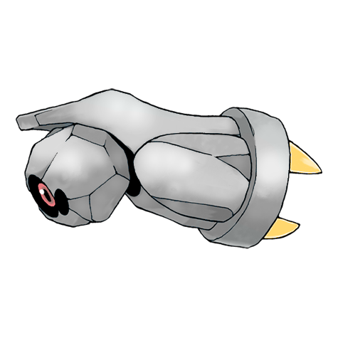
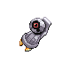
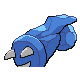
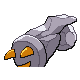

# #374 Beldum (Iron Ball Pokémon)

| Official Artwork | Shiny Artwork |
|------------------|---------------|
|  |  |

The magnetic force generated by its body repels the ground’s natural magnetism, letting it float.

---

## Media

### Default Sprites

| Front | Shiny | Back | Shiny |
|-------|-------|------|-------|
|  |  |  |  |

### Cries

Latest (Gen VI+):

<audio controls>
<source src='../../assets/cries/beldum/latest.ogg' type='audio/ogg'>
  Your browser does not support the audio element.
</audio>

Legacy:

<audio controls>
<source src='../../assets/cries/beldum/legacy.ogg' type='audio/ogg'>
  Your browser does not support the audio element.
</audio>

---

## Pokédex Data

| National № | Type(s) | Height | Weight | Abilities | Local № |
|------------|---------|--------|--------|-----------|---------|
| #374 | {: width="48"} {: width="48"} | 0.6 m / 2.0 ft | 95.2 kg / 209.9 lbs | 1. Clear Body 2. Rock Head | N/A |

---

## Base Stats
|   | HP | Attack | Defense | Sp. Atk | Sp. Def | Speed |
|---|----|--------|---------|---------|---------|-------|
| **Base** | 40 | 55 | 80 | 35 | 60 | 30 |
| **Min** | 190 | 103 | 148 | 67 | 112 | 58 |
| **Max** | 284 | 229 | 284 | 185 | 240 | 174 |

The ranges shown above are for a level 100 Pokémon. Maximum values are based on a beneficial nature, 252 EVs, 31 IVs; minimum values are based on a hindering nature, 0 EVs, 0 IVs.

---

## Forms & Evolutions

!!! warning "WARNING"

    Information on evolutions may not be 100% accurate; differences between evolution methods across generations are not accounted for.

### Forms

Beldum has no alternate forms.

### Evolution Line

1. [Beldum](beldum.md/)
    1. Level Up: [Metang](metang.md/)
        1. Level Up: [Metagross](metagross.md/)

---

## Training

| EV Yield | Catch Rate | Base Friendship | Base Exp. | Growth Rate | Held Items |
|----------|------------|-----------------|-----------|-------------|------------|
| 1 Def | 3 | 35 | 60 | Slow | Metal Coat (5%) |

---

## Breeding

| Egg Groups | Egg Cycles | Gender | Dimorphic | Color | Shape |
|------------|------------|--------|-----------|-------|-------|
| 1. Mineral | 40 | Genderless | False | Blue | Blob |

---

## Moves

!!! warning "WARNING"

    Specific move information may be incorrect. However, the general movepool should be accurate; this includes changes made in Sacred Gold and Storm Silver.

### Level Up Moves

| Lv. | Move | Type | Cat. | Power | Acc. | PP |
| --- | --- | --- | --- | --- | --- | --- |
| 1 | Take Down | {: width="48"} | {: width="36"} | 90 | 85 | 20 |
| 10 | Headbutt | {: width="48"} | {: width="36"} | 70 | 100 | 15 |
| 20 | Zen Headbutt | {: width="48"} | {: width="36"} | 80 | 90 | 15 |
| 30 | Iron Head | {: width="48"} | {: width="36"} | 80 | 100 | 15 |

### TM Moves

Beldum cannot learn any TM moves.
### Egg Moves

Beldum cannot learn any moves by breeding.
### Tutor Moves

Beldum cannot learn any moves from tutors.
