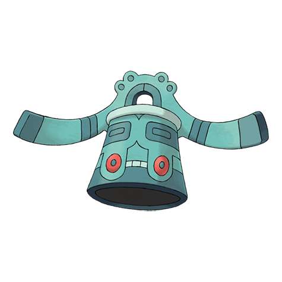
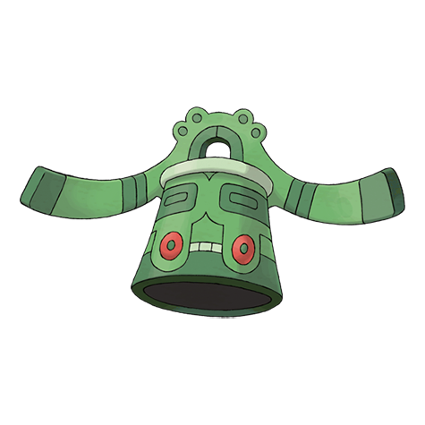
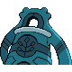

# #437 Bronzong (Bronze Bell Pokémon)

| Official Artwork | Shiny Artwork |
|------------------|---------------|
|  |  |

Ancient people believed that petitioning BRONZONG for rain was the way to make crops grow.

---

## Media

### Default Sprites

| Front | Shiny | Back | Shiny |
|-------|-------|------|-------|
|  |  |  |  |

### Female Sprites

| Front | Shiny | Back | Shiny |
|-------|-------|------|-------|
| ? | ? | ? | ? |

### Cries

Latest (Gen VI+):

<audio controls>
<source src='../../assets/cries/bronzong/latest.ogg' type='audio/ogg'>
  Your browser does not support the audio element.
</audio>

Legacy:

<audio controls>
<source src='../../assets/cries/bronzong/legacy.ogg' type='audio/ogg'>
  Your browser does not support the audio element.
</audio>

---

## Pokédex Data

| National № | Type(s) | Height | Weight | Abilities | Local № |
|------------|---------|--------|--------|-----------|---------|
| #437 | {: width="48"} {: width="48"} | 1.3 m / 4.3 ft | 187.0 kg / 412.3 lbs | 1. Levitate 2. Heatproof 3. Heavy Metal | #89 |

---

## Base Stats
|   | HP | Attack | Defense | Sp. Atk | Sp. Def | Speed |
|---|----|--------|---------|---------|---------|-------|
| **Base** | 67 | 89 | 116 | 79 | 116 | 33 |
| **Min** | 244 | 164 | 213 | 146 | 213 | 63 |
| **Max** | 338 | 304 | 364 | 282 | 364 | 181 |

The ranges shown above are for a level 100 Pokémon. Maximum values are based on a beneficial nature, 252 EVs, 31 IVs; minimum values are based on a hindering nature, 0 EVs, 0 IVs.

---

## Forms & Evolutions

!!! warning "WARNING"

    Information on evolutions may not be 100% accurate; differences between evolution methods across generations are not accounted for.

### Forms

Bronzong has no alternate forms.

### Evolution Line

1. [Bronzor](bronzor.md/)
    1. Level Up: [Bronzong](bronzong.md/)

---

## Training

| EV Yield | Catch Rate | Base Friendship | Base Exp. | Growth Rate | Held Items |
|----------|------------|-----------------|-----------|-------------|------------|
| 1 Defense 1 Special Defense | 90 | 50 | 175 | Medium | Metal Coat (5%) |

---

## Breeding

| Egg Groups | Egg Cycles | Gender | Dimorphic | Color | Shape |
|------------|------------|--------|-----------|-------|-------|
| 1. Mineral | 20 | Genderless | False | Green | Arms |

---

## Moves

!!! warning "WARNING"

    Specific move information may be incorrect. However, the general movepool should be accurate; this includes changes made in Sacred Gold and Storm Silver.

### Level Up Moves

| Lv. | Move | Type | Cat. | Power | Acc. | PP |
| --- | --- | --- | --- | --- | --- | --- |
| 1 | Confusion | {: width="48"} | {: width="36"} | 50 | 100 | 25 |
| 1 | Hypnosis | {: width="48"} | {: width="36"} | — | 60 | 20 |
| 1 | Imprison | {: width="48"} | {: width="36"} | — | — | 10 |
| 1 | Rain Dance | {: width="48"} | {: width="36"} | — | — | 5 |
| 1 | Sunny Day | {: width="48"} | {: width="36"} | — | — | 5 |
| 1 | Tackle | {: width="48"} | {: width="36"} | 40 | 100 | 35 |
| 7 | Hypnosis | {: width="48"} | {: width="36"} | — | 60 | 20 |
| 12 | Imprison | {: width="48"} | {: width="36"} | — | — | 10 |
| 14 | Confuse Ray | {: width="48"} | {: width="36"} | — | 100 | 10 |
| 16 | Night Shade | {: width="48"} | {: width="36"} | — | 100 | 15 |
| 19 | Extrasensory | {: width="48"} | {: width="36"} | 80 | 100 | 20 |
| 21 | Rollout | {: width="48"} | {: width="36"} | 30 | 90 | 20 |
| 24 | Curse | {: width="48"} | {: width="36"} | — | — | 10 |
| 26 | Iron Defense | {: width="48"} | {: width="36"} | — | — | 15 |
| 30 | Safeguard | {: width="48"} | {: width="36"} | — | — | 25 |
| 33 | Block | {: width="48"} | {: width="36"} | — | — | 5 |
| 38 | Gyro Ball | {: width="48"} | {: width="36"} | — | 100 | 5 |
| 43 | Future Sight | {: width="48"} | {: width="36"} | 120 | 100 | 10 |
| 50 | Feint Attack | {: width="48"} | {: width="36"} | 60 | — | 20 |
| 61 | Payback | {: width="48"} | {: width="36"} | 50 | 100 | 10 |
| 67 | Heal Block | {: width="48"} | {: width="36"} | — | 100 | 15 |

### TM Moves

| TM | Move | Type | Cat. | Power | Acc. | PP |
| --- | --- | --- | --- | --- | --- | --- |
| HM02 | Fly | {: width="48"} | {: width="36"} | 90 | 95 | 15 |
| HM04 | Strength | {: width="48"} | {: width="36"} | 60 | 100 | 15 |
| HM06 | Rock Smash | {: width="48"} | {: width="36"} | 60 | 100 | 15 |
| TM04 | Calm Mind | {: width="48"} | {: width="36"} | — | — | 20 |
| TM06 | Toxic | {: width="48"} | {: width="36"} | — | 90 | 10 |
| TM10 | Hidden Power | {: width="48"} | {: width="36"} | 60 | 100 | 15 |
| TM11 | Sunny Day | {: width="48"} | {: width="36"} | — | — | 5 |
| TM15 | Hyper Beam | {: width="48"} | {: width="36"} | 150 | 90 | 5 |
| TM16 | Light Screen | {: width="48"} | {: width="36"} | — | — | 30 |
| TM17 | Protect | {: width="48"} | {: width="36"} | — | — | 10 |
| TM18 | Rain Dance | {: width="48"} | {: width="36"} | — | — | 5 |
| TM20 | Safeguard | {: width="48"} | {: width="36"} | — | — | 25 |
| TM21 | Frustration | {: width="48"} | {: width="36"} | — | 100 | 20 |
| TM22 | Solar Beam | {: width="48"} | {: width="36"} | 120 | 100 | 10 |
| TM26 | Earthquake | {: width="48"} | {: width="36"} | 100 | 100 | 10 |
| TM27 | Return | {: width="48"} | {: width="36"} | — | 100 | 20 |
| TM29 | Psychic | {: width="48"} | {: width="36"} | 90 | 100 | 10 |
| TM30 | Shadow Ball | {: width="48"} | {: width="36"} | 80 | 100 | 15 |
| TM32 | Double Team | {: width="48"} | {: width="36"} | — | — | 15 |
| TM33 | Reflect | {: width="48"} | {: width="36"} | — | — | 20 |
| TM37 | Sandstorm | {: width="48"} | {: width="36"} | — | — | 10 |
| TM39 | Rock Tomb | {: width="48"} | {: width="36"} | 60 | 95 | 15 |
| TM42 | Facade | {: width="48"} | {: width="36"} | 70 | 100 | 20 |
| TM43 | Secret Power | {: width="48"} | {: width="36"} | 70 | 100 | 20 |
| TM44 | Rest | {: width="48"} | {: width="36"} | — | — | 5 |
| TM48 | Skill Swap | {: width="48"} | {: width="36"} | — | — | 10 |
| TM57 | Charge Beam | {: width="48"} | {: width="36"} | 50 | 90 | 10 |
| TM58 | Endure | {: width="48"} | {: width="36"} | — | — | 10 |
| TM64 | Explosion | {: width="48"} | {: width="36"} | 250 | 100 | 5 |
| TM66 | Payback | {: width="48"} | {: width="36"} | 50 | 100 | 10 |
| TM67 | Recycle | {: width="48"} | {: width="36"} | — | — | 10 |
| TM68 | Giga Impact | {: width="48"} | {: width="36"} | 150 | 90 | 5 |
| TM69 | Rock Polish | {: width="48"} | {: width="36"} | — | — | 20 |
| TM70 | Flash | {: width="48"} | {: width="36"} | — | 100 | 20 |
| TM74 | Gyro Ball | {: width="48"} | {: width="36"} | — | 100 | 5 |
| TM76 | Stealth Rock | {: width="48"} | {: width="36"} | — | — | 20 |
| TM77 | Psych Up | {: width="48"} | {: width="36"} | — | — | 10 |
| TM80 | Rock Slide | {: width="48"} | {: width="36"} | 75 | 90 | 10 |
| TM82 | Sleep Talk | {: width="48"} | {: width="36"} | — | — | 10 |
| TM83 | Natural Gift | {: width="48"} | {: width="36"} | — | 100 | 15 |
| TM85 | Dream Eater | {: width="48"} | {: width="36"} | 100 | 100 | 15 |
| TM86 | Grass Knot | {: width="48"} | {: width="36"} | — | 100 | 20 |
| TM87 | Swagger | {: width="48"} | {: width="36"} | — | 85 | 15 |
| TM90 | Substitute | {: width="48"} | {: width="36"} | — | — | 10 |
| TM91 | Flash Cannon | {: width="48"} | {: width="36"} | 80 | 100 | 10 |
| TM92 | Trick Room | {: width="48"} | {: width="36"} | — | — | 5 |

### Egg Moves

Bronzong cannot learn any moves by breeding.
### Tutor Moves

| Move | Type | Cat. | Power | Acc. | PP |
| --- | --- | --- | --- | --- | --- |
| Snore | {: width="48"} | {: width="36"} | 50 | 100 | 15 |
| Rollout | {: width="48"} | {: width="36"} | 30 | 90 | 20 |
| Ancient Power | {: width="48"} | {: width="36"} | 60 | 100 | 5 |
| Trick | {: width="48"} | {: width="36"} | — | 100 | 10 |
| Signal Beam | {: width="48"} | {: width="36"} | 75 | 100 | 15 |
| Block | {: width="48"} | {: width="36"} | — | — | 5 |
| Gravity | {: width="48"} | {: width="36"} | — | — | 5 |
| Zen Headbutt | {: width="48"} | {: width="36"} | 80 | 90 | 15 |
| Iron Head | {: width="48"} | {: width="36"} | 80 | 100 | 15 |

