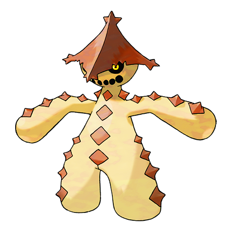
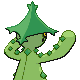

# #332 Cacturne (Scarecrow Pokémon)

| Official Artwork | Shiny Artwork |
|------------------|---------------|
|  |  |

Packs of them follow travelers through the desert until the travelers can no longer move.

---

## Media

### Default Sprites

| Front | Shiny | Back | Shiny |
|-------|-------|------|-------|
|  |  |  |  |

### Female Sprites

| Front | Shiny | Back | Shiny |
|-------|-------|------|-------|
|  |  | ? | ? |

### Cries

Latest (Gen VI+):

<audio controls>
<source src='../../assets/cries/cacturne/latest.ogg' type='audio/ogg'>
  Your browser does not support the audio element.
</audio>

Legacy:

<audio controls>
<source src='../../assets/cries/cacturne/legacy.ogg' type='audio/ogg'>
  Your browser does not support the audio element.
</audio>

---

## Pokédex Data

| National № | Type(s) | Height | Weight | Abilities | Local № |
|------------|---------|--------|--------|-----------|---------|
| #332 | {: width="48"} {: width="48"} | 1.3 m / 4.3 ft | 77.4 kg / 170.6 lbs | 1. Sand Veil 2. Water Absorb | N/A |

---

## Base Stats
|   | HP | Attack | Defense | Sp. Atk | Sp. Def | Speed |
|---|----|--------|---------|---------|---------|-------|
| **Base** | 70 | 115 | 60 | 115 | 60 | 55 |
| **Min** | 250 | 211 | 112 | 211 | 112 | 103 |
| **Max** | 344 | 361 | 240 | 361 | 240 | 229 |

The ranges shown above are for a level 100 Pokémon. Maximum values are based on a beneficial nature, 252 EVs, 31 IVs; minimum values are based on a hindering nature, 0 EVs, 0 IVs.

---

## Forms & Evolutions

!!! warning "WARNING"

    Information on evolutions may not be 100% accurate; differences between evolution methods across generations are not accounted for.

### Forms

Cacturne has no alternate forms.

### Evolution Line

1. [Cacnea](cacnea.md/)
    1. Level Up: [Cacturne](cacturne.md/)

---

## Training

| EV Yield | Catch Rate | Base Friendship | Base Exp. | Growth Rate | Held Items |
|----------|------------|-----------------|-----------|-------------|------------|
| 1 Attack 1 Special Attack | 60 | 35 | 166 | Medium Slow | Sticky Barb (5%) |

---

## Breeding

| Egg Groups | Egg Cycles | Gender | Dimorphic | Color | Shape |
|------------|------------|--------|-----------|-------|-------|
| 1. Plant 2. Humanshape | 20 | 50.0% Male 50.0% Female | True | Green | Humanoid |

---

## Moves

!!! warning "WARNING"

    Specific move information may be incorrect. However, the general movepool should be accurate; this includes changes made in Sacred Gold and Storm Silver.

### Level Up Moves

| Lv. | Move | Type | Cat. | Power | Acc. | PP |
| --- | --- | --- | --- | --- | --- | --- |
| 1 | Absorb | {: width="48"} | {: width="36"} | 20 | 100 | 25 |
| 1 | Growth | {: width="48"} | {: width="36"} | — | — | 20 |
| 1 | Leer | {: width="48"} | {: width="36"} | — | 100 | 30 |
| 1 | Poison Sting | {: width="48"} | {: width="36"} | 15 | 100 | 35 |
| 1 | Revenge | {: width="48"} | {: width="36"} | 60 | 100 | 10 |
| 1 | Thunder Punch | {: width="48"} | {: width="36"} | 75 | 100 | 15 |
| 5 | Absorb | {: width="48"} | {: width="36"} | 20 | 100 | 25 |
| 9 | Growth | {: width="48"} | {: width="36"} | — | — | 20 |
| 13 | Leech Seed | {: width="48"} | {: width="36"} | — | 90 | 10 |
| 17 | Sand Attack | {: width="48"} | {: width="36"} | — | 100 | 15 |
| 21 | Pin Missile | {: width="48"} | {: width="36"} | 25 | 95 | 20 |
| 25 | Needle Arm | {: width="48"} | {: width="36"} | 60 | 100 | 15 |
| 29 | Feint Attack | {: width="48"} | {: width="36"} | 60 | — | 20 |
| 35 | Spikes | {: width="48"} | {: width="36"} | — | — | 20 |
| 41 | Sucker Punch | {: width="48"} | {: width="36"} | 70 | 100 | 5 |
| 47 | Payback | {: width="48"} | {: width="36"} | 50 | 100 | 10 |
| 53 | Ingrain | {: width="48"} | {: width="36"} | — | — | 20 |
| 59 | Cotton Spore | {: width="48"} | {: width="36"} | — | 100 | 40 |
| 65 | Sandstorm | {: width="48"} | {: width="36"} | — | — | 10 |
| 71 | Destiny Bond | {: width="48"} | {: width="36"} | — | — | 5 |
| 77 | Teeter Dance | {: width="48"} | {: width="36"} | — | 100 | 20 |

### TM Moves

| TM | Move | Type | Cat. | Power | Acc. | PP |
| --- | --- | --- | --- | --- | --- | --- |
| HM01 | Cut | {: width="48"} | {: width="36"} | 60 | 95 | 30 |
| HM04 | Strength | {: width="48"} | {: width="36"} | 60 | 100 | 15 |
| TM01 | Focus Punch | {: width="48"} | {: width="36"} | 150 | 100 | 20 |
| TM06 | Toxic | {: width="48"} | {: width="36"} | — | 90 | 10 |
| TM09 | Bullet Seed | {: width="48"} | {: width="36"} | 25 | 100 | 30 |
| TM10 | Hidden Power | {: width="48"} | {: width="36"} | 60 | 100 | 15 |
| TM11 | Sunny Day | {: width="48"} | {: width="36"} | — | — | 5 |
| TM15 | Hyper Beam | {: width="48"} | {: width="36"} | 150 | 90 | 5 |
| TM17 | Protect | {: width="48"} | {: width="36"} | — | — | 10 |
| TM19 | Giga Drain | {: width="48"} | {: width="36"} | 75 | 100 | 10 |
| TM21 | Frustration | {: width="48"} | {: width="36"} | — | 100 | 20 |
| TM22 | Solar Beam | {: width="48"} | {: width="36"} | 120 | 100 | 10 |
| TM27 | Return | {: width="48"} | {: width="36"} | — | 100 | 20 |
| TM31 | Brick Break | {: width="48"} | {: width="36"} | 75 | 100 | 15 |
| TM32 | Double Team | {: width="48"} | {: width="36"} | — | — | 15 |
| TM37 | Sandstorm | {: width="48"} | {: width="36"} | — | — | 10 |
| TM42 | Facade | {: width="48"} | {: width="36"} | 70 | 100 | 20 |
| TM43 | Secret Power | {: width="48"} | {: width="36"} | 70 | 100 | 20 |
| TM44 | Rest | {: width="48"} | {: width="36"} | — | — | 5 |
| TM45 | Attract | {: width="48"} | {: width="36"} | — | 100 | 15 |
| TM52 | Focus Blast | {: width="48"} | {: width="36"} | 120 | 70 | 5 |
| TM53 | Energy Ball | {: width="48"} | {: width="36"} | 90 | 100 | 10 |
| TM56 | Fling | {: width="48"} | {: width="36"} | — | 100 | 10 |
| TM58 | Endure | {: width="48"} | {: width="36"} | — | — | 10 |
| TM60 | Drain Punch | {: width="48"} | {: width="36"} | 75 | 100 | 10 |
| TM63 | Embargo | {: width="48"} | {: width="36"} | — | 100 | 15 |
| TM66 | Payback | {: width="48"} | {: width="36"} | 50 | 100 | 10 |
| TM68 | Giga Impact | {: width="48"} | {: width="36"} | 150 | 90 | 5 |
| TM70 | Flash | {: width="48"} | {: width="36"} | — | 100 | 20 |
| TM75 | Swords Dance | {: width="48"} | {: width="36"} | — | — | 20 |
| TM78 | Captivate | {: width="48"} | {: width="36"} | — | 100 | 20 |
| TM79 | Dark Pulse | {: width="48"} | {: width="36"} | 80 | 100 | 15 |
| TM82 | Sleep Talk | {: width="48"} | {: width="36"} | — | — | 10 |
| TM83 | Natural Gift | {: width="48"} | {: width="36"} | — | 100 | 15 |
| TM84 | Poison Jab | {: width="48"} | {: width="36"} | 80 | 100 | 20 |
| TM86 | Grass Knot | {: width="48"} | {: width="36"} | — | 100 | 20 |
| TM87 | Swagger | {: width="48"} | {: width="36"} | — | 85 | 15 |
| TM90 | Substitute | {: width="48"} | {: width="36"} | — | — | 10 |

### Egg Moves

Cacturne cannot learn any moves by breeding.
### Tutor Moves

| Move | Type | Cat. | Power | Acc. | PP |
| --- | --- | --- | --- | --- | --- |
| Thunder Punch | {: width="48"} | {: width="36"} | 75 | 100 | 15 |
| Headbutt | {: width="48"} | {: width="36"} | 70 | 100 | 15 |
| Low Kick | {: width="48"} | {: width="36"} | — | 100 | 20 |
| Snore | {: width="48"} | {: width="36"} | 50 | 100 | 15 |
| Spite | {: width="48"} | {: width="36"} | — | 100 | 10 |
| Mud Slap | {: width="48"} | {: width="36"} | 20 | 100 | 10 |
| Fury Cutter | {: width="48"} | {: width="36"} | 40 | 95 | 20 |
| Synthesis | {: width="48"} | {: width="36"} | — | — | 5 |
| Role Play | {: width="48"} | {: width="36"} | — | — | 10 |
| Superpower | {: width="48"} | {: width="36"} | 120 | 100 | 5 |
| Worry Seed | {: width="48"} | {: width="36"} | — | 100 | 10 |
| Sucker Punch | {: width="48"} | {: width="36"} | 70 | 100 | 5 |
| Seed Bomb | {: width="48"} | {: width="36"} | 80 | 100 | 15 |

