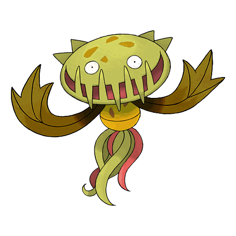
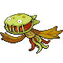
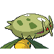
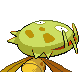

# #455 Carnivine (Bug Catcher Pokémon)

| Official Artwork | Shiny Artwork |
|------------------|---------------|
|  |  |

It walks around on its tentacles in search of a tree branch where it can dangle down and ambush prey.

---

## Media

### Default Sprites

| Front | Shiny | Back | Shiny |
|-------|-------|------|-------|
|  |  |  |  |

### Cries

Latest (Gen VI+):

<audio controls>
<source src='../../assets/cries/carnivine/latest.ogg' type='audio/ogg'>
  Your browser does not support the audio element.
</audio>

Legacy:

<audio controls>
<source src='../../assets/cries/carnivine/legacy.ogg' type='audio/ogg'>
  Your browser does not support the audio element.
</audio>

---

## Pokédex Data

| National № | Type(s) | Height | Weight | Abilities | Local № |
|------------|---------|--------|--------|-----------|---------|
| #455 | {: width="48"} {: width="48"} | 1.4 m / 4.6 ft | 27.0 kg / 59.5 lbs | 1. Levitate | #131 |

---

## Base Stats
|   | HP | Attack | Defense | Sp. Atk | Sp. Def | Speed |
|---|----|--------|---------|---------|---------|-------|
| **Base** | 74 | 120 | 72 | 90 | 72 | 86 |
| **Min** | 258 | 220 | 134 | 166 | 134 | 159 |
| **Max** | 352 | 372 | 267 | 306 | 267 | 298 |

The ranges shown above are for a level 100 Pokémon. Maximum values are based on a beneficial nature, 252 EVs, 31 IVs; minimum values are based on a hindering nature, 0 EVs, 0 IVs.

---

## Forms & Evolutions

!!! warning "WARNING"

    Information on evolutions may not be 100% accurate; differences between evolution methods across generations are not accounted for.

### Forms

Carnivine has no alternate forms.

### Evolution Line

1. [Carnivine](carnivine.md/)

---

## Training

| EV Yield | Catch Rate | Base Friendship | Base Exp. | Growth Rate | Held Items |
|----------|------------|-----------------|-----------|-------------|------------|
| 2 Attack | 200 | 70 | 159 | Slow | N/A |

---

## Breeding

| Egg Groups | Egg Cycles | Gender | Dimorphic | Color | Shape |
|------------|------------|--------|-----------|-------|-------|
| 1. Plant | 25 | 50.0% Male 50.0% Female | False | Green | Tentacles |

---

## Moves

!!! warning "WARNING"

    Specific move information may be incorrect. However, the general movepool should be accurate; this includes changes made in Sacred Gold and Storm Silver.

### Level Up Moves

| Lv. | Move | Type | Cat. | Power | Acc. | PP |
| --- | --- | --- | --- | --- | --- | --- |
| 1 | Bind | {: width="48"} | {: width="36"} | 15 | 85 | 20 |
| 1 | Growth | {: width="48"} | {: width="36"} | — | — | 20 |
| 7 | Poison Fang | {: width="48"} | {: width="36"} | 50 | 100 | 15 |
| 11 | Vine Whip | {: width="48"} | {: width="36"} | 45 | 100 | 25 |
| 14 | Bullet Seed | {: width="48"} | {: width="36"} | 25 | 100 | 30 |
| 17 | Sweet Scent | {: width="48"} | {: width="36"} | — | 100 | 20 |
| 19 | Sleep Powder | {: width="48"} | {: width="36"} | — | 75 | 15 |
| 21 | Ingrain | {: width="48"} | {: width="36"} | — | — | 20 |
| 24 | Stun Spore | {: width="48"} | {: width="36"} | — | 75 | 30 |
| 27 | Feint Attack | {: width="48"} | {: width="36"} | 60 | — | 20 |
| 31 | Leaf Tornado | {: width="48"} | {: width="36"} | 65 | 90 | 10 |
| 34 | Seed Bomb | {: width="48"} | {: width="36"} | 80 | 100 | 15 |
| 37 | Spit Up | {: width="48"} | {: width="36"} | — | 100 | 10 |
| 37 | Stockpile | {: width="48"} | {: width="36"} | — | — | 20 |
| 37 | Swallow | {: width="48"} | {: width="36"} | — | — | 10 |
| 41 | Crunch | {: width="48"} | {: width="36"} | 80 | 100 | 15 |
| 44 | Bug Bite | {: width="48"} | {: width="36"} | 60 | 100 | 20 |
| 47 | Wring Out | {: width="48"} | {: width="36"} | — | 100 | 5 |
| 51 | Power Whip | {: width="48"} | {: width="36"} | 120 | 85 | 10 |

### TM Moves

| TM | Move | Type | Cat. | Power | Acc. | PP |
| --- | --- | --- | --- | --- | --- | --- |
| TBD | Dark Pulse | {: width="48"} | {: width="36"} | 80 | 100 | 15 |
| HM01 | Cut | {: width="48"} | {: width="36"} | 60 | 95 | 30 |
| TM06 | Toxic | {: width="48"} | {: width="36"} | — | 90 | 10 |
| TM10 | Hidden Power | {: width="48"} | {: width="36"} | 60 | 100 | 15 |
| TM11 | Sunny Day | {: width="48"} | {: width="36"} | — | — | 5 |
| TM12 | Taunt | {: width="48"} | {: width="36"} | — | 100 | 20 |
| TM15 | Hyper Beam | {: width="48"} | {: width="36"} | 150 | 90 | 5 |
| TM17 | Protect | {: width="48"} | {: width="36"} | — | — | 10 |
| TM21 | Frustration | {: width="48"} | {: width="36"} | — | 100 | 20 |
| TM22 | Solar Beam | {: width="48"} | {: width="36"} | 120 | 100 | 10 |
| TM27 | Return | {: width="48"} | {: width="36"} | — | 100 | 20 |
| TM32 | Double Team | {: width="48"} | {: width="36"} | — | — | 15 |
| TM36 | Sludge Bomb | {: width="48"} | {: width="36"} | 90 | 100 | 10 |
| TM41 | Torment | {: width="48"} | {: width="36"} | — | 100 | 15 |
| TM42 | Facade | {: width="48"} | {: width="36"} | 70 | 100 | 20 |
| TM44 | Rest | {: width="48"} | {: width="36"} | — | — | 5 |
| TM45 | Attract | {: width="48"} | {: width="36"} | — | 100 | 15 |
| TM46 | Thief | {: width="48"} | {: width="36"} | 60 | 100 | 25 |
| TM48 | Round | {: width="48"} | {: width="36"} | 60 | 100 | 15 |
| TM53 | Energy Ball | {: width="48"} | {: width="36"} | 90 | 100 | 10 |
| TM56 | Fling | {: width="48"} | {: width="36"} | — | 100 | 10 |
| TM66 | Payback | {: width="48"} | {: width="36"} | 50 | 100 | 10 |
| TM68 | Giga Impact | {: width="48"} | {: width="36"} | 150 | 90 | 5 |
| TM70 | Flash | {: width="48"} | {: width="36"} | — | 100 | 20 |
| TM75 | Swords Dance | {: width="48"} | {: width="36"} | — | — | 20 |
| TM86 | Grass Knot | {: width="48"} | {: width="36"} | — | 100 | 20 |
| TM87 | Swagger | {: width="48"} | {: width="36"} | — | 85 | 15 |
| TM90 | Substitute | {: width="48"} | {: width="36"} | — | — | 10 |

### Egg Moves

| Move | Type | Cat. | Power | Acc. | PP |
| --- | --- | --- | --- | --- | --- |
| Slam | {: width="48"} | {: width="36"} | 80 | 75 | 20 |
| Leech Seed | {: width="48"} | {: width="36"} | — | 90 | 10 |
| Razor Leaf | {: width="48"} | {: width="36"} | 55 | 95 | 25 |
| Stun Spore | {: width="48"} | {: width="36"} | — | 75 | 30 |
| Sleep Powder | {: width="48"} | {: width="36"} | — | 75 | 15 |
| Giga Drain | {: width="48"} | {: width="36"} | 75 | 100 | 10 |
| Synthesis | {: width="48"} | {: width="36"} | — | — | 5 |
| Grass Whistle | {: width="48"} | {: width="36"} | — | 55 | 15 |
| Magical Leaf | {: width="48"} | {: width="36"} | 60 | — | 20 |
| Worry Seed | {: width="48"} | {: width="36"} | — | 100 | 10 |
| Rage Powder | {: width="48"} | {: width="36"} | — | — | 20 |

### Tutor Moves

Carnivine cannot learn any moves from tutors.
