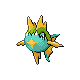
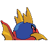

# #318 Carvanha (Savage Pokémon)

| Official Artwork | Shiny Artwork |
|------------------|---------------|
|  |  |

They form packs to attack boats and rip out their hulls to sink them. They live in rivers in the jungle.

---

## Media

### Default Sprites

| Front | Shiny | Back | Shiny |
|-------|-------|------|-------|
|  |  |  |  |

### Cries

Latest (Gen VI+):

<audio controls>
<source src='../../assets/cries/carvanha/latest.ogg' type='audio/ogg'>
  Your browser does not support the audio element.
</audio>

Legacy:

<audio controls>
<source src='../../assets/cries/carvanha/legacy.ogg' type='audio/ogg'>
  Your browser does not support the audio element.
</audio>

---

## Pokédex Data

| National № | Type(s) | Height | Weight | Abilities | Local № |
|------------|---------|--------|--------|-----------|---------|
| #318 | {: width="48"} {: width="48"} | 0.8 m / 2.6 ft | 20.8 kg / 45.9 lbs | 1. Rough Skin 2. Speed Boost | N/A |

---

## Base Stats
|   | HP | Attack | Defense | Sp. Atk | Sp. Def | Speed |
|---|----|--------|---------|---------|---------|-------|
| **Base** | 45 | 90 | 20 | 65 | 20 | 65 |
| **Min** | 200 | 166 | 40 | 121 | 40 | 121 |
| **Max** | 294 | 306 | 152 | 251 | 152 | 251 |

The ranges shown above are for a level 100 Pokémon. Maximum values are based on a beneficial nature, 252 EVs, 31 IVs; minimum values are based on a hindering nature, 0 EVs, 0 IVs.

---

## Forms & Evolutions

!!! warning "WARNING"

    Information on evolutions may not be 100% accurate; differences between evolution methods across generations are not accounted for.

### Forms

Carvanha has no alternate forms.

### Evolution Line

1. [Carvanha](carvanha.md/)
    1. Level Up: [Sharpedo](sharpedo.md/)

---

## Training

| EV Yield | Catch Rate | Base Friendship | Base Exp. | Growth Rate | Held Items |
|----------|------------|-----------------|-----------|-------------|------------|
| 1 Attack | 225 | 35 | 61 | Slow | Deep Sea Tooth (5%) |

---

## Breeding

| Egg Groups | Egg Cycles | Gender | Dimorphic | Color | Shape |
|------------|------------|--------|-----------|-------|-------|
| 1. Water2 | 20 | 50.0% Male 50.0% Female | False | Red | Fish |

---

## Moves

!!! warning "WARNING"

    Specific move information may be incorrect. However, the general movepool should be accurate; this includes changes made in Sacred Gold and Storm Silver.

### Level Up Moves

| Lv. | Move | Type | Cat. | Power | Acc. | PP |
| --- | --- | --- | --- | --- | --- | --- |
| 1 | Bite | {: width="48"} | {: width="36"} | 60 | 100 | 25 |
| 1 | Leer | {: width="48"} | {: width="36"} | — | 100 | 30 |
| 6 | Rage | {: width="48"} | {: width="36"} | 20 | 100 | 20 |
| 8 | Focus Energy | {: width="48"} | {: width="36"} | — | — | 30 |
| 11 | Scary Face | {: width="48"} | {: width="36"} | — | 100 | 10 |
| 16 | Ice Fang | {: width="48"} | {: width="36"} | 65 | 95 | 15 |
| 18 | Screech | {: width="48"} | {: width="36"} | — | 85 | 40 |
| 21 | Swagger | {: width="48"} | {: width="36"} | — | 85 | 15 |
| 26 | Assurance | {: width="48"} | {: width="36"} | 60 | 100 | 10 |
| 28 | Crunch | {: width="48"} | {: width="36"} | 80 | 100 | 15 |
| 31 | Aqua Jet | {: width="48"} | {: width="36"} | 40 | 100 | 20 |
| 36 | Agility | {: width="48"} | {: width="36"} | — | — | 30 |
| 38 | Take Down | {: width="48"} | {: width="36"} | 90 | 85 | 20 |

### TM Moves

| TM | Move | Type | Cat. | Power | Acc. | PP |
| --- | --- | --- | --- | --- | --- | --- |
| HM03 | Surf | {: width="48"} | {: width="36"} | 90 | 100 | 15 |
| HM05 | Waterfall | {: width="48"} | {: width="36"} | 80 | 100 | 15 |
| HM06 | Dive | {: width="48"} | {: width="36"} | 80 | 100 | 10 |
| TM06 | Toxic | {: width="48"} | {: width="36"} | — | 90 | 10 |
| TM07 | Hail | {: width="48"} | {: width="36"} | — | — | 10 |
| TM10 | Hidden Power | {: width="48"} | {: width="36"} | 60 | 100 | 15 |
| TM12 | Taunt | {: width="48"} | {: width="36"} | — | 100 | 20 |
| TM13 | Ice Beam | {: width="48"} | {: width="36"} | 90 | 100 | 10 |
| TM14 | Blizzard | {: width="48"} | {: width="36"} | 110 | 70 | 5 |
| TM17 | Protect | {: width="48"} | {: width="36"} | — | — | 10 |
| TM18 | Rain Dance | {: width="48"} | {: width="36"} | — | — | 5 |
| TM21 | Frustration | {: width="48"} | {: width="36"} | — | 100 | 20 |
| TM27 | Return | {: width="48"} | {: width="36"} | — | 100 | 20 |
| TM32 | Double Team | {: width="48"} | {: width="36"} | — | — | 15 |
| TM41 | Torment | {: width="48"} | {: width="36"} | — | 100 | 15 |
| TM42 | Facade | {: width="48"} | {: width="36"} | 70 | 100 | 20 |
| TM44 | Rest | {: width="48"} | {: width="36"} | — | — | 5 |
| TM45 | Attract | {: width="48"} | {: width="36"} | — | 100 | 15 |
| TM46 | Thief | {: width="48"} | {: width="36"} | 60 | 100 | 25 |
| TM48 | Round | {: width="48"} | {: width="36"} | 60 | 100 | 15 |
| TM55 | Scald | {: width="48"} | {: width="36"} | 80 | 100 | 15 |
| TM66 | Payback | {: width="48"} | {: width="36"} | 50 | 100 | 10 |
| TM67 | Retaliate | {: width="48"} | {: width="36"} | 70 | 100 | 5 |
| TM87 | Swagger | {: width="48"} | {: width="36"} | — | 85 | 15 |
| TM90 | Substitute | {: width="48"} | {: width="36"} | — | — | 10 |
| TM95 | Snarl | {: width="48"} | {: width="36"} | 55 | 95 | 15 |

### Egg Moves

| Move | Type | Cat. | Power | Acc. | PP |
| --- | --- | --- | --- | --- | --- |
| Thrash | {: width="48"} | {: width="36"} | 120 | 100 | 10 |
| Double Edge | {: width="48"} | {: width="36"} | 120 | 100 | 15 |
| Hydro Pump | {: width="48"} | {: width="36"} | 110 | 80 | 5 |
| Swift | {: width="48"} | {: width="36"} | 60 | — | 20 |
| Ancient Power | {: width="48"} | {: width="36"} | 60 | 100 | 5 |
| Brine | {: width="48"} | {: width="36"} | 65 | 100 | 10 |

### Tutor Moves

Carvanha cannot learn any moves from tutors.
