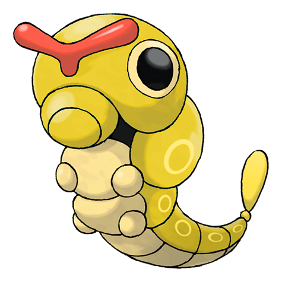

# #010 Caterpie (Worm Pokémon)

| Official Artwork | Shiny Artwork |
|------------------|---------------|
|  |  |

**Sacred Gold:** For protection, it releases a horrible stench from the antennae on its head to drive away enemies.

**Storm Silver:** Its feet have suction cups designed to stick to any surface. It tenaciously climbs trees to forage.

---

## Media

### Default Sprites

| Front | Shiny | Back | Shiny |
|-------|-------|------|-------|
|  |  |  |  |

### Female Sprites

| Front | Shiny | Back | Shiny |
|-------|-------|------|-------|
| ? | ? | ? | ? |

### Cries

Latest (Gen VI+):

<audio controls>
<source src='../../assets/cries/caterpie/latest.ogg' type='audio/ogg'>
  Your browser does not support the audio element.
</audio>

Legacy:

<audio controls>
<source src='../../assets/cries/caterpie/legacy.ogg' type='audio/ogg'>
  Your browser does not support the audio element.
</audio>

---

## Pokédex Data

| National № | Type(s) | Height | Weight | Abilities | Local № |
|------------|---------|--------|--------|-----------|---------|
| #10 | {: width="48"} | 0.3 m / 1.0 ft | 2.9 kg / 6.4 lbs | 1. Shield Dust 2. Run Away | N/A |

---

## Base Stats
|   | HP | Attack | Defense | Sp. Atk | Sp. Def | Speed |
|---|----|--------|---------|---------|---------|-------|
| **Base** | 45 | 30 | 35 | 20 | 20 | 45 |
| **Min** | 200 | 58 | 67 | 40 | 40 | 85 |
| **Max** | 294 | 174 | 185 | 152 | 152 | 207 |

The ranges shown above are for a level 100 Pokémon. Maximum values are based on a beneficial nature, 252 EVs, 31 IVs; minimum values are based on a hindering nature, 0 EVs, 0 IVs.

---

## Forms & Evolutions

!!! warning "WARNING"

    Information on evolutions may not be 100% accurate; differences between evolution methods across generations are not accounted for.

### Forms

Caterpie has no alternate forms.

### Evolution Line

1. [Caterpie](caterpie.md/)
    1. Level Up: [Metapod](metapod.md/)
        1. Level Up: [Butterfree](butterfree.md/)

---

## Training

| EV Yield | Catch Rate | Base Friendship | Base Exp. | Growth Rate | Held Items |
|----------|------------|-----------------|-----------|-------------|------------|
| 1 Hp | 255 | 50 | 39 | Medium | N/A |

---

## Breeding

| Egg Groups | Egg Cycles | Gender | Dimorphic | Color | Shape |
|------------|------------|--------|-----------|-------|-------|
| 1. Bug | 15 | 50.0% Male 50.0% Female | False | Green | Armor |

---

## Moves

!!! warning "WARNING"

    Specific move information may be incorrect. However, the general movepool should be accurate; this includes changes made in Sacred Gold and Storm Silver.

### Level Up Moves

| Lv. | Move | Type | Cat. | Power | Acc. | PP |
| --- | --- | --- | --- | --- | --- | --- |
| 1 | Bug Bite | {: width="48"} | {: width="36"} | 60 | 100 | 20 |
| 1 | Snore | {: width="48"} | {: width="36"} | 50 | 100 | 15 |
| 1 | String Shot | {: width="48"} | {: width="36"} | — | 95 | 40 |
| 1 | Tackle | {: width="48"} | {: width="36"} | 40 | 100 | 35 |

### TM Moves

Caterpie cannot learn any TM moves.
### Egg Moves

Caterpie cannot learn any moves by breeding.
### Tutor Moves

| Move | Type | Cat. | Power | Acc. | PP |
| --- | --- | --- | --- | --- | --- |
| String Shot | {: width="48"} | {: width="36"} | — | 95 | 40 |
| Snore | {: width="48"} | {: width="36"} | 50 | 100 | 15 |
| Bug Bite | {: width="48"} | {: width="36"} | 60 | 100 | 20 |

