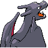

# #006 Charizard (Flame Pokémon)

| Official Artwork | Shiny Artwork |
|------------------|---------------|
|  |  |

**Sacred Gold:** If CHARIZARD becomes furious, the flame at the tip of its tail flares up in a light blue shade.

**Storm Silver:** Breathing intense, hot flames, it can melt almost anything. Its breath inflicts terrible pain on enemies.

---

## Media

### Default Sprites

| Front | Shiny | Back | Shiny |
|-------|-------|------|-------|
|  |  |  |  |

### Female Sprites

| Front | Shiny | Back | Shiny |
|-------|-------|------|-------|
| ? | ? | ? | ? |

### Cries

Latest (Gen VI+):

<audio controls>
<source src='../../assets/cries/charizard/latest.ogg' type='audio/ogg'>
  Your browser does not support the audio element.
</audio>

Legacy:

<audio controls>
<source src='../../assets/cries/charizard/legacy.ogg' type='audio/ogg'>
  Your browser does not support the audio element.
</audio>

---

## Pokédex Data

| National № | Type(s) | Height | Weight | Abilities | Local № |
|------------|---------|--------|--------|-----------|---------|
| #6 | {: width="48"} {: width="48"} | 1.7 m / 5.6 ft | 90.5 kg / 199.5 lbs | 1. Blaze 2. Solar Power | N/A |

---

## Base Stats
|   | HP | Attack | Defense | Sp. Atk | Sp. Def | Speed |
|---|----|--------|---------|---------|---------|-------|
| **Base** | 78 | 84 | 78 | 109 | 85 | 100 |
| **Min** | 266 | 155 | 144 | 200 | 157 | 184 |
| **Max** | 360 | 293 | 280 | 348 | 295 | 328 |

The ranges shown above are for a level 100 Pokémon. Maximum values are based on a beneficial nature, 252 EVs, 31 IVs; minimum values are based on a hindering nature, 0 EVs, 0 IVs.

---

## Forms & Evolutions

!!! warning "WARNING"

    Information on evolutions may not be 100% accurate; differences between evolution methods across generations are not accounted for.

### Forms

Charizard has no alternate forms.

### Evolution Line

1. [Charmander](charmander.md/)
    1. Level Up: [Charmeleon](charmeleon.md/)
        1. Level Up: [Charizard](charizard.md/)

---

## Training

| EV Yield | Catch Rate | Base Friendship | Base Exp. | Growth Rate | Held Items |
|----------|------------|-----------------|-----------|-------------|------------|
| 3 Special Attack | 45 | 50 | 267 | Medium Slow | N/A |

---

## Breeding

| Egg Groups | Egg Cycles | Gender | Dimorphic | Color | Shape |
|------------|------------|--------|-----------|-------|-------|
| 1. Monster 2. Dragon | 20 | 87.5% Male 12.5% Female | False | Red | Upright |

---

## Moves

!!! warning "WARNING"

    Specific move information may be incorrect. However, the general movepool should be accurate; this includes changes made in Sacred Gold and Storm Silver.

### Level Up Moves

| Lv. | Move | Type | Cat. | Power | Acc. | PP |
| --- | --- | --- | --- | --- | --- | --- |
| 1 | Air Slash | {: width="48"} | {: width="36"} | 75 | 95 | 15 |
| 1 | Dragon Claw | {: width="48"} | {: width="36"} | 80 | 100 | 15 |
| 1 | Ember | {: width="48"} | {: width="36"} | 40 | 100 | 25 |
| 1 | Growl | {: width="48"} | {: width="36"} | — | 100 | 40 |
| 1 | Scratch | {: width="48"} | {: width="36"} | 40 | 100 | 35 |
| 1 | Shadow Claw | {: width="48"} | {: width="36"} | 70 | 100 | 15 |
| 1 | Smokescreen | {: width="48"} | {: width="36"} | — | 100 | 20 |
| 7 | Ember | {: width="48"} | {: width="36"} | 40 | 100 | 25 |
| 10 | Smokescreen | {: width="48"} | {: width="36"} | — | 100 | 20 |
| 13 | Metal Claw | {: width="48"} | {: width="36"} | 50 | 95 | 35 |
| 17 | Dragon Rage | {: width="48"} | {: width="36"} | — | 100 | 10 |
| 21 | Scary Face | {: width="48"} | {: width="36"} | — | 100 | 10 |
| 28 | Fire Fang | {: width="48"} | {: width="36"} | 65 | 95 | 15 |
| 32 | Slash | {: width="48"} | {: width="36"} | 70 | 100 | 20 |
| 36 | Belly Drum | {: width="48"} | {: width="36"} | — | — | 10 |
| 42 | Flamethrower | {: width="48"} | {: width="36"} | 90 | 100 | 15 |
| 49 | Fire Spin | {: width="48"} | {: width="36"} | 35 | 85 | 15 |
| 59 | Heat Wave | {: width="48"} | {: width="36"} | 95 | 90 | 10 |
| 66 | Flare Blitz | {: width="48"} | {: width="36"} | 120 | 100 | 15 |
| 73 | Outrage | {: width="48"} | {: width="36"} | 120 | 100 | 10 |

### TM Moves

| TM | Move | Type | Cat. | Power | Acc. | PP |
| --- | --- | --- | --- | --- | --- | --- |
| HM01 | Cut | {: width="48"} | {: width="36"} | 60 | 95 | 30 |
| HM02 | Fly | {: width="48"} | {: width="36"} | 90 | 95 | 15 |
| HM04 | Strength | {: width="48"} | {: width="36"} | 60 | 100 | 15 |
| HM06 | Rock Smash | {: width="48"} | {: width="36"} | 60 | 100 | 15 |
| TM01 | Focus Punch | {: width="48"} | {: width="36"} | 150 | 100 | 20 |
| TM02 | Dragon Claw | {: width="48"} | {: width="36"} | 80 | 100 | 15 |
| TM05 | Roar | {: width="48"} | {: width="36"} | — | — | 20 |
| TM06 | Toxic | {: width="48"} | {: width="36"} | — | 90 | 10 |
| TM10 | Hidden Power | {: width="48"} | {: width="36"} | 60 | 100 | 15 |
| TM11 | Sunny Day | {: width="48"} | {: width="36"} | — | — | 5 |
| TM15 | Hyper Beam | {: width="48"} | {: width="36"} | 150 | 90 | 5 |
| TM17 | Protect | {: width="48"} | {: width="36"} | — | — | 10 |
| TM21 | Frustration | {: width="48"} | {: width="36"} | — | 100 | 20 |
| TM22 | Solar Beam | {: width="48"} | {: width="36"} | 120 | 100 | 10 |
| TM23 | Iron Tail | {: width="48"} | {: width="36"} | 100 | 75 | 15 |
| TM26 | Earthquake | {: width="48"} | {: width="36"} | 100 | 100 | 10 |
| TM27 | Return | {: width="48"} | {: width="36"} | — | 100 | 20 |
| TM28 | Dig | {: width="48"} | {: width="36"} | 80 | 100 | 10 |
| TM31 | Brick Break | {: width="48"} | {: width="36"} | 75 | 100 | 15 |
| TM32 | Double Team | {: width="48"} | {: width="36"} | — | — | 15 |
| TM35 | Flamethrower | {: width="48"} | {: width="36"} | 90 | 100 | 15 |
| TM38 | Fire Blast | {: width="48"} | {: width="36"} | 110 | 85 | 5 |
| TM39 | Rock Tomb | {: width="48"} | {: width="36"} | 60 | 95 | 15 |
| TM40 | Aerial Ace | {: width="48"} | {: width="36"} | 60 | — | 20 |
| TM42 | Facade | {: width="48"} | {: width="36"} | 70 | 100 | 20 |
| TM43 | Secret Power | {: width="48"} | {: width="36"} | 70 | 100 | 20 |
| TM44 | Rest | {: width="48"} | {: width="36"} | — | — | 5 |
| TM45 | Attract | {: width="48"} | {: width="36"} | — | 100 | 15 |
| TM47 | Steel Wing | {: width="48"} | {: width="36"} | 70 | 90 | 25 |
| TM50 | Overheat | {: width="48"} | {: width="36"} | 130 | 90 | 5 |
| TM51 | Roost | {: width="48"} | {: width="36"} | — | — | 5 |
| TM52 | Focus Blast | {: width="48"} | {: width="36"} | 120 | 70 | 5 |
| TM56 | Fling | {: width="48"} | {: width="36"} | — | 100 | 10 |
| TM58 | Endure | {: width="48"} | {: width="36"} | — | — | 10 |
| TM59 | Dragon Pulse | {: width="48"} | {: width="36"} | 85 | 100 | 10 |
| TM61 | Will O Wisp | {: width="48"} | {: width="36"} | — | 85 | 15 |
| TM65 | Shadow Claw | {: width="48"} | {: width="36"} | 70 | 100 | 15 |
| TM68 | Giga Impact | {: width="48"} | {: width="36"} | 150 | 90 | 5 |
| TM75 | Swords Dance | {: width="48"} | {: width="36"} | — | — | 20 |
| TM78 | Captivate | {: width="48"} | {: width="36"} | — | 100 | 20 |
| TM80 | Rock Slide | {: width="48"} | {: width="36"} | 75 | 90 | 10 |
| TM82 | Sleep Talk | {: width="48"} | {: width="36"} | — | — | 10 |
| TM83 | Natural Gift | {: width="48"} | {: width="36"} | — | 100 | 15 |
| TM87 | Swagger | {: width="48"} | {: width="36"} | — | 85 | 15 |
| TM90 | Substitute | {: width="48"} | {: width="36"} | — | — | 10 |

### Egg Moves

Charizard cannot learn any moves by breeding.
### Tutor Moves

| Move | Type | Cat. | Power | Acc. | PP |
| --- | --- | --- | --- | --- | --- |
| Fire Punch | {: width="48"} | {: width="36"} | 75 | 100 | 15 |
| Thunder Punch | {: width="48"} | {: width="36"} | 75 | 100 | 15 |
| Headbutt | {: width="48"} | {: width="36"} | 70 | 100 | 15 |
| Swift | {: width="48"} | {: width="36"} | 60 | — | 20 |
| Snore | {: width="48"} | {: width="36"} | 50 | 100 | 15 |
| Mud Slap | {: width="48"} | {: width="36"} | 20 | 100 | 10 |
| Outrage | {: width="48"} | {: width="36"} | 120 | 100 | 10 |
| Fury Cutter | {: width="48"} | {: width="36"} | 40 | 95 | 20 |
| Twister | {: width="48"} | {: width="36"} | 40 | 100 | 20 |
| Heat Wave | {: width="48"} | {: width="36"} | 95 | 90 | 10 |
| Blast Burn | {: width="48"} | {: width="36"} | 150 | 90 | 5 |
| Air Cutter | {: width="48"} | {: width="36"} | 60 | 95 | 25 |
| Tailwind | {: width="48"} | {: width="36"} | — | — | 15 |
| Ominous Wind | {: width="48"} | {: width="36"} | 60 | 100 | 5 |

