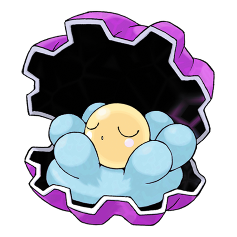
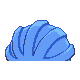

# #366 Clamperl (Bivalve Pokémon)

| Official Artwork | Shiny Artwork |
|------------------|---------------|
|  |  |

When it evolves, it makes a mysterious pearl that amplifies psychic powers when it’s held.

---

## Media

### Default Sprites

| Front | Shiny | Back | Shiny |
|-------|-------|------|-------|
|  |  |  |  |

### Cries

Latest (Gen VI+):

<audio controls>
<source src='../../assets/cries/clamperl/latest.ogg' type='audio/ogg'>
  Your browser does not support the audio element.
</audio>

Legacy:

<audio controls>
<source src='../../assets/cries/clamperl/legacy.ogg' type='audio/ogg'>
  Your browser does not support the audio element.
</audio>

---

## Pokédex Data

| National № | Type(s) | Height | Weight | Abilities | Local № |
|------------|---------|--------|--------|-----------|---------|
| #366 | {: width="48"} | 0.4 m / 1.3 ft | 52.5 kg / 115.7 lbs | 1. Shell Armor 2. Rattled | N/A |

---

## Base Stats
|   | HP | Attack | Defense | Sp. Atk | Sp. Def | Speed |
|---|----|--------|---------|---------|---------|-------|
| **Base** | 35 | 64 | 85 | 74 | 55 | 32 |
| **Min** | 180 | 119 | 157 | 137 | 103 | 62 |
| **Max** | 274 | 249 | 295 | 271 | 229 | 179 |

The ranges shown above are for a level 100 Pokémon. Maximum values are based on a beneficial nature, 252 EVs, 31 IVs; minimum values are based on a hindering nature, 0 EVs, 0 IVs.

---

## Forms & Evolutions

!!! warning "WARNING"

    Information on evolutions may not be 100% accurate; differences between evolution methods across generations are not accounted for.

### Forms

Clamperl has no alternate forms.

### Evolution Line

1. [Clamperl](clamperl.md/)
    1. Trade: [Huntail](huntail.md/)

    2. Trade: [Gorebyss](gorebyss.md/)

---

## Training

| EV Yield | Catch Rate | Base Friendship | Base Exp. | Growth Rate | Held Items |
|----------|------------|-----------------|-----------|-------------|------------|
| 1 Def | 255 | 70 | 69 | Slow Then Very Fast | Big Pearl (5%) |

---

## Breeding

| Egg Groups | Egg Cycles | Gender | Dimorphic | Color | Shape |
|------------|------------|--------|-----------|-------|-------|
| 1. Water1 | 20 | 50.0% Male 50.0% Female | False | Blue | Ball |

---

## Moves

!!! warning "WARNING"

    Specific move information may be incorrect. However, the general movepool should be accurate; this includes changes made in Sacred Gold and Storm Silver.

### Level Up Moves

| Lv. | Move | Type | Cat. | Power | Acc. | PP |
| --- | --- | --- | --- | --- | --- | --- |
| 1 | Clamp | {: width="48"} | {: width="36"} | 35 | 85 | 15 |
| 1 | Iron Defense | {: width="48"} | {: width="36"} | — | — | 15 |
| 1 | Water Gun | {: width="48"} | {: width="36"} | 40 | 100 | 25 |
| 1 | Whirlpool | {: width="48"} | {: width="36"} | 35 | 85 | 15 |
| 26 | Muddy Water | {: width="48"} | {: width="36"} | 90 | 85 | 10 |
| 51 | Shell Smash | {: width="48"} | {: width="36"} | — | — | 15 |

### TM Moves

| TM | Move | Type | Cat. | Power | Acc. | PP |
| --- | --- | --- | --- | --- | --- | --- |
| HM03 | Surf | {: width="48"} | {: width="36"} | 90 | 100 | 15 |
| HM05 | Waterfall | {: width="48"} | {: width="36"} | 80 | 100 | 15 |
| HM06 | Dive | {: width="48"} | {: width="36"} | 80 | 100 | 10 |
| TM06 | Toxic | {: width="48"} | {: width="36"} | — | 90 | 10 |
| TM07 | Hail | {: width="48"} | {: width="36"} | — | — | 10 |
| TM10 | Hidden Power | {: width="48"} | {: width="36"} | 60 | 100 | 15 |
| TM13 | Ice Beam | {: width="48"} | {: width="36"} | 90 | 100 | 10 |
| TM14 | Blizzard | {: width="48"} | {: width="36"} | 110 | 70 | 5 |
| TM17 | Protect | {: width="48"} | {: width="36"} | — | — | 10 |
| TM18 | Rain Dance | {: width="48"} | {: width="36"} | — | — | 5 |
| TM21 | Frustration | {: width="48"} | {: width="36"} | — | 100 | 20 |
| TM27 | Return | {: width="48"} | {: width="36"} | — | 100 | 20 |
| TM32 | Double Team | {: width="48"} | {: width="36"} | — | — | 15 |
| TM42 | Facade | {: width="48"} | {: width="36"} | 70 | 100 | 20 |
| TM44 | Rest | {: width="48"} | {: width="36"} | — | — | 5 |
| TM45 | Attract | {: width="48"} | {: width="36"} | — | 100 | 15 |
| TM48 | Round | {: width="48"} | {: width="36"} | 60 | 100 | 15 |
| TM55 | Scald | {: width="48"} | {: width="36"} | 80 | 100 | 15 |
| TM87 | Swagger | {: width="48"} | {: width="36"} | — | 85 | 15 |
| TM90 | Substitute | {: width="48"} | {: width="36"} | — | — | 10 |

### Egg Moves

| Move | Type | Cat. | Power | Acc. | PP |
| --- | --- | --- | --- | --- | --- |
| Body Slam | {: width="48"} | {: width="36"} | 85 | 100 | 15 |
| Supersonic | {: width="48"} | {: width="36"} | — | 55 | 20 |
| Confuse Ray | {: width="48"} | {: width="36"} | — | 100 | 10 |
| Barrier | {: width="48"} | {: width="36"} | — | — | 20 |
| Endure | {: width="48"} | {: width="36"} | — | — | 10 |
| Refresh | {: width="48"} | {: width="36"} | — | — | 20 |
| Mud Sport | {: width="48"} | {: width="36"} | — | — | 15 |
| Muddy Water | {: width="48"} | {: width="36"} | 90 | 85 | 10 |
| Water Pulse | {: width="48"} | {: width="36"} | 60 | 100 | 20 |
| Brine | {: width="48"} | {: width="36"} | 65 | 100 | 10 |
| Aqua Ring | {: width="48"} | {: width="36"} | — | — | 20 |

### Tutor Moves

Clamperl cannot learn any moves from tutors.
