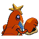

# #342 Crawdaunt (Rogue Pokémon)

| Official Artwork | Shiny Artwork |
|------------------|---------------|
|  |  |

A brutish Pokémon that loves to battle. It will crash itself into any foe that approaches its nest.

---

## Media

### Default Sprites

| Front | Shiny | Back | Shiny |
|-------|-------|------|-------|
|  |  |  |  |

### Female Sprites

| Front | Shiny | Back | Shiny |
|-------|-------|------|-------|
| ? | ? | ? | ? |

### Cries

Latest (Gen VI+):

<audio controls>
<source src='../../assets/cries/crawdaunt/latest.ogg' type='audio/ogg'>
  Your browser does not support the audio element.
</audio>

Legacy:

<audio controls>
<source src='../../assets/cries/crawdaunt/legacy.ogg' type='audio/ogg'>
  Your browser does not support the audio element.
</audio>

---

## Pokédex Data

| National № | Type(s) | Height | Weight | Abilities | Local № |
|------------|---------|--------|--------|-----------|---------|
| #342 | {: width="48"} {: width="48"} | 1.1 m / 3.6 ft | 32.8 kg / 72.3 lbs | 1. Hyper Cutter 2. Shell Armor 3. Adaptability | N/A |

---

## Base Stats
|   | HP | Attack | Defense | Sp. Atk | Sp. Def | Speed |
|---|----|--------|---------|---------|---------|-------|
| **Base** | 63 | 120 | 85 | 90 | 55 | 55 |
| **Min** | 236 | 220 | 157 | 166 | 103 | 103 |
| **Max** | 330 | 372 | 295 | 306 | 229 | 229 |

The ranges shown above are for a level 100 Pokémon. Maximum values are based on a beneficial nature, 252 EVs, 31 IVs; minimum values are based on a hindering nature, 0 EVs, 0 IVs.

---

## Forms & Evolutions

!!! warning "WARNING"

    Information on evolutions may not be 100% accurate; differences between evolution methods across generations are not accounted for.

### Forms

Crawdaunt has no alternate forms.

### Evolution Line

1. [Corphish](corphish.md/)
    1. Level Up: [Crawdaunt](crawdaunt.md/)

---

## Training

| EV Yield | Catch Rate | Base Friendship | Base Exp. | Growth Rate | Held Items |
|----------|------------|-----------------|-----------|-------------|------------|
| 2 Attack | 155 | 50 | 164 | Fast Then Very Slow | N/A |

---

## Breeding

| Egg Groups | Egg Cycles | Gender | Dimorphic | Color | Shape |
|------------|------------|--------|-----------|-------|-------|
| 1. Water1 2. Water3 | 15 | 50.0% Male 50.0% Female | False | Red | Armor |

---

## Moves

!!! warning "WARNING"

    Specific move information may be incorrect. However, the general movepool should be accurate; this includes changes made in Sacred Gold and Storm Silver.

### Level Up Moves

| Lv. | Move | Type | Cat. | Power | Acc. | PP |
| --- | --- | --- | --- | --- | --- | --- |
| 1 | Bubble | {: width="48"} | {: width="36"} | 40 | 100 | 30 |
| 1 | Harden | {: width="48"} | {: width="36"} | — | — | 30 |
| 1 | Leer | {: width="48"} | {: width="36"} | — | 100 | 30 |
| 1 | Vice Grip | {: width="48"} | {: width="36"} | 55 | 100 | 30 |
| 7 | Harden | {: width="48"} | {: width="36"} | — | — | 30 |
| 10 | Vice Grip | {: width="48"} | {: width="36"} | 55 | 100 | 30 |
| 13 | Leer | {: width="48"} | {: width="36"} | — | 100 | 30 |
| 20 | Crabhammer | {: width="48"} | {: width="36"} | 100 | 90 | 10 |
| 23 | Protect | {: width="48"} | {: width="36"} | — | — | 10 |
| 26 | Knock Off | {: width="48"} | {: width="36"} | 65 | 100 | 20 |
| 30 | Swift | {: width="48"} | {: width="36"} | 60 | — | 20 |
| 34 | Taunt | {: width="48"} | {: width="36"} | — | 100 | 20 |
| 39 | Night Slash | {: width="48"} | {: width="36"} | 70 | 100 | 15 |
| 44 | Dragon Dance | {: width="48"} | {: width="36"} | — | — | 20 |
| 52 | Swords Dance | {: width="48"} | {: width="36"} | — | — | 20 |
| 57 | Crunch | {: width="48"} | {: width="36"} | 80 | 100 | 15 |
| 65 | Guillotine | {: width="48"} | {: width="36"} | — | 30 | 5 |
| 73 | Superpower | {: width="48"} | {: width="36"} | 120 | 100 | 5 |

### TM Moves

| TM | Move | Type | Cat. | Power | Acc. | PP |
| --- | --- | --- | --- | --- | --- | --- |
| HM01 | Cut | {: width="48"} | {: width="36"} | 60 | 95 | 30 |
| HM03 | Surf | {: width="48"} | {: width="36"} | 90 | 100 | 15 |
| HM04 | Strength | {: width="48"} | {: width="36"} | 60 | 100 | 15 |
| HM05 | Whirlpool | {: width="48"} | {: width="36"} | 35 | 85 | 15 |
| HM06 | Rock Smash | {: width="48"} | {: width="36"} | 60 | 100 | 15 |
| HM07 | Waterfall | {: width="48"} | {: width="36"} | 80 | 100 | 15 |
| TM03 | Water Pulse | {: width="48"} | {: width="36"} | 60 | 100 | 20 |
| TM06 | Toxic | {: width="48"} | {: width="36"} | — | 90 | 10 |
| TM07 | Hail | {: width="48"} | {: width="36"} | — | — | 10 |
| TM10 | Hidden Power | {: width="48"} | {: width="36"} | 60 | 100 | 15 |
| TM12 | Taunt | {: width="48"} | {: width="36"} | — | 100 | 20 |
| TM13 | Ice Beam | {: width="48"} | {: width="36"} | 90 | 100 | 10 |
| TM14 | Blizzard | {: width="48"} | {: width="36"} | 110 | 70 | 5 |
| TM15 | Hyper Beam | {: width="48"} | {: width="36"} | 150 | 90 | 5 |
| TM17 | Protect | {: width="48"} | {: width="36"} | — | — | 10 |
| TM18 | Rain Dance | {: width="48"} | {: width="36"} | — | — | 5 |
| TM21 | Frustration | {: width="48"} | {: width="36"} | — | 100 | 20 |
| TM27 | Return | {: width="48"} | {: width="36"} | — | 100 | 20 |
| TM28 | Dig | {: width="48"} | {: width="36"} | 80 | 100 | 10 |
| TM31 | Brick Break | {: width="48"} | {: width="36"} | 75 | 100 | 15 |
| TM32 | Double Team | {: width="48"} | {: width="36"} | — | — | 15 |
| TM36 | Sludge Bomb | {: width="48"} | {: width="36"} | 90 | 100 | 10 |
| TM39 | Rock Tomb | {: width="48"} | {: width="36"} | 60 | 95 | 15 |
| TM40 | Aerial Ace | {: width="48"} | {: width="36"} | 60 | — | 20 |
| TM42 | Facade | {: width="48"} | {: width="36"} | 70 | 100 | 20 |
| TM43 | Secret Power | {: width="48"} | {: width="36"} | 70 | 100 | 20 |
| TM44 | Rest | {: width="48"} | {: width="36"} | — | — | 5 |
| TM45 | Attract | {: width="48"} | {: width="36"} | — | 100 | 15 |
| TM54 | False Swipe | {: width="48"} | {: width="36"} | 40 | 100 | 40 |
| TM56 | Fling | {: width="48"} | {: width="36"} | — | 100 | 10 |
| TM58 | Endure | {: width="48"} | {: width="36"} | — | — | 10 |
| TM66 | Payback | {: width="48"} | {: width="36"} | 50 | 100 | 10 |
| TM68 | Giga Impact | {: width="48"} | {: width="36"} | 150 | 90 | 5 |
| TM72 | Avalanche | {: width="48"} | {: width="36"} | 60 | 100 | 10 |
| TM75 | Swords Dance | {: width="48"} | {: width="36"} | — | — | 20 |
| TM78 | Captivate | {: width="48"} | {: width="36"} | — | 100 | 20 |
| TM79 | Dark Pulse | {: width="48"} | {: width="36"} | 80 | 100 | 15 |
| TM80 | Rock Slide | {: width="48"} | {: width="36"} | 75 | 90 | 10 |
| TM81 | X Scissor | {: width="48"} | {: width="36"} | 80 | 100 | 15 |
| TM82 | Sleep Talk | {: width="48"} | {: width="36"} | — | — | 10 |
| TM83 | Natural Gift | {: width="48"} | {: width="36"} | — | 100 | 15 |
| TM87 | Swagger | {: width="48"} | {: width="36"} | — | 85 | 15 |
| TM90 | Substitute | {: width="48"} | {: width="36"} | — | — | 10 |

### Egg Moves

Crawdaunt cannot learn any moves by breeding.
### Tutor Moves

| Move | Type | Cat. | Power | Acc. | PP |
| --- | --- | --- | --- | --- | --- |
| Swift | {: width="48"} | {: width="36"} | 60 | — | 20 |
| Snore | {: width="48"} | {: width="36"} | 50 | 100 | 15 |
| Spite | {: width="48"} | {: width="36"} | — | 100 | 10 |
| Mud Slap | {: width="48"} | {: width="36"} | 20 | 100 | 10 |
| Icy Wind | {: width="48"} | {: width="36"} | 55 | 95 | 15 |
| Fury Cutter | {: width="48"} | {: width="36"} | 40 | 95 | 20 |
| Ancient Power | {: width="48"} | {: width="36"} | 60 | 100 | 5 |
| Superpower | {: width="48"} | {: width="36"} | 120 | 100 | 5 |
| Knock Off | {: width="48"} | {: width="36"} | 65 | 100 | 20 |
| Endeavor | {: width="48"} | {: width="36"} | — | 100 | 5 |
| Dive | {: width="48"} | {: width="36"} | 80 | 100 | 10 |
| Iron Defense | {: width="48"} | {: width="36"} | — | — | 15 |

