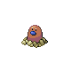
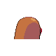
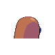

# #050 Diglett (Mole Pokémon)

| Official Artwork | Shiny Artwork |
|------------------|---------------|
|  |  |

**Sacred Gold:** Its skin is very thin. If it is exposed to light, its blood heats up, causing it to grow weak.

**Storm Silver:** If a DIGLETT digs through a field, it leaves the soil perfectly tilled and ideal for planting crops.

---

## Media

### Default Sprites

| Front | Shiny | Back | Shiny |
|-------|-------|------|-------|
|  |  |  |  |

### Cries

Latest (Gen VI+):

<audio controls>
<source src='../../assets/cries/diglett/latest.ogg' type='audio/ogg'>
  Your browser does not support the audio element.
</audio>

Legacy:

<audio controls>
<source src='../../assets/cries/diglett/legacy.ogg' type='audio/ogg'>
  Your browser does not support the audio element.
</audio>

---

## Pokédex Data

| National № | Type(s) | Height | Weight | Abilities | Local № |
|------------|---------|--------|--------|-----------|---------|
| #50 | {: width="48"} | 0.2 m / 0.7 ft | 0.8 kg / 1.8 lbs | 1. Sand Veil 2. Arena Trap | N/A |

---

## Base Stats
|   | HP | Attack | Defense | Sp. Atk | Sp. Def | Speed |
|---|----|--------|---------|---------|---------|-------|
| **Base** | 10 | 55 | 25 | 35 | 45 | 95 |
| **Min** | 130 | 103 | 49 | 67 | 85 | 175 |
| **Max** | 224 | 229 | 163 | 185 | 207 | 317 |

The ranges shown above are for a level 100 Pokémon. Maximum values are based on a beneficial nature, 252 EVs, 31 IVs; minimum values are based on a hindering nature, 0 EVs, 0 IVs.

---

## Forms & Evolutions

!!! warning "WARNING"

    Information on evolutions may not be 100% accurate; differences between evolution methods across generations are not accounted for.

### Forms

Diglett has no alternate forms.

### Evolution Line

1. [Diglett](diglett.md/)
    1. Level Up: [Dugtrio](dugtrio.md/)

---

## Training

| EV Yield | Catch Rate | Base Friendship | Base Exp. | Growth Rate | Held Items |
|----------|------------|-----------------|-----------|-------------|------------|
| 1 Speed | 255 | 50 | 53 | Medium | Soft Sand (5%) |

---

## Breeding

| Egg Groups | Egg Cycles | Gender | Dimorphic | Color | Shape |
|------------|------------|--------|-----------|-------|-------|
| 1. Ground | 20 | 50.0% Male 50.0% Female | False | Brown | Blob |

---

## Moves

!!! warning "WARNING"

    Specific move information may be incorrect. However, the general movepool should be accurate; this includes changes made in Sacred Gold and Storm Silver.

### Level Up Moves

| Lv. | Move | Type | Cat. | Power | Acc. | PP |
| --- | --- | --- | --- | --- | --- | --- |
| 1 | Sand Attack | {: width="48"} | {: width="36"} | — | 100 | 15 |
| 1 | Scratch | {: width="48"} | {: width="36"} | 40 | 100 | 35 |
| 4 | Growl | {: width="48"} | {: width="36"} | — | 100 | 40 |
| 7 | Astonish | {: width="48"} | {: width="36"} | 30 | 100 | 15 |
| 12 | Mud Slap | {: width="48"} | {: width="36"} | 20 | 100 | 10 |
| 15 | Magnitude | {: width="48"} | {: width="36"} | — | 100 | 30 |
| 18 | Bulldoze | {: width="48"} | {: width="36"} | 60 | 100 | 20 |
| 23 | Sucker Punch | {: width="48"} | {: width="36"} | 70 | 100 | 5 |
| 26 | Mud Bomb | {: width="48"} | {: width="36"} | 65 | 85 | 10 |
| 29 | Earth Power | {: width="48"} | {: width="36"} | 90 | 100 | 10 |
| 34 | Dig | {: width="48"} | {: width="36"} | 80 | 100 | 10 |
| 37 | Slash | {: width="48"} | {: width="36"} | 70 | 100 | 20 |
| 40 | Earthquake | {: width="48"} | {: width="36"} | 100 | 100 | 10 |
| 45 | Fissure | {: width="48"} | {: width="36"} | — | 30 | 5 |

### TM Moves

| TM | Move | Type | Cat. | Power | Acc. | PP |
| --- | --- | --- | --- | --- | --- | --- |
| HM01 | Cut | {: width="48"} | {: width="36"} | 60 | 95 | 30 |
| TM01 | Hone Claws | {: width="48"} | {: width="36"} | — | — | 15 |
| TM06 | Toxic | {: width="48"} | {: width="36"} | — | 90 | 10 |
| TM10 | Hidden Power | {: width="48"} | {: width="36"} | 60 | 100 | 15 |
| TM11 | Sunny Day | {: width="48"} | {: width="36"} | — | — | 5 |
| TM17 | Protect | {: width="48"} | {: width="36"} | — | — | 10 |
| TM21 | Frustration | {: width="48"} | {: width="36"} | — | 100 | 20 |
| TM26 | Earthquake | {: width="48"} | {: width="36"} | 100 | 100 | 10 |
| TM27 | Return | {: width="48"} | {: width="36"} | — | 100 | 20 |
| TM28 | Dig | {: width="48"} | {: width="36"} | 80 | 100 | 10 |
| TM32 | Double Team | {: width="48"} | {: width="36"} | — | — | 15 |
| TM36 | Sludge Bomb | {: width="48"} | {: width="36"} | 90 | 100 | 10 |
| TM37 | Sandstorm | {: width="48"} | {: width="36"} | — | — | 10 |
| TM39 | Rock Tomb | {: width="48"} | {: width="36"} | 60 | 95 | 15 |
| TM40 | Aerial Ace | {: width="48"} | {: width="36"} | 60 | — | 20 |
| TM42 | Facade | {: width="48"} | {: width="36"} | 70 | 100 | 20 |
| TM44 | Rest | {: width="48"} | {: width="36"} | — | — | 5 |
| TM45 | Attract | {: width="48"} | {: width="36"} | — | 100 | 15 |
| TM46 | Thief | {: width="48"} | {: width="36"} | 60 | 100 | 25 |
| TM48 | Round | {: width="48"} | {: width="36"} | 60 | 100 | 15 |
| TM49 | Echoed Voice | {: width="48"} | {: width="36"} | 40 | 100 | 15 |
| TM65 | Shadow Claw | {: width="48"} | {: width="36"} | 70 | 100 | 15 |
| TM78 | Bulldoze | {: width="48"} | {: width="36"} | 60 | 100 | 20 |
| TM80 | Rock Slide | {: width="48"} | {: width="36"} | 75 | 90 | 10 |
| TM87 | Swagger | {: width="48"} | {: width="36"} | — | 85 | 15 |
| TM90 | Substitute | {: width="48"} | {: width="36"} | — | — | 10 |
| TM94 | Rock Smash | {: width="48"} | {: width="36"} | 60 | 100 | 15 |

### Egg Moves

| Move | Type | Cat. | Power | Acc. | PP |
| --- | --- | --- | --- | --- | --- |
| Headbutt | {: width="48"} | {: width="36"} | 70 | 100 | 15 |
| Screech | {: width="48"} | {: width="36"} | — | 85 | 40 |
| Reversal | {: width="48"} | {: width="36"} | — | 100 | 15 |
| Feint Attack | {: width="48"} | {: width="36"} | 60 | — | 20 |
| Endure | {: width="48"} | {: width="36"} | — | — | 10 |
| Pursuit | {: width="48"} | {: width="36"} | 40 | 100 | 20 |
| Ancient Power | {: width="48"} | {: width="36"} | 60 | 100 | 5 |
| Beat Up | {: width="48"} | {: width="36"} | — | 100 | 10 |
| Uproar | {: width="48"} | {: width="36"} | 90 | 100 | 10 |
| Memento | {: width="48"} | {: width="36"} | — | 100 | 10 |
| Astonish | {: width="48"} | {: width="36"} | 30 | 100 | 15 |
| Mud Bomb | {: width="48"} | {: width="36"} | 65 | 85 | 10 |
| Final Gambit | {: width="48"} | {: width="36"} | — | 100 | 5 |

### Tutor Moves

Diglett cannot learn any moves from tutors.
