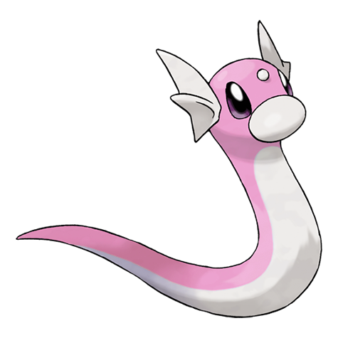
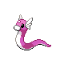
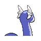
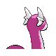

# #147 Dratini (Dragon Pokémon)

| Official Artwork | Shiny Artwork |
|------------------|---------------|
|  |  |

**Sacred Gold:** It is born large to start with. It repeatedly sheds its skin as it steadily grows longer.

**Storm Silver:** This Pokémon is full of life energy. It continually sheds its skin and grows steadily larger.

---

## Media

### Default Sprites

| Front | Shiny | Back | Shiny |
|-------|-------|------|-------|
|  |  |  |  |

### Female Sprites

| Front | Shiny | Back | Shiny |
|-------|-------|------|-------|
| ? | ? | ? | ? |

### Cries

Latest (Gen VI+):

<audio controls>
<source src='../../assets/cries/dratini/latest.ogg' type='audio/ogg'>
  Your browser does not support the audio element.
</audio>

Legacy:

<audio controls>
<source src='../../assets/cries/dratini/legacy.ogg' type='audio/ogg'>
  Your browser does not support the audio element.
</audio>

---

## Pokédex Data

| National № | Type(s) | Height | Weight | Abilities | Local № |
|------------|---------|--------|--------|-----------|---------|
| #147 | {: width="48"} | 1.8 m / 5.9 ft | 3.3 kg / 7.3 lbs | 1. Shed Skin 2. Marvel Scale | N/A |

---

## Base Stats
|   | HP | Attack | Defense | Sp. Atk | Sp. Def | Speed |
|---|----|--------|---------|---------|---------|-------|
| **Base** | 41 | 64 | 45 | 50 | 50 | 50 |
| **Min** | 192 | 119 | 85 | 94 | 94 | 94 |
| **Max** | 286 | 249 | 207 | 218 | 218 | 218 |

The ranges shown above are for a level 100 Pokémon. Maximum values are based on a beneficial nature, 252 EVs, 31 IVs; minimum values are based on a hindering nature, 0 EVs, 0 IVs.

---

## Forms & Evolutions

!!! warning "WARNING"

    Information on evolutions may not be 100% accurate; differences between evolution methods across generations are not accounted for.

### Forms

Dratini has no alternate forms.

### Evolution Line

1. [Dratini](dratini.md/)
    1. Level Up: [Dragonair](dragonair.md/)
        1. Level Up: [Dragonite](dragonite.md/)

---

## Training

| EV Yield | Catch Rate | Base Friendship | Base Exp. | Growth Rate | Held Items |
|----------|------------|-----------------|-----------|-------------|------------|
| 1 Attack | 45 | 35 | 60 | Slow | Dragon Scale (5%) |

---

## Breeding

| Egg Groups | Egg Cycles | Gender | Dimorphic | Color | Shape |
|------------|------------|--------|-----------|-------|-------|
| 1. Water1 2. Dragon | 40 | 50.0% Male 50.0% Female | False | Blue | Squiggle |

---

## Moves

!!! warning "WARNING"

    Specific move information may be incorrect. However, the general movepool should be accurate; this includes changes made in Sacred Gold and Storm Silver.

### Level Up Moves

| Lv. | Move | Type | Cat. | Power | Acc. | PP |
| --- | --- | --- | --- | --- | --- | --- |
| 1 | Leer | {: width="48"} | {: width="36"} | — | 100 | 30 |
| 1 | Wrap | {: width="48"} | {: width="36"} | 15 | 90 | 20 |
| 5 | Thunder Wave | {: width="48"} | {: width="36"} | — | 90 | 20 |
| 11 | Twister | {: width="48"} | {: width="36"} | 40 | 100 | 20 |
| 15 | Dragon Rage | {: width="48"} | {: width="36"} | — | 100 | 10 |
| 21 | Slam | {: width="48"} | {: width="36"} | 80 | 75 | 20 |
| 25 | Agility | {: width="48"} | {: width="36"} | — | — | 30 |
| 31 | Aqua Tail | {: width="48"} | {: width="36"} | 90 | 90 | 10 |
| 35 | Dragon Rush | {: width="48"} | {: width="36"} | 100 | 75 | 10 |
| 41 | Safeguard | {: width="48"} | {: width="36"} | — | — | 25 |
| 45 | Dragon Dance | {: width="48"} | {: width="36"} | — | — | 20 |
| 51 | Outrage | {: width="48"} | {: width="36"} | 120 | 100 | 10 |
| 55 | Hyper Beam | {: width="48"} | {: width="36"} | 150 | 90 | 5 |

### TM Moves

| TM | Move | Type | Cat. | Power | Acc. | PP |
| --- | --- | --- | --- | --- | --- | --- |
| HM03 | Surf | {: width="48"} | {: width="36"} | 90 | 100 | 15 |
| HM05 | Whirlpool | {: width="48"} | {: width="36"} | 35 | 85 | 15 |
| HM07 | Waterfall | {: width="48"} | {: width="36"} | 80 | 100 | 15 |
| TM03 | Water Pulse | {: width="48"} | {: width="36"} | 60 | 100 | 20 |
| TM06 | Toxic | {: width="48"} | {: width="36"} | — | 90 | 10 |
| TM07 | Hail | {: width="48"} | {: width="36"} | — | — | 10 |
| TM10 | Hidden Power | {: width="48"} | {: width="36"} | 60 | 100 | 15 |
| TM11 | Sunny Day | {: width="48"} | {: width="36"} | — | — | 5 |
| TM13 | Ice Beam | {: width="48"} | {: width="36"} | 90 | 100 | 10 |
| TM14 | Blizzard | {: width="48"} | {: width="36"} | 110 | 70 | 5 |
| TM15 | Hyper Beam | {: width="48"} | {: width="36"} | 150 | 90 | 5 |
| TM17 | Protect | {: width="48"} | {: width="36"} | — | — | 10 |
| TM18 | Rain Dance | {: width="48"} | {: width="36"} | — | — | 5 |
| TM20 | Safeguard | {: width="48"} | {: width="36"} | — | — | 25 |
| TM21 | Frustration | {: width="48"} | {: width="36"} | — | 100 | 20 |
| TM23 | Iron Tail | {: width="48"} | {: width="36"} | 100 | 75 | 15 |
| TM24 | Thunderbolt | {: width="48"} | {: width="36"} | 90 | 100 | 15 |
| TM25 | Thunder | {: width="48"} | {: width="36"} | 110 | 70 | 10 |
| TM27 | Return | {: width="48"} | {: width="36"} | — | 100 | 20 |
| TM32 | Double Team | {: width="48"} | {: width="36"} | — | — | 15 |
| TM34 | Shock Wave | {: width="48"} | {: width="36"} | 60 | — | 20 |
| TM35 | Flamethrower | {: width="48"} | {: width="36"} | 90 | 100 | 15 |
| TM38 | Fire Blast | {: width="48"} | {: width="36"} | 110 | 85 | 5 |
| TM42 | Facade | {: width="48"} | {: width="36"} | 70 | 100 | 20 |
| TM43 | Secret Power | {: width="48"} | {: width="36"} | 70 | 100 | 20 |
| TM44 | Rest | {: width="48"} | {: width="36"} | — | — | 5 |
| TM45 | Attract | {: width="48"} | {: width="36"} | — | 100 | 15 |
| TM58 | Endure | {: width="48"} | {: width="36"} | — | — | 10 |
| TM59 | Dragon Pulse | {: width="48"} | {: width="36"} | 85 | 100 | 10 |
| TM73 | Thunder Wave | {: width="48"} | {: width="36"} | — | 90 | 20 |
| TM78 | Captivate | {: width="48"} | {: width="36"} | — | 100 | 20 |
| TM82 | Sleep Talk | {: width="48"} | {: width="36"} | — | — | 10 |
| TM83 | Natural Gift | {: width="48"} | {: width="36"} | — | 100 | 15 |
| TM87 | Swagger | {: width="48"} | {: width="36"} | — | 85 | 15 |
| TM90 | Substitute | {: width="48"} | {: width="36"} | — | — | 10 |

### Egg Moves

| Move | Type | Cat. | Power | Acc. | PP |
| --- | --- | --- | --- | --- | --- |
| Supersonic | {: width="48"} | {: width="36"} | — | 55 | 20 |
| Mist | {: width="48"} | {: width="36"} | — | — | 30 |
| Light Screen | {: width="48"} | {: width="36"} | — | — | 30 |
| Haze | {: width="48"} | {: width="36"} | — | — | 30 |
| Dragon Breath | {: width="48"} | {: width="36"} | 60 | 100 | 20 |
| Extreme Speed | {: width="48"} | {: width="36"} | 80 | 100 | 5 |
| Dragon Dance | {: width="48"} | {: width="36"} | — | — | 20 |
| Dragon Rush | {: width="48"} | {: width="36"} | 100 | 75 | 10 |

### Tutor Moves

| Move | Type | Cat. | Power | Acc. | PP |
| --- | --- | --- | --- | --- | --- |
| Headbutt | {: width="48"} | {: width="36"} | 70 | 100 | 15 |
| Swift | {: width="48"} | {: width="36"} | 60 | — | 20 |
| Snore | {: width="48"} | {: width="36"} | 50 | 100 | 15 |
| Icy Wind | {: width="48"} | {: width="36"} | 55 | 95 | 15 |
| Outrage | {: width="48"} | {: width="36"} | 120 | 100 | 10 |
| Twister | {: width="48"} | {: width="36"} | 40 | 100 | 20 |
| Aqua Tail | {: width="48"} | {: width="36"} | 90 | 90 | 10 |
| Draco Meteor | {: width="48"} | {: width="36"} | 130 | 90 | 5 |

