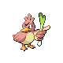
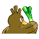
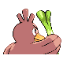

# #083 Farfetchd (Wild Duck Pokémon)

| Official Artwork | Shiny Artwork |
|------------------|---------------|
|  |  |

**Sacred Gold:** If anyone tries to disturb where the essential plant stalks grow, it uses its own stalk to thwart them.

**Storm Silver:** If it eats the plant stalk it carries as emergency rations, it runs off in search of a new stalk.

---

## Media

### Default Sprites

| Front | Shiny | Back | Shiny |
|-------|-------|------|-------|
|  |  |  |  |

### Cries

Latest (Gen VI+):

<audio controls>
<source src='../../assets/cries/farfetchd/latest.ogg' type='audio/ogg'>
  Your browser does not support the audio element.
</audio>

Legacy:

<audio controls>
<source src='../../assets/cries/farfetchd/legacy.ogg' type='audio/ogg'>
  Your browser does not support the audio element.
</audio>

---

## Pokédex Data

| National № | Type(s) | Height | Weight | Abilities | Local № |
|------------|---------|--------|--------|-----------|---------|
| #83 | {: width="48"} {: width="48"} | 0.8 m / 2.6 ft | 15.0 kg / 33.1 lbs | 1. Super Luck 2. Inner Focus | N/A |

---

## Base Stats
|   | HP | Attack | Defense | Sp. Atk | Sp. Def | Speed |
|---|----|--------|---------|---------|---------|-------|
| **Base** | 55 | 110 | 55 | 60 | 65 | 105 |
| **Min** | 220 | 202 | 103 | 112 | 121 | 193 |
| **Max** | 314 | 350 | 229 | 240 | 251 | 339 |

The ranges shown above are for a level 100 Pokémon. Maximum values are based on a beneficial nature, 252 EVs, 31 IVs; minimum values are based on a hindering nature, 0 EVs, 0 IVs.

---

## Forms & Evolutions

!!! warning "WARNING"

    Information on evolutions may not be 100% accurate; differences between evolution methods across generations are not accounted for.

### Forms

Farfetchd has no alternate forms.

### Evolution Line

1. [Farfetchd](farfetchd.md/)

---

## Training

| EV Yield | Catch Rate | Base Friendship | Base Exp. | Growth Rate | Held Items |
|----------|------------|-----------------|-----------|-------------|------------|
| 1 Attack | 45 | 50 | 144 | Medium | Stick (5%) |

---

## Breeding

| Egg Groups | Egg Cycles | Gender | Dimorphic | Color | Shape |
|------------|------------|--------|-----------|-------|-------|
| 1. Flying 2. Ground | 20 | 50.0% Male 50.0% Female | False | Brown | Wings |

---

## Moves

!!! warning "WARNING"

    Specific move information may be incorrect. However, the general movepool should be accurate; this includes changes made in Sacred Gold and Storm Silver.

### Level Up Moves

| Lv. | Move | Type | Cat. | Power | Acc. | PP |
| --- | --- | --- | --- | --- | --- | --- |
| 1 | Leer | {: width="48"} | {: width="36"} | — | 100 | 30 |
| 1 | Peck | {: width="48"} | {: width="36"} | 35 | 100 | 35 |
| 1 | Sand Attack | {: width="48"} | {: width="36"} | — | 100 | 15 |
| 4 | Fury Cutter | {: width="48"} | {: width="36"} | 40 | 95 | 20 |
| 7 | Fury Attack | {: width="48"} | {: width="36"} | 15 | 85 | 20 |
| 10 | Knock Off | {: width="48"} | {: width="36"} | 65 | 100 | 20 |
| 13 | Aerial Ace | {: width="48"} | {: width="36"} | 60 | — | 20 |
| 16 | Slash | {: width="48"} | {: width="36"} | 70 | 100 | 20 |
| 19 | Revenge | {: width="48"} | {: width="36"} | 60 | 100 | 10 |
| 21 | Air Cutter | {: width="48"} | {: width="36"} | 60 | 95 | 25 |
| 22 | Swords Dance | {: width="48"} | {: width="36"} | — | — | 20 |
| 25 | Agility | {: width="48"} | {: width="36"} | — | — | 30 |
| 28 | Close Combat | {: width="48"} | {: width="36"} | 120 | 100 | 5 |
| 31 | Night Slash | {: width="48"} | {: width="36"} | 70 | 100 | 15 |
| 34 | False Swipe | {: width="48"} | {: width="36"} | 40 | 100 | 40 |
| 37 | Poison Jab | {: width="48"} | {: width="36"} | 80 | 100 | 20 |
| 40 | Psycho Cut | {: width="48"} | {: width="36"} | 70 | 100 | 20 |
| 43 | Leaf Blade | {: width="48"} | {: width="36"} | 90 | 100 | 15 |
| 46 | Brave Bird | {: width="48"} | {: width="36"} | 120 | 100 | 15 |
| 49 | Air Slash | {: width="48"} | {: width="36"} | 75 | 95 | 15 |

### TM Moves

| TM | Move | Type | Cat. | Power | Acc. | PP |
| --- | --- | --- | --- | --- | --- | --- |
| HM01 | Cut | {: width="48"} | {: width="36"} | 60 | 95 | 30 |
| HM02 | Fly | {: width="48"} | {: width="36"} | 90 | 95 | 15 |
| TM06 | Toxic | {: width="48"} | {: width="36"} | — | 90 | 10 |
| TM10 | Hidden Power | {: width="48"} | {: width="36"} | 60 | 100 | 15 |
| TM11 | Sunny Day | {: width="48"} | {: width="36"} | — | — | 5 |
| TM17 | Protect | {: width="48"} | {: width="36"} | — | — | 10 |
| TM21 | Frustration | {: width="48"} | {: width="36"} | — | 100 | 20 |
| TM27 | Return | {: width="48"} | {: width="36"} | — | 100 | 20 |
| TM31 | Brick Break | {: width="48"} | {: width="36"} | 75 | 100 | 15 |
| TM32 | Double Team | {: width="48"} | {: width="36"} | — | — | 15 |
| TM40 | Aerial Ace | {: width="48"} | {: width="36"} | 60 | — | 20 |
| TM42 | Facade | {: width="48"} | {: width="36"} | 70 | 100 | 20 |
| TM44 | Rest | {: width="48"} | {: width="36"} | — | — | 5 |
| TM45 | Attract | {: width="48"} | {: width="36"} | — | 100 | 15 |
| TM46 | Thief | {: width="48"} | {: width="36"} | 60 | 100 | 25 |
| TM48 | Round | {: width="48"} | {: width="36"} | 60 | 100 | 15 |
| TM54 | False Swipe | {: width="48"} | {: width="36"} | 40 | 100 | 40 |
| TM62 | Acrobatics | {: width="48"} | {: width="36"} | 55 | 100 | 15 |
| TM67 | Retaliate | {: width="48"} | {: width="36"} | 70 | 100 | 5 |
| TM75 | Swords Dance | {: width="48"} | {: width="36"} | — | — | 20 |
| TM77 | Psych Up | {: width="48"} | {: width="36"} | — | — | 10 |
| TM83 | Work Up | {: width="48"} | {: width="36"} | — | — | 30 |
| TM84 | Poison Jab | {: width="48"} | {: width="36"} | 80 | 100 | 20 |
| TM87 | Swagger | {: width="48"} | {: width="36"} | — | 85 | 15 |
| TM88 | Pluck | {: width="48"} | {: width="36"} | 60 | 100 | 20 |
| TM89 | U Turn | {: width="48"} | {: width="36"} | 70 | 100 | 20 |
| TM90 | Substitute | {: width="48"} | {: width="36"} | — | — | 10 |

### Egg Moves

| Move | Type | Cat. | Power | Acc. | PP |
| --- | --- | --- | --- | --- | --- |
| Gust | {: width="48"} | {: width="36"} | 40 | 100 | 35 |
| Quick Attack | {: width="48"} | {: width="36"} | 40 | 100 | 30 |
| Mirror Move | {: width="48"} | {: width="36"} | — | — | 20 |
| Curse | {: width="48"} | {: width="36"} | — | — | 10 |
| Flail | {: width="48"} | {: width="36"} | — | 100 | 15 |
| Mud Slap | {: width="48"} | {: width="36"} | 20 | 100 | 10 |
| Foresight | {: width="48"} | {: width="36"} | — | — | 40 |
| Steel Wing | {: width="48"} | {: width="36"} | 70 | 90 | 25 |
| Revenge | {: width="48"} | {: width="36"} | 60 | 100 | 10 |
| Feather Dance | {: width="48"} | {: width="36"} | — | 100 | 15 |
| Covet | {: width="48"} | {: width="36"} | 60 | 100 | 25 |
| Leaf Blade | {: width="48"} | {: width="36"} | 90 | 100 | 15 |
| Roost | {: width="48"} | {: width="36"} | — | — | 5 |
| Trump Card | {: width="48"} | {: width="36"} | — | — | 5 |
| Night Slash | {: width="48"} | {: width="36"} | 70 | 100 | 15 |

### Tutor Moves

Farfetchd cannot learn any moves from tutors.
