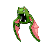
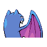
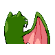
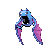
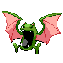
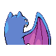
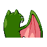

# #042 Golbat (Bat Pokémon)

| Official Artwork | Shiny Artwork |
|------------------|---------------|
|  |  |

**Sacred Gold:** However hard its victim’s hide may be, it punctures with sharp fangs and gorges itself with blood.

**Storm Silver:** It can drink more than 10 ounces of blood at once. If it has too much, it gets heavy and flies clumsily.

---

## Media

### Default Sprites

| Front | Shiny | Back | Shiny |
|-------|-------|------|-------|
|  |  |  |  |

### Female Sprites

| Front | Shiny | Back | Shiny |
|-------|-------|------|-------|
|  |  |  |  |

### Cries

Latest (Gen VI+):

<audio controls>
<source src='../../assets/cries/golbat/latest.ogg' type='audio/ogg'>
  Your browser does not support the audio element.
</audio>

Legacy:

<audio controls>
<source src='../../assets/cries/golbat/legacy.ogg' type='audio/ogg'>
  Your browser does not support the audio element.
</audio>

---

## Pokédex Data

| National № | Type(s) | Height | Weight | Abilities | Local № |
|------------|---------|--------|--------|-----------|---------|
| #42 | {: width="48"} {: width="48"} | 1.6 m / 5.2 ft | 55.0 kg / 121.3 lbs | 1. Inner Focus 2. Infiltrator | #29 |

---

## Base Stats
|   | HP | Attack | Defense | Sp. Atk | Sp. Def | Speed |
|---|----|--------|---------|---------|---------|-------|
| **Base** | 75 | 80 | 70 | 65 | 75 | 90 |
| **Min** | 260 | 148 | 130 | 121 | 139 | 166 |
| **Max** | 354 | 284 | 262 | 251 | 273 | 306 |

The ranges shown above are for a level 100 Pokémon. Maximum values are based on a beneficial nature, 252 EVs, 31 IVs; minimum values are based on a hindering nature, 0 EVs, 0 IVs.

---

## Forms & Evolutions

!!! warning "WARNING"

    Information on evolutions may not be 100% accurate; differences between evolution methods across generations are not accounted for.

### Forms

Golbat has no alternate forms.

### Evolution Line

1. [Zubat](zubat.md/)
    1. Level Up: [Golbat](golbat.md/)
        1. Level Up: [Crobat](crobat.md/)

---

## Training

| EV Yield | Catch Rate | Base Friendship | Base Exp. | Growth Rate | Held Items |
|----------|------------|-----------------|-----------|-------------|------------|
| 2 Speed | 90 | 50 | 159 | Medium | N/A |

---

## Breeding

| Egg Groups | Egg Cycles | Gender | Dimorphic | Color | Shape |
|------------|------------|--------|-----------|-------|-------|
| 1. Flying | 15 | 50.0% Male 50.0% Female | True | Purple | Wings |

---

## Moves

!!! warning "WARNING"

    Specific move information may be incorrect. However, the general movepool should be accurate; this includes changes made in Sacred Gold and Storm Silver.

### Level Up Moves

| Lv. | Move | Type | Cat. | Power | Acc. | PP |
| --- | --- | --- | --- | --- | --- | --- |
| 1 | Astonish | {: width="48"} | {: width="36"} | 30 | 100 | 15 |
| 1 | Leech Life | {: width="48"} | {: width="36"} | 80 | 100 | 10 |
| 1 | Screech | {: width="48"} | {: width="36"} | — | 85 | 40 |
| 1 | Supersonic | {: width="48"} | {: width="36"} | — | 55 | 20 |
| 1 | Wing Attack | {: width="48"} | {: width="36"} | 60 | 100 | 35 |
| 5 | Supersonic | {: width="48"} | {: width="36"} | — | 55 | 20 |
| 9 | Astonish | {: width="48"} | {: width="36"} | 30 | 100 | 15 |
| 13 | Bite | {: width="48"} | {: width="36"} | 60 | 100 | 25 |
| 17 | Hypnosis | {: width="48"} | {: width="36"} | — | 60 | 20 |
| 21 | Confuse Ray | {: width="48"} | {: width="36"} | — | 100 | 10 |
| 27 | Air Cutter | {: width="48"} | {: width="36"} | 60 | 95 | 25 |
| 33 | Mean Look | {: width="48"} | {: width="36"} | — | — | 5 |
| 39 | Poison Fang | {: width="48"} | {: width="36"} | 50 | 100 | 15 |
| 45 | Haze | {: width="48"} | {: width="36"} | — | — | 30 |
| 51 | Air Slash | {: width="48"} | {: width="36"} | 75 | 95 | 15 |
| 57 | Nasty Plot | {: width="48"} | {: width="36"} | — | — | 20 |
| 63 | Brave Bird | {: width="48"} | {: width="36"} | 120 | 100 | 15 |

### TM Moves

| TM | Move | Type | Cat. | Power | Acc. | PP |
| --- | --- | --- | --- | --- | --- | --- |
| HM02 | Fly | {: width="48"} | {: width="36"} | 90 | 95 | 15 |
| TM06 | Toxic | {: width="48"} | {: width="36"} | — | 90 | 10 |
| TM10 | Hidden Power | {: width="48"} | {: width="36"} | 60 | 100 | 15 |
| TM11 | Sunny Day | {: width="48"} | {: width="36"} | — | — | 5 |
| TM12 | Taunt | {: width="48"} | {: width="36"} | — | 100 | 20 |
| TM15 | Hyper Beam | {: width="48"} | {: width="36"} | 150 | 90 | 5 |
| TM17 | Protect | {: width="48"} | {: width="36"} | — | — | 10 |
| TM18 | Rain Dance | {: width="48"} | {: width="36"} | — | — | 5 |
| TM19 | Giga Drain | {: width="48"} | {: width="36"} | 75 | 100 | 10 |
| TM21 | Frustration | {: width="48"} | {: width="36"} | — | 100 | 20 |
| TM27 | Return | {: width="48"} | {: width="36"} | — | 100 | 20 |
| TM30 | Shadow Ball | {: width="48"} | {: width="36"} | 80 | 100 | 15 |
| TM32 | Double Team | {: width="48"} | {: width="36"} | — | — | 15 |
| TM36 | Sludge Bomb | {: width="48"} | {: width="36"} | 90 | 100 | 10 |
| TM40 | Aerial Ace | {: width="48"} | {: width="36"} | 60 | — | 20 |
| TM41 | Torment | {: width="48"} | {: width="36"} | — | 100 | 15 |
| TM42 | Facade | {: width="48"} | {: width="36"} | 70 | 100 | 20 |
| TM43 | Secret Power | {: width="48"} | {: width="36"} | 70 | 100 | 20 |
| TM44 | Rest | {: width="48"} | {: width="36"} | — | — | 5 |
| TM45 | Attract | {: width="48"} | {: width="36"} | — | 100 | 15 |
| TM46 | Thief | {: width="48"} | {: width="36"} | 60 | 100 | 25 |
| TM47 | Steel Wing | {: width="48"} | {: width="36"} | 70 | 90 | 25 |
| TM49 | Snatch | {: width="48"} | {: width="36"} | — | — | 10 |
| TM51 | Roost | {: width="48"} | {: width="36"} | — | — | 5 |
| TM58 | Endure | {: width="48"} | {: width="36"} | — | — | 10 |
| TM66 | Payback | {: width="48"} | {: width="36"} | 50 | 100 | 10 |
| TM68 | Giga Impact | {: width="48"} | {: width="36"} | 150 | 90 | 5 |
| TM78 | Captivate | {: width="48"} | {: width="36"} | — | 100 | 20 |
| TM82 | Sleep Talk | {: width="48"} | {: width="36"} | — | — | 10 |
| TM83 | Natural Gift | {: width="48"} | {: width="36"} | — | 100 | 15 |
| TM87 | Swagger | {: width="48"} | {: width="36"} | — | 85 | 15 |
| TM88 | Pluck | {: width="48"} | {: width="36"} | 60 | 100 | 20 |
| TM89 | U Turn | {: width="48"} | {: width="36"} | 70 | 100 | 20 |
| TM90 | Substitute | {: width="48"} | {: width="36"} | — | — | 10 |

### Egg Moves

Golbat cannot learn any moves by breeding.
### Tutor Moves

| Move | Type | Cat. | Power | Acc. | PP |
| --- | --- | --- | --- | --- | --- |
| Swift | {: width="48"} | {: width="36"} | 60 | — | 20 |
| Super Fang | {: width="48"} | {: width="36"} | — | 90 | 10 |
| Snore | {: width="48"} | {: width="36"} | 50 | 100 | 15 |
| Twister | {: width="48"} | {: width="36"} | 40 | 100 | 20 |
| Uproar | {: width="48"} | {: width="36"} | 90 | 100 | 10 |
| Heat Wave | {: width="48"} | {: width="36"} | 95 | 90 | 10 |
| Air Cutter | {: width="48"} | {: width="36"} | 60 | 95 | 25 |
| Tailwind | {: width="48"} | {: width="36"} | — | — | 15 |
| Zen Headbutt | {: width="48"} | {: width="36"} | 80 | 90 | 15 |
| Ominous Wind | {: width="48"} | {: width="36"} | 60 | 100 | 5 |

