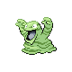
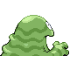

# #088 Grimer (Sludge Pokémon)

| Official Artwork | Shiny Artwork |
|------------------|---------------|
|  |  |

**Sacred Gold:** As it moves, it loses bits of its body, from which new GRIMER emerge. This worsens the stench around it.

**Storm Silver:** Wherever GRIMER has passed, so many germs are left behind that no plants will ever grow again.

---

## Media

### Default Sprites

| Front | Shiny | Back | Shiny |
|-------|-------|------|-------|
|  |  |  |  |

### Cries

Latest (Gen VI+):

<audio controls>
<source src='../../assets/cries/grimer/latest.ogg' type='audio/ogg'>
  Your browser does not support the audio element.
</audio>

Legacy:

<audio controls>
<source src='../../assets/cries/grimer/legacy.ogg' type='audio/ogg'>
  Your browser does not support the audio element.
</audio>

---

## Pokédex Data

| National № | Type(s) | Height | Weight | Abilities | Local № |
|------------|---------|--------|--------|-----------|---------|
| #88 | {: width="48"} | 0.9 m / 3.0 ft | 30.0 kg / 66.1 lbs | 1. Stench 2. Sticky Hold | N/A |

---

## Base Stats
|   | HP | Attack | Defense | Sp. Atk | Sp. Def | Speed |
|---|----|--------|---------|---------|---------|-------|
| **Base** | 80 | 80 | 50 | 40 | 50 | 25 |
| **Min** | 270 | 148 | 94 | 76 | 94 | 49 |
| **Max** | 364 | 284 | 218 | 196 | 218 | 163 |

The ranges shown above are for a level 100 Pokémon. Maximum values are based on a beneficial nature, 252 EVs, 31 IVs; minimum values are based on a hindering nature, 0 EVs, 0 IVs.

---

## Forms & Evolutions

!!! warning "WARNING"

    Information on evolutions may not be 100% accurate; differences between evolution methods across generations are not accounted for.

### Forms

Grimer has no alternate forms.

### Evolution Line

1. [Grimer](grimer.md/)
    1. Level Up: [Muk](muk.md/)

---

## Training

| EV Yield | Catch Rate | Base Friendship | Base Exp. | Growth Rate | Held Items |
|----------|------------|-----------------|-----------|-------------|------------|
| 1 Hp | 190 | 70 | 65 | Medium | Nugget (5%) |

---

## Breeding

| Egg Groups | Egg Cycles | Gender | Dimorphic | Color | Shape |
|------------|------------|--------|-----------|-------|-------|
| 1. Indeterminate | 20 | 50.0% Male 50.0% Female | False | Purple | Arms |

---

## Moves

!!! warning "WARNING"

    Specific move information may be incorrect. However, the general movepool should be accurate; this includes changes made in Sacred Gold and Storm Silver.

### Level Up Moves

| Lv. | Move | Type | Cat. | Power | Acc. | PP |
| --- | --- | --- | --- | --- | --- | --- |
| 1 | Poison Gas | {: width="48"} | {: width="36"} | — | 90 | 40 |
| 1 | Pound | {: width="48"} | {: width="36"} | 40 | 100 | 35 |
| 4 | Harden | {: width="48"} | {: width="36"} | — | — | 30 |
| 7 | Mud Slap | {: width="48"} | {: width="36"} | 20 | 100 | 10 |
| 12 | Disable | {: width="48"} | {: width="36"} | — | 100 | 20 |
| 17 | Minimize | {: width="48"} | {: width="36"} | — | — | 10 |
| 20 | Sludge | {: width="48"} | {: width="36"} | 65 | 100 | 20 |
| 23 | Mud Bomb | {: width="48"} | {: width="36"} | 65 | 85 | 10 |
| 28 | Fling | {: width="48"} | {: width="36"} | — | 100 | 10 |
| 33 | Screech | {: width="48"} | {: width="36"} | — | 85 | 40 |
| 36 | Sludge Bomb | {: width="48"} | {: width="36"} | 90 | 100 | 10 |
| 39 | Acid Armor | {: width="48"} | {: width="36"} | — | — | 20 |
| 44 | Sludge Wave | {: width="48"} | {: width="36"} | 95 | 100 | 10 |
| 49 | Gunk Shot | {: width="48"} | {: width="36"} | 120 | 80 | 5 |
| 52 | Memento | {: width="48"} | {: width="36"} | — | 100 | 10 |
| 54 | Curse | {: width="48"} | {: width="36"} | — | — | 10 |

### TM Moves

| TM | Move | Type | Cat. | Power | Acc. | PP |
| --- | --- | --- | --- | --- | --- | --- |
| HM04 | Strength | {: width="48"} | {: width="36"} | 60 | 100 | 15 |
| TM06 | Toxic | {: width="48"} | {: width="36"} | — | 90 | 10 |
| TM09 | Venoshock | {: width="48"} | {: width="36"} | 65 | 100 | 10 |
| TM10 | Hidden Power | {: width="48"} | {: width="36"} | 60 | 100 | 15 |
| TM11 | Sunny Day | {: width="48"} | {: width="36"} | — | — | 5 |
| TM12 | Taunt | {: width="48"} | {: width="36"} | — | 100 | 20 |
| TM17 | Protect | {: width="48"} | {: width="36"} | — | — | 10 |
| TM18 | Rain Dance | {: width="48"} | {: width="36"} | — | — | 5 |
| TM21 | Frustration | {: width="48"} | {: width="36"} | — | 100 | 20 |
| TM24 | Thunderbolt | {: width="48"} | {: width="36"} | 90 | 100 | 15 |
| TM25 | Thunder | {: width="48"} | {: width="36"} | 110 | 70 | 10 |
| TM27 | Return | {: width="48"} | {: width="36"} | — | 100 | 20 |
| TM28 | Dig | {: width="48"} | {: width="36"} | 80 | 100 | 10 |
| TM30 | Shadow Ball | {: width="48"} | {: width="36"} | 80 | 100 | 15 |
| TM32 | Double Team | {: width="48"} | {: width="36"} | — | — | 15 |
| TM34 | Sludge Wave | {: width="48"} | {: width="36"} | 95 | 100 | 10 |
| TM35 | Flamethrower | {: width="48"} | {: width="36"} | 90 | 100 | 15 |
| TM36 | Sludge Bomb | {: width="48"} | {: width="36"} | 90 | 100 | 10 |
| TM38 | Fire Blast | {: width="48"} | {: width="36"} | 110 | 85 | 5 |
| TM39 | Rock Tomb | {: width="48"} | {: width="36"} | 60 | 95 | 15 |
| TM41 | Torment | {: width="48"} | {: width="36"} | — | 100 | 15 |
| TM42 | Facade | {: width="48"} | {: width="36"} | 70 | 100 | 20 |
| TM44 | Rest | {: width="48"} | {: width="36"} | — | — | 5 |
| TM45 | Attract | {: width="48"} | {: width="36"} | — | 100 | 15 |
| TM46 | Thief | {: width="48"} | {: width="36"} | 60 | 100 | 25 |
| TM48 | Round | {: width="48"} | {: width="36"} | 60 | 100 | 15 |
| TM56 | Fling | {: width="48"} | {: width="36"} | — | 100 | 10 |
| TM59 | Incinerate | {: width="48"} | {: width="36"} | 60 | 100 | 15 |
| TM64 | Explosion | {: width="48"} | {: width="36"} | 250 | 100 | 5 |
| TM66 | Payback | {: width="48"} | {: width="36"} | 50 | 100 | 10 |
| TM80 | Rock Slide | {: width="48"} | {: width="36"} | 75 | 90 | 10 |
| TM84 | Poison Jab | {: width="48"} | {: width="36"} | 80 | 100 | 20 |
| TM87 | Swagger | {: width="48"} | {: width="36"} | — | 85 | 15 |
| TM90 | Substitute | {: width="48"} | {: width="36"} | — | — | 10 |

### Egg Moves

| Move | Type | Cat. | Power | Acc. | PP |
| --- | --- | --- | --- | --- | --- |
| Haze | {: width="48"} | {: width="36"} | — | — | 30 |
| Lick | {: width="48"} | {: width="36"} | 30 | 100 | 30 |
| Curse | {: width="48"} | {: width="36"} | — | — | 10 |
| Scary Face | {: width="48"} | {: width="36"} | — | 100 | 10 |
| Mean Look | {: width="48"} | {: width="36"} | — | — | 5 |
| Stockpile | {: width="48"} | {: width="36"} | — | — | 20 |
| Spit Up | {: width="48"} | {: width="36"} | — | 100 | 10 |
| Swallow | {: width="48"} | {: width="36"} | — | — | 10 |
| Imprison | {: width="48"} | {: width="36"} | — | — | 10 |
| Shadow Punch | {: width="48"} | {: width="36"} | 60 | — | 20 |
| Shadow Sneak | {: width="48"} | {: width="36"} | 40 | 100 | 30 |
| Acid Spray | {: width="48"} | {: width="36"} | 40 | 100 | 20 |

### Tutor Moves

Grimer cannot learn any moves from tutors.
