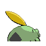

# #316 Gulpin (Stomach Pokémon)

| Official Artwork | Shiny Artwork |
|------------------|---------------|
|  |  |

It has a small heart and brain. Its stomach comprises most of its body, with enzymes to dissolve anything.

---

## Media

### Default Sprites

| Front | Shiny | Back | Shiny |
|-------|-------|------|-------|
|  |  |  |  |

### Female Sprites

| Front | Shiny | Back | Shiny |
|-------|-------|------|-------|
|  |  |  |  |

### Cries

Latest (Gen VI+):

<audio controls>
<source src='../../assets/cries/gulpin/latest.ogg' type='audio/ogg'>
  Your browser does not support the audio element.
</audio>

Legacy:

<audio controls>
<source src='../../assets/cries/gulpin/legacy.ogg' type='audio/ogg'>
  Your browser does not support the audio element.
</audio>

---

## Pokédex Data

| National № | Type(s) | Height | Weight | Abilities | Local № |
|------------|---------|--------|--------|-----------|---------|
| #316 | {: width="48"} | 0.4 m / 1.3 ft | 10.3 kg / 22.7 lbs | 1. Liquid Ooze 2. Sticky Hold 3. Gluttony | N/A |

---

## Base Stats
|   | HP | Attack | Defense | Sp. Atk | Sp. Def | Speed |
|---|----|--------|---------|---------|---------|-------|
| **Base** | 70 | 43 | 53 | 43 | 53 | 40 |
| **Min** | 250 | 81 | 99 | 81 | 99 | 76 |
| **Max** | 344 | 203 | 225 | 203 | 225 | 196 |

The ranges shown above are for a level 100 Pokémon. Maximum values are based on a beneficial nature, 252 EVs, 31 IVs; minimum values are based on a hindering nature, 0 EVs, 0 IVs.

---

## Forms & Evolutions

!!! warning "WARNING"

    Information on evolutions may not be 100% accurate; differences between evolution methods across generations are not accounted for.

### Forms

Gulpin has no alternate forms.

### Evolution Line

1. [Gulpin](gulpin.md/)
    1. Level Up: [Swalot](swalot.md/)

---

## Training

| EV Yield | Catch Rate | Base Friendship | Base Exp. | Growth Rate | Held Items |
|----------|------------|-----------------|-----------|-------------|------------|
| 1 Hp | 225 | 70 | 60 | Fast Then Very Slow | Big Pearl (5%) |

---

## Breeding

| Egg Groups | Egg Cycles | Gender | Dimorphic | Color | Shape |
|------------|------------|--------|-----------|-------|-------|
| 1. Indeterminate | 20 | 50.0% Male 50.0% Female | True | Green | Arms |

---

## Moves

!!! warning "WARNING"

    Specific move information may be incorrect. However, the general movepool should be accurate; this includes changes made in Sacred Gold and Storm Silver.

### Level Up Moves

| Lv. | Move | Type | Cat. | Power | Acc. | PP |
| --- | --- | --- | --- | --- | --- | --- |
| 1 | Pound | {: width="48"} | {: width="36"} | 40 | 100 | 35 |
| 6 | Yawn | {: width="48"} | {: width="36"} | — | — | 10 |
| 9 | Poison Gas | {: width="48"} | {: width="36"} | — | 90 | 40 |
| 14 | Sludge | {: width="48"} | {: width="36"} | 65 | 100 | 20 |
| 17 | Amnesia | {: width="48"} | {: width="36"} | — | — | 20 |
| 23 | Encore | {: width="48"} | {: width="36"} | — | 100 | 5 |
| 28 | Toxic | {: width="48"} | {: width="36"} | — | 90 | 10 |
| 34 | Acid Spray | {: width="48"} | {: width="36"} | 40 | 100 | 20 |
| 39 | Spit Up | {: width="48"} | {: width="36"} | — | 100 | 10 |
| 39 | Stockpile | {: width="48"} | {: width="36"} | — | — | 20 |
| 39 | Swallow | {: width="48"} | {: width="36"} | — | — | 10 |
| 44 | Sludge Bomb | {: width="48"} | {: width="36"} | 90 | 100 | 10 |
| 49 | Gastro Acid | {: width="48"} | {: width="36"} | — | 100 | 10 |
| 54 | Wring Out | {: width="48"} | {: width="36"} | — | 100 | 5 |
| 59 | Gunk Shot | {: width="48"} | {: width="36"} | 120 | 80 | 5 |

### TM Moves

| TM | Move | Type | Cat. | Power | Acc. | PP |
| --- | --- | --- | --- | --- | --- | --- |
| HM04 | Strength | {: width="48"} | {: width="36"} | 60 | 100 | 15 |
| TM06 | Toxic | {: width="48"} | {: width="36"} | — | 90 | 10 |
| TM09 | Venoshock | {: width="48"} | {: width="36"} | 65 | 100 | 10 |
| TM10 | Hidden Power | {: width="48"} | {: width="36"} | 60 | 100 | 15 |
| TM11 | Sunny Day | {: width="48"} | {: width="36"} | — | — | 5 |
| TM13 | Ice Beam | {: width="48"} | {: width="36"} | 90 | 100 | 10 |
| TM17 | Protect | {: width="48"} | {: width="36"} | — | — | 10 |
| TM18 | Rain Dance | {: width="48"} | {: width="36"} | — | — | 5 |
| TM21 | Frustration | {: width="48"} | {: width="36"} | — | 100 | 20 |
| TM22 | Solar Beam | {: width="48"} | {: width="36"} | 120 | 100 | 10 |
| TM27 | Return | {: width="48"} | {: width="36"} | — | 100 | 20 |
| TM30 | Shadow Ball | {: width="48"} | {: width="36"} | 80 | 100 | 15 |
| TM32 | Double Team | {: width="48"} | {: width="36"} | — | — | 15 |
| TM34 | Sludge Wave | {: width="48"} | {: width="36"} | 95 | 100 | 10 |
| TM36 | Sludge Bomb | {: width="48"} | {: width="36"} | 90 | 100 | 10 |
| TM42 | Facade | {: width="48"} | {: width="36"} | 70 | 100 | 20 |
| TM44 | Rest | {: width="48"} | {: width="36"} | — | — | 5 |
| TM45 | Attract | {: width="48"} | {: width="36"} | — | 100 | 15 |
| TM48 | Round | {: width="48"} | {: width="36"} | 60 | 100 | 15 |
| TM64 | Explosion | {: width="48"} | {: width="36"} | 250 | 100 | 5 |
| TM85 | Dream Eater | {: width="48"} | {: width="36"} | 100 | 100 | 15 |
| TM87 | Swagger | {: width="48"} | {: width="36"} | — | 85 | 15 |
| TM90 | Substitute | {: width="48"} | {: width="36"} | — | — | 10 |
| TM94 | Rock Smash | {: width="48"} | {: width="36"} | 60 | 100 | 15 |

### Egg Moves

| Move | Type | Cat. | Power | Acc. | PP |
| --- | --- | --- | --- | --- | --- |
| Smog | {: width="48"} | {: width="36"} | 30 | 70 | 20 |
| Acid Armor | {: width="48"} | {: width="36"} | — | — | 20 |
| Curse | {: width="48"} | {: width="36"} | — | — | 10 |
| Mud Slap | {: width="48"} | {: width="36"} | 20 | 100 | 10 |
| Destiny Bond | {: width="48"} | {: width="36"} | — | — | 5 |
| Pain Split | {: width="48"} | {: width="36"} | — | — | 20 |
| Gunk Shot | {: width="48"} | {: width="36"} | 120 | 80 | 5 |

### Tutor Moves

Gulpin cannot learn any moves from tutors.
