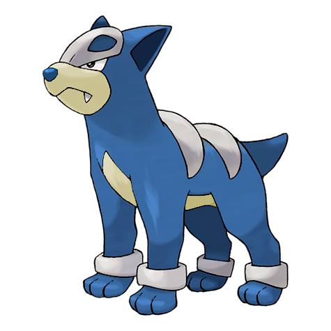
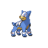
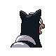
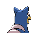

# #228 Houndour (Dark Pokémon)

| Official Artwork | Shiny Artwork |
|------------------|---------------|
|  |  |

**Sacred Gold:** It uses different kinds of cries for communicating with others of its kind and for pursuing its prey.

**Storm Silver:** To corner prey, they check each other’s location using barks that only they can understand.

---

## Media

### Default Sprites

| Front | Shiny | Back | Shiny |
|-------|-------|------|-------|
|  |  |  |  |

### Cries

Latest (Gen VI+):

<audio controls>
<source src='../../assets/cries/houndour/latest.ogg' type='audio/ogg'>
  Your browser does not support the audio element.
</audio>

Legacy:

<audio controls>
<source src='../../assets/cries/houndour/legacy.ogg' type='audio/ogg'>
  Your browser does not support the audio element.
</audio>

---

## Pokédex Data

| National № | Type(s) | Height | Weight | Abilities | Local № |
|------------|---------|--------|--------|-----------|---------|
| #228 | {: width="48"} {: width="48"} | 0.6 m / 2.0 ft | 10.8 kg / 23.8 lbs | 1. Early Bird 2. Flash Fire | N/A |

---

## Base Stats
|   | HP | Attack | Defense | Sp. Atk | Sp. Def | Speed |
|---|----|--------|---------|---------|---------|-------|
| **Base** | 45 | 60 | 30 | 80 | 50 | 65 |
| **Min** | 200 | 112 | 58 | 148 | 94 | 121 |
| **Max** | 294 | 240 | 174 | 284 | 218 | 251 |

The ranges shown above are for a level 100 Pokémon. Maximum values are based on a beneficial nature, 252 EVs, 31 IVs; minimum values are based on a hindering nature, 0 EVs, 0 IVs.

---

## Forms & Evolutions

!!! warning "WARNING"

    Information on evolutions may not be 100% accurate; differences between evolution methods across generations are not accounted for.

### Forms

Houndour has no alternate forms.

### Evolution Line

1. [Houndour](houndour.md/)
    1. Level Up: [Houndoom](houndoom.md/)

---

## Training

| EV Yield | Catch Rate | Base Friendship | Base Exp. | Growth Rate | Held Items |
|----------|------------|-----------------|-----------|-------------|------------|
| 1 Special Attack | 120 | 35 | 66 | Slow | N/A |

---

## Breeding

| Egg Groups | Egg Cycles | Gender | Dimorphic | Color | Shape |
|------------|------------|--------|-----------|-------|-------|
| 1. Ground | 20 | 50.0% Male 50.0% Female | False | Black | Quadruped |

---

## Moves

!!! warning "WARNING"

    Specific move information may be incorrect. However, the general movepool should be accurate; this includes changes made in Sacred Gold and Storm Silver.

### Level Up Moves

| Lv. | Move | Type | Cat. | Power | Acc. | PP |
| --- | --- | --- | --- | --- | --- | --- |
| 1 | Ember | {: width="48"} | {: width="36"} | 40 | 100 | 25 |
| 1 | Leer | {: width="48"} | {: width="36"} | — | 100 | 30 |
| 4 | Howl | {: width="48"} | {: width="36"} | — | — | 40 |
| 9 | Bite | {: width="48"} | {: width="36"} | 60 | 100 | 25 |
| 13 | Roar | {: width="48"} | {: width="36"} | — | — | 20 |
| 17 | Smog | {: width="48"} | {: width="36"} | 30 | 70 | 20 |
| 20 | Odor Sleuth | {: width="48"} | {: width="36"} | — | — | 40 |
| 25 | Beat Up | {: width="48"} | {: width="36"} | — | 100 | 10 |
| 28 | Fire Fang | {: width="48"} | {: width="36"} | 65 | 95 | 15 |
| 32 | Feint Attack | {: width="48"} | {: width="36"} | 60 | — | 20 |
| 37 | Embargo | {: width="48"} | {: width="36"} | — | 100 | 15 |
| 40 | Foul Play | {: width="48"} | {: width="36"} | 95 | 100 | 15 |
| 44 | Flamethrower | {: width="48"} | {: width="36"} | 90 | 100 | 15 |
| 49 | Crunch | {: width="48"} | {: width="36"} | 80 | 100 | 15 |
| 52 | Nasty Plot | {: width="48"} | {: width="36"} | — | — | 20 |
| 56 | Dark Pulse | {: width="48"} | {: width="36"} | 80 | 100 | 15 |

### TM Moves

| TM | Move | Type | Cat. | Power | Acc. | PP |
| --- | --- | --- | --- | --- | --- | --- |
| TM05 | Roar | {: width="48"} | {: width="36"} | — | — | 20 |
| TM06 | Toxic | {: width="48"} | {: width="36"} | — | 90 | 10 |
| TM10 | Hidden Power | {: width="48"} | {: width="36"} | 60 | 100 | 15 |
| TM11 | Sunny Day | {: width="48"} | {: width="36"} | — | — | 5 |
| TM12 | Taunt | {: width="48"} | {: width="36"} | — | 100 | 20 |
| TM17 | Protect | {: width="48"} | {: width="36"} | — | — | 10 |
| TM21 | Frustration | {: width="48"} | {: width="36"} | — | 100 | 20 |
| TM22 | Solar Beam | {: width="48"} | {: width="36"} | 120 | 100 | 10 |
| TM27 | Return | {: width="48"} | {: width="36"} | — | 100 | 20 |
| TM30 | Shadow Ball | {: width="48"} | {: width="36"} | 80 | 100 | 15 |
| TM32 | Double Team | {: width="48"} | {: width="36"} | — | — | 15 |
| TM35 | Flamethrower | {: width="48"} | {: width="36"} | 90 | 100 | 15 |
| TM36 | Sludge Bomb | {: width="48"} | {: width="36"} | 90 | 100 | 10 |
| TM38 | Fire Blast | {: width="48"} | {: width="36"} | 110 | 85 | 5 |
| TM41 | Torment | {: width="48"} | {: width="36"} | — | 100 | 15 |
| TM42 | Facade | {: width="48"} | {: width="36"} | 70 | 100 | 20 |
| TM43 | Flame Charge | {: width="48"} | {: width="36"} | 50 | 100 | 20 |
| TM44 | Rest | {: width="48"} | {: width="36"} | — | — | 5 |
| TM45 | Attract | {: width="48"} | {: width="36"} | — | 100 | 15 |
| TM46 | Thief | {: width="48"} | {: width="36"} | 60 | 100 | 25 |
| TM48 | Round | {: width="48"} | {: width="36"} | 60 | 100 | 15 |
| TM50 | Overheat | {: width="48"} | {: width="36"} | 130 | 90 | 5 |
| TM59 | Incinerate | {: width="48"} | {: width="36"} | 60 | 100 | 15 |
| TM61 | Will O Wisp | {: width="48"} | {: width="36"} | — | 85 | 15 |
| TM63 | Embargo | {: width="48"} | {: width="36"} | — | 100 | 15 |
| TM66 | Payback | {: width="48"} | {: width="36"} | 50 | 100 | 10 |
| TM67 | Retaliate | {: width="48"} | {: width="36"} | 70 | 100 | 5 |
| TM85 | Dream Eater | {: width="48"} | {: width="36"} | 100 | 100 | 15 |
| TM87 | Swagger | {: width="48"} | {: width="36"} | — | 85 | 15 |
| TM90 | Substitute | {: width="48"} | {: width="36"} | — | — | 10 |
| TM94 | Rock Smash | {: width="48"} | {: width="36"} | 60 | 100 | 15 |
| TM95 | Snarl | {: width="48"} | {: width="36"} | 55 | 95 | 15 |

### Egg Moves

| Move | Type | Cat. | Power | Acc. | PP |
| --- | --- | --- | --- | --- | --- |
| Counter | {: width="48"} | {: width="36"} | — | 100 | 20 |
| Fire Spin | {: width="48"} | {: width="36"} | 35 | 85 | 15 |
| Rage | {: width="48"} | {: width="36"} | 20 | 100 | 20 |
| Reversal | {: width="48"} | {: width="36"} | — | 100 | 15 |
| Spite | {: width="48"} | {: width="36"} | — | 100 | 10 |
| Pursuit | {: width="48"} | {: width="36"} | 40 | 100 | 20 |
| Beat Up | {: width="48"} | {: width="36"} | — | 100 | 10 |
| Feint | {: width="48"} | {: width="36"} | 30 | 100 | 10 |
| Punishment | {: width="48"} | {: width="36"} | — | 100 | 5 |
| Sucker Punch | {: width="48"} | {: width="36"} | 70 | 100 | 5 |
| Nasty Plot | {: width="48"} | {: width="36"} | — | — | 20 |
| Thunder Fang | {: width="48"} | {: width="36"} | 65 | 95 | 15 |
| Fire Fang | {: width="48"} | {: width="36"} | 65 | 95 | 15 |

### Tutor Moves

Houndour cannot learn any moves from tutors.
