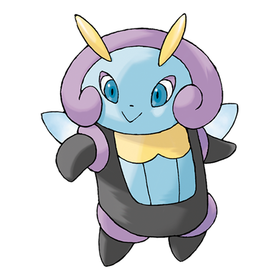
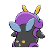
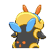

# #314 Illumise (Firefly Pokémon)

| Official Artwork | Shiny Artwork |
|------------------|---------------|
|  |  |

Its fragrance attracts a swarm of VOLBEAT, so they draw over 200 patterns in the night sky.

---

## Media

### Default Sprites

| Front | Shiny | Back | Shiny |
|-------|-------|------|-------|
|  |  |  |  |

### Cries

Latest (Gen VI+):

<audio controls>
<source src='../../assets/cries/illumise/latest.ogg' type='audio/ogg'>
  Your browser does not support the audio element.
</audio>

Legacy:

<audio controls>
<source src='../../assets/cries/illumise/legacy.ogg' type='audio/ogg'>
  Your browser does not support the audio element.
</audio>

---

## Pokédex Data

| National № | Type(s) | Height | Weight | Abilities | Local № |
|------------|---------|--------|--------|-----------|---------|
| #314 | {: width="48"} {: width="48"} | 0.6 m / 2.0 ft | 17.7 kg / 39.0 lbs | 1. Oblivious 2. Tinted Lens | N/A |

---

## Base Stats
|   | HP | Attack | Defense | Sp. Atk | Sp. Def | Speed |
|---|----|--------|---------|---------|---------|-------|
| **Base** | 80 | 30 | 60 | 90 | 100 | 90 |
| **Min** | 270 | 58 | 112 | 166 | 184 | 166 |
| **Max** | 364 | 174 | 240 | 306 | 328 | 306 |

The ranges shown above are for a level 100 Pokémon. Maximum values are based on a beneficial nature, 252 EVs, 31 IVs; minimum values are based on a hindering nature, 0 EVs, 0 IVs.

---

## Forms & Evolutions

!!! warning "WARNING"

    Information on evolutions may not be 100% accurate; differences between evolution methods across generations are not accounted for.

### Forms

Illumise has no alternate forms.

### Evolution Line

1. [Illumise](illumise.md/)

---

## Training

| EV Yield | Catch Rate | Base Friendship | Base Exp. | Growth Rate | Held Items |
|----------|------------|-----------------|-----------|-------------|------------|
| 1 Speed | 150 | 70 | 151 | Fast Then Very Slo |

---

## Breeding

| Egg Groups | Egg Cycles | Gender | Dimorphic | Color | Shape |
|------------|------------|--------|-----------|-------|-------|
| 1. Bug 2. Humanshape | 15 | 0.0% Male 100.0% Female | False | Purple | Humanoid |

---

## Moves

!!! warning "WARNING"

    Specific move information may be incorrect. However, the general movepool should be accurate; this includes changes made in Sacred Gold and Storm Silver.

### Level Up Moves

| Lv. | Move | Type | Cat. | Power | Acc. | PP |
| --- | --- | --- | --- | --- | --- | --- |
| 1 | Sweet Scent | {: width="48"} | {: width="36"} | — | 100 | 20 |
| 1 | Tackle | {: width="48"} | {: width="36"} | 40 | 100 | 35 |
| 1 | Wish | {: width="48"} | {: width="36"} | — | — | 10 |
| 5 | Thunder Shock | {: width="48"} | {: width="36"} | 40 | 100 | 30 |
| 9 | Charm | {: width="48"} | {: width="36"} | — | 100 | 20 |
| 13 | Moonlight | {: width="48"} | {: width="36"} | — | — | 5 |
| 17 | Quick Attack | {: width="48"} | {: width="36"} | 40 | 100 | 30 |
| 21 | Silver Wind | {: width="48"} | {: width="36"} | 60 | 100 | 5 |
| 25 | Encore | {: width="48"} | {: width="36"} | — | 100 | 5 |
| 29 | Helping Hand | {: width="48"} | {: width="36"} | — | — | 20 |
| 33 | Thunderbolt | {: width="48"} | {: width="36"} | 90 | 100 | 15 |
| 37 | Zen Headbutt | {: width="48"} | {: width="36"} | 80 | 90 | 15 |
| 41 | Bug Buzz | {: width="48"} | {: width="36"} | 90 | 100 | 10 |
| 45 | Covet | {: width="48"} | {: width="36"} | 60 | 100 | 25 |
| 49 | Baton Pass | {: width="48"} | {: width="36"} | — | — | 40 |

### TM Moves

| TM | Move | Type | Cat. | Power | Acc. | PP |
| --- | --- | --- | --- | --- | --- | --- |
| TM06 | Toxic | {: width="48"} | {: width="36"} | — | 90 | 10 |
| TM10 | Hidden Power | {: width="48"} | {: width="36"} | 60 | 100 | 15 |
| TM11 | Sunny Day | {: width="48"} | {: width="36"} | — | — | 5 |
| TM16 | Light Screen | {: width="48"} | {: width="36"} | — | — | 30 |
| TM17 | Protect | {: width="48"} | {: width="36"} | — | — | 10 |
| TM18 | Rain Dance | {: width="48"} | {: width="36"} | — | — | 5 |
| TM21 | Frustration | {: width="48"} | {: width="36"} | — | 100 | 20 |
| TM22 | Solar Beam | {: width="48"} | {: width="36"} | 120 | 100 | 10 |
| TM24 | Thunderbolt | {: width="48"} | {: width="36"} | 90 | 100 | 15 |
| TM25 | Thunder | {: width="48"} | {: width="36"} | 110 | 70 | 10 |
| TM27 | Return | {: width="48"} | {: width="36"} | — | 100 | 20 |
| TM30 | Shadow Ball | {: width="48"} | {: width="36"} | 80 | 100 | 15 |
| TM31 | Brick Break | {: width="48"} | {: width="36"} | 75 | 100 | 15 |
| TM32 | Double Team | {: width="48"} | {: width="36"} | — | — | 15 |
| TM40 | Aerial Ace | {: width="48"} | {: width="36"} | 60 | — | 20 |
| TM42 | Facade | {: width="48"} | {: width="36"} | 70 | 100 | 20 |
| TM44 | Rest | {: width="48"} | {: width="36"} | — | — | 5 |
| TM45 | Attract | {: width="48"} | {: width="36"} | — | 100 | 15 |
| TM46 | Thief | {: width="48"} | {: width="36"} | 60 | 100 | 25 |
| TM48 | Round | {: width="48"} | {: width="36"} | 60 | 100 | 15 |
| TM56 | Fling | {: width="48"} | {: width="36"} | — | 100 | 10 |
| TM57 | Charge Beam | {: width="48"} | {: width="36"} | 50 | 90 | 10 |
| TM62 | Acrobatics | {: width="48"} | {: width="36"} | 55 | 100 | 15 |
| TM70 | Flash | {: width="48"} | {: width="36"} | — | 100 | 20 |
| TM73 | Thunder Wave | {: width="48"} | {: width="36"} | — | 90 | 20 |
| TM76 | Struggle Bug | {: width="48"} | {: width="36"} | 50 | 100 | 20 |
| TM77 | Psych Up | {: width="48"} | {: width="36"} | — | — | 10 |
| TM87 | Swagger | {: width="48"} | {: width="36"} | — | 85 | 15 |
| TM89 | U Turn | {: width="48"} | {: width="36"} | 70 | 100 | 20 |
| TM90 | Substitute | {: width="48"} | {: width="36"} | — | — | 10 |

### Egg Moves

| Move | Type | Cat. | Power | Acc. | PP |
| --- | --- | --- | --- | --- | --- |
| Growth | {: width="48"} | {: width="36"} | — | — | 20 |
| Confuse Ray | {: width="48"} | {: width="36"} | — | 100 | 10 |
| Baton Pass | {: width="48"} | {: width="36"} | — | — | 40 |
| Encore | {: width="48"} | {: width="36"} | — | 100 | 5 |
| Fake Tears | {: width="48"} | {: width="36"} | — | 100 | 20 |
| Silver Wind | {: width="48"} | {: width="36"} | 60 | 100 | 5 |
| Bug Buzz | {: width="48"} | {: width="36"} | 90 | 100 | 10 |
| Captivate | {: width="48"} | {: width="36"} | — | 100 | 20 |

### Tutor Moves

Illumise cannot learn any moves from tutors.
