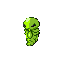
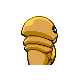

# #014 Kakuna (Cocoon Pokémon)

| Official Artwork | Shiny Artwork |
|------------------|---------------|
|  |  |

**Sacred Gold:** Although it is a cocoon, it can move a little. It can extend its poison barb if it is attacked.

**Storm Silver:** From this form, it will grow into an adult. As its body becomes softer, the external shell hardens.

---

## Media

### Default Sprites

| Front | Shiny | Back | Shiny |
|-------|-------|------|-------|
|  |  |  |  |

### Cries

Latest (Gen VI+):

<audio controls>
<source src='../../assets/cries/kakuna/latest.ogg' type='audio/ogg'>
  Your browser does not support the audio element.
</audio>

Legacy:

<audio controls>
<source src='../../assets/cries/kakuna/legacy.ogg' type='audio/ogg'>
  Your browser does not support the audio element.
</audio>

---

## Pokédex Data

| National № | Type(s) | Height | Weight | Abilities | Local № |
|------------|---------|--------|--------|-----------|---------|
| #14 | {: width="48"} {: width="48"} | 0.6 m / 2.0 ft | 10.0 kg / 22.0 lbs | 1. Shed Skin | N/A |

---

## Base Stats
|   | HP | Attack | Defense | Sp. Atk | Sp. Def | Speed |
|---|----|--------|---------|---------|---------|-------|
| **Base** | 45 | 25 | 50 | 25 | 25 | 35 |
| **Min** | 200 | 49 | 94 | 49 | 49 | 67 |
| **Max** | 294 | 163 | 218 | 163 | 163 | 185 |

The ranges shown above are for a level 100 Pokémon. Maximum values are based on a beneficial nature, 252 EVs, 31 IVs; minimum values are based on a hindering nature, 0 EVs, 0 IVs.

---

## Forms & Evolutions

!!! warning "WARNING"

    Information on evolutions may not be 100% accurate; differences between evolution methods across generations are not accounted for.

### Forms

Kakuna has no alternate forms.

### Evolution Line

1. [Weedle](weedle.md/)
    1. Level Up: [Kakuna](kakuna.md/)
        1. Level Up: [Beedrill](beedrill.md/)

---

## Training

| EV Yield | Catch Rate | Base Friendship | Base Exp. | Growth Rate | Held Items |
|----------|------------|-----------------|-----------|-------------|------------|
| 2 Defense | 120 | 70 | 72 | Medium | N/A |

---

## Breeding

| Egg Groups | Egg Cycles | Gender | Dimorphic | Color | Shape |
|------------|------------|--------|-----------|-------|-------|
| 1. Bug | 15 | 50.0% Male 50.0% Female | False | Yellow | Squiggle |

---

## Moves

!!! warning "WARNING"

    Specific move information may be incorrect. However, the general movepool should be accurate; this includes changes made in Sacred Gold and Storm Silver.

### Level Up Moves

| Lv. | Move | Type | Cat. | Power | Acc. | PP |
| --- | --- | --- | --- | --- | --- | --- |
| 1 | Harden | {: width="48"} | {: width="36"} | — | — | 30 |
| 7 | Harden | {: width="48"} | {: width="36"} | — | — | 30 |

### TM Moves

Kakuna cannot learn any TM moves.
### Egg Moves

Kakuna cannot learn any moves by breeding.
### Tutor Moves

Kakuna cannot learn any moves from tutors.
