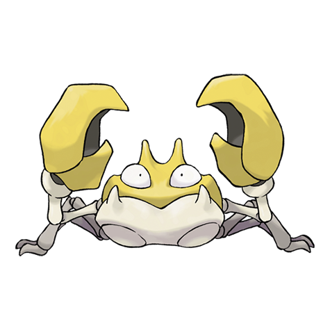
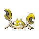
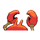
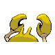

# #098 Krabby (River Crab Pokémon)

| Official Artwork | Shiny Artwork |
|------------------|---------------|
|  |  |

**Sacred Gold:** If it senses danger approaching, it cloaks itself with bubbles from its mouth so it will look bigger.

**Storm Silver:** The pincers break off easily. If it loses a pincer, it somehow becomes incapable of walking sideways.

---

## Media

### Default Sprites

| Front | Shiny | Back | Shiny |
|-------|-------|------|-------|
|  |  |  |  |

### Cries

Latest (Gen VI+):

<audio controls>
<source src='../../assets/cries/krabby/latest.ogg' type='audio/ogg'>
  Your browser does not support the audio element.
</audio>

Legacy:

<audio controls>
<source src='../../assets/cries/krabby/legacy.ogg' type='audio/ogg'>
  Your browser does not support the audio element.
</audio>

---

## Pokédex Data

| National № | Type(s) | Height | Weight | Abilities | Local № |
|------------|---------|--------|--------|-----------|---------|
| #98 | {: width="48"} | 0.4 m / 1.3 ft | 6.5 kg / 14.3 lbs | 1. Hyper Cutter 2. Shed Skin | N/A |

---

## Base Stats
|   | HP | Attack | Defense | Sp. Atk | Sp. Def | Speed |
|---|----|--------|---------|---------|---------|-------|
| **Base** | 30 | 105 | 90 | 25 | 25 | 50 |
| **Min** | 170 | 193 | 166 | 49 | 49 | 94 |
| **Max** | 264 | 339 | 306 | 163 | 163 | 218 |

The ranges shown above are for a level 100 Pokémon. Maximum values are based on a beneficial nature, 252 EVs, 31 IVs; minimum values are based on a hindering nature, 0 EVs, 0 IVs.

---

## Forms & Evolutions

!!! warning "WARNING"

    Information on evolutions may not be 100% accurate; differences between evolution methods across generations are not accounted for.

### Forms

Krabby has no alternate forms.

### Evolution Line

1. [Krabby](krabby.md/)
    1. Level Up: [Kingler](kingler.md/)

---

## Training

| EV Yield | Catch Rate | Base Friendship | Base Exp. | Growth Rate | Held Items |
|----------|------------|-----------------|-----------|-------------|------------|
| 1 Attack | 225 | 50 | 65 | Medium | N/A |

---

## Breeding

| Egg Groups | Egg Cycles | Gender | Dimorphic | Color | Shape |
|------------|------------|--------|-----------|-------|-------|
| 1. Water3 | 20 | 50.0% Male 50.0% Female | False | Red | Armor |

---

## Moves

!!! warning "WARNING"

    Specific move information may be incorrect. However, the general movepool should be accurate; this includes changes made in Sacred Gold and Storm Silver.

### Level Up Moves

| Lv. | Move | Type | Cat. | Power | Acc. | PP |
| --- | --- | --- | --- | --- | --- | --- |
| 1 | Bubble | {: width="48"} | {: width="36"} | 40 | 100 | 30 |
| 1 | Mud Sport | {: width="48"} | {: width="36"} | — | — | 15 |
| 5 | Vice Grip | {: width="48"} | {: width="36"} | 55 | 100 | 30 |
| 9 | Leer | {: width="48"} | {: width="36"} | — | 100 | 30 |
| 11 | Harden | {: width="48"} | {: width="36"} | — | — | 30 |
| 15 | Bubble Beam | {: width="48"} | {: width="36"} | 65 | 100 | 20 |
| 19 | Mud Shot | {: width="48"} | {: width="36"} | 55 | 95 | 15 |
| 21 | Metal Claw | {: width="48"} | {: width="36"} | 50 | 95 | 35 |
| 25 | Stomp | {: width="48"} | {: width="36"} | 65 | 100 | 20 |
| 29 | Protect | {: width="48"} | {: width="36"} | — | — | 10 |
| 31 | Guillotine | {: width="48"} | {: width="36"} | — | 30 | 5 |
| 35 | Slam | {: width="48"} | {: width="36"} | 80 | 75 | 20 |
| 39 | Brine | {: width="48"} | {: width="36"} | 65 | 100 | 10 |
| 41 | Crabhammer | {: width="48"} | {: width="36"} | 100 | 90 | 10 |
| 45 | Flail | {: width="48"} | {: width="36"} | — | 100 | 15 |

### TM Moves

| TM | Move | Type | Cat. | Power | Acc. | PP |
| --- | --- | --- | --- | --- | --- | --- |
| HM01 | Cut | {: width="48"} | {: width="36"} | 60 | 95 | 30 |
| HM03 | Surf | {: width="48"} | {: width="36"} | 90 | 100 | 15 |
| HM04 | Strength | {: width="48"} | {: width="36"} | 60 | 100 | 15 |
| HM06 | Dive | {: width="48"} | {: width="36"} | 80 | 100 | 10 |
| TM01 | Hone Claws | {: width="48"} | {: width="36"} | — | — | 15 |
| TM06 | Toxic | {: width="48"} | {: width="36"} | — | 90 | 10 |
| TM07 | Hail | {: width="48"} | {: width="36"} | — | — | 10 |
| TM10 | Hidden Power | {: width="48"} | {: width="36"} | 60 | 100 | 15 |
| TM13 | Ice Beam | {: width="48"} | {: width="36"} | 90 | 100 | 10 |
| TM14 | Blizzard | {: width="48"} | {: width="36"} | 110 | 70 | 5 |
| TM17 | Protect | {: width="48"} | {: width="36"} | — | — | 10 |
| TM18 | Rain Dance | {: width="48"} | {: width="36"} | — | — | 5 |
| TM21 | Frustration | {: width="48"} | {: width="36"} | — | 100 | 20 |
| TM27 | Return | {: width="48"} | {: width="36"} | — | 100 | 20 |
| TM28 | Dig | {: width="48"} | {: width="36"} | 80 | 100 | 10 |
| TM31 | Brick Break | {: width="48"} | {: width="36"} | 75 | 100 | 15 |
| TM32 | Double Team | {: width="48"} | {: width="36"} | — | — | 15 |
| TM39 | Rock Tomb | {: width="48"} | {: width="36"} | 60 | 95 | 15 |
| TM42 | Facade | {: width="48"} | {: width="36"} | 70 | 100 | 20 |
| TM44 | Rest | {: width="48"} | {: width="36"} | — | — | 5 |
| TM45 | Attract | {: width="48"} | {: width="36"} | — | 100 | 15 |
| TM46 | Thief | {: width="48"} | {: width="36"} | 60 | 100 | 25 |
| TM48 | Round | {: width="48"} | {: width="36"} | 60 | 100 | 15 |
| TM54 | False Swipe | {: width="48"} | {: width="36"} | 40 | 100 | 40 |
| TM55 | Scald | {: width="48"} | {: width="36"} | 80 | 100 | 15 |
| TM56 | Fling | {: width="48"} | {: width="36"} | — | 100 | 10 |
| TM75 | Swords Dance | {: width="48"} | {: width="36"} | — | — | 20 |
| TM80 | Rock Slide | {: width="48"} | {: width="36"} | 75 | 90 | 10 |
| TM81 | X Scissor | {: width="48"} | {: width="36"} | 80 | 100 | 15 |
| TM87 | Swagger | {: width="48"} | {: width="36"} | — | 85 | 15 |
| TM90 | Substitute | {: width="48"} | {: width="36"} | — | — | 10 |
| TM94 | Rock Smash | {: width="48"} | {: width="36"} | 60 | 100 | 15 |

### Egg Moves

| Move | Type | Cat. | Power | Acc. | PP |
| --- | --- | --- | --- | --- | --- |
| Slam | {: width="48"} | {: width="36"} | 80 | 75 | 20 |
| Agility | {: width="48"} | {: width="36"} | — | — | 30 |
| Haze | {: width="48"} | {: width="36"} | — | — | 30 |
| Bide | {: width="48"} | {: width="36"} | — | — | 10 |
| Amnesia | {: width="48"} | {: width="36"} | — | — | 20 |
| Flail | {: width="48"} | {: width="36"} | — | 100 | 15 |
| Endure | {: width="48"} | {: width="36"} | — | — | 10 |
| Ancient Power | {: width="48"} | {: width="36"} | 60 | 100 | 5 |
| Knock Off | {: width="48"} | {: width="36"} | 65 | 100 | 20 |
| Tickle | {: width="48"} | {: width="36"} | — | 100 | 20 |
| Chip Away | {: width="48"} | {: width="36"} | 70 | 100 | 20 |

### Tutor Moves

Krabby cannot learn any moves from tutors.
