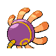
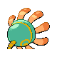

# #345 Lileep (Sea Lily Pokémon)

| Official Artwork | Shiny Artwork |
|------------------|---------------|
|  |  |

It disguises its tentacles as flowers to attract and catch prey. It became extinct in ancient times.

---

## Media

### Default Sprites

| Front | Shiny | Back | Shiny |
|-------|-------|------|-------|
|  |  |  |  |

### Cries

Latest (Gen VI+):

<audio controls>
<source src='../../assets/cries/lileep/latest.ogg' type='audio/ogg'>
  Your browser does not support the audio element.
</audio>

Legacy:

<audio controls>
<source src='../../assets/cries/lileep/legacy.ogg' type='audio/ogg'>
  Your browser does not support the audio element.
</audio>

---

## Pokédex Data

| National № | Type(s) | Height | Weight | Abilities | Local № |
|------------|---------|--------|--------|-----------|---------|
| #345 | {: width="48"} {: width="48"} | 1.0 m / 3.3 ft | 23.8 kg / 52.5 lbs | 1. Suction Cups 2. Storm Drain | N/A |

---

## Base Stats
|   | HP | Attack | Defense | Sp. Atk | Sp. Def | Speed |
|---|----|--------|---------|---------|---------|-------|
| **Base** | 66 | 41 | 77 | 61 | 87 | 23 |
| **Min** | 242 | 78 | 143 | 114 | 161 | 45 |
| **Max** | 336 | 199 | 278 | 243 | 300 | 159 |

The ranges shown above are for a level 100 Pokémon. Maximum values are based on a beneficial nature, 252 EVs, 31 IVs; minimum values are based on a hindering nature, 0 EVs, 0 IVs.

---

## Forms & Evolutions

!!! warning "WARNING"

    Information on evolutions may not be 100% accurate; differences between evolution methods across generations are not accounted for.

### Forms

Lileep has no alternate forms.

### Evolution Line

1. [Lileep](lileep.md/)
    1. Level Up: [Cradily](cradily.md/)

---

## Training

| EV Yield | Catch Rate | Base Friendship | Base Exp. | Growth Rate | Held Items |
|----------|------------|-----------------|-----------|-------------|------------|
| 1 Sp. Def | 45 | 50 | 71 | Slow Then Very Fast | Big Root (5%) |

---

## Breeding

| Egg Groups | Egg Cycles | Gender | Dimorphic | Color | Shape |
|------------|------------|--------|-----------|-------|-------|
| 1. Water3 | 30 | 87.5% Male 12.5% Female | False | Purple | Blob |

---

## Moves

!!! warning "WARNING"

    Specific move information may be incorrect. However, the general movepool should be accurate; this includes changes made in Sacred Gold and Storm Silver.

### Level Up Moves

| Lv. | Move | Type | Cat. | Power | Acc. | PP |
| --- | --- | --- | --- | --- | --- | --- |
| 1 | Astonish | {: width="48"} | {: width="36"} | 30 | 100 | 15 |
| 1 | Constrict | {: width="48"} | {: width="36"} | 10 | 100 | 35 |
| 8 | Acid | {: width="48"} | {: width="36"} | 40 | 100 | 30 |
| 15 | Ingrain | {: width="48"} | {: width="36"} | — | — | 20 |
| 22 | Confuse Ray | {: width="48"} | {: width="36"} | — | 100 | 10 |
| 29 | Amnesia | {: width="48"} | {: width="36"} | — | — | 20 |
| 36 | Gastro Acid | {: width="48"} | {: width="36"} | — | 100 | 10 |
| 43 | Ancient Power | {: width="48"} | {: width="36"} | 60 | 100 | 5 |
| 50 | Energy Ball | {: width="48"} | {: width="36"} | 90 | 100 | 10 |
| 57 | Spit Up | {: width="48"} | {: width="36"} | — | 100 | 10 |
| 57 | Stockpile | {: width="48"} | {: width="36"} | — | — | 20 |
| 57 | Swallow | {: width="48"} | {: width="36"} | — | — | 10 |
| 64 | Wring Out | {: width="48"} | {: width="36"} | — | 100 | 5 |
| 71 | Recover | {: width="48"} | {: width="36"} | — | — | 5 |
| 78 | Earth Power | {: width="48"} | {: width="36"} | 90 | 100 | 10 |

### TM Moves

| TM | Move | Type | Cat. | Power | Acc. | PP |
| --- | --- | --- | --- | --- | --- | --- |
| TM06 | Toxic | {: width="48"} | {: width="36"} | — | 90 | 10 |
| TM10 | Hidden Power | {: width="48"} | {: width="36"} | 60 | 100 | 15 |
| TM11 | Sunny Day | {: width="48"} | {: width="36"} | — | — | 5 |
| TM17 | Protect | {: width="48"} | {: width="36"} | — | — | 10 |
| TM21 | Frustration | {: width="48"} | {: width="36"} | — | 100 | 20 |
| TM22 | Solar Beam | {: width="48"} | {: width="36"} | 120 | 100 | 10 |
| TM23 | Smack Down | {: width="48"} | {: width="36"} | 50 | 100 | 15 |
| TM27 | Return | {: width="48"} | {: width="36"} | — | 100 | 20 |
| TM32 | Double Team | {: width="48"} | {: width="36"} | — | — | 15 |
| TM36 | Sludge Bomb | {: width="48"} | {: width="36"} | 90 | 100 | 10 |
| TM37 | Sandstorm | {: width="48"} | {: width="36"} | — | — | 10 |
| TM39 | Rock Tomb | {: width="48"} | {: width="36"} | 60 | 95 | 15 |
| TM42 | Facade | {: width="48"} | {: width="36"} | 70 | 100 | 20 |
| TM44 | Rest | {: width="48"} | {: width="36"} | — | — | 5 |
| TM45 | Attract | {: width="48"} | {: width="36"} | — | 100 | 15 |
| TM48 | Round | {: width="48"} | {: width="36"} | 60 | 100 | 15 |
| TM53 | Energy Ball | {: width="48"} | {: width="36"} | 90 | 100 | 10 |
| TM69 | Rock Polish | {: width="48"} | {: width="36"} | — | — | 20 |
| TM70 | Flash | {: width="48"} | {: width="36"} | — | 100 | 20 |
| TM75 | Swords Dance | {: width="48"} | {: width="36"} | — | — | 20 |
| TM80 | Rock Slide | {: width="48"} | {: width="36"} | 75 | 90 | 10 |
| TM86 | Grass Knot | {: width="48"} | {: width="36"} | — | 100 | 20 |
| TM87 | Swagger | {: width="48"} | {: width="36"} | — | 85 | 15 |
| TM90 | Substitute | {: width="48"} | {: width="36"} | — | — | 10 |

### Egg Moves

| Move | Type | Cat. | Power | Acc. | PP |
| --- | --- | --- | --- | --- | --- |
| Mega Drain | {: width="48"} | {: width="36"} | 40 | 100 | 15 |
| Recover | {: width="48"} | {: width="36"} | — | — | 5 |
| Barrier | {: width="48"} | {: width="36"} | — | — | 20 |
| Curse | {: width="48"} | {: width="36"} | — | — | 10 |
| Endure | {: width="48"} | {: width="36"} | — | — | 10 |
| Mirror Coat | {: width="48"} | {: width="36"} | — | 100 | 20 |
| Tickle | {: width="48"} | {: width="36"} | — | 100 | 20 |
| Wring Out | {: width="48"} | {: width="36"} | — | 100 | 5 |
| Stealth Rock | {: width="48"} | {: width="36"} | — | — | 20 |

### Tutor Moves

Lileep cannot learn any moves from tutors.
