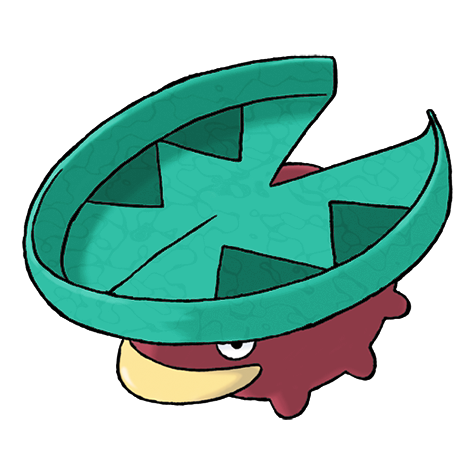
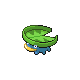
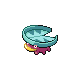
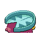

# #270 Lotad (Water Weed Pokémon)

| Official Artwork | Shiny Artwork |
|------------------|---------------|
|  |  |

Its leaf grew too large for it to live on land. That is how it began to live floating in the water.

---

## Media

### Default Sprites

| Front | Shiny | Back | Shiny |
|-------|-------|------|-------|
|  |  |  |  |

### Cries

Latest (Gen VI+):

<audio controls>
<source src='../../assets/cries/lotad/latest.ogg' type='audio/ogg'>
  Your browser does not support the audio element.
</audio>

Legacy:

<audio controls>
<source src='../../assets/cries/lotad/legacy.ogg' type='audio/ogg'>
  Your browser does not support the audio element.
</audio>

---

## Pokédex Data

| National № | Type(s) | Height | Weight | Abilities | Local № |
|------------|---------|--------|--------|-----------|---------|
| #270 | {: width="48"} {: width="48"} | 0.5 m / 1.6 ft | 2.6 kg / 5.7 lbs | 1. Swift Swim 2. Rain Dish | N/A |

---

## Base Stats
|   | HP | Attack | Defense | Sp. Atk | Sp. Def | Speed |
|---|----|--------|---------|---------|---------|-------|
| **Base** | 40 | 30 | 30 | 40 | 50 | 30 |
| **Min** | 190 | 58 | 58 | 76 | 94 | 58 |
| **Max** | 284 | 174 | 174 | 196 | 218 | 174 |

The ranges shown above are for a level 100 Pokémon. Maximum values are based on a beneficial nature, 252 EVs, 31 IVs; minimum values are based on a hindering nature, 0 EVs, 0 IVs.

---

## Forms & Evolutions

!!! warning "WARNING"

    Information on evolutions may not be 100% accurate; differences between evolution methods across generations are not accounted for.

### Forms

Lotad has no alternate forms.

### Evolution Line

1. [Lotad](lotad.md/)
    1. Level Up: [Lombre](lombre.md/)
        1. Use Item: [Ludicolo](ludicolo.md/)

---

## Training

| EV Yield | Catch Rate | Base Friendship | Base Exp. | Growth Rate | Held Items |
|----------|------------|-----------------|-----------|-------------|------------|
| 1 Special Defense | 255 | 50 | 44 | Medium Slo |

---

## Breeding

| Egg Groups | Egg Cycles | Gender | Dimorphic | Color | Shape |
|------------|------------|--------|-----------|-------|-------|
| 1. Water1 2. Plant | 15 | 50.0% Male 50.0% Female | False | Green | Armor |

---

## Moves

!!! warning "WARNING"

    Specific move information may be incorrect. However, the general movepool should be accurate; this includes changes made in Sacred Gold and Storm Silver.

### Level Up Moves

| Lv. | Move | Type | Cat. | Power | Acc. | PP |
| --- | --- | --- | --- | --- | --- | --- |
| 1 | Astonish | {: width="48"} | {: width="36"} | 30 | 100 | 15 |
| 3 | Growl | {: width="48"} | {: width="36"} | — | 100 | 40 |
| 5 | Absorb | {: width="48"} | {: width="36"} | 20 | 100 | 25 |
| 7 | Nature Power | {: width="48"} | {: width="36"} | — | — | 20 |
| 11 | Mist | {: width="48"} | {: width="36"} | — | — | 30 |
| 15 | Natural Gift | {: width="48"} | {: width="36"} | — | 100 | 15 |
| 19 | Mega Drain | {: width="48"} | {: width="36"} | 40 | 100 | 15 |
| 25 | Bubble Beam | {: width="48"} | {: width="36"} | 65 | 100 | 20 |
| 31 | Zen Headbutt | {: width="48"} | {: width="36"} | 80 | 90 | 15 |
| 37 | Rain Dance | {: width="48"} | {: width="36"} | — | — | 5 |
| 45 | Energy Ball | {: width="48"} | {: width="36"} | 90 | 100 | 10 |

### TM Moves

| TM | Move | Type | Cat. | Power | Acc. | PP |
| --- | --- | --- | --- | --- | --- | --- |
| HM03 | Surf | {: width="48"} | {: width="36"} | 90 | 100 | 15 |
| TM06 | Toxic | {: width="48"} | {: width="36"} | — | 90 | 10 |
| TM07 | Hail | {: width="48"} | {: width="36"} | — | — | 10 |
| TM10 | Hidden Power | {: width="48"} | {: width="36"} | 60 | 100 | 15 |
| TM11 | Sunny Day | {: width="48"} | {: width="36"} | — | — | 5 |
| TM13 | Ice Beam | {: width="48"} | {: width="36"} | 90 | 100 | 10 |
| TM14 | Blizzard | {: width="48"} | {: width="36"} | 110 | 70 | 5 |
| TM17 | Protect | {: width="48"} | {: width="36"} | — | — | 10 |
| TM18 | Rain Dance | {: width="48"} | {: width="36"} | — | — | 5 |
| TM21 | Frustration | {: width="48"} | {: width="36"} | — | 100 | 20 |
| TM22 | Solar Beam | {: width="48"} | {: width="36"} | 120 | 100 | 10 |
| TM27 | Return | {: width="48"} | {: width="36"} | — | 100 | 20 |
| TM32 | Double Team | {: width="48"} | {: width="36"} | — | — | 15 |
| TM42 | Facade | {: width="48"} | {: width="36"} | 70 | 100 | 20 |
| TM44 | Rest | {: width="48"} | {: width="36"} | — | — | 5 |
| TM45 | Attract | {: width="48"} | {: width="36"} | — | 100 | 15 |
| TM46 | Thief | {: width="48"} | {: width="36"} | 60 | 100 | 25 |
| TM48 | Round | {: width="48"} | {: width="36"} | 60 | 100 | 15 |
| TM49 | Echoed Voice | {: width="48"} | {: width="36"} | 40 | 100 | 15 |
| TM53 | Energy Ball | {: width="48"} | {: width="36"} | 90 | 100 | 10 |
| TM55 | Scald | {: width="48"} | {: width="36"} | 80 | 100 | 15 |
| TM70 | Flash | {: width="48"} | {: width="36"} | — | 100 | 20 |
| TM75 | Swords Dance | {: width="48"} | {: width="36"} | — | — | 20 |
| TM86 | Grass Knot | {: width="48"} | {: width="36"} | — | 100 | 20 |
| TM87 | Swagger | {: width="48"} | {: width="36"} | — | 85 | 15 |
| TM90 | Substitute | {: width="48"} | {: width="36"} | — | — | 10 |

### Egg Moves

| Move | Type | Cat. | Power | Acc. | PP |
| --- | --- | --- | --- | --- | --- |
| Water Gun | {: width="48"} | {: width="36"} | 40 | 100 | 25 |
| Counter | {: width="48"} | {: width="36"} | — | 100 | 20 |
| Leech Seed | {: width="48"} | {: width="36"} | — | 90 | 10 |
| Razor Leaf | {: width="48"} | {: width="36"} | 55 | 95 | 25 |
| Flail | {: width="48"} | {: width="36"} | — | 100 | 15 |
| Giga Drain | {: width="48"} | {: width="36"} | 75 | 100 | 10 |
| Sweet Scent | {: width="48"} | {: width="36"} | — | 100 | 20 |
| Synthesis | {: width="48"} | {: width="36"} | — | — | 5 |
| Teeter Dance | {: width="48"} | {: width="36"} | — | 100 | 20 |
| Tickle | {: width="48"} | {: width="36"} | — | 100 | 20 |

### Tutor Moves

Lotad cannot learn any moves from tutors.
