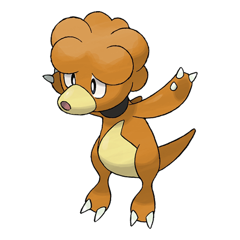

# #240 Magby (Live Coal Pokémon)

| Official Artwork | Shiny Artwork |
|------------------|---------------|
|  |  |

**Sacred Gold:** Each and every time it inhales and exhales, hot embers dribble from its mouth and nostrils.

**Storm Silver:** It is found in volcanic craters. Its body temperature is over 1,100 degrees Fahrenheit, so don’t underestimate it.

---

## Media

### Default Sprites

| Front | Shiny | Back | Shiny |
|-------|-------|------|-------|
|  |  |  |  |

### Cries

Latest (Gen VI+):

<audio controls>
<source src='../../assets/cries/magby/latest.ogg' type='audio/ogg'>
  Your browser does not support the audio element.
</audio>

Legacy:

<audio controls>
<source src='../../assets/cries/magby/legacy.ogg' type='audio/ogg'>
  Your browser does not support the audio element.
</audio>

---

## Pokédex Data

| National № | Type(s) | Height | Weight | Abilities | Local № |
|------------|---------|--------|--------|-----------|---------|
| #240 | {: width="48"} | 0.7 m / 2.3 ft | 21.4 kg / 47.2 lbs | 1. Flame Body 2. Vital Spirit | N/A |

---

## Base Stats
|   | HP | Attack | Defense | Sp. Atk | Sp. Def | Speed |
|---|----|--------|---------|---------|---------|-------|
| **Base** | 45 | 75 | 37 | 70 | 55 | 83 |
| **Min** | 200 | 139 | 71 | 130 | 103 | 153 |
| **Max** | 294 | 273 | 190 | 262 | 229 | 291 |

The ranges shown above are for a level 100 Pokémon. Maximum values are based on a beneficial nature, 252 EVs, 31 IVs; minimum values are based on a hindering nature, 0 EVs, 0 IVs.

---

## Forms & Evolutions

!!! warning "WARNING"

    Information on evolutions may not be 100% accurate; differences between evolution methods across generations are not accounted for.

### Forms

Magby has no alternate forms.

### Evolution Line

1. [Magby](magby.md/)
    1. Level Up: [Magmar](magmar.md/)
        1. Trade: [Magmortar](magmortar.md/)

---

## Training

| EV Yield | Catch Rate | Base Friendship | Base Exp. | Growth Rate | Held Items |
|----------|------------|-----------------|-----------|-------------|------------|
| 1 Speed | 45 | 50 | 73 | Mediu |

---

## Breeding

| Egg Groups | Egg Cycles | Gender | Dimorphic | Color | Shape |
|------------|------------|--------|-----------|-------|-------|
| 1. No-Eggs | 25 | 75.0% Male 25.0% Female | False | Red | Upright |

---

## Moves

!!! warning "WARNING"

    Specific move information may be incorrect. However, the general movepool should be accurate; this includes changes made in Sacred Gold and Storm Silver.

### Level Up Moves

| Lv. | Move | Type | Cat. | Power | Acc. | PP |
| --- | --- | --- | --- | --- | --- | --- |
| 1 | Leer | {: width="48"} | {: width="36"} | — | 100 | 30 |
| 1 | Smog | {: width="48"} | {: width="36"} | 30 | 70 | 20 |
| 7 | Ember | {: width="48"} | {: width="36"} | 40 | 100 | 25 |
| 10 | Smokescreen | {: width="48"} | {: width="36"} | — | 100 | 20 |
| 16 | Feint Attack | {: width="48"} | {: width="36"} | 60 | — | 20 |
| 19 | Fire Spin | {: width="48"} | {: width="36"} | 35 | 85 | 15 |
| 25 | Confuse Ray | {: width="48"} | {: width="36"} | — | 100 | 10 |
| 28 | Flame Burst | {: width="48"} | {: width="36"} | 70 | 100 | 15 |
| 34 | Fire Punch | {: width="48"} | {: width="36"} | 75 | 100 | 15 |
| 37 | Lava Plume | {: width="48"} | {: width="36"} | 80 | 100 | 15 |
| 43 | Flamethrower | {: width="48"} | {: width="36"} | 90 | 100 | 15 |
| 46 | Sunny Day | {: width="48"} | {: width="36"} | — | — | 5 |
| 49 | Fire Blast | {: width="48"} | {: width="36"} | 110 | 85 | 5 |

### TM Moves

| TM | Move | Type | Cat. | Power | Acc. | PP |
| --- | --- | --- | --- | --- | --- | --- |
| TM06 | Toxic | {: width="48"} | {: width="36"} | — | 90 | 10 |
| TM10 | Hidden Power | {: width="48"} | {: width="36"} | 60 | 100 | 15 |
| TM11 | Sunny Day | {: width="48"} | {: width="36"} | — | — | 5 |
| TM17 | Protect | {: width="48"} | {: width="36"} | — | — | 10 |
| TM21 | Frustration | {: width="48"} | {: width="36"} | — | 100 | 20 |
| TM27 | Return | {: width="48"} | {: width="36"} | — | 100 | 20 |
| TM29 | Psychic | {: width="48"} | {: width="36"} | 90 | 100 | 10 |
| TM31 | Brick Break | {: width="48"} | {: width="36"} | 75 | 100 | 15 |
| TM32 | Double Team | {: width="48"} | {: width="36"} | — | — | 15 |
| TM35 | Flamethrower | {: width="48"} | {: width="36"} | 90 | 100 | 15 |
| TM38 | Fire Blast | {: width="48"} | {: width="36"} | 110 | 85 | 5 |
| TM42 | Facade | {: width="48"} | {: width="36"} | 70 | 100 | 20 |
| TM43 | Flame Charge | {: width="48"} | {: width="36"} | 50 | 100 | 20 |
| TM44 | Rest | {: width="48"} | {: width="36"} | — | — | 5 |
| TM45 | Attract | {: width="48"} | {: width="36"} | — | 100 | 15 |
| TM46 | Thief | {: width="48"} | {: width="36"} | 60 | 100 | 25 |
| TM48 | Round | {: width="48"} | {: width="36"} | 60 | 100 | 15 |
| TM50 | Overheat | {: width="48"} | {: width="36"} | 130 | 90 | 5 |
| TM56 | Fling | {: width="48"} | {: width="36"} | — | 100 | 10 |
| TM59 | Incinerate | {: width="48"} | {: width="36"} | 60 | 100 | 15 |
| TM61 | Will O Wisp | {: width="48"} | {: width="36"} | — | 85 | 15 |
| TM87 | Swagger | {: width="48"} | {: width="36"} | — | 85 | 15 |
| TM90 | Substitute | {: width="48"} | {: width="36"} | — | — | 10 |
| TM94 | Rock Smash | {: width="48"} | {: width="36"} | 60 | 100 | 15 |

### Egg Moves

| Move | Type | Cat. | Power | Acc. | PP |
| --- | --- | --- | --- | --- | --- |
| Karate Chop | {: width="48"} | {: width="36"} | 50 | 100 | 25 |
| Mega Punch | {: width="48"} | {: width="36"} | 80 | 85 | 20 |
| Thunder Punch | {: width="48"} | {: width="36"} | 75 | 100 | 15 |
| Screech | {: width="48"} | {: width="36"} | — | 85 | 40 |
| Barrier | {: width="48"} | {: width="36"} | — | — | 20 |
| Focus Energy | {: width="48"} | {: width="36"} | — | — | 30 |
| Mach Punch | {: width="48"} | {: width="36"} | 40 | 100 | 30 |
| Belly Drum | {: width="48"} | {: width="36"} | — | — | 10 |
| Dynamic Punch | {: width="48"} | {: width="36"} | 100 | 50 | 5 |
| Iron Tail | {: width="48"} | {: width="36"} | 100 | 75 | 15 |
| Cross Chop | {: width="48"} | {: width="36"} | 100 | 80 | 5 |
| Flare Blitz | {: width="48"} | {: width="36"} | 120 | 100 | 15 |

### Tutor Moves

Magby cannot learn any moves from tutors.
