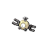
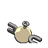

# #081 Magnemite (Magnet Pokémon)

| Official Artwork | Shiny Artwork |
|------------------|---------------|
|  |  |

**Sacred Gold:** It is attracted by electromagnetic waves. It may approach Trainers if they are using their Pokégear.

**Storm Silver:** The units at the sides of its body generate antigravity energy to keep it aloft in the air.

---

## Media

### Default Sprites

| Front | Shiny | Back | Shiny |
|-------|-------|------|-------|
|  |  |  |  |

### Cries

Latest (Gen VI+):

<audio controls>
<source src='../../assets/cries/magnemite/latest.ogg' type='audio/ogg'>
  Your browser does not support the audio element.
</audio>

Legacy:

<audio controls>
<source src='../../assets/cries/magnemite/legacy.ogg' type='audio/ogg'>
  Your browser does not support the audio element.
</audio>

---

## Pokédex Data

| National № | Type(s) | Height | Weight | Abilities | Local № |
|------------|---------|--------|--------|-----------|---------|
| #81 | {: width="48"} {: width="48"} | 0.3 m / 1.0 ft | 6.0 kg / 13.2 lbs | 1. Magnet Pull 2. Sturdy | N/A |

---

## Base Stats
|   | HP | Attack | Defense | Sp. Atk | Sp. Def | Speed |
|---|----|--------|---------|---------|---------|-------|
| **Base** | 25 | 35 | 70 | 95 | 55 | 45 |
| **Min** | 160 | 67 | 130 | 175 | 103 | 85 |
| **Max** | 254 | 185 | 262 | 317 | 229 | 207 |

The ranges shown above are for a level 100 Pokémon. Maximum values are based on a beneficial nature, 252 EVs, 31 IVs; minimum values are based on a hindering nature, 0 EVs, 0 IVs.

---

## Forms & Evolutions

!!! warning "WARNING"

    Information on evolutions may not be 100% accurate; differences between evolution methods across generations are not accounted for.

### Forms

Magnemite has no alternate forms.

### Evolution Line

1. [Magnemite](magnemite.md/)
    1. Level Up: [Magneton](magneton.md/)
        1. Use Item: [Magnezone](magnezone.md/)

---

## Training

| EV Yield | Catch Rate | Base Friendship | Base Exp. | Growth Rate | Held Items |
|----------|------------|-----------------|-----------|-------------|------------|
| 1 Special Attack | 190 | 50 | 65 | Medium | Metal Coat (5%) |

---

## Breeding

| Egg Groups | Egg Cycles | Gender | Dimorphic | Color | Shape |
|------------|------------|--------|-----------|-------|-------|
| 1. Mineral | 20 | Genderless | False | Gray | Arms |

---

## Moves

!!! warning "WARNING"

    Specific move information may be incorrect. However, the general movepool should be accurate; this includes changes made in Sacred Gold and Storm Silver.

### Level Up Moves

| Lv. | Move | Type | Cat. | Power | Acc. | PP |
| --- | --- | --- | --- | --- | --- | --- |
| 1 | Metal Sound | {: width="48"} | {: width="36"} | — | 85 | 40 |
| 1 | Tackle | {: width="48"} | {: width="36"} | 40 | 100 | 35 |
| 6 | Thunder Shock | {: width="48"} | {: width="36"} | 40 | 100 | 30 |
| 11 | Supersonic | {: width="48"} | {: width="36"} | — | 55 | 20 |
| 14 | Sonic Boom | {: width="48"} | {: width="36"} | — | 90 | 20 |
| 17 | Thunder Wave | {: width="48"} | {: width="36"} | — | 90 | 20 |
| 22 | Spark | {: width="48"} | {: width="36"} | 65 | 100 | 20 |
| 27 | Electro Ball | {: width="48"} | {: width="36"} | — | 100 | 10 |
| 30 | Lock On | {: width="48"} | {: width="36"} | — | — | 5 |
| 33 | Magnet Bomb | {: width="48"} | {: width="36"} | 60 | — | 20 |
| 38 | Screech | {: width="48"} | {: width="36"} | — | 85 | 40 |
| 43 | Discharge | {: width="48"} | {: width="36"} | 80 | 100 | 15 |
| 46 | Mirror Shot | {: width="48"} | {: width="36"} | 65 | 85 | 10 |
| 49 | Magnet Rise | {: width="48"} | {: width="36"} | — | — | 10 |
| 54 | Gyro Ball | {: width="48"} | {: width="36"} | — | 100 | 5 |
| 59 | Zap Cannon | {: width="48"} | {: width="36"} | 120 | 50 | 5 |

### TM Moves

| TM | Move | Type | Cat. | Power | Acc. | PP |
| --- | --- | --- | --- | --- | --- | --- |
| TM06 | Toxic | {: width="48"} | {: width="36"} | — | 90 | 10 |
| TM10 | Hidden Power | {: width="48"} | {: width="36"} | 60 | 100 | 15 |
| TM11 | Sunny Day | {: width="48"} | {: width="36"} | — | — | 5 |
| TM16 | Light Screen | {: width="48"} | {: width="36"} | — | — | 30 |
| TM17 | Protect | {: width="48"} | {: width="36"} | — | — | 10 |
| TM18 | Rain Dance | {: width="48"} | {: width="36"} | — | — | 5 |
| TM21 | Frustration | {: width="48"} | {: width="36"} | — | 100 | 20 |
| TM24 | Thunderbolt | {: width="48"} | {: width="36"} | 90 | 100 | 15 |
| TM25 | Thunder | {: width="48"} | {: width="36"} | 110 | 70 | 10 |
| TM27 | Return | {: width="48"} | {: width="36"} | — | 100 | 20 |
| TM32 | Double Team | {: width="48"} | {: width="36"} | — | — | 15 |
| TM33 | Reflect | {: width="48"} | {: width="36"} | — | — | 20 |
| TM42 | Facade | {: width="48"} | {: width="36"} | 70 | 100 | 20 |
| TM44 | Rest | {: width="48"} | {: width="36"} | — | — | 5 |
| TM48 | Round | {: width="48"} | {: width="36"} | 60 | 100 | 15 |
| TM57 | Charge Beam | {: width="48"} | {: width="36"} | 50 | 90 | 10 |
| TM64 | Explosion | {: width="48"} | {: width="36"} | 250 | 100 | 5 |
| TM70 | Flash | {: width="48"} | {: width="36"} | — | 100 | 20 |
| TM72 | Volt Switch | {: width="48"} | {: width="36"} | 70 | 100 | 20 |
| TM73 | Thunder Wave | {: width="48"} | {: width="36"} | — | 90 | 20 |
| TM74 | Gyro Ball | {: width="48"} | {: width="36"} | — | 100 | 5 |
| TM77 | Psych Up | {: width="48"} | {: width="36"} | — | — | 10 |
| TM87 | Swagger | {: width="48"} | {: width="36"} | — | 85 | 15 |
| TM90 | Substitute | {: width="48"} | {: width="36"} | — | — | 10 |
| TM91 | Flash Cannon | {: width="48"} | {: width="36"} | 80 | 100 | 10 |
| TM93 | Wild Charge | {: width="48"} | {: width="36"} | 90 | 100 | 15 |

### Egg Moves

Magnemite cannot learn any moves by breeding.
### Tutor Moves

Magnemite cannot learn any moves from tutors.
