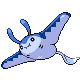

# #226 Mantine (Kite Pokémon)

| Official Artwork | Shiny Artwork |
|------------------|---------------|
|  |  |

**Sacred Gold:** As it majestically swims, it doesn’t care if REMORAID attach to it for scavenging its leftovers.

**Storm Silver:** Swimming freely in open seas, it may fly out of the water and over the waves if it builds up enough speed.

---

## Media

### Default Sprites

| Front | Shiny | Back | Shiny |
|-------|-------|------|-------|
|  |  |  |  |

### Cries

Latest (Gen VI+):

<audio controls>
<source src='../../assets/cries/mantine/latest.ogg' type='audio/ogg'>
  Your browser does not support the audio element.
</audio>

Legacy:

<audio controls>
<source src='../../assets/cries/mantine/legacy.ogg' type='audio/ogg'>
  Your browser does not support the audio element.
</audio>

---

## Pokédex Data

| National № | Type(s) | Height | Weight | Abilities | Local № |
|------------|---------|--------|--------|-----------|---------|
| #226 | {: width="48"} {: width="48"} | 2.1 m / 6.9 ft | 220.0 kg / 485.0 lbs | 1. Swift Swim 2. Water Absorb | #141 |

---

## Base Stats
|   | HP | Attack | Defense | Sp. Atk | Sp. Def | Speed |
|---|----|--------|---------|---------|---------|-------|
| **Base** | 85 | 40 | 70 | 80 | 140 | 70 |
| **Min** | 280 | 76 | 130 | 148 | 256 | 130 |
| **Max** | 374 | 196 | 262 | 284 | 416 | 262 |

The ranges shown above are for a level 100 Pokémon. Maximum values are based on a beneficial nature, 252 EVs, 31 IVs; minimum values are based on a hindering nature, 0 EVs, 0 IVs.

---

## Forms & Evolutions

!!! warning "WARNING"

    Information on evolutions may not be 100% accurate; differences between evolution methods across generations are not accounted for.

### Forms

Mantine has no alternate forms.

### Evolution Line

1. [Mantyke](mantyke.md/)
    1. Level Up: [Mantine](mantine.md/)

---

## Training

| EV Yield | Catch Rate | Base Friendship | Base Exp. | Growth Rate | Held Items |
|----------|------------|-----------------|-----------|-------------|------------|
| 2 Special Defense | 25 | 50 | 170 | Slow | N/A |

---

## Breeding

| Egg Groups | Egg Cycles | Gender | Dimorphic | Color | Shape |
|------------|------------|--------|-----------|-------|-------|
| 1. Water1 | 25 | 50.0% Male 50.0% Female | False | Purple | Wings |

---

## Moves

!!! warning "WARNING"

    Specific move information may be incorrect. However, the general movepool should be accurate; this includes changes made in Sacred Gold and Storm Silver.

### Level Up Moves

| Lv. | Move | Type | Cat. | Power | Acc. | PP |
| --- | --- | --- | --- | --- | --- | --- |
| 1 | Bubble | {: width="48"} | {: width="36"} | 40 | 100 | 30 |
| 1 | Bubble Beam | {: width="48"} | {: width="36"} | 65 | 100 | 20 |
| 1 | Bullet Seed | {: width="48"} | {: width="36"} | 25 | 100 | 30 |
| 1 | Psybeam | {: width="48"} | {: width="36"} | 65 | 100 | 20 |
| 1 | Signal Beam | {: width="48"} | {: width="36"} | 75 | 100 | 15 |
| 1 | Supersonic | {: width="48"} | {: width="36"} | — | 55 | 20 |
| 1 | Tackle | {: width="48"} | {: width="36"} | 40 | 100 | 35 |
| 4 | Supersonic | {: width="48"} | {: width="36"} | — | 55 | 20 |
| 10 | Bubble Beam | {: width="48"} | {: width="36"} | 65 | 100 | 20 |
| 13 | Headbutt | {: width="48"} | {: width="36"} | 70 | 100 | 15 |
| 19 | Agility | {: width="48"} | {: width="36"} | — | — | 30 |
| 22 | Wing Attack | {: width="48"} | {: width="36"} | 60 | 100 | 35 |
| 28 | Water Pulse | {: width="48"} | {: width="36"} | 60 | 100 | 20 |
| 31 | Take Down | {: width="48"} | {: width="36"} | 90 | 85 | 20 |
| 37 | Confuse Ray | {: width="48"} | {: width="36"} | — | 100 | 10 |
| 40 | Bounce | {: width="48"} | {: width="36"} | 85 | 85 | 5 |
| 46 | Aqua Ring | {: width="48"} | {: width="36"} | — | — | 20 |
| 49 | Hydro Pump | {: width="48"} | {: width="36"} | 110 | 80 | 5 |

### TM Moves

| TM | Move | Type | Cat. | Power | Acc. | PP |
| --- | --- | --- | --- | --- | --- | --- |
| HM03 | Surf | {: width="48"} | {: width="36"} | 90 | 100 | 15 |
| HM05 | Waterfall | {: width="48"} | {: width="36"} | 80 | 100 | 15 |
| HM06 | Dive | {: width="48"} | {: width="36"} | 80 | 100 | 10 |
| TM06 | Toxic | {: width="48"} | {: width="36"} | — | 90 | 10 |
| TM07 | Hail | {: width="48"} | {: width="36"} | — | — | 10 |
| TM10 | Hidden Power | {: width="48"} | {: width="36"} | 60 | 100 | 15 |
| TM13 | Ice Beam | {: width="48"} | {: width="36"} | 90 | 100 | 10 |
| TM14 | Blizzard | {: width="48"} | {: width="36"} | 110 | 70 | 5 |
| TM15 | Hyper Beam | {: width="48"} | {: width="36"} | 150 | 90 | 5 |
| TM17 | Protect | {: width="48"} | {: width="36"} | — | — | 10 |
| TM18 | Rain Dance | {: width="48"} | {: width="36"} | — | — | 5 |
| TM21 | Frustration | {: width="48"} | {: width="36"} | — | 100 | 20 |
| TM26 | Earthquake | {: width="48"} | {: width="36"} | 100 | 100 | 10 |
| TM27 | Return | {: width="48"} | {: width="36"} | — | 100 | 20 |
| TM32 | Double Team | {: width="48"} | {: width="36"} | — | — | 15 |
| TM39 | Rock Tomb | {: width="48"} | {: width="36"} | 60 | 95 | 15 |
| TM40 | Aerial Ace | {: width="48"} | {: width="36"} | 60 | — | 20 |
| TM42 | Facade | {: width="48"} | {: width="36"} | 70 | 100 | 20 |
| TM44 | Rest | {: width="48"} | {: width="36"} | — | — | 5 |
| TM45 | Attract | {: width="48"} | {: width="36"} | — | 100 | 15 |
| TM48 | Round | {: width="48"} | {: width="36"} | 60 | 100 | 15 |
| TM55 | Scald | {: width="48"} | {: width="36"} | 80 | 100 | 15 |
| TM62 | Acrobatics | {: width="48"} | {: width="36"} | 55 | 100 | 15 |
| TM68 | Giga Impact | {: width="48"} | {: width="36"} | 150 | 90 | 5 |
| TM78 | Bulldoze | {: width="48"} | {: width="36"} | 60 | 100 | 20 |
| TM80 | Rock Slide | {: width="48"} | {: width="36"} | 75 | 90 | 10 |
| TM87 | Swagger | {: width="48"} | {: width="36"} | — | 85 | 15 |
| TM90 | Substitute | {: width="48"} | {: width="36"} | — | — | 10 |

### Egg Moves

| Move | Type | Cat. | Power | Acc. | PP |
| --- | --- | --- | --- | --- | --- |
| Slam | {: width="48"} | {: width="36"} | 80 | 75 | 20 |
| Hydro Pump | {: width="48"} | {: width="36"} | 110 | 80 | 5 |
| Haze | {: width="48"} | {: width="36"} | — | — | 30 |
| Amnesia | {: width="48"} | {: width="36"} | — | — | 20 |
| Splash | {: width="48"} | {: width="36"} | — | — | 40 |
| Twister | {: width="48"} | {: width="36"} | 40 | 100 | 20 |
| Mirror Coat | {: width="48"} | {: width="36"} | — | 100 | 20 |
| Mud Sport | {: width="48"} | {: width="36"} | — | — | 15 |
| Water Sport | {: width="48"} | {: width="36"} | — | — | 15 |
| Wide Guard | {: width="48"} | {: width="36"} | — | — | 10 |

### Tutor Moves

Mantine cannot learn any moves from tutors.
