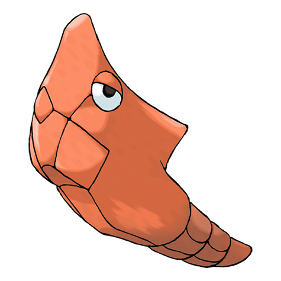
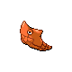
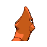

# #011 Metapod (Cocoon Pokémon)

| Official Artwork | Shiny Artwork |
|------------------|---------------|
|  |  |

**Sacred Gold:** Inside the shell, it is soft and weak as it prepares to evolve. It stays motionless in the shell.

**Storm Silver:** It prepares for evolution by hardening its shell as much as possible to protect its soft body.

---

## Media

### Default Sprites

| Front | Shiny | Back | Shiny |
|-------|-------|------|-------|
|  |  |  |  |

### Cries

Latest (Gen VI+):

<audio controls>
<source src='../../assets/cries/metapod/latest.ogg' type='audio/ogg'>
  Your browser does not support the audio element.
</audio>

Legacy:

<audio controls>
<source src='../../assets/cries/metapod/legacy.ogg' type='audio/ogg'>
  Your browser does not support the audio element.
</audio>

---

## Pokédex Data

| National № | Type(s) | Height | Weight | Abilities | Local № |
|------------|---------|--------|--------|-----------|---------|
| #11 | {: width="48"} | 0.7 m / 2.3 ft | 9.9 kg / 21.8 lbs | 1. Shed Skin | N/A |

---

## Base Stats
|   | HP | Attack | Defense | Sp. Atk | Sp. Def | Speed |
|---|----|--------|---------|---------|---------|-------|
| **Base** | 50 | 20 | 55 | 25 | 25 | 30 |
| **Min** | 210 | 40 | 103 | 49 | 49 | 58 |
| **Max** | 304 | 152 | 229 | 163 | 163 | 174 |

The ranges shown above are for a level 100 Pokémon. Maximum values are based on a beneficial nature, 252 EVs, 31 IVs; minimum values are based on a hindering nature, 0 EVs, 0 IVs.

---

## Forms & Evolutions

!!! warning "WARNING"

    Information on evolutions may not be 100% accurate; differences between evolution methods across generations are not accounted for.

### Forms

Metapod has no alternate forms.

### Evolution Line

1. [Caterpie](caterpie.md/)
    1. Level Up: [Metapod](metapod.md/)
        1. Level Up: [Butterfree](butterfree.md/)

---

## Training

| EV Yield | Catch Rate | Base Friendship | Base Exp. | Growth Rate | Held Items |
|----------|------------|-----------------|-----------|-------------|------------|
| 2 Def | 120 | 50 | 72 | Medium | N/A |

---

## Breeding

| Egg Groups | Egg Cycles | Gender | Dimorphic | Color | Shape |
|------------|------------|--------|-----------|-------|-------|
| 1. Bug | 15 | 50.0% Male 50.0% Female | False | Green | Squiggle |

---

## Moves

!!! warning "WARNING"

    Specific move information may be incorrect. However, the general movepool should be accurate; this includes changes made in Sacred Gold and Storm Silver.

### Level Up Moves

| Lv. | Move | Type | Cat. | Power | Acc. | PP |
| --- | --- | --- | --- | --- | --- | --- |
| 1 | Harden | {: width="48"} | {: width="36"} | — | — | 30 |
| 7 | Harden | {: width="48"} | {: width="36"} | — | — | 30 |

### TM Moves

Metapod cannot learn any TM moves.
### Egg Moves

Metapod cannot learn any moves by breeding.
### Tutor Moves

Metapod cannot learn any moves from tutors.
