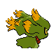

# #200 Misdreavus (Screech Pokémon)

| Official Artwork | Shiny Artwork |
|------------------|---------------|
|  |  |

**Sacred Gold:** It likes playing mischievous tricks, such as screaming and wailing to startle people at night.

**Storm Silver:** It loves to bite and yank people’s hair from behind without warning, just to see their shocked reactions.

---

## Media

### Default Sprites

| Front | Shiny | Back | Shiny |
|-------|-------|------|-------|
|  |  |  |  |

### Cries

Latest (Gen VI+):

<audio controls>
<source src='../../assets/cries/misdreavus/latest.ogg' type='audio/ogg'>
  Your browser does not support the audio element.
</audio>

Legacy:

<audio controls>
<source src='../../assets/cries/misdreavus/legacy.ogg' type='audio/ogg'>
  Your browser does not support the audio element.
</audio>

---

## Pokédex Data

| National № | Type(s) | Height | Weight | Abilities | Local № |
|------------|---------|--------|--------|-----------|---------|
| #200 | {: width="48"} | 0.7 m / 2.3 ft | 1.0 kg / 2.2 lbs | 1. Levitate | #72 |

---

## Base Stats
|   | HP | Attack | Defense | Sp. Atk | Sp. Def | Speed |
|---|----|--------|---------|---------|---------|-------|
| **Base** | 60 | 60 | 60 | 85 | 85 | 85 |
| **Min** | 230 | 112 | 112 | 157 | 157 | 157 |
| **Max** | 324 | 240 | 240 | 295 | 295 | 295 |

The ranges shown above are for a level 100 Pokémon. Maximum values are based on a beneficial nature, 252 EVs, 31 IVs; minimum values are based on a hindering nature, 0 EVs, 0 IVs.

---

## Forms & Evolutions

!!! warning "WARNING"

    Information on evolutions may not be 100% accurate; differences between evolution methods across generations are not accounted for.

### Forms

Misdreavus has no alternate forms.

### Evolution Line

1. [Misdreavus](misdreavus.md/)
    1. Use Item: [Mismagius](mismagius.md/)

---

## Training

| EV Yield | Catch Rate | Base Friendship | Base Exp. | Growth Rate | Held Items |
|----------|------------|-----------------|-----------|-------------|------------|
| 1 Special Defense | 45 | 35 | 87 | Fas |

---

## Breeding

| Egg Groups | Egg Cycles | Gender | Dimorphic | Color | Shape |
|------------|------------|--------|-----------|-------|-------|
| 1. Indeterminate | 25 | 50.0% Male 50.0% Female | False | Gray | Ball |

---

## Moves

!!! warning "WARNING"

    Specific move information may be incorrect. However, the general movepool should be accurate; this includes changes made in Sacred Gold and Storm Silver.

### Level Up Moves

| Lv. | Move | Type | Cat. | Power | Acc. | PP |
| --- | --- | --- | --- | --- | --- | --- |
| 1 | Growl | {: width="48"} | {: width="36"} | — | 100 | 40 |
| 1 | Psywave | {: width="48"} | {: width="36"} | — | 100 | 15 |
| 5 | Spite | {: width="48"} | {: width="36"} | — | 100 | 10 |
| 10 | Astonish | {: width="48"} | {: width="36"} | 30 | 100 | 15 |
| 14 | Confuse Ray | {: width="48"} | {: width="36"} | — | 100 | 10 |
| 19 | Mean Look | {: width="48"} | {: width="36"} | — | — | 5 |
| 23 | Hex | {: width="48"} | {: width="36"} | 65 | 100 | 10 |
| 28 | Psybeam | {: width="48"} | {: width="36"} | 65 | 100 | 20 |
| 32 | Pain Split | {: width="48"} | {: width="36"} | — | — | 20 |
| 37 | Payback | {: width="48"} | {: width="36"} | 50 | 100 | 10 |
| 41 | Shadow Ball | {: width="48"} | {: width="36"} | 80 | 100 | 15 |
| 46 | Perish Song | {: width="48"} | {: width="36"} | — | — | 5 |
| 50 | Grudge | {: width="48"} | {: width="36"} | — | — | 5 |
| 54 | Hypnosis | {: width="48"} | {: width="36"} | — | 60 | 20 |
| 55 | Power Gem | {: width="48"} | {: width="36"} | 80 | 100 | 20 |
| 58 | Nasty Plot | {: width="48"} | {: width="36"} | — | — | 20 |
| 63 | Destiny Bond | {: width="48"} | {: width="36"} | — | — | 5 |

### TM Moves

| TM | Move | Type | Cat. | Power | Acc. | PP |
| --- | --- | --- | --- | --- | --- | --- |
| TM04 | Calm Mind | {: width="48"} | {: width="36"} | — | — | 20 |
| TM06 | Toxic | {: width="48"} | {: width="36"} | — | 90 | 10 |
| TM10 | Hidden Power | {: width="48"} | {: width="36"} | 60 | 100 | 15 |
| TM11 | Sunny Day | {: width="48"} | {: width="36"} | — | — | 5 |
| TM12 | Taunt | {: width="48"} | {: width="36"} | — | 100 | 20 |
| TM17 | Protect | {: width="48"} | {: width="36"} | — | — | 10 |
| TM18 | Rain Dance | {: width="48"} | {: width="36"} | — | — | 5 |
| TM19 | Telekinesis | {: width="48"} | {: width="36"} | — | — | 15 |
| TM21 | Frustration | {: width="48"} | {: width="36"} | — | 100 | 20 |
| TM24 | Thunderbolt | {: width="48"} | {: width="36"} | 90 | 100 | 15 |
| TM25 | Thunder | {: width="48"} | {: width="36"} | 110 | 70 | 10 |
| TM27 | Return | {: width="48"} | {: width="36"} | — | 100 | 20 |
| TM29 | Psychic | {: width="48"} | {: width="36"} | 90 | 100 | 10 |
| TM30 | Shadow Ball | {: width="48"} | {: width="36"} | 80 | 100 | 15 |
| TM32 | Double Team | {: width="48"} | {: width="36"} | — | — | 15 |
| TM40 | Aerial Ace | {: width="48"} | {: width="36"} | 60 | — | 20 |
| TM41 | Torment | {: width="48"} | {: width="36"} | — | 100 | 15 |
| TM42 | Facade | {: width="48"} | {: width="36"} | 70 | 100 | 20 |
| TM44 | Rest | {: width="48"} | {: width="36"} | — | — | 5 |
| TM45 | Attract | {: width="48"} | {: width="36"} | — | 100 | 15 |
| TM46 | Thief | {: width="48"} | {: width="36"} | 60 | 100 | 25 |
| TM48 | Round | {: width="48"} | {: width="36"} | 60 | 100 | 15 |
| TM49 | Echoed Voice | {: width="48"} | {: width="36"} | 40 | 100 | 15 |
| TM57 | Charge Beam | {: width="48"} | {: width="36"} | 50 | 90 | 10 |
| TM61 | Will O Wisp | {: width="48"} | {: width="36"} | — | 85 | 15 |
| TM63 | Embargo | {: width="48"} | {: width="36"} | — | 100 | 15 |
| TM66 | Payback | {: width="48"} | {: width="36"} | 50 | 100 | 10 |
| TM70 | Flash | {: width="48"} | {: width="36"} | — | 100 | 20 |
| TM73 | Thunder Wave | {: width="48"} | {: width="36"} | — | 90 | 20 |
| TM77 | Psych Up | {: width="48"} | {: width="36"} | — | — | 10 |
| TM85 | Dream Eater | {: width="48"} | {: width="36"} | 100 | 100 | 15 |
| TM87 | Swagger | {: width="48"} | {: width="36"} | — | 85 | 15 |
| TM90 | Substitute | {: width="48"} | {: width="36"} | — | — | 10 |
| TM92 | Trick Room | {: width="48"} | {: width="36"} | — | — | 5 |

### Egg Moves

| Move | Type | Cat. | Power | Acc. | PP |
| --- | --- | --- | --- | --- | --- |
| Screech | {: width="48"} | {: width="36"} | — | 85 | 40 |
| Curse | {: width="48"} | {: width="36"} | — | — | 10 |
| Spite | {: width="48"} | {: width="36"} | — | 100 | 10 |
| Destiny Bond | {: width="48"} | {: width="36"} | — | — | 5 |
| Memento | {: width="48"} | {: width="36"} | — | 100 | 10 |
| Skill Swap | {: width="48"} | {: width="36"} | — | — | 10 |
| Imprison | {: width="48"} | {: width="36"} | — | — | 10 |
| Sucker Punch | {: width="48"} | {: width="36"} | 70 | 100 | 5 |
| Nasty Plot | {: width="48"} | {: width="36"} | — | — | 20 |
| Shadow Sneak | {: width="48"} | {: width="36"} | 40 | 100 | 30 |
| Ominous Wind | {: width="48"} | {: width="36"} | 60 | 100 | 5 |
| Wonder Room | {: width="48"} | {: width="36"} | — | — | 10 |

### Tutor Moves

Misdreavus cannot learn any moves from tutors.
