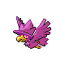
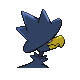
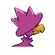
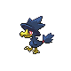
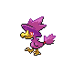
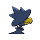
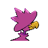

# #198 Murkrow (Darkness Pokémon)

| Official Artwork | Shiny Artwork |
|------------------|---------------|
|  |  |

**Sacred Gold:** Feared and loathed by many, it is believed to bring misfortune to all those who see it at night.

**Storm Silver:** It is said that when chased, it lures its attacker onto dark mountain trails where the foe will get lost.

---

## Media

### Default Sprites

| Front | Shiny | Back | Shiny |
|-------|-------|------|-------|
|  |  |  |  |

### Female Sprites

| Front | Shiny | Back | Shiny |
|-------|-------|------|-------|
|  |  |  |  |

### Cries

Latest (Gen VI+):

<audio controls>
<source src='../../assets/cries/murkrow/latest.ogg' type='audio/ogg'>
  Your browser does not support the audio element.
</audio>

Legacy:

<audio controls>
<source src='../../assets/cries/murkrow/legacy.ogg' type='audio/ogg'>
  Your browser does not support the audio element.
</audio>

---

## Pokédex Data

| National № | Type(s) | Height | Weight | Abilities | Local № |
|------------|---------|--------|--------|-----------|---------|
| #198 | {: width="48"} {: width="48"} | 0.5 m / 1.6 ft | 2.1 kg / 4.6 lbs | 1. Insomnia 2. Super Luck 3. Prankster | #74 |

---

## Base Stats
|   | HP | Attack | Defense | Sp. Atk | Sp. Def | Speed |
|---|----|--------|---------|---------|---------|-------|
| **Base** | 60 | 85 | 42 | 85 | 42 | 91 |
| **Min** | 230 | 157 | 80 | 157 | 80 | 168 |
| **Max** | 324 | 295 | 201 | 295 | 201 | 309 |

The ranges shown above are for a level 100 Pokémon. Maximum values are based on a beneficial nature, 252 EVs, 31 IVs; minimum values are based on a hindering nature, 0 EVs, 0 IVs.

---

## Forms & Evolutions

!!! warning "WARNING"

    Information on evolutions may not be 100% accurate; differences between evolution methods across generations are not accounted for.

### Forms

Murkrow has no alternate forms.

### Evolution Line

1. [Murkrow](murkrow.md/)
    1. Use Item: [Honchkrow](honchkrow.md/)

---

## Training

| EV Yield | Catch Rate | Base Friendship | Base Exp. | Growth Rate | Held Items |
|----------|------------|-----------------|-----------|-------------|------------|
| 1 Speed | 30 | 35 | 81 | Medium Slow | N/A |

---

## Breeding

| Egg Groups | Egg Cycles | Gender | Dimorphic | Color | Shape |
|------------|------------|--------|-----------|-------|-------|
| 1. Flying | 20 | 50.0% Male 50.0% Female | True | Black | Wings |

---

## Moves

!!! warning "WARNING"

    Specific move information may be incorrect. However, the general movepool should be accurate; this includes changes made in Sacred Gold and Storm Silver.

### Level Up Moves

| Lv. | Move | Type | Cat. | Power | Acc. | PP |
| --- | --- | --- | --- | --- | --- | --- |
| 1 | Astonish | {: width="48"} | {: width="36"} | 30 | 100 | 15 |
| 1 | Peck | {: width="48"} | {: width="36"} | 35 | 100 | 35 |
| 5 | Pursuit | {: width="48"} | {: width="36"} | 40 | 100 | 20 |
| 11 | Haze | {: width="48"} | {: width="36"} | — | — | 30 |
| 15 | Wing Attack | {: width="48"} | {: width="36"} | 60 | 100 | 35 |
| 21 | Night Shade | {: width="48"} | {: width="36"} | — | 100 | 15 |
| 25 | Assurance | {: width="48"} | {: width="36"} | 60 | 100 | 10 |
| 31 | Taunt | {: width="48"} | {: width="36"} | — | 100 | 20 |
| 35 | Feint Attack | {: width="48"} | {: width="36"} | 60 | — | 20 |
| 41 | Mean Look | {: width="48"} | {: width="36"} | — | — | 5 |
| 45 | Sucker Punch | {: width="48"} | {: width="36"} | 70 | 100 | 5 |
| 49 | Beat Up | {: width="48"} | {: width="36"} | — | 100 | 10 |
| 53 | Brave Bird | {: width="48"} | {: width="36"} | 120 | 100 | 15 |

### TM Moves

| TM | Move | Type | Cat. | Power | Acc. | PP |
| --- | --- | --- | --- | --- | --- | --- |
| HM02 | Fly | {: width="48"} | {: width="36"} | 90 | 95 | 15 |
| TM04 | Calm Mind | {: width="48"} | {: width="36"} | — | — | 20 |
| TM06 | Toxic | {: width="48"} | {: width="36"} | — | 90 | 10 |
| TM10 | Hidden Power | {: width="48"} | {: width="36"} | 60 | 100 | 15 |
| TM11 | Sunny Day | {: width="48"} | {: width="36"} | — | — | 5 |
| TM12 | Taunt | {: width="48"} | {: width="36"} | — | 100 | 20 |
| TM17 | Protect | {: width="48"} | {: width="36"} | — | — | 10 |
| TM18 | Rain Dance | {: width="48"} | {: width="36"} | — | — | 5 |
| TM21 | Frustration | {: width="48"} | {: width="36"} | — | 100 | 20 |
| TM27 | Return | {: width="48"} | {: width="36"} | — | 100 | 20 |
| TM29 | Psychic | {: width="48"} | {: width="36"} | 90 | 100 | 10 |
| TM30 | Shadow Ball | {: width="48"} | {: width="36"} | 80 | 100 | 15 |
| TM32 | Double Team | {: width="48"} | {: width="36"} | — | — | 15 |
| TM40 | Aerial Ace | {: width="48"} | {: width="36"} | 60 | — | 20 |
| TM41 | Torment | {: width="48"} | {: width="36"} | — | 100 | 15 |
| TM42 | Facade | {: width="48"} | {: width="36"} | 70 | 100 | 20 |
| TM43 | Secret Power | {: width="48"} | {: width="36"} | 70 | 100 | 20 |
| TM44 | Rest | {: width="48"} | {: width="36"} | — | — | 5 |
| TM45 | Attract | {: width="48"} | {: width="36"} | — | 100 | 15 |
| TM46 | Thief | {: width="48"} | {: width="36"} | 60 | 100 | 25 |
| TM47 | Steel Wing | {: width="48"} | {: width="36"} | 70 | 90 | 25 |
| TM49 | Snatch | {: width="48"} | {: width="36"} | — | — | 10 |
| TM51 | Roost | {: width="48"} | {: width="36"} | — | — | 5 |
| TM58 | Endure | {: width="48"} | {: width="36"} | — | — | 10 |
| TM63 | Embargo | {: width="48"} | {: width="36"} | — | 100 | 15 |
| TM66 | Payback | {: width="48"} | {: width="36"} | 50 | 100 | 10 |
| TM73 | Thunder Wave | {: width="48"} | {: width="36"} | — | 90 | 20 |
| TM77 | Psych Up | {: width="48"} | {: width="36"} | — | — | 10 |
| TM78 | Captivate | {: width="48"} | {: width="36"} | — | 100 | 20 |
| TM79 | Dark Pulse | {: width="48"} | {: width="36"} | 80 | 100 | 15 |
| TM82 | Sleep Talk | {: width="48"} | {: width="36"} | — | — | 10 |
| TM83 | Natural Gift | {: width="48"} | {: width="36"} | — | 100 | 15 |
| TM85 | Dream Eater | {: width="48"} | {: width="36"} | 100 | 100 | 15 |
| TM87 | Swagger | {: width="48"} | {: width="36"} | — | 85 | 15 |
| TM88 | Pluck | {: width="48"} | {: width="36"} | 60 | 100 | 20 |
| TM90 | Substitute | {: width="48"} | {: width="36"} | — | — | 10 |

### Egg Moves

| Move | Type | Cat. | Power | Acc. | PP |
| --- | --- | --- | --- | --- | --- |
| Wing Attack | {: width="48"} | {: width="36"} | 60 | 100 | 35 |
| Whirlwind | {: width="48"} | {: width="36"} | — | — | 20 |
| Drill Peck | {: width="48"} | {: width="36"} | 80 | 100 | 20 |
| Screech | {: width="48"} | {: width="36"} | — | 85 | 40 |
| Confuse Ray | {: width="48"} | {: width="36"} | — | 100 | 10 |
| Mirror Move | {: width="48"} | {: width="36"} | — | — | 20 |
| Sky Attack | {: width="48"} | {: width="36"} | 140 | 90 | 5 |
| Feint Attack | {: width="48"} | {: width="36"} | 60 | — | 20 |
| Perish Song | {: width="48"} | {: width="36"} | — | — | 5 |
| Feather Dance | {: width="48"} | {: width="36"} | — | 100 | 15 |
| Psycho Shift | {: width="48"} | {: width="36"} | — | 100 | 10 |
| Brave Bird | {: width="48"} | {: width="36"} | 120 | 100 | 15 |

### Tutor Moves

| Move | Type | Cat. | Power | Acc. | PP |
| --- | --- | --- | --- | --- | --- |
| Swift | {: width="48"} | {: width="36"} | 60 | — | 20 |
| Spite | {: width="48"} | {: width="36"} | — | 100 | 10 |
| Mud Slap | {: width="48"} | {: width="36"} | 20 | 100 | 10 |
| Icy Wind | {: width="48"} | {: width="36"} | 55 | 95 | 15 |
| Twister | {: width="48"} | {: width="36"} | 40 | 100 | 20 |
| Uproar | {: width="48"} | {: width="36"} | 90 | 100 | 10 |
| Heat Wave | {: width="48"} | {: width="36"} | 95 | 90 | 10 |
| Air Cutter | {: width="48"} | {: width="36"} | 60 | 95 | 25 |
| Tailwind | {: width="48"} | {: width="36"} | — | — | 15 |
| Sucker Punch | {: width="48"} | {: width="36"} | 70 | 100 | 5 |
| Ominous Wind | {: width="48"} | {: width="36"} | 60 | 100 | 5 |

