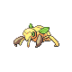
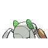
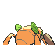

# #290 Nincada (Trainee Pokémon)

| Official Artwork | Shiny Artwork |
|------------------|---------------|
|  |  |

It can sometimes live underground for more than 10 years. It absorbs nutrients from the roots of trees.

---

## Media

### Default Sprites

| Front | Shiny | Back | Shiny |
|-------|-------|------|-------|
|  |  |  |  |

### Cries

Latest (Gen VI+):

<audio controls>
<source src='../../assets/cries/nincada/latest.ogg' type='audio/ogg'>
  Your browser does not support the audio element.
</audio>

Legacy:

<audio controls>
<source src='../../assets/cries/nincada/legacy.ogg' type='audio/ogg'>
  Your browser does not support the audio element.
</audio>

---

## Pokédex Data

| National № | Type(s) | Height | Weight | Abilities | Local № |
|------------|---------|--------|--------|-----------|---------|
| #290 | {: width="48"} {: width="48"} | 0.5 m / 1.6 ft | 5.5 kg / 12.1 lbs | 1. Compound Eyes 2. Run Away | N/A |

---

## Base Stats
|   | HP | Attack | Defense | Sp. Atk | Sp. Def | Speed |
|---|----|--------|---------|---------|---------|-------|
| **Base** | 31 | 45 | 90 | 30 | 30 | 40 |
| **Min** | 172 | 85 | 166 | 58 | 58 | 76 |
| **Max** | 266 | 207 | 306 | 174 | 174 | 196 |

The ranges shown above are for a level 100 Pokémon. Maximum values are based on a beneficial nature, 252 EVs, 31 IVs; minimum values are based on a hindering nature, 0 EVs, 0 IVs.

---

## Forms & Evolutions

!!! warning "WARNING"

    Information on evolutions may not be 100% accurate; differences between evolution methods across generations are not accounted for.

### Forms

Nincada has no alternate forms.

### Evolution Line

1. [Nincada](nincada.md/)
    1. Level Up: [Ninjask](ninjask.md/)

    2. Shed: [Shedinja](shedinja.md/)

---

## Training

| EV Yield | Catch Rate | Base Friendship | Base Exp. | Growth Rate | Held Items |
|----------|------------|-----------------|-----------|-------------|------------|
| 1 Defense | 255 | 50 | 53 | Slow Then Very Fas |

---

## Breeding

| Egg Groups | Egg Cycles | Gender | Dimorphic | Color | Shape |
|------------|------------|--------|-----------|-------|-------|
| 1. Bug | 15 | 50.0% Male 50.0% Female | False | Gray | Armor |

---

## Moves

!!! warning "WARNING"

    Specific move information may be incorrect. However, the general movepool should be accurate; this includes changes made in Sacred Gold and Storm Silver.

### Level Up Moves

| Lv. | Move | Type | Cat. | Power | Acc. | PP |
| --- | --- | --- | --- | --- | --- | --- |
| 1 | Harden | {: width="48"} | {: width="36"} | — | — | 30 |
| 1 | Scratch | {: width="48"} | {: width="36"} | 40 | 100 | 35 |
| 5 | Leech Life | {: width="48"} | {: width="36"} | 80 | 100 | 10 |
| 9 | Sand Attack | {: width="48"} | {: width="36"} | — | 100 | 15 |
| 14 | Fury Swipes | {: width="48"} | {: width="36"} | 18 | 80 | 15 |
| 19 | Mind Reader | {: width="48"} | {: width="36"} | — | — | 5 |
| 25 | False Swipe | {: width="48"} | {: width="36"} | 40 | 100 | 40 |
| 31 | Mud Slap | {: width="48"} | {: width="36"} | 20 | 100 | 10 |
| 38 | Metal Claw | {: width="48"} | {: width="36"} | 50 | 95 | 35 |
| 45 | Dig | {: width="48"} | {: width="36"} | 80 | 100 | 10 |

### TM Moves

| TM | Move | Type | Cat. | Power | Acc. | PP |
| --- | --- | --- | --- | --- | --- | --- |
| HM01 | Cut | {: width="48"} | {: width="36"} | 60 | 95 | 30 |
| TM01 | Hone Claws | {: width="48"} | {: width="36"} | — | — | 15 |
| TM06 | Toxic | {: width="48"} | {: width="36"} | — | 90 | 10 |
| TM10 | Hidden Power | {: width="48"} | {: width="36"} | 60 | 100 | 15 |
| TM11 | Sunny Day | {: width="48"} | {: width="36"} | — | — | 5 |
| TM17 | Protect | {: width="48"} | {: width="36"} | — | — | 10 |
| TM21 | Frustration | {: width="48"} | {: width="36"} | — | 100 | 20 |
| TM22 | Solar Beam | {: width="48"} | {: width="36"} | 120 | 100 | 10 |
| TM27 | Return | {: width="48"} | {: width="36"} | — | 100 | 20 |
| TM28 | Dig | {: width="48"} | {: width="36"} | 80 | 100 | 10 |
| TM30 | Shadow Ball | {: width="48"} | {: width="36"} | 80 | 100 | 15 |
| TM32 | Double Team | {: width="48"} | {: width="36"} | — | — | 15 |
| TM37 | Sandstorm | {: width="48"} | {: width="36"} | — | — | 10 |
| TM40 | Aerial Ace | {: width="48"} | {: width="36"} | 60 | — | 20 |
| TM42 | Facade | {: width="48"} | {: width="36"} | 70 | 100 | 20 |
| TM44 | Rest | {: width="48"} | {: width="36"} | — | — | 5 |
| TM48 | Round | {: width="48"} | {: width="36"} | 60 | 100 | 15 |
| TM54 | False Swipe | {: width="48"} | {: width="36"} | 40 | 100 | 40 |
| TM70 | Flash | {: width="48"} | {: width="36"} | — | 100 | 20 |
| TM76 | Struggle Bug | {: width="48"} | {: width="36"} | 50 | 100 | 20 |
| TM81 | X Scissor | {: width="48"} | {: width="36"} | 80 | 100 | 15 |
| TM87 | Swagger | {: width="48"} | {: width="36"} | — | 85 | 15 |
| TM90 | Substitute | {: width="48"} | {: width="36"} | — | — | 10 |

### Egg Moves

| Move | Type | Cat. | Power | Acc. | PP |
| --- | --- | --- | --- | --- | --- |
| Gust | {: width="48"} | {: width="36"} | 40 | 100 | 35 |
| Feint Attack | {: width="48"} | {: width="36"} | 60 | — | 20 |
| Endure | {: width="48"} | {: width="36"} | — | — | 10 |
| Silver Wind | {: width="48"} | {: width="36"} | 60 | 100 | 5 |
| Night Slash | {: width="48"} | {: width="36"} | 70 | 100 | 15 |
| Bug Buzz | {: width="48"} | {: width="36"} | 90 | 100 | 10 |
| Bug Bite | {: width="48"} | {: width="36"} | 60 | 100 | 20 |
| Final Gambit | {: width="48"} | {: width="36"} | — | 100 | 5 |

### Tutor Moves

Nincada cannot learn any moves from tutors.
