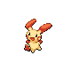
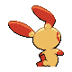

# #311 Plusle (Cheering Pokémon)

| Official Artwork | Shiny Artwork |
|------------------|---------------|
|  |  |

It absorbs electricity from telephone poles. It shorts out its body to create crackling noises.

---

## Media

### Default Sprites

| Front | Shiny | Back | Shiny |
|-------|-------|------|-------|
|  |  |  |  |

### Cries

Latest (Gen VI+):

<audio controls>
<source src='../../assets/cries/plusle/latest.ogg' type='audio/ogg'>
  Your browser does not support the audio element.
</audio>

Legacy:

<audio controls>
<source src='../../assets/cries/plusle/legacy.ogg' type='audio/ogg'>
  Your browser does not support the audio element.
</audio>

---

## Pokédex Data

| National № | Type(s) | Height | Weight | Abilities | Local № |
|------------|---------|--------|--------|-----------|---------|
| #311 | {: width="48"} | 0.4 m / 1.3 ft | 4.2 kg / 9.3 lbs | 1. Plus 2. Lightning Rod | N/A |

---

## Base Stats
|   | HP | Attack | Defense | Sp. Atk | Sp. Def | Speed |
|---|----|--------|---------|---------|---------|-------|
| **Base** | 60 | 50 | 50 | 90 | 85 | 115 |
| **Min** | 230 | 94 | 94 | 166 | 157 | 211 |
| **Max** | 324 | 218 | 218 | 306 | 295 | 361 |

The ranges shown above are for a level 100 Pokémon. Maximum values are based on a beneficial nature, 252 EVs, 31 IVs; minimum values are based on a hindering nature, 0 EVs, 0 IVs.

---

## Forms & Evolutions

!!! warning "WARNING"

    Information on evolutions may not be 100% accurate; differences between evolution methods across generations are not accounted for.

### Forms

Plusle has no alternate forms.

### Evolution Line

1. [Plusle](plusle.md/)

---

## Training

| EV Yield | Catch Rate | Base Friendship | Base Exp. | Growth Rate | Held Items |
|----------|------------|-----------------|-----------|-------------|------------|
| 1 Speed | 200 | 70 | 142 | Mediu |

---

## Breeding

| Egg Groups | Egg Cycles | Gender | Dimorphic | Color | Shape |
|------------|------------|--------|-----------|-------|-------|
| 1. Fairy | 20 | 50.0% Male 50.0% Female | False | Yellow | Upright |

---

## Moves

!!! warning "WARNING"

    Specific move information may be incorrect. However, the general movepool should be accurate; this includes changes made in Sacred Gold and Storm Silver.

### Level Up Moves

| Lv. | Move | Type | Cat. | Power | Acc. | PP |
| --- | --- | --- | --- | --- | --- | --- |
| 1 | Growl | {: width="48"} | {: width="36"} | — | 100 | 40 |
| 3 | Thunder Wave | {: width="48"} | {: width="36"} | — | 90 | 20 |
| 7 | Quick Attack | {: width="48"} | {: width="36"} | 40 | 100 | 30 |
| 10 | Helping Hand | {: width="48"} | {: width="36"} | — | — | 20 |
| 15 | Spark | {: width="48"} | {: width="36"} | 65 | 100 | 20 |
| 17 | Encore | {: width="48"} | {: width="36"} | — | 100 | 5 |
| 21 | Fake Tears | {: width="48"} | {: width="36"} | — | 100 | 20 |
| 24 | Copycat | {: width="48"} | {: width="36"} | — | — | 20 |
| 29 | Electro Ball | {: width="48"} | {: width="36"} | — | 100 | 10 |
| 31 | Swift | {: width="48"} | {: width="36"} | 60 | — | 20 |
| 35 | Fake Tears | {: width="48"} | {: width="36"} | — | 100 | 20 |
| 38 | Charge | {: width="48"} | {: width="36"} | — | — | 20 |
| 42 | Thunder | {: width="48"} | {: width="36"} | 110 | 70 | 10 |
| 44 | Baton Pass | {: width="48"} | {: width="36"} | — | — | 40 |
| 48 | Agility | {: width="48"} | {: width="36"} | — | — | 30 |
| 51 | Last Resort | {: width="48"} | {: width="36"} | 140 | 100 | 5 |
| 56 | Nasty Plot | {: width="48"} | {: width="36"} | — | — | 20 |
| 63 | Entrainment | {: width="48"} | {: width="36"} | — | 100 | 15 |

### TM Moves

| TM | Move | Type | Cat. | Power | Acc. | PP |
| --- | --- | --- | --- | --- | --- | --- |
| TM06 | Toxic | {: width="48"} | {: width="36"} | — | 90 | 10 |
| TM10 | Hidden Power | {: width="48"} | {: width="36"} | 60 | 100 | 15 |
| TM16 | Light Screen | {: width="48"} | {: width="36"} | — | — | 30 |
| TM17 | Protect | {: width="48"} | {: width="36"} | — | — | 10 |
| TM18 | Rain Dance | {: width="48"} | {: width="36"} | — | — | 5 |
| TM21 | Frustration | {: width="48"} | {: width="36"} | — | 100 | 20 |
| TM24 | Thunderbolt | {: width="48"} | {: width="36"} | 90 | 100 | 15 |
| TM25 | Thunder | {: width="48"} | {: width="36"} | 110 | 70 | 10 |
| TM27 | Return | {: width="48"} | {: width="36"} | — | 100 | 20 |
| TM32 | Double Team | {: width="48"} | {: width="36"} | — | — | 15 |
| TM42 | Facade | {: width="48"} | {: width="36"} | 70 | 100 | 20 |
| TM44 | Rest | {: width="48"} | {: width="36"} | — | — | 5 |
| TM45 | Attract | {: width="48"} | {: width="36"} | — | 100 | 15 |
| TM48 | Round | {: width="48"} | {: width="36"} | 60 | 100 | 15 |
| TM49 | Echoed Voice | {: width="48"} | {: width="36"} | 40 | 100 | 15 |
| TM56 | Fling | {: width="48"} | {: width="36"} | — | 100 | 10 |
| TM57 | Charge Beam | {: width="48"} | {: width="36"} | 50 | 90 | 10 |
| TM70 | Flash | {: width="48"} | {: width="36"} | — | 100 | 20 |
| TM72 | Volt Switch | {: width="48"} | {: width="36"} | 70 | 100 | 20 |
| TM73 | Thunder Wave | {: width="48"} | {: width="36"} | — | 90 | 20 |
| TM86 | Grass Knot | {: width="48"} | {: width="36"} | — | 100 | 20 |
| TM87 | Swagger | {: width="48"} | {: width="36"} | — | 85 | 15 |
| TM90 | Substitute | {: width="48"} | {: width="36"} | — | — | 10 |
| TM93 | Wild Charge | {: width="48"} | {: width="36"} | 90 | 100 | 15 |

### Egg Moves

| Move | Type | Cat. | Power | Acc. | PP |
| --- | --- | --- | --- | --- | --- |
| Sing | {: width="48"} | {: width="36"} | — | 55 | 15 |
| Sweet Kiss | {: width="48"} | {: width="36"} | — | 75 | 10 |
| Wish | {: width="48"} | {: width="36"} | — | — | 10 |
| Lucky Chant | {: width="48"} | {: width="36"} | — | — | 30 |
| Discharge | {: width="48"} | {: width="36"} | 80 | 100 | 15 |

### Tutor Moves

Plusle cannot learn any moves from tutors.
