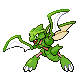
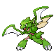
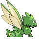
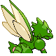

# #123 Scyther (Mantis Pokémon)

| Official Artwork | Shiny Artwork |
|------------------|---------------|
|  |  |

**Sacred Gold:** It slashes through grass with its sharp scythes, moving too fast for the human eye to track.

**Storm Silver:** When it moves, it leaves only a blur. If it hides in grass, its protective coloration makes it invisible.

---

## Media

### Default Sprites

| Front | Shiny | Back | Shiny |
|-------|-------|------|-------|
|  |  |  |  |

### Female Sprites

| Front | Shiny | Back | Shiny |
|-------|-------|------|-------|
|  |  |  |  |

### Cries

Latest (Gen VI+):

<audio controls>
<source src='../../assets/cries/scyther/latest.ogg' type='audio/ogg'>
  Your browser does not support the audio element.
</audio>

Legacy:

<audio controls>
<source src='../../assets/cries/scyther/legacy.ogg' type='audio/ogg'>
  Your browser does not support the audio element.
</audio>

---

## Pokédex Data

| National № | Type(s) | Height | Weight | Abilities | Local № |
|------------|---------|--------|--------|-----------|---------|
| #123 | {: width="48"} {: width="48"} | 1.5 m / 4.9 ft | 56.0 kg / 123.5 lbs | 1. Swarm 2. Technician | N/A |

---

## Base Stats
|   | HP | Attack | Defense | Sp. Atk | Sp. Def | Speed |
|---|----|--------|---------|---------|---------|-------|
| **Base** | 70 | 110 | 80 | 55 | 80 | 105 |
| **Min** | 250 | 202 | 148 | 103 | 148 | 193 |
| **Max** | 344 | 350 | 284 | 229 | 284 | 339 |

The ranges shown above are for a level 100 Pokémon. Maximum values are based on a beneficial nature, 252 EVs, 31 IVs; minimum values are based on a hindering nature, 0 EVs, 0 IVs.

---

## Forms & Evolutions

!!! warning "WARNING"

    Information on evolutions may not be 100% accurate; differences between evolution methods across generations are not accounted for.

### Forms

Scyther has no alternate forms.

### Evolution Line

1. [Scyther](scyther.md/)
    1. Trade: [Scizor](scizor.md/)

---

## Training

| EV Yield | Catch Rate | Base Friendship | Base Exp. | Growth Rate | Held Items |
|----------|------------|-----------------|-----------|-------------|------------|
| 1 Attack | 45 | 50 | 100 | Medium | N/A |

---

## Breeding

| Egg Groups | Egg Cycles | Gender | Dimorphic | Color | Shape |
|------------|------------|--------|-----------|-------|-------|
| 1. Bug | 25 | 50.0% Male 50.0% Female | True | Green | Bug-Wings |

---

## Moves

!!! warning "WARNING"

    Specific move information may be incorrect. However, the general movepool should be accurate; this includes changes made in Sacred Gold and Storm Silver.

### Level Up Moves

| Lv. | Move | Type | Cat. | Power | Acc. | PP |
| --- | --- | --- | --- | --- | --- | --- |
| 1 | Leer | {: width="48"} | {: width="36"} | — | 100 | 30 |
| 1 | Quick Attack | {: width="48"} | {: width="36"} | 40 | 100 | 30 |
| 1 | Vacuum Wave | {: width="48"} | {: width="36"} | 40 | 100 | 30 |
| 5 | Focus Energy | {: width="48"} | {: width="36"} | — | — | 30 |
| 9 | Pursuit | {: width="48"} | {: width="36"} | 40 | 100 | 20 |
| 13 | False Swipe | {: width="48"} | {: width="36"} | 40 | 100 | 40 |
| 17 | Agility | {: width="48"} | {: width="36"} | — | — | 30 |
| 21 | Wing Attack | {: width="48"} | {: width="36"} | 60 | 100 | 35 |
| 25 | Fury Cutter | {: width="48"} | {: width="36"} | 40 | 95 | 20 |
| 29 | Slash | {: width="48"} | {: width="36"} | 70 | 100 | 20 |
| 33 | Razor Wind | {: width="48"} | {: width="36"} | 80 | 100 | 10 |
| 37 | Double Team | {: width="48"} | {: width="36"} | — | — | 15 |
| 41 | X Scissor | {: width="48"} | {: width="36"} | 80 | 100 | 15 |
| 45 | Night Slash | {: width="48"} | {: width="36"} | 70 | 100 | 15 |
| 49 | Double Hit | {: width="48"} | {: width="36"} | 35 | 90 | 10 |
| 53 | Air Slash | {: width="48"} | {: width="36"} | 75 | 95 | 15 |
| 57 | Swords Dance | {: width="48"} | {: width="36"} | — | — | 20 |
| 61 | Feint | {: width="48"} | {: width="36"} | 30 | 100 | 10 |

### TM Moves

| TM | Move | Type | Cat. | Power | Acc. | PP |
| --- | --- | --- | --- | --- | --- | --- |
| HM01 | Cut | {: width="48"} | {: width="36"} | 60 | 95 | 30 |
| TM06 | Toxic | {: width="48"} | {: width="36"} | — | 90 | 10 |
| TM10 | Hidden Power | {: width="48"} | {: width="36"} | 60 | 100 | 15 |
| TM11 | Sunny Day | {: width="48"} | {: width="36"} | — | — | 5 |
| TM15 | Hyper Beam | {: width="48"} | {: width="36"} | 150 | 90 | 5 |
| TM16 | Light Screen | {: width="48"} | {: width="36"} | — | — | 30 |
| TM17 | Protect | {: width="48"} | {: width="36"} | — | — | 10 |
| TM18 | Rain Dance | {: width="48"} | {: width="36"} | — | — | 5 |
| TM20 | Safeguard | {: width="48"} | {: width="36"} | — | — | 25 |
| TM21 | Frustration | {: width="48"} | {: width="36"} | — | 100 | 20 |
| TM27 | Return | {: width="48"} | {: width="36"} | — | 100 | 20 |
| TM31 | Brick Break | {: width="48"} | {: width="36"} | 75 | 100 | 15 |
| TM32 | Double Team | {: width="48"} | {: width="36"} | — | — | 15 |
| TM40 | Aerial Ace | {: width="48"} | {: width="36"} | 60 | — | 20 |
| TM42 | Facade | {: width="48"} | {: width="36"} | 70 | 100 | 20 |
| TM44 | Rest | {: width="48"} | {: width="36"} | — | — | 5 |
| TM45 | Attract | {: width="48"} | {: width="36"} | — | 100 | 15 |
| TM46 | Thief | {: width="48"} | {: width="36"} | 60 | 100 | 25 |
| TM48 | Round | {: width="48"} | {: width="36"} | 60 | 100 | 15 |
| TM54 | False Swipe | {: width="48"} | {: width="36"} | 40 | 100 | 40 |
| TM68 | Giga Impact | {: width="48"} | {: width="36"} | 150 | 90 | 5 |
| TM75 | Swords Dance | {: width="48"} | {: width="36"} | — | — | 20 |
| TM76 | Struggle Bug | {: width="48"} | {: width="36"} | 50 | 100 | 20 |
| TM81 | X Scissor | {: width="48"} | {: width="36"} | 80 | 100 | 15 |
| TM87 | Swagger | {: width="48"} | {: width="36"} | — | 85 | 15 |
| TM89 | U Turn | {: width="48"} | {: width="36"} | 70 | 100 | 20 |
| TM90 | Substitute | {: width="48"} | {: width="36"} | — | — | 10 |
| TM94 | Rock Smash | {: width="48"} | {: width="36"} | 60 | 100 | 15 |

### Egg Moves

| Move | Type | Cat. | Power | Acc. | PP |
| --- | --- | --- | --- | --- | --- |
| Razor Wind | {: width="48"} | {: width="36"} | 80 | 100 | 10 |
| Counter | {: width="48"} | {: width="36"} | — | 100 | 20 |
| Reversal | {: width="48"} | {: width="36"} | — | 100 | 15 |
| Endure | {: width="48"} | {: width="36"} | — | — | 10 |
| Steel Wing | {: width="48"} | {: width="36"} | 70 | 90 | 25 |
| Baton Pass | {: width="48"} | {: width="36"} | — | — | 40 |
| Silver Wind | {: width="48"} | {: width="36"} | 60 | 100 | 5 |
| Night Slash | {: width="48"} | {: width="36"} | 70 | 100 | 15 |
| Bug Buzz | {: width="48"} | {: width="36"} | 90 | 100 | 10 |
| Defog | {: width="48"} | {: width="36"} | — | — | 15 |

### Tutor Moves

Scyther cannot learn any moves from tutors.
