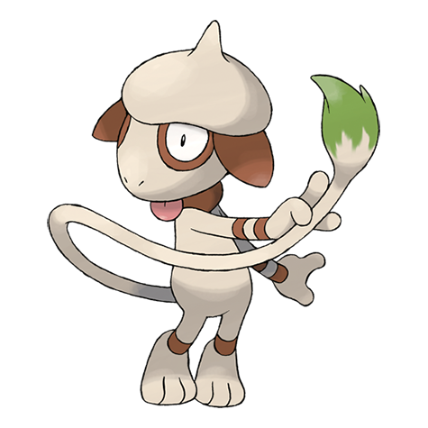
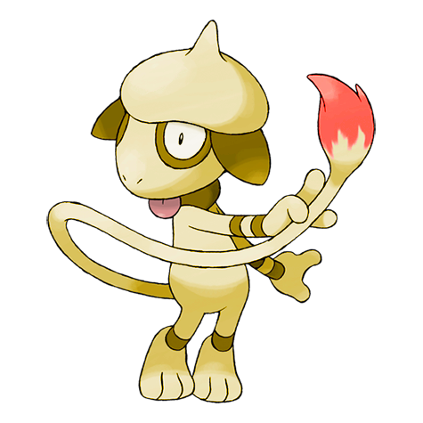
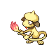
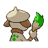
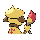

# #235 Smeargle (Painter Pokémon)

| Official Artwork | Shiny Artwork |
|------------------|---------------|
|  |  |

**Sacred Gold:** A special fluid oozes from the tip of its tail. It paints the fluid everywhere to mark its territory.

**Storm Silver:** Once it becomes an adult, it has a tendency to let its comrades plant footprints on its back.

---

## Media

### Default Sprites

| Front | Shiny | Back | Shiny |
|-------|-------|------|-------|
|  |  |  |  |

### Cries

Latest (Gen VI+):

<audio controls>
<source src='../../assets/cries/smeargle/latest.ogg' type='audio/ogg'>
  Your browser does not support the audio element.
</audio>

Legacy:

<audio controls>
<source src='../../assets/cries/smeargle/legacy.ogg' type='audio/ogg'>
  Your browser does not support the audio element.
</audio>

---

## Pokédex Data

| National № | Type(s) | Height | Weight | Abilities | Local № |
|------------|---------|--------|--------|-----------|---------|
| #235 | {: width="48"} | 1.2 m / 3.9 ft | 58.0 kg / 127.9 lbs | 1. Own Tempo 2. Technician | N/A |

---

## Base Stats
|   | HP | Attack | Defense | Sp. Atk | Sp. Def | Speed |
|---|----|--------|---------|---------|---------|-------|
| **Base** | 55 | 20 | 35 | 20 | 45 | 110 |
| **Min** | 220 | 40 | 67 | 40 | 85 | 202 |
| **Max** | 314 | 152 | 185 | 152 | 207 | 350 |

The ranges shown above are for a level 100 Pokémon. Maximum values are based on a beneficial nature, 252 EVs, 31 IVs; minimum values are based on a hindering nature, 0 EVs, 0 IVs.

---

## Forms & Evolutions

!!! warning "WARNING"

    Information on evolutions may not be 100% accurate; differences between evolution methods across generations are not accounted for.

### Forms

Smeargle has no alternate forms.

### Evolution Line

1. [Smeargle](smeargle.md/)

---

## Training

| EV Yield | Catch Rate | Base Friendship | Base Exp. | Growth Rate | Held Items |
|----------|------------|-----------------|-----------|-------------|------------|
| 1 Spd | 45 | 70 | 88 | Fast | N/A |

---

## Breeding

| Egg Groups | Egg Cycles | Gender | Dimorphic | Color | Shape |
|------------|------------|--------|-----------|-------|-------|
| 1. Ground | 20 | 50.0% Male 50.0% Female | False | White | Upright |

---

## Moves

!!! warning "WARNING"

    Specific move information may be incorrect. However, the general movepool should be accurate; this includes changes made in Sacred Gold and Storm Silver.

### Level Up Moves

| Lv. | Move | Type | Cat. | Power | Acc. | PP |
| --- | --- | --- | --- | --- | --- | --- |
| 1 | Sketch | {: width="48"} | {: width="36"} | — | — | 1 |
| 11 | Sketch | {: width="48"} | {: width="36"} | — | — | 1 |
| 21 | Sketch | {: width="48"} | {: width="36"} | — | — | 1 |
| 31 | Sketch | {: width="48"} | {: width="36"} | — | — | 1 |
| 41 | Sketch | {: width="48"} | {: width="36"} | — | — | 1 |
| 51 | Sketch | {: width="48"} | {: width="36"} | — | — | 1 |
| 61 | Sketch | {: width="48"} | {: width="36"} | — | — | 1 |
| 71 | Sketch | {: width="48"} | {: width="36"} | — | — | 1 |
| 81 | Sketch | {: width="48"} | {: width="36"} | — | — | 1 |
| 91 | Sketch | {: width="48"} | {: width="36"} | — | — | 1 |

### TM Moves

Smeargle cannot learn any TM moves.
### Egg Moves

Smeargle cannot learn any moves by breeding.
### Tutor Moves

Smeargle cannot learn any moves from tutors.
