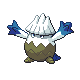
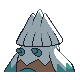
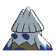
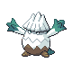
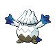
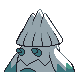
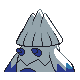

# #459 Snover (Frost Tree Pokémon)

| Official Artwork | Shiny Artwork |
|------------------|---------------|
|  |  |

During cold seasons, it migrates to the mountain’s lower reaches. It returns to the snow-covered summit in the spring.

---

## Media

### Default Sprites

| Front | Shiny | Back | Shiny |
|-------|-------|------|-------|
|  |  |  |  |

### Female Sprites

| Front | Shiny | Back | Shiny |
|-------|-------|------|-------|
|  |  |  |  |

### Cries

Latest (Gen VI+):

<audio controls>
<source src='../../assets/cries/snover/latest.ogg' type='audio/ogg'>
  Your browser does not support the audio element.
</audio>

Legacy:

<audio controls>
<source src='../../assets/cries/snover/legacy.ogg' type='audio/ogg'>
  Your browser does not support the audio element.
</audio>

---

## Pokédex Data

| National № | Type(s) | Height | Weight | Abilities | Local № |
|------------|---------|--------|--------|-----------|---------|
| #459 | {: width="48"} {: width="48"} | 1.0 m / 3.3 ft | 50.5 kg / 111.3 lbs | 1. Snow Warning 2. Soundproof | #142 |

---

## Base Stats
|   | HP | Attack | Defense | Sp. Atk | Sp. Def | Speed |
|---|----|--------|---------|---------|---------|-------|
| **Base** | 60 | 62 | 50 | 62 | 60 | 40 |
| **Min** | 230 | 116 | 94 | 116 | 112 | 76 |
| **Max** | 324 | 245 | 218 | 245 | 240 | 196 |

The ranges shown above are for a level 100 Pokémon. Maximum values are based on a beneficial nature, 252 EVs, 31 IVs; minimum values are based on a hindering nature, 0 EVs, 0 IVs.

---

## Forms & Evolutions

!!! warning "WARNING"

    Information on evolutions may not be 100% accurate; differences between evolution methods across generations are not accounted for.

### Forms

Snover has no alternate forms.

### Evolution Line

1. [Snover](snover.md/)
    1. Level Up: [Abomasnow](abomasnow.md/)

---

## Training

| EV Yield | Catch Rate | Base Friendship | Base Exp. | Growth Rate | Held Items |
|----------|------------|-----------------|-----------|-------------|------------|
| 1 Atk | 120 | 50 | 67 | Slow | Never Melt Ice (5%) |

---

## Breeding

| Egg Groups | Egg Cycles | Gender | Dimorphic | Color | Shape |
|------------|------------|--------|-----------|-------|-------|
| 1. Monster 2. Plant | 20 | 50.0% Male 50.0% Female | True | White | Upright |

---

## Moves

!!! warning "WARNING"

    Specific move information may be incorrect. However, the general movepool should be accurate; this includes changes made in Sacred Gold and Storm Silver.

### Level Up Moves

| Lv. | Move | Type | Cat. | Power | Acc. | PP |
| --- | --- | --- | --- | --- | --- | --- |
| 1 | Leer | {: width="48"} | {: width="36"} | — | 100 | 30 |
| 1 | Powder Snow | {: width="48"} | {: width="36"} | 40 | 100 | 25 |
| 5 | Razor Leaf | {: width="48"} | {: width="36"} | 55 | 95 | 25 |
| 9 | Icy Wind | {: width="48"} | {: width="36"} | 55 | 95 | 15 |
| 13 | Grass Whistle | {: width="48"} | {: width="36"} | — | 55 | 15 |
| 17 | Swagger | {: width="48"} | {: width="36"} | — | 85 | 15 |
| 21 | Mist | {: width="48"} | {: width="36"} | — | — | 30 |
| 26 | Ice Shard | {: width="48"} | {: width="36"} | 40 | 100 | 30 |
| 31 | Ingrain | {: width="48"} | {: width="36"} | — | — | 20 |
| 36 | Wood Hammer | {: width="48"} | {: width="36"} | 120 | 100 | 15 |
| 41 | Blizzard | {: width="48"} | {: width="36"} | 110 | 70 | 5 |
| 46 | Sheer Cold | {: width="48"} | {: width="36"} | — | 30 | 5 |
| 51 | Seed Bomb | {: width="48"} | {: width="36"} | 80 | 100 | 15 |

### TM Moves

| TM | Move | Type | Cat. | Power | Acc. | PP |
| --- | --- | --- | --- | --- | --- | --- |
| TM06 | Toxic | {: width="48"} | {: width="36"} | — | 90 | 10 |
| TM07 | Hail | {: width="48"} | {: width="36"} | — | — | 10 |
| TM10 | Hidden Power | {: width="48"} | {: width="36"} | 60 | 100 | 15 |
| TM13 | Ice Beam | {: width="48"} | {: width="36"} | 90 | 100 | 10 |
| TM14 | Blizzard | {: width="48"} | {: width="36"} | 110 | 70 | 5 |
| TM16 | Light Screen | {: width="48"} | {: width="36"} | — | — | 30 |
| TM17 | Protect | {: width="48"} | {: width="36"} | — | — | 10 |
| TM18 | Rain Dance | {: width="48"} | {: width="36"} | — | — | 5 |
| TM20 | Safeguard | {: width="48"} | {: width="36"} | — | — | 25 |
| TM21 | Frustration | {: width="48"} | {: width="36"} | — | 100 | 20 |
| TM22 | Solar Beam | {: width="48"} | {: width="36"} | 120 | 100 | 10 |
| TM27 | Return | {: width="48"} | {: width="36"} | — | 100 | 20 |
| TM30 | Shadow Ball | {: width="48"} | {: width="36"} | 80 | 100 | 15 |
| TM32 | Double Team | {: width="48"} | {: width="36"} | — | — | 15 |
| TM42 | Facade | {: width="48"} | {: width="36"} | 70 | 100 | 20 |
| TM44 | Rest | {: width="48"} | {: width="36"} | — | — | 5 |
| TM45 | Attract | {: width="48"} | {: width="36"} | — | 100 | 15 |
| TM48 | Round | {: width="48"} | {: width="36"} | 60 | 100 | 15 |
| TM53 | Energy Ball | {: width="48"} | {: width="36"} | 90 | 100 | 10 |
| TM70 | Flash | {: width="48"} | {: width="36"} | — | 100 | 20 |
| TM75 | Swords Dance | {: width="48"} | {: width="36"} | — | — | 20 |
| TM79 | Frost Breath | {: width="48"} | {: width="36"} | 60 | 90 | 10 |
| TM86 | Grass Knot | {: width="48"} | {: width="36"} | — | 100 | 20 |
| TM87 | Swagger | {: width="48"} | {: width="36"} | — | 85 | 15 |
| TM90 | Substitute | {: width="48"} | {: width="36"} | — | — | 10 |

### Egg Moves

| Move | Type | Cat. | Power | Acc. | PP |
| --- | --- | --- | --- | --- | --- |
| Stomp | {: width="48"} | {: width="36"} | 65 | 100 | 20 |
| Double Edge | {: width="48"} | {: width="36"} | 120 | 100 | 15 |
| Mist | {: width="48"} | {: width="36"} | — | — | 30 |
| Leech Seed | {: width="48"} | {: width="36"} | — | 90 | 10 |
| Growth | {: width="48"} | {: width="36"} | — | — | 20 |
| Skull Bash | {: width="48"} | {: width="36"} | 130 | 100 | 10 |
| Bullet Seed | {: width="48"} | {: width="36"} | 25 | 100 | 30 |
| Magical Leaf | {: width="48"} | {: width="36"} | 60 | — | 20 |
| Natural Gift | {: width="48"} | {: width="36"} | — | 100 | 15 |
| Seed Bomb | {: width="48"} | {: width="36"} | 80 | 100 | 15 |
| Avalanche | {: width="48"} | {: width="36"} | 60 | 100 | 10 |

### Tutor Moves

Snover cannot learn any moves from tutors.
