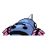

# #167 Spinarak (String Spit Pokémon)

| Official Artwork | Shiny Artwork |
|------------------|---------------|
|  |  |

**Sacred Gold:** It lies still in the same pose for days in its web, waiting for its unsuspecting prey to wander close.

**Storm Silver:** It spins a web using fine--but durable--thread. It then waits patiently for prey to be trapped.

---

## Media

### Default Sprites

| Front | Shiny | Back | Shiny |
|-------|-------|------|-------|
|  |  |  |  |

### Female Sprites

| Front | Shiny | Back | Shiny |
|-------|-------|------|-------|
| ? | ? | ? | ? |

### Cries

Latest (Gen VI+):

<audio controls>
<source src='../../assets/cries/spinarak/latest.ogg' type='audio/ogg'>
  Your browser does not support the audio element.
</audio>

Legacy:

<audio controls>
<source src='../../assets/cries/spinarak/legacy.ogg' type='audio/ogg'>
  Your browser does not support the audio element.
</audio>

---

## Pokédex Data

| National № | Type(s) | Height | Weight | Abilities | Local № |
|------------|---------|--------|--------|-----------|---------|
| #167 | {: width="48"} {: width="48"} | 0.5 m / 1.6 ft | 8.5 kg / 18.7 lbs | 1. Swarm 2. Insomnia 3. Sniper | N/A |

---

## Base Stats
|   | HP | Attack | Defense | Sp. Atk | Sp. Def | Speed |
|---|----|--------|---------|---------|---------|-------|
| **Base** | 40 | 60 | 40 | 40 | 40 | 30 |
| **Min** | 190 | 112 | 76 | 76 | 76 | 58 |
| **Max** | 284 | 240 | 196 | 196 | 196 | 174 |

The ranges shown above are for a level 100 Pokémon. Maximum values are based on a beneficial nature, 252 EVs, 31 IVs; minimum values are based on a hindering nature, 0 EVs, 0 IVs.

---

## Forms & Evolutions

!!! warning "WARNING"

    Information on evolutions may not be 100% accurate; differences between evolution methods across generations are not accounted for.

### Forms

Spinarak has no alternate forms.

### Evolution Line

1. [Spinarak](spinarak.md/)
    1. Level Up: [Ariados](ariados.md/)

---

## Training

| EV Yield | Catch Rate | Base Friendship | Base Exp. | Growth Rate | Held Items |
|----------|------------|-----------------|-----------|-------------|------------|
| 1 Attack | 255 | 70 | 50 | Fast | N/A |

---

## Breeding

| Egg Groups | Egg Cycles | Gender | Dimorphic | Color | Shape |
|------------|------------|--------|-----------|-------|-------|
| 1. Bug | 15 | 50.0% Male 50.0% Female | False | Green | Armor |

---

## Moves

!!! warning "WARNING"

    Specific move information may be incorrect. However, the general movepool should be accurate; this includes changes made in Sacred Gold and Storm Silver.

### Level Up Moves

| Lv. | Move | Type | Cat. | Power | Acc. | PP |
| --- | --- | --- | --- | --- | --- | --- |
| 1 | Bug Bite | {: width="48"} | {: width="36"} | 60 | 100 | 20 |
| 1 | Poison Sting | {: width="48"} | {: width="36"} | 15 | 100 | 35 |
| 1 | String Shot | {: width="48"} | {: width="36"} | — | 95 | 40 |
| 5 | Scary Face | {: width="48"} | {: width="36"} | — | 100 | 10 |
| 8 | Constrict | {: width="48"} | {: width="36"} | 10 | 100 | 35 |
| 12 | Leech Life | {: width="48"} | {: width="36"} | 80 | 100 | 10 |
| 15 | Night Shade | {: width="48"} | {: width="36"} | — | 100 | 15 |
| 19 | Shadow Sneak | {: width="48"} | {: width="36"} | 40 | 100 | 30 |
| 22 | Fury Swipes | {: width="48"} | {: width="36"} | 18 | 80 | 15 |
| 26 | Sucker Punch | {: width="48"} | {: width="36"} | 70 | 100 | 5 |
| 29 | Spider Web | {: width="48"} | {: width="36"} | — | — | 10 |
| 33 | Agility | {: width="48"} | {: width="36"} | — | — | 30 |
| 36 | Pin Missile | {: width="48"} | {: width="36"} | 25 | 95 | 20 |
| 40 | Psychic | {: width="48"} | {: width="36"} | 90 | 100 | 10 |
| 43 | Poison Jab | {: width="48"} | {: width="36"} | 80 | 100 | 20 |

### TM Moves

| TM | Move | Type | Cat. | Power | Acc. | PP |
| --- | --- | --- | --- | --- | --- | --- |
| TM06 | Toxic | {: width="48"} | {: width="36"} | — | 90 | 10 |
| TM10 | Hidden Power | {: width="48"} | {: width="36"} | 60 | 100 | 15 |
| TM11 | Sunny Day | {: width="48"} | {: width="36"} | — | — | 5 |
| TM17 | Protect | {: width="48"} | {: width="36"} | — | — | 10 |
| TM19 | Giga Drain | {: width="48"} | {: width="36"} | 75 | 100 | 10 |
| TM21 | Frustration | {: width="48"} | {: width="36"} | — | 100 | 20 |
| TM22 | Solar Beam | {: width="48"} | {: width="36"} | 120 | 100 | 10 |
| TM27 | Return | {: width="48"} | {: width="36"} | — | 100 | 20 |
| TM28 | Dig | {: width="48"} | {: width="36"} | 80 | 100 | 10 |
| TM29 | Psychic | {: width="48"} | {: width="36"} | 90 | 100 | 10 |
| TM32 | Double Team | {: width="48"} | {: width="36"} | — | — | 15 |
| TM36 | Sludge Bomb | {: width="48"} | {: width="36"} | 90 | 100 | 10 |
| TM42 | Facade | {: width="48"} | {: width="36"} | 70 | 100 | 20 |
| TM43 | Secret Power | {: width="48"} | {: width="36"} | 70 | 100 | 20 |
| TM44 | Rest | {: width="48"} | {: width="36"} | — | — | 5 |
| TM45 | Attract | {: width="48"} | {: width="36"} | — | 100 | 15 |
| TM46 | Thief | {: width="48"} | {: width="36"} | 60 | 100 | 25 |
| TM58 | Endure | {: width="48"} | {: width="36"} | — | — | 10 |
| TM70 | Flash | {: width="48"} | {: width="36"} | — | 100 | 20 |
| TM78 | Captivate | {: width="48"} | {: width="36"} | — | 100 | 20 |
| TM82 | Sleep Talk | {: width="48"} | {: width="36"} | — | — | 10 |
| TM83 | Natural Gift | {: width="48"} | {: width="36"} | — | 100 | 15 |
| TM84 | Poison Jab | {: width="48"} | {: width="36"} | 80 | 100 | 20 |
| TM87 | Swagger | {: width="48"} | {: width="36"} | — | 85 | 15 |
| TM90 | Substitute | {: width="48"} | {: width="36"} | — | — | 10 |

### Egg Moves

| Move | Type | Cat. | Power | Acc. | PP |
| --- | --- | --- | --- | --- | --- |
| Sonic Boom | {: width="48"} | {: width="36"} | — | 90 | 20 |
| Disable | {: width="48"} | {: width="36"} | — | 100 | 20 |
| Psybeam | {: width="48"} | {: width="36"} | 65 | 100 | 20 |
| Baton Pass | {: width="48"} | {: width="36"} | — | — | 40 |
| Pursuit | {: width="48"} | {: width="36"} | 40 | 100 | 20 |
| Signal Beam | {: width="48"} | {: width="36"} | 75 | 100 | 15 |
| Toxic Spikes | {: width="48"} | {: width="36"} | — | — | 20 |
| Poison Jab | {: width="48"} | {: width="36"} | 80 | 100 | 20 |

### Tutor Moves

| Move | Type | Cat. | Power | Acc. | PP |
| --- | --- | --- | --- | --- | --- |
| String Shot | {: width="48"} | {: width="36"} | — | 95 | 40 |
| Signal Beam | {: width="48"} | {: width="36"} | 75 | 100 | 15 |
| Bounce | {: width="48"} | {: width="36"} | 85 | 85 | 5 |
| Sucker Punch | {: width="48"} | {: width="36"} | 70 | 100 | 5 |
| Bug Bite | {: width="48"} | {: width="36"} | 60 | 100 | 20 |

