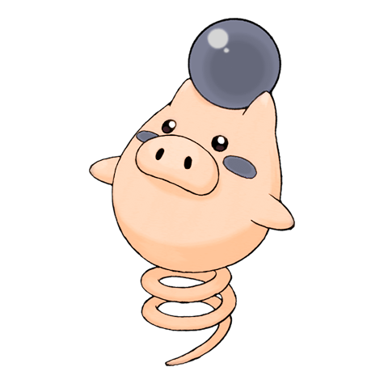
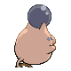

# #325 Spoink (Bounce Pokémon)

| Official Artwork | Shiny Artwork |
|------------------|---------------|
|  |  |

It bounces around on its tail to keep its heart pumping. It carries a pearl from CLAMPERL on its head.

---

## Media

### Default Sprites

| Front | Shiny | Back | Shiny |
|-------|-------|------|-------|
|  |  |  |  |

### Cries

Latest (Gen VI+):

<audio controls>
<source src='../../assets/cries/spoink/latest.ogg' type='audio/ogg'>
  Your browser does not support the audio element.
</audio>

Legacy:

<audio controls>
<source src='../../assets/cries/spoink/legacy.ogg' type='audio/ogg'>
  Your browser does not support the audio element.
</audio>

---

## Pokédex Data

| National № | Type(s) | Height | Weight | Abilities | Local № |
|------------|---------|--------|--------|-----------|---------|
| #325 | {: width="48"} | 0.7 m / 2.3 ft | 30.6 kg / 67.5 lbs | 1. Thick Fat 2. Own Tempo | N/A |

---

## Base Stats
|   | HP | Attack | Defense | Sp. Atk | Sp. Def | Speed |
|---|----|--------|---------|---------|---------|-------|
| **Base** | 60 | 25 | 35 | 70 | 80 | 60 |
| **Min** | 230 | 49 | 67 | 130 | 148 | 112 |
| **Max** | 324 | 163 | 185 | 262 | 284 | 240 |

The ranges shown above are for a level 100 Pokémon. Maximum values are based on a beneficial nature, 252 EVs, 31 IVs; minimum values are based on a hindering nature, 0 EVs, 0 IVs.

---

## Forms & Evolutions

!!! warning "WARNING"

    Information on evolutions may not be 100% accurate; differences between evolution methods across generations are not accounted for.

### Forms

Spoink has no alternate forms.

### Evolution Line

1. [Spoink](spoink.md/)
    1. Level Up: [Grumpig](grumpig.md/)

---

## Training

| EV Yield | Catch Rate | Base Friendship | Base Exp. | Growth Rate | Held Items |
|----------|------------|-----------------|-----------|-------------|------------|
| 1 Special Defense | 255 | 70 | 66 | Fast | Tanga Berry (5%) |

---

## Breeding

| Egg Groups | Egg Cycles | Gender | Dimorphic | Color | Shape |
|------------|------------|--------|-----------|-------|-------|
| 1. Ground | 20 | 50.0% Male 50.0% Female | False | Black | Arms |

---

## Moves

!!! warning "WARNING"

    Specific move information may be incorrect. However, the general movepool should be accurate; this includes changes made in Sacred Gold and Storm Silver.

### Level Up Moves

| Lv. | Move | Type | Cat. | Power | Acc. | PP |
| --- | --- | --- | --- | --- | --- | --- |
| 1 | Splash | {: width="48"} | {: width="36"} | — | — | 40 |
| 7 | Psywave | {: width="48"} | {: width="36"} | — | 100 | 15 |
| 10 | Odor Sleuth | {: width="48"} | {: width="36"} | — | — | 40 |
| 14 | Psybeam | {: width="48"} | {: width="36"} | 65 | 100 | 20 |
| 15 | Psych Up | {: width="48"} | {: width="36"} | — | — | 10 |
| 18 | Confuse Ray | {: width="48"} | {: width="36"} | — | 100 | 10 |
| 21 | Magic Coat | {: width="48"} | {: width="36"} | — | — | 15 |
| 26 | Zen Headbutt | {: width="48"} | {: width="36"} | 80 | 90 | 15 |
| 29 | Rest | {: width="48"} | {: width="36"} | — | — | 5 |
| 29 | Snore | {: width="48"} | {: width="36"} | 50 | 100 | 15 |
| 34 | Psyshock | {: width="48"} | {: width="36"} | 80 | 100 | 10 |
| 41 | Payback | {: width="48"} | {: width="36"} | 50 | 100 | 10 |
| 46 | Psychic | {: width="48"} | {: width="36"} | 90 | 100 | 10 |
| 48 | Power Gem | {: width="48"} | {: width="36"} | 80 | 100 | 20 |
| 53 | Bounce | {: width="48"} | {: width="36"} | 85 | 85 | 5 |

### TM Moves

| TM | Move | Type | Cat. | Power | Acc. | PP |
| --- | --- | --- | --- | --- | --- | --- |
| TM03 | Psyshock | {: width="48"} | {: width="36"} | 80 | 100 | 10 |
| TM04 | Calm Mind | {: width="48"} | {: width="36"} | — | — | 20 |
| TM06 | Toxic | {: width="48"} | {: width="36"} | — | 90 | 10 |
| TM10 | Hidden Power | {: width="48"} | {: width="36"} | 60 | 100 | 15 |
| TM11 | Sunny Day | {: width="48"} | {: width="36"} | — | — | 5 |
| TM12 | Taunt | {: width="48"} | {: width="36"} | — | 100 | 20 |
| TM16 | Light Screen | {: width="48"} | {: width="36"} | — | — | 30 |
| TM17 | Protect | {: width="48"} | {: width="36"} | — | — | 10 |
| TM18 | Rain Dance | {: width="48"} | {: width="36"} | — | — | 5 |
| TM19 | Telekinesis | {: width="48"} | {: width="36"} | — | — | 15 |
| TM21 | Frustration | {: width="48"} | {: width="36"} | — | 100 | 20 |
| TM27 | Return | {: width="48"} | {: width="36"} | — | 100 | 20 |
| TM29 | Psychic | {: width="48"} | {: width="36"} | 90 | 100 | 10 |
| TM30 | Shadow Ball | {: width="48"} | {: width="36"} | 80 | 100 | 15 |
| TM32 | Double Team | {: width="48"} | {: width="36"} | — | — | 15 |
| TM33 | Reflect | {: width="48"} | {: width="36"} | — | — | 20 |
| TM41 | Torment | {: width="48"} | {: width="36"} | — | 100 | 15 |
| TM42 | Facade | {: width="48"} | {: width="36"} | 70 | 100 | 20 |
| TM44 | Rest | {: width="48"} | {: width="36"} | — | — | 5 |
| TM45 | Attract | {: width="48"} | {: width="36"} | — | 100 | 15 |
| TM46 | Thief | {: width="48"} | {: width="36"} | 60 | 100 | 25 |
| TM48 | Round | {: width="48"} | {: width="36"} | 60 | 100 | 15 |
| TM57 | Charge Beam | {: width="48"} | {: width="36"} | 50 | 90 | 10 |
| TM66 | Payback | {: width="48"} | {: width="36"} | 50 | 100 | 10 |
| TM70 | Flash | {: width="48"} | {: width="36"} | — | 100 | 20 |
| TM73 | Thunder Wave | {: width="48"} | {: width="36"} | — | 90 | 20 |
| TM77 | Psych Up | {: width="48"} | {: width="36"} | — | — | 10 |
| TM85 | Dream Eater | {: width="48"} | {: width="36"} | 100 | 100 | 15 |
| TM86 | Grass Knot | {: width="48"} | {: width="36"} | — | 100 | 20 |
| TM87 | Swagger | {: width="48"} | {: width="36"} | — | 85 | 15 |
| TM90 | Substitute | {: width="48"} | {: width="36"} | — | — | 10 |
| TM92 | Trick Room | {: width="48"} | {: width="36"} | — | — | 5 |

### Egg Moves

| Move | Type | Cat. | Power | Acc. | PP |
| --- | --- | --- | --- | --- | --- |
| Whirlwind | {: width="48"} | {: width="36"} | — | — | 20 |
| Amnesia | {: width="48"} | {: width="36"} | — | — | 20 |
| Endure | {: width="48"} | {: width="36"} | — | — | 10 |
| Mirror Coat | {: width="48"} | {: width="36"} | — | 100 | 20 |
| Future Sight | {: width="48"} | {: width="36"} | 120 | 100 | 10 |
| Trick | {: width="48"} | {: width="36"} | — | 100 | 10 |
| Skill Swap | {: width="48"} | {: width="36"} | — | — | 10 |
| Extrasensory | {: width="48"} | {: width="36"} | 80 | 100 | 20 |
| Lucky Chant | {: width="48"} | {: width="36"} | — | — | 30 |
| Zen Headbutt | {: width="48"} | {: width="36"} | 80 | 90 | 15 |

### Tutor Moves

Spoink cannot learn any moves from tutors.
