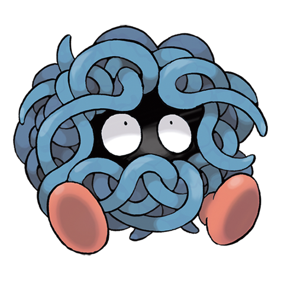
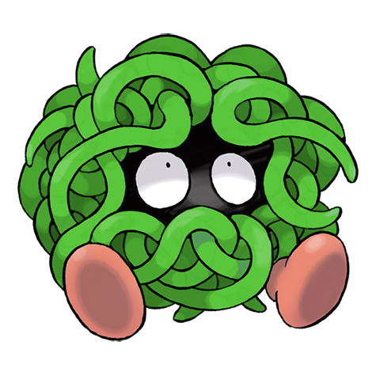
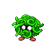

# #114 Tangela (Vine Pokémon)

| Official Artwork | Shiny Artwork |
|------------------|---------------|
|  |  |

**Sacred Gold:** The vines that cloak its entire body are always jiggling. They effectively unnerve its foes.

**Storm Silver:** It tangles any moving thing with its vines. Their subtle shaking is ticklish if you get ensnared.

---

## Media

### Default Sprites

| Front | Shiny | Back | Shiny |
|-------|-------|------|-------|
|  |  |  |  |

### Female Sprites

| Front | Shiny | Back | Shiny |
|-------|-------|------|-------|
| ? | ? | ? | ? |

### Cries

Latest (Gen VI+):

<audio controls>
<source src='../../assets/cries/tangela/latest.ogg' type='audio/ogg'>
  Your browser does not support the audio element.
</audio>

Legacy:

<audio controls>
<source src='../../assets/cries/tangela/legacy.ogg' type='audio/ogg'>
  Your browser does not support the audio element.
</audio>

---

## Pokédex Data

| National № | Type(s) | Height | Weight | Abilities | Local № |
|------------|---------|--------|--------|-----------|---------|
| #114 | {: width="48"} | 1.0 m / 3.3 ft | 35.0 kg / 77.2 lbs | 1. Chlorophyll 2. Leaf Guard 3. Regenerator | N/A |

---

## Base Stats
|   | HP | Attack | Defense | Sp. Atk | Sp. Def | Speed |
|---|----|--------|---------|---------|---------|-------|
| **Base** | 65 | 55 | 115 | 100 | 40 | 60 |
| **Min** | 240 | 103 | 211 | 184 | 76 | 112 |
| **Max** | 334 | 229 | 361 | 328 | 196 | 240 |

The ranges shown above are for a level 100 Pokémon. Maximum values are based on a beneficial nature, 252 EVs, 31 IVs; minimum values are based on a hindering nature, 0 EVs, 0 IVs.

---

## Forms & Evolutions

!!! warning "WARNING"

    Information on evolutions may not be 100% accurate; differences between evolution methods across generations are not accounted for.

### Forms

Tangela has no alternate forms.

### Evolution Line

1. [Tangela](tangela.md/)
    1. Level Up: [Tangrowth](tangrowth.md/)

---

## Training

| EV Yield | Catch Rate | Base Friendship | Base Exp. | Growth Rate | Held Items |
|----------|------------|-----------------|-----------|-------------|------------|
| 1 Defense | 45 | 50 | 87 | Medium | N/A |

---

## Breeding

| Egg Groups | Egg Cycles | Gender | Dimorphic | Color | Shape |
|------------|------------|--------|-----------|-------|-------|
| 1. Plant | 20 | 50.0% Male 50.0% Female | False | Blue | Legs |

---

## Moves

!!! warning "WARNING"

    Specific move information may be incorrect. However, the general movepool should be accurate; this includes changes made in Sacred Gold and Storm Silver.

### Level Up Moves

| Lv. | Move | Type | Cat. | Power | Acc. | PP |
| --- | --- | --- | --- | --- | --- | --- |
| 1 | Constrict | {: width="48"} | {: width="36"} | 10 | 100 | 35 |
| 1 | Ingrain | {: width="48"} | {: width="36"} | — | — | 20 |
| 5 | Sleep Powder | {: width="48"} | {: width="36"} | — | 75 | 15 |
| 8 | Absorb | {: width="48"} | {: width="36"} | 20 | 100 | 25 |
| 12 | Growth | {: width="48"} | {: width="36"} | — | — | 20 |
| 15 | Poison Powder | {: width="48"} | {: width="36"} | — | 75 | 35 |
| 19 | Vine Whip | {: width="48"} | {: width="36"} | 45 | 100 | 25 |
| 22 | Bind | {: width="48"} | {: width="36"} | 15 | 85 | 20 |
| 26 | Mega Drain | {: width="48"} | {: width="36"} | 40 | 100 | 15 |
| 29 | Stun Spore | {: width="48"} | {: width="36"} | — | 75 | 30 |
| 33 | Ancient Power | {: width="48"} | {: width="36"} | 60 | 100 | 5 |
| 36 | Knock Off | {: width="48"} | {: width="36"} | 65 | 100 | 20 |
| 40 | Natural Gift | {: width="48"} | {: width="36"} | — | 100 | 15 |
| 43 | Slam | {: width="48"} | {: width="36"} | 80 | 75 | 20 |
| 47 | Tickle | {: width="48"} | {: width="36"} | — | 100 | 20 |
| 50 | Wring Out | {: width="48"} | {: width="36"} | — | 100 | 5 |
| 54 | Power Whip | {: width="48"} | {: width="36"} | 120 | 85 | 10 |

### TM Moves

| TM | Move | Type | Cat. | Power | Acc. | PP |
| --- | --- | --- | --- | --- | --- | --- |
| HM01 | Cut | {: width="48"} | {: width="36"} | 60 | 95 | 30 |
| HM06 | Rock Smash | {: width="48"} | {: width="36"} | 60 | 100 | 15 |
| TM06 | Toxic | {: width="48"} | {: width="36"} | — | 90 | 10 |
| TM09 | Bullet Seed | {: width="48"} | {: width="36"} | 25 | 100 | 30 |
| TM10 | Hidden Power | {: width="48"} | {: width="36"} | 60 | 100 | 15 |
| TM11 | Sunny Day | {: width="48"} | {: width="36"} | — | — | 5 |
| TM15 | Hyper Beam | {: width="48"} | {: width="36"} | 150 | 90 | 5 |
| TM17 | Protect | {: width="48"} | {: width="36"} | — | — | 10 |
| TM19 | Giga Drain | {: width="48"} | {: width="36"} | 75 | 100 | 10 |
| TM21 | Frustration | {: width="48"} | {: width="36"} | — | 100 | 20 |
| TM22 | Solar Beam | {: width="48"} | {: width="36"} | 120 | 100 | 10 |
| TM27 | Return | {: width="48"} | {: width="36"} | — | 100 | 20 |
| TM32 | Double Team | {: width="48"} | {: width="36"} | — | — | 15 |
| TM33 | Reflect | {: width="48"} | {: width="36"} | — | — | 20 |
| TM34 | Shock Wave | {: width="48"} | {: width="36"} | 60 | — | 20 |
| TM36 | Sludge Bomb | {: width="48"} | {: width="36"} | 90 | 100 | 10 |
| TM42 | Facade | {: width="48"} | {: width="36"} | 70 | 100 | 20 |
| TM43 | Secret Power | {: width="48"} | {: width="36"} | 70 | 100 | 20 |
| TM44 | Rest | {: width="48"} | {: width="36"} | — | — | 5 |
| TM45 | Attract | {: width="48"} | {: width="36"} | — | 100 | 15 |
| TM46 | Thief | {: width="48"} | {: width="36"} | 60 | 100 | 25 |
| TM53 | Energy Ball | {: width="48"} | {: width="36"} | 90 | 100 | 10 |
| TM58 | Endure | {: width="48"} | {: width="36"} | — | — | 10 |
| TM68 | Giga Impact | {: width="48"} | {: width="36"} | 150 | 90 | 5 |
| TM70 | Flash | {: width="48"} | {: width="36"} | — | 100 | 20 |
| TM75 | Swords Dance | {: width="48"} | {: width="36"} | — | — | 20 |
| TM77 | Psych Up | {: width="48"} | {: width="36"} | — | — | 10 |
| TM78 | Captivate | {: width="48"} | {: width="36"} | — | 100 | 20 |
| TM82 | Sleep Talk | {: width="48"} | {: width="36"} | — | — | 10 |
| TM83 | Natural Gift | {: width="48"} | {: width="36"} | — | 100 | 15 |
| TM86 | Grass Knot | {: width="48"} | {: width="36"} | — | 100 | 20 |
| TM87 | Swagger | {: width="48"} | {: width="36"} | — | 85 | 15 |
| TM90 | Substitute | {: width="48"} | {: width="36"} | — | — | 10 |

### Egg Moves

| Move | Type | Cat. | Power | Acc. | PP |
| --- | --- | --- | --- | --- | --- |
| Mega Drain | {: width="48"} | {: width="36"} | 40 | 100 | 15 |
| Leech Seed | {: width="48"} | {: width="36"} | — | 90 | 10 |
| Confusion | {: width="48"} | {: width="36"} | 50 | 100 | 25 |
| Reflect | {: width="48"} | {: width="36"} | — | — | 20 |
| Amnesia | {: width="48"} | {: width="36"} | — | — | 20 |
| Flail | {: width="48"} | {: width="36"} | — | 100 | 15 |
| Nature Power | {: width="48"} | {: width="36"} | — | — | 20 |
| Endeavor | {: width="48"} | {: width="36"} | — | 100 | 5 |
| Power Swap | {: width="48"} | {: width="36"} | — | — | 10 |
| Leaf Storm | {: width="48"} | {: width="36"} | 130 | 90 | 5 |

### Tutor Moves

| Move | Type | Cat. | Power | Acc. | PP |
| --- | --- | --- | --- | --- | --- |
| Headbutt | {: width="48"} | {: width="36"} | 70 | 100 | 15 |
| Snore | {: width="48"} | {: width="36"} | 50 | 100 | 15 |
| Pain Split | {: width="48"} | {: width="36"} | — | — | 20 |
| Synthesis | {: width="48"} | {: width="36"} | — | — | 5 |
| Ancient Power | {: width="48"} | {: width="36"} | 60 | 100 | 5 |
| Knock Off | {: width="48"} | {: width="36"} | 65 | 100 | 20 |
| Worry Seed | {: width="48"} | {: width="36"} | — | 100 | 10 |
| Seed Bomb | {: width="48"} | {: width="36"} | 80 | 100 | 15 |

