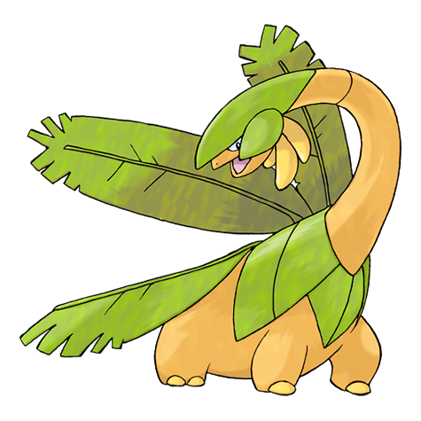
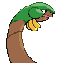

# #357 Tropius (Fruit Pokémon)

| Official Artwork | Shiny Artwork |
|------------------|---------------|
|  |  |

The bunch of fruit around its neck ripens twice a year and is delicious. It’s a highly favored tropical snack.

---

## Media

### Default Sprites

| Front | Shiny | Back | Shiny |
|-------|-------|------|-------|
|  |  |  |  |

### Cries

Latest (Gen VI+):

<audio controls>
<source src='../../assets/cries/tropius/latest.ogg' type='audio/ogg'>
  Your browser does not support the audio element.
</audio>

Legacy:

<audio controls>
<source src='../../assets/cries/tropius/legacy.ogg' type='audio/ogg'>
  Your browser does not support the audio element.
</audio>

---

## Pokédex Data

| National № | Type(s) | Height | Weight | Abilities | Local № |
|------------|---------|--------|--------|-----------|---------|
| #357 | {: width="48"} {: width="48"} | 2.0 m / 6.6 ft | 100.0 kg / 220.5 lbs | 1. Chlorophyll 2. Solar Power | N/A |

---

## Base Stats
|   | HP | Attack | Defense | Sp. Atk | Sp. Def | Speed |
|---|----|--------|---------|---------|---------|-------|
| **Base** | 110 | 90 | 90 | 90 | 90 | 65 |
| **Min** | 330 | 166 | 166 | 166 | 166 | 121 |
| **Max** | 424 | 306 | 306 | 306 | 306 | 251 |

The ranges shown above are for a level 100 Pokémon. Maximum values are based on a beneficial nature, 252 EVs, 31 IVs; minimum values are based on a hindering nature, 0 EVs, 0 IVs.

---

## Forms & Evolutions

!!! warning "WARNING"

    Information on evolutions may not be 100% accurate; differences between evolution methods across generations are not accounted for.

### Forms

Tropius has no alternate forms.

### Evolution Line

1. [Tropius](tropius.md/)

---

## Training

| EV Yield | Catch Rate | Base Friendship | Base Exp. | Growth Rate | Held Items |
|----------|------------|-----------------|-----------|-------------|------------|
| 2 Hp | 200 | 70 | 200 | Slow | N/A |

---

## Breeding

| Egg Groups | Egg Cycles | Gender | Dimorphic | Color | Shape |
|------------|------------|--------|-----------|-------|-------|
| 1. Monster 2. Plant | 25 | 50.0% Male 50.0% Female | False | Green | Quadruped |

---

## Moves

!!! warning "WARNING"

    Specific move information may be incorrect. However, the general movepool should be accurate; this includes changes made in Sacred Gold and Storm Silver.

### Level Up Moves

| Lv. | Move | Type | Cat. | Power | Acc. | PP |
| --- | --- | --- | --- | --- | --- | --- |
| 1 | Gust | {: width="48"} | {: width="36"} | 40 | 100 | 35 |
| 1 | Leer | {: width="48"} | {: width="36"} | — | 100 | 30 |
| 7 | Growth | {: width="48"} | {: width="36"} | — | — | 20 |
| 11 | Razor Leaf | {: width="48"} | {: width="36"} | 55 | 95 | 25 |
| 17 | Stomp | {: width="48"} | {: width="36"} | 65 | 100 | 20 |
| 21 | Sweet Scent | {: width="48"} | {: width="36"} | — | 100 | 20 |
| 27 | Whirlwind | {: width="48"} | {: width="36"} | — | — | 20 |
| 31 | Leaf Blade | {: width="48"} | {: width="36"} | 90 | 100 | 15 |
| 37 | Body Slam | {: width="48"} | {: width="36"} | 85 | 100 | 15 |
| 41 | Synthesis | {: width="48"} | {: width="36"} | — | — | 5 |
| 47 | Leaf Tornado | {: width="48"} | {: width="36"} | 65 | 90 | 10 |
| 51 | Air Slash | {: width="48"} | {: width="36"} | 75 | 95 | 15 |
| 57 | Bestow | {: width="48"} | {: width="36"} | — | — | 15 |
| 61 | Solar Beam | {: width="48"} | {: width="36"} | 120 | 100 | 10 |
| 65 | Outrage | {: width="48"} | {: width="36"} | 120 | 100 | 10 |
| 67 | Natural Gift | {: width="48"} | {: width="36"} | — | 100 | 15 |
| 69 | Dragon Dance | {: width="48"} | {: width="36"} | — | — | 20 |
| 71 | Leaf Storm | {: width="48"} | {: width="36"} | 130 | 90 | 5 |

### TM Moves

| TM | Move | Type | Cat. | Power | Acc. | PP |
| --- | --- | --- | --- | --- | --- | --- |
| HM01 | Cut | {: width="48"} | {: width="36"} | 60 | 95 | 30 |
| HM02 | Fly | {: width="48"} | {: width="36"} | 90 | 95 | 15 |
| HM04 | Strength | {: width="48"} | {: width="36"} | 60 | 100 | 15 |
| TM05 | Roar | {: width="48"} | {: width="36"} | — | — | 20 |
| TM06 | Toxic | {: width="48"} | {: width="36"} | — | 90 | 10 |
| TM10 | Hidden Power | {: width="48"} | {: width="36"} | 60 | 100 | 15 |
| TM11 | Sunny Day | {: width="48"} | {: width="36"} | — | — | 5 |
| TM15 | Hyper Beam | {: width="48"} | {: width="36"} | 150 | 90 | 5 |
| TM17 | Protect | {: width="48"} | {: width="36"} | — | — | 10 |
| TM20 | Safeguard | {: width="48"} | {: width="36"} | — | — | 25 |
| TM21 | Frustration | {: width="48"} | {: width="36"} | — | 100 | 20 |
| TM22 | Solar Beam | {: width="48"} | {: width="36"} | 120 | 100 | 10 |
| TM26 | Earthquake | {: width="48"} | {: width="36"} | 100 | 100 | 10 |
| TM27 | Return | {: width="48"} | {: width="36"} | — | 100 | 20 |
| TM32 | Double Team | {: width="48"} | {: width="36"} | — | — | 15 |
| TM40 | Aerial Ace | {: width="48"} | {: width="36"} | 60 | — | 20 |
| TM42 | Facade | {: width="48"} | {: width="36"} | 70 | 100 | 20 |
| TM44 | Rest | {: width="48"} | {: width="36"} | — | — | 5 |
| TM45 | Attract | {: width="48"} | {: width="36"} | — | 100 | 15 |
| TM48 | Round | {: width="48"} | {: width="36"} | 60 | 100 | 15 |
| TM53 | Energy Ball | {: width="48"} | {: width="36"} | 90 | 100 | 10 |
| TM68 | Giga Impact | {: width="48"} | {: width="36"} | 150 | 90 | 5 |
| TM70 | Flash | {: width="48"} | {: width="36"} | — | 100 | 20 |
| TM75 | Swords Dance | {: width="48"} | {: width="36"} | — | — | 20 |
| TM78 | Bulldoze | {: width="48"} | {: width="36"} | 60 | 100 | 20 |
| TM86 | Grass Knot | {: width="48"} | {: width="36"} | — | 100 | 20 |
| TM87 | Swagger | {: width="48"} | {: width="36"} | — | 85 | 15 |
| TM90 | Substitute | {: width="48"} | {: width="36"} | — | — | 10 |
| TM94 | Rock Smash | {: width="48"} | {: width="36"} | 60 | 100 | 15 |

### Egg Moves

| Move | Type | Cat. | Power | Acc. | PP |
| --- | --- | --- | --- | --- | --- |
| Razor Wind | {: width="48"} | {: width="36"} | 80 | 100 | 10 |
| Slam | {: width="48"} | {: width="36"} | 80 | 75 | 20 |
| Headbutt | {: width="48"} | {: width="36"} | 70 | 100 | 15 |
| Leech Seed | {: width="48"} | {: width="36"} | — | 90 | 10 |
| Curse | {: width="48"} | {: width="36"} | — | — | 10 |
| Synthesis | {: width="48"} | {: width="36"} | — | — | 5 |
| Nature Power | {: width="48"} | {: width="36"} | — | — | 20 |
| Bullet Seed | {: width="48"} | {: width="36"} | 25 | 100 | 30 |
| Leaf Blade | {: width="48"} | {: width="36"} | 90 | 100 | 15 |
| Dragon Dance | {: width="48"} | {: width="36"} | — | — | 20 |
| Natural Gift | {: width="48"} | {: width="36"} | — | 100 | 15 |
| Leaf Storm | {: width="48"} | {: width="36"} | 130 | 90 | 5 |

### Tutor Moves

Tropius cannot learn any moves from tutors.
