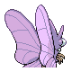

# #049 Venomoth (Poison Moth Pokémon)

| Official Artwork | Shiny Artwork |
|------------------|---------------|
|  |  |

**Sacred Gold:** When it attacks, it flaps its large wings violently to scatter its poisonous powder all around.

**Storm Silver:** The powder on its wings is poisonous if it is dark in hue. If it is light in hue, it causes paralysis.

---

## Media

### Default Sprites

| Front | Shiny | Back | Shiny |
|-------|-------|------|-------|
|  |  |  |  |

### Female Sprites

| Front | Shiny | Back | Shiny |
|-------|-------|------|-------|
| ? | ? | ? | ? |

### Cries

Latest (Gen VI+):

<audio controls>
<source src='../../assets/cries/venomoth/latest.ogg' type='audio/ogg'>
  Your browser does not support the audio element.
</audio>

Legacy:

<audio controls>
<source src='../../assets/cries/venomoth/legacy.ogg' type='audio/ogg'>
  Your browser does not support the audio element.
</audio>

---

## Pokédex Data

| National № | Type(s) | Height | Weight | Abilities | Local № |
|------------|---------|--------|--------|-----------|---------|
| #49 | {: width="48"} {: width="48"} | 1.5 m / 4.9 ft | 12.5 kg / 27.6 lbs | 1. Shield Dust 2. Tinted Lens 3. Wonder Skin | N/A |

---

## Base Stats
|   | HP | Attack | Defense | Sp. Atk | Sp. Def | Speed |
|---|----|--------|---------|---------|---------|-------|
| **Base** | 70 | 65 | 60 | 115 | 75 | 90 |
| **Min** | 250 | 121 | 112 | 211 | 139 | 166 |
| **Max** | 344 | 251 | 240 | 361 | 273 | 306 |

The ranges shown above are for a level 100 Pokémon. Maximum values are based on a beneficial nature, 252 EVs, 31 IVs; minimum values are based on a hindering nature, 0 EVs, 0 IVs.

---

## Forms & Evolutions

!!! warning "WARNING"

    Information on evolutions may not be 100% accurate; differences between evolution methods across generations are not accounted for.

### Forms

Venomoth has no alternate forms.

### Evolution Line

1. [Venonat](venonat.md/)
    1. Level Up: [Venomoth](venomoth.md/)

---

## Training

| EV Yield | Catch Rate | Base Friendship | Base Exp. | Growth Rate | Held Items |
|----------|------------|-----------------|-----------|-------------|------------|
| 1 Special Attack 1 Speed | 75 | 70 | 158 | Medium | Shed Shell (5%) |

---

## Breeding

| Egg Groups | Egg Cycles | Gender | Dimorphic | Color | Shape |
|------------|------------|--------|-----------|-------|-------|
| 1. Bug | 20 | 50.0% Male 50.0% Female | False | Purple | Bug-Wings |

---

## Moves

!!! warning "WARNING"

    Specific move information may be incorrect. However, the general movepool should be accurate; this includes changes made in Sacred Gold and Storm Silver.

### Level Up Moves

| Lv. | Move | Type | Cat. | Power | Acc. | PP |
| --- | --- | --- | --- | --- | --- | --- |
| 1 | Disable | {: width="48"} | {: width="36"} | — | 100 | 20 |
| 1 | Foresight | {: width="48"} | {: width="36"} | — | — | 40 |
| 1 | Silver Wind | {: width="48"} | {: width="36"} | 60 | 100 | 5 |
| 1 | Supersonic | {: width="48"} | {: width="36"} | — | 55 | 20 |
| 1 | Tackle | {: width="48"} | {: width="36"} | 40 | 100 | 35 |
| 5 | Supersonic | {: width="48"} | {: width="36"} | — | 55 | 20 |
| 11 | Confusion | {: width="48"} | {: width="36"} | 50 | 100 | 25 |
| 13 | Poison Powder | {: width="48"} | {: width="36"} | — | 75 | 35 |
| 17 | Leech Life | {: width="48"} | {: width="36"} | 80 | 100 | 10 |
| 19 | Signal Beam | {: width="48"} | {: width="36"} | 75 | 100 | 15 |
| 23 | Stun Spore | {: width="48"} | {: width="36"} | — | 75 | 30 |
| 25 | Psybeam | {: width="48"} | {: width="36"} | 65 | 100 | 20 |
| 29 | Sleep Powder | {: width="48"} | {: width="36"} | — | 75 | 15 |
| 31 | Ominous Wind | {: width="48"} | {: width="36"} | 60 | 100 | 5 |
| 37 | Baton Pass | {: width="48"} | {: width="36"} | — | — | 40 |
| 41 | Giga Drain | {: width="48"} | {: width="36"} | 75 | 100 | 10 |
| 47 | Sludge Bomb | {: width="48"} | {: width="36"} | 90 | 100 | 10 |
| 55 | Psychic | {: width="48"} | {: width="36"} | 90 | 100 | 10 |
| 59 | Bug Buzz | {: width="48"} | {: width="36"} | 90 | 100 | 10 |

### TM Moves

| TM | Move | Type | Cat. | Power | Acc. | PP |
| --- | --- | --- | --- | --- | --- | --- |
| TM04 | Calm Mind | {: width="48"} | {: width="36"} | — | — | 20 |
| TM06 | Toxic | {: width="48"} | {: width="36"} | — | 90 | 10 |
| TM10 | Hidden Power | {: width="48"} | {: width="36"} | 60 | 100 | 15 |
| TM11 | Sunny Day | {: width="48"} | {: width="36"} | — | — | 5 |
| TM15 | Hyper Beam | {: width="48"} | {: width="36"} | 150 | 90 | 5 |
| TM17 | Protect | {: width="48"} | {: width="36"} | — | — | 10 |
| TM19 | Giga Drain | {: width="48"} | {: width="36"} | 75 | 100 | 10 |
| TM21 | Frustration | {: width="48"} | {: width="36"} | — | 100 | 20 |
| TM22 | Solar Beam | {: width="48"} | {: width="36"} | 120 | 100 | 10 |
| TM27 | Return | {: width="48"} | {: width="36"} | — | 100 | 20 |
| TM29 | Psychic | {: width="48"} | {: width="36"} | 90 | 100 | 10 |
| TM32 | Double Team | {: width="48"} | {: width="36"} | — | — | 15 |
| TM36 | Sludge Bomb | {: width="48"} | {: width="36"} | 90 | 100 | 10 |
| TM40 | Aerial Ace | {: width="48"} | {: width="36"} | 60 | — | 20 |
| TM42 | Facade | {: width="48"} | {: width="36"} | 70 | 100 | 20 |
| TM43 | Secret Power | {: width="48"} | {: width="36"} | 70 | 100 | 20 |
| TM44 | Rest | {: width="48"} | {: width="36"} | — | — | 5 |
| TM45 | Attract | {: width="48"} | {: width="36"} | — | 100 | 15 |
| TM46 | Thief | {: width="48"} | {: width="36"} | 60 | 100 | 25 |
| TM48 | Skill Swap | {: width="48"} | {: width="36"} | — | — | 10 |
| TM51 | Roost | {: width="48"} | {: width="36"} | — | — | 5 |
| TM53 | Energy Ball | {: width="48"} | {: width="36"} | 90 | 100 | 10 |
| TM58 | Endure | {: width="48"} | {: width="36"} | — | — | 10 |
| TM62 | Silver Wind | {: width="48"} | {: width="36"} | 60 | 100 | 5 |
| TM68 | Giga Impact | {: width="48"} | {: width="36"} | 150 | 90 | 5 |
| TM70 | Flash | {: width="48"} | {: width="36"} | — | 100 | 20 |
| TM78 | Captivate | {: width="48"} | {: width="36"} | — | 100 | 20 |
| TM82 | Sleep Talk | {: width="48"} | {: width="36"} | — | — | 10 |
| TM83 | Natural Gift | {: width="48"} | {: width="36"} | — | 100 | 15 |
| TM87 | Swagger | {: width="48"} | {: width="36"} | — | 85 | 15 |
| TM89 | U Turn | {: width="48"} | {: width="36"} | 70 | 100 | 20 |
| TM90 | Substitute | {: width="48"} | {: width="36"} | — | — | 10 |

### Egg Moves

Venomoth cannot learn any moves by breeding.
### Tutor Moves

| Move | Type | Cat. | Power | Acc. | PP |
| --- | --- | --- | --- | --- | --- |
| String Shot | {: width="48"} | {: width="36"} | — | 95 | 40 |
| Swift | {: width="48"} | {: width="36"} | 60 | — | 20 |
| Snore | {: width="48"} | {: width="36"} | 50 | 100 | 15 |
| Twister | {: width="48"} | {: width="36"} | 40 | 100 | 20 |
| Air Cutter | {: width="48"} | {: width="36"} | 60 | 95 | 25 |
| Signal Beam | {: width="48"} | {: width="36"} | 75 | 100 | 15 |
| Tailwind | {: width="48"} | {: width="36"} | — | — | 15 |
| Zen Headbutt | {: width="48"} | {: width="36"} | 80 | 90 | 15 |
| Bug Bite | {: width="48"} | {: width="36"} | 60 | 100 | 20 |
| Ominous Wind | {: width="48"} | {: width="36"} | 60 | 100 | 5 |

