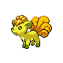
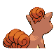
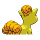

# #037 Vulpix (Fox Pokémon)

| Official Artwork | Shiny Artwork |
|------------------|---------------|
|  |  |

**Sacred Gold:** As it develops, its single white tail gains color and splits into six. It is quite warm and cuddly.

**Storm Silver:** If it is attacked by an enemy that is stronger than itself, it feigns injury to fool the enemy and escapes.

---

## Media

### Default Sprites

| Front | Shiny | Back | Shiny |
|-------|-------|------|-------|
|  |  |  |  |

### Female Sprites

| Front | Shiny | Back | Shiny |
|-------|-------|------|-------|
| ? | ? | ? | ? |

### Cries

Latest (Gen VI+):

<audio controls>
<source src='../../assets/cries/vulpix/latest.ogg' type='audio/ogg'>
  Your browser does not support the audio element.
</audio>

Legacy:

<audio controls>
<source src='../../assets/cries/vulpix/legacy.ogg' type='audio/ogg'>
  Your browser does not support the audio element.
</audio>

---

## Pokédex Data

| National № | Type(s) | Height | Weight | Abilities | Local № |
|------------|---------|--------|--------|-----------|---------|
| #37 | {: width="48"} | 0.6 m / 2.0 ft | 9.9 kg / 21.8 lbs | 1. Flash Fire 2. Drought | N/A |

---

## Base Stats
|   | HP | Attack | Defense | Sp. Atk | Sp. Def | Speed |
|---|----|--------|---------|---------|---------|-------|
| **Base** | 38 | 41 | 40 | 50 | 65 | 65 |
| **Min** | 186 | 78 | 76 | 94 | 121 | 121 |
| **Max** | 280 | 199 | 196 | 218 | 251 | 251 |

The ranges shown above are for a level 100 Pokémon. Maximum values are based on a beneficial nature, 252 EVs, 31 IVs; minimum values are based on a hindering nature, 0 EVs, 0 IVs.

---

## Forms & Evolutions

!!! warning "WARNING"

    Information on evolutions may not be 100% accurate; differences between evolution methods across generations are not accounted for.

### Forms

Vulpix has no alternate forms.

### Evolution Line

1. [Vulpix](vulpix.md/)
    1. Use Item: [Ninetales](ninetales.md/)

---

## Training

| EV Yield | Catch Rate | Base Friendship | Base Exp. | Growth Rate | Held Items |
|----------|------------|-----------------|-----------|-------------|------------|
| 1 Speed | 190 | 50 | 60 | Medium | Rawst Berry (100%) |

---

## Breeding

| Egg Groups | Egg Cycles | Gender | Dimorphic | Color | Shape |
|------------|------------|--------|-----------|-------|-------|
| 1. Ground | 20 | 25.0% Male 75.0% Female | False | Brown | Quadruped |

---

## Moves

!!! warning "WARNING"

    Specific move information may be incorrect. However, the general movepool should be accurate; this includes changes made in Sacred Gold and Storm Silver.

### Level Up Moves

| Lv. | Move | Type | Cat. | Power | Acc. | PP |
| --- | --- | --- | --- | --- | --- | --- |
| 1 | Ember | {: width="48"} | {: width="36"} | 40 | 100 | 25 |
| 4 | Tail Whip | {: width="48"} | {: width="36"} | — | 100 | 30 |
| 7 | Roar | {: width="48"} | {: width="36"} | — | — | 20 |
| 11 | Quick Attack | {: width="48"} | {: width="36"} | 40 | 100 | 30 |
| 14 | Hypnosis | {: width="48"} | {: width="36"} | — | 60 | 20 |
| 17 | Confuse Ray | {: width="48"} | {: width="36"} | — | 100 | 10 |
| 21 | Imprison | {: width="48"} | {: width="36"} | — | — | 10 |
| 24 | Flamethrower | {: width="48"} | {: width="36"} | 90 | 100 | 15 |
| 27 | Safeguard | {: width="48"} | {: width="36"} | — | — | 25 |
| 31 | Payback | {: width="48"} | {: width="36"} | 50 | 100 | 10 |
| 34 | Fire Spin | {: width="48"} | {: width="36"} | 35 | 85 | 15 |
| 37 | Captivate | {: width="48"} | {: width="36"} | — | 100 | 20 |
| 41 | Grudge | {: width="48"} | {: width="36"} | — | — | 5 |
| 44 | Extrasensory | {: width="48"} | {: width="36"} | 80 | 100 | 20 |
| 47 | Fire Blast | {: width="48"} | {: width="36"} | 110 | 85 | 5 |

### TM Moves

| TM | Move | Type | Cat. | Power | Acc. | PP |
| --- | --- | --- | --- | --- | --- | --- |
| TM05 | Roar | {: width="48"} | {: width="36"} | — | — | 20 |
| TM06 | Toxic | {: width="48"} | {: width="36"} | — | 90 | 10 |
| TM10 | Hidden Power | {: width="48"} | {: width="36"} | 60 | 100 | 15 |
| TM11 | Sunny Day | {: width="48"} | {: width="36"} | — | — | 5 |
| TM17 | Protect | {: width="48"} | {: width="36"} | — | — | 10 |
| TM20 | Safeguard | {: width="48"} | {: width="36"} | — | — | 25 |
| TM21 | Frustration | {: width="48"} | {: width="36"} | — | 100 | 20 |
| TM23 | Iron Tail | {: width="48"} | {: width="36"} | 100 | 75 | 15 |
| TM27 | Return | {: width="48"} | {: width="36"} | — | 100 | 20 |
| TM28 | Dig | {: width="48"} | {: width="36"} | 80 | 100 | 10 |
| TM32 | Double Team | {: width="48"} | {: width="36"} | — | — | 15 |
| TM35 | Flamethrower | {: width="48"} | {: width="36"} | 90 | 100 | 15 |
| TM38 | Fire Blast | {: width="48"} | {: width="36"} | 110 | 85 | 5 |
| TM42 | Facade | {: width="48"} | {: width="36"} | 70 | 100 | 20 |
| TM43 | Secret Power | {: width="48"} | {: width="36"} | 70 | 100 | 20 |
| TM44 | Rest | {: width="48"} | {: width="36"} | — | — | 5 |
| TM45 | Attract | {: width="48"} | {: width="36"} | — | 100 | 15 |
| TM50 | Overheat | {: width="48"} | {: width="36"} | 130 | 90 | 5 |
| TM53 | Energy Ball | {: width="48"} | {: width="36"} | 90 | 100 | 10 |
| TM58 | Endure | {: width="48"} | {: width="36"} | — | — | 10 |
| TM61 | Will O Wisp | {: width="48"} | {: width="36"} | — | 85 | 15 |
| TM66 | Payback | {: width="48"} | {: width="36"} | 50 | 100 | 10 |
| TM77 | Psych Up | {: width="48"} | {: width="36"} | — | — | 10 |
| TM78 | Captivate | {: width="48"} | {: width="36"} | — | 100 | 20 |
| TM79 | Dark Pulse | {: width="48"} | {: width="36"} | 80 | 100 | 15 |
| TM82 | Sleep Talk | {: width="48"} | {: width="36"} | — | — | 10 |
| TM83 | Natural Gift | {: width="48"} | {: width="36"} | — | 100 | 15 |
| TM87 | Swagger | {: width="48"} | {: width="36"} | — | 85 | 15 |
| TM90 | Substitute | {: width="48"} | {: width="36"} | — | — | 10 |

### Egg Moves

| Move | Type | Cat. | Power | Acc. | PP |
| --- | --- | --- | --- | --- | --- |
| Disable | {: width="48"} | {: width="36"} | — | 100 | 20 |
| Hypnosis | {: width="48"} | {: width="36"} | — | 60 | 20 |
| Flail | {: width="48"} | {: width="36"} | — | 100 | 15 |
| Spite | {: width="48"} | {: width="36"} | — | 100 | 10 |
| Feint Attack | {: width="48"} | {: width="36"} | 60 | — | 20 |
| Psych Up | {: width="48"} | {: width="36"} | — | — | 10 |
| Heat Wave | {: width="48"} | {: width="36"} | 95 | 90 | 10 |
| Extrasensory | {: width="48"} | {: width="36"} | 80 | 100 | 20 |
| Howl | {: width="48"} | {: width="36"} | — | — | 40 |
| Power Swap | {: width="48"} | {: width="36"} | — | — | 10 |
| Flare Blitz | {: width="48"} | {: width="36"} | 120 | 100 | 15 |
| Energy Ball | {: width="48"} | {: width="36"} | 90 | 100 | 10 |

### Tutor Moves

| Move | Type | Cat. | Power | Acc. | PP |
| --- | --- | --- | --- | --- | --- |
| Headbutt | {: width="48"} | {: width="36"} | 70 | 100 | 15 |
| Swift | {: width="48"} | {: width="36"} | 60 | — | 20 |
| Snore | {: width="48"} | {: width="36"} | 50 | 100 | 15 |
| Spite | {: width="48"} | {: width="36"} | — | 100 | 10 |
| Pain Split | {: width="48"} | {: width="36"} | — | — | 20 |
| Heat Wave | {: width="48"} | {: width="36"} | 95 | 90 | 10 |
| Role Play | {: width="48"} | {: width="36"} | — | — | 10 |
| Zen Headbutt | {: width="48"} | {: width="36"} | 80 | 90 | 15 |
| Ominous Wind | {: width="48"} | {: width="36"} | 60 | 100 | 5 |

