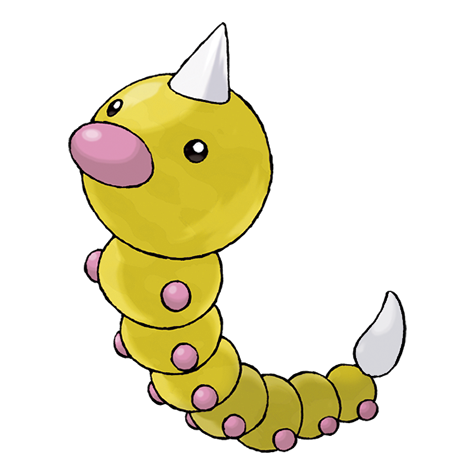

# #013 Weedle (Hairy Bug Pokémon)

| Official Artwork | Shiny Artwork |
|------------------|---------------|
|  |  |

**Sacred Gold:** Its poison stinger is very powerful. Its bright-colored body is intended to warn off its enemies.

**Storm Silver:** It attacks using a two-inch poison barb on its head. It can usually be found under the leaves it eats.

---

## Media

### Default Sprites

| Front | Shiny | Back | Shiny |
|-------|-------|------|-------|
|  |  |  |  |

### Cries

Latest (Gen VI+):

<audio controls>
<source src='../../assets/cries/weedle/latest.ogg' type='audio/ogg'>
  Your browser does not support the audio element.
</audio>

Legacy:

<audio controls>
<source src='../../assets/cries/weedle/legacy.ogg' type='audio/ogg'>
  Your browser does not support the audio element.
</audio>

---

## Pokédex Data

| National № | Type(s) | Height | Weight | Abilities | Local № |
|------------|---------|--------|--------|-----------|---------|
| #13 | {: width="48"} {: width="48"} | 0.3 m / 1.0 ft | 3.2 kg / 7.1 lbs | 1. Shield Dust 2. Run Away | N/A |

---

## Base Stats
|   | HP | Attack | Defense | Sp. Atk | Sp. Def | Speed |
|---|----|--------|---------|---------|---------|-------|
| **Base** | 40 | 35 | 30 | 20 | 20 | 50 |
| **Min** | 190 | 67 | 58 | 40 | 40 | 94 |
| **Max** | 284 | 185 | 174 | 152 | 152 | 218 |

The ranges shown above are for a level 100 Pokémon. Maximum values are based on a beneficial nature, 252 EVs, 31 IVs; minimum values are based on a hindering nature, 0 EVs, 0 IVs.

---

## Forms & Evolutions

!!! warning "WARNING"

    Information on evolutions may not be 100% accurate; differences between evolution methods across generations are not accounted for.

### Forms

Weedle has no alternate forms.

### Evolution Line

1. [Weedle](weedle.md/)
    1. Level Up: [Kakuna](kakuna.md/)
        1. Level Up: [Beedrill](beedrill.md/)

---

## Training

| EV Yield | Catch Rate | Base Friendship | Base Exp. | Growth Rate | Held Items |
|----------|------------|-----------------|-----------|-------------|------------|
| 1 Speed | 255 | 70 | 39 | Medium | N/A |

---

## Breeding

| Egg Groups | Egg Cycles | Gender | Dimorphic | Color | Shape |
|------------|------------|--------|-----------|-------|-------|
| 1. Bug | 15 | 50.0% Male 50.0% Female | False | Brown | Armor |

---

## Moves

!!! warning "WARNING"

    Specific move information may be incorrect. However, the general movepool should be accurate; this includes changes made in Sacred Gold and Storm Silver.

### Level Up Moves

| Lv. | Move | Type | Cat. | Power | Acc. | PP |
| --- | --- | --- | --- | --- | --- | --- |
| 1 | Poison Sting | {: width="48"} | {: width="36"} | 15 | 100 | 35 |
| 1 | String Shot | {: width="48"} | {: width="36"} | — | 95 | 40 |
| 15 | Bug Bite | {: width="48"} | {: width="36"} | 60 | 100 | 20 |

### TM Moves

Weedle cannot learn any TM moves.
### Egg Moves

Weedle cannot learn any moves by breeding.
### Tutor Moves

Weedle cannot learn any moves from tutors.
