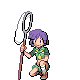
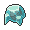
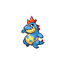

# Important Trainers

---

## Gym

### Leader Bugsy

| Pokémon | Attributes | Item | Moves |
|:-------:|------------|:----:|-------|
|  | **Lv. 18** Butterfree **Ability:** Compound Eyes   |  Damp Rock | 1. U-Turn 2. Rain Dance 3. Confusion 4. Air Cutter |
|  | **Lv. 18** Yanma **Ability:** Compound Eyes   | None | 1. U-Turn 2. Detect 3. Air Cutter 4. Ancient Power |
|  | **Lv. 18** Beedrill **Ability:** Swarm   | None | 1. U-Turn 2. Twineedle 3. Sludge Bomb 4. Cut |
|  | **Lv. 19** Heracross **Ability:** Guts   |  Damp Rock | 1. Aerial Ace 2. Counter 3. Bug Bite 4. Rain Dance |
|  | **Lv. 19** Pinsir **Ability:** Mold Breaker  | None | 1. Vital Throw 2. Fury Cutter 3. Knock Off 4. Bind |
|  | **Lv. 21** Scyther **Ability:** Technician   |  Sitrus Berry | 1. U-Turn 2. Quick Attack 3. Wing Attack 4. Swords Dance |

### Rival Silver

=== "Totodile"

	| Pokémon | Attributes | Item | Moves |
	|:-------:|------------|:----:|-------|
	|  | **Lv. 19** Murkrow **Ability:** Insomnia   | None | 1. Wing Attack 2. Astonish 3. Haze 4. Pursuit |
	|  | **Lv. 18** Gastly **Ability:** Levitate   | None | 1. Lick 2. Curse 3. Spite 4. Mean Look |
	|  | **Lv. 18** Kadabra **Ability:** Synchronize  | None | 1. Kinesis 2. Disable 3. Confusion 4. Teleport |
	|  | **Lv. 21** Bayleef **Ability:** Torrent  | None | 1. Synthesis 2. Reflect 3. Nature Power 4. Grass Whistle |
	
=== "Chikorita"

	| Pokémon | Attributes | Item | Moves |
	|:-------:|------------|:----:|-------|
	|  | **Lv. 19** Murkrow **Ability:** Insomnia   | None | 1. Wing Attack 2. Astonish 3. Haze 4. Pursuit |
	|  | **Lv. 18** Gastly **Ability:** Levitate   | None | 1. Lick 2. Curse 3. Spite 4. Mean Look |
	|  | **Lv. 18** Kadabra **Ability:** Synchronize  | None | 1. Kinesis 2. Disable 3. Confusion 4. Teleport |
	|  | **Lv. 21** Quilava **Ability:** Blaze  | None | 1. Flame Wheel 2. Quick Attack 3. Ember 4. Smokescreen |
	
=== "Cyndaquil"

	| Pokémon | Attributes | Item | Moves |
	|:-------:|------------|:----:|-------|
	|  | **Lv. 19** Murkrow **Ability:** Insomnia   | None | 1. Wing Attack 2. Astonish 3. Haze 4. Pursuit |
	|  | **Lv. 18** Gastly **Ability:** Levitate   | None | 1. Lick 2. Curse 3. Spite 4. Mean Look |
	|  | **Lv. 18** Kadabra **Ability:** Synchronize  | None | 1. Kinesis 2. Disable 3. Confusion 4. Teleport |
	|  | **Lv. 21** Croconaw **Ability:** Overgrow  | None | 1. Rage 2. Bite 3. Scary Face 4. Ice Fang |
	
