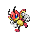

# Trainer Rosters

---

## Gym

### Generic Trainers

| Trainer | P1 | P2 | P3 | P4 | P5 | P6 |
|:-------:|:--:|:--:|:--:|:--:|:--:|:--:|
|  Bug Catcher Al |  Combee Lv. 17 |  Pineco Lv. 17 |  Kricketune Lv. 17 |
|  Bug Catcher Benny |  Paras Lv. 18 |  Nincada Lv. 18 |  Ledian Lv. 18 |  Skorupi Lv. 18 |
|  Bug Catcher Josh |  Wormadam Lv. 20 |
|  Twins Amy & Mimi |  Illumise Lv. 18 |  Volbeat Lv. 18 |  Dustox Lv. 18 |  Beautifly Lv. 18 |

### Important Trainers

1. [Leader Bugsy](important_trainers.md#leader-bugsy)

### Generic Trainers

| Trainer | P1 | P2 | P3 | P4 | P5 | P6 |
|:-------:|:--:|:--:|:--:|:--:|:--:|:--:|
|  Rival Silver |  Murkrow Lv. 19 |  Gastly Lv. 18 |  Kadabra Lv. 18 |  Bayleef Lv. 21 |
|  Rival Silver |  Murkrow Lv. 19 |  Gastly Lv. 18 |  Kadabra Lv. 18 |  Quilava Lv. 21 |
|  Rival Silver |  Murkrow Lv. 19 |  Gastly Lv. 18 |  Kadabra Lv. 18 |  Croconaw Lv. 21 |

