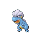

# Blackthorn City — Trainer Rosters

---

## Gym

### Generic Trainers

| Trainer | P1 | P2 | P3 | P4 | P5 | P6 |
|:-------:|:--:|:--:|:--:|:--:|:--:|:--:|
|  Ace Trainer Paulo |  Dratini Lv. 46 |  Bagon Lv. 46 |  Seadra Lv. 46 |
|  Ace Trainer Lola |  Dragonair Lv. 47 |  Gabite Lv. 47 |
|  Ace Trainer Cody |  Vibrava Lv. 47 |  Altaria Lv. 47 |
|  Ace Trainer Fran |  Flygon Lv. 48 |
|  Ace Trainer Mike |  Shelgon Lv. 48 |

### Important Trainers

1. [Leader Clair](important_trainers.md#leader-clair)
