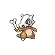

# Burned Tower — Wild Pokémon

---

## Super Rod

### Cave

| Sprite | Pokémon | Encounter Type | Level | Chance |
|:------:|---------|:--------------:|-------|--------|
|  | Rattata | {: style="max-width: 24px;"" } | 22 – 23 | 20% |
|  | Koffing | {: style="max-width: 24px;"" } | 22 – 23 | 20% |
|  | Zigzagoon | {: style="max-width: 24px;"" } | 22 – 23 | 10% |
|  | Cubone | {: style="max-width: 24px;"" } | 22 – 23 | 10% |
|  | Magby | {: style="max-width: 24px;"" } | 22 – 23 | 10% |
|  | Grimer | {: style="max-width: 24px;"" } | 22 – 23 | 10% |
|  | Duskull | {: style="max-width: 24px;"" } | 22 – 23 | 10% |
|  | Shuppet | {: style="max-width: 24px;"" } | 22 – 23 | 10% |

### Meridian Sound

| Sprite | Pokémon | Encounter Type | Level | Chance |
|:------:|---------|:--------------:|-------|--------|
|  | Raticate | {: style="max-width: 24px;"" } | 22 – 23 | 50% |
|  | Marowak | {: style="max-width: 24px;"" } | 22 – 23 | 50% |

### Pastoral Sound

| Sprite | Pokémon | Encounter Type | Level | Chance |
|:------:|---------|:--------------:|-------|--------|
|  | Chimecho | {: style="max-width: 24px;"" } | 22 – 23 | 100% |

---

## Pastoral Sound

### Cave

| Sprite | Pokémon | Encounter Type | Level | Chance |
|:------:|---------|:--------------:|-------|--------|
|  | Raticate | {: style="max-width: 24px;"" } | 23 – 24 | 20% |
|  | Koffing | {: style="max-width: 24px;"" } | 23 – 24 | 20% |
|  | Linoone | {: style="max-width: 24px;"" } | 23 – 24 | 10% |
|  | Cubone | {: style="max-width: 24px;"" } | 23 – 24 | 10% |
|  | Magby | {: style="max-width: 24px;"" } | 23 – 24 | 10% |
|  | Grimer | {: style="max-width: 24px;"" } | 23 – 24 | 10% |
|  | Duskull | {: style="max-width: 24px;"" } | 23 – 24 | 10% |
|  | Shuppet | {: style="max-width: 24px;"" } | 23 – 24 | 10% |

### Meridian Sound

| Sprite | Pokémon | Encounter Type | Level | Chance |
|:------:|---------|:--------------:|-------|--------|
|  | Weezing | {: style="max-width: 24px;"" } | 23 – 24 | 50% |
|  | Magmar | {: style="max-width: 24px;"" } | 23 – 24 | 50% |

### Pastoral Sound

| Sprite | Pokémon | Encounter Type | Level | Chance |
|:------:|---------|:--------------:|-------|--------|
|  | Chimecho | {: style="max-width: 24px;"" } | 23 – 24 | 100% |

