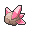

# Celadon City — Important Trainers

---

## Gym

### Leader Erika

| Pokémon | Attributes | Item | Moves |
|:-------:|------------|:----:|-------|
|  | **Lv. 62** Jumpluff **Ability:** Chlorophyll   |  Heat Rock | 1. U-Turn 2. Leech Seed 3. Sunny Day 4. Giga Drain |
|  | **Lv. 60** Meganium **Ability:** Overgrow  |  Power Herb | 1. Reflect 2. Light Screen 3. Solar Beam 4. Toxic |
|  | **Lv. 60** Leafeon **Ability:** Leaf Guard  | None | 1. Seed Bomb 2. Swords Dance 3. X-Scissor 4. Aerial Ace |
|  | **Lv. 63** Victreebel **Ability:** Chlorophyll   | None | 1. Leaf Blade 2. Synthesis 3. Sludge Bomb 4. Weather Ball |
|  | **Lv. 63** Bellossom **Ability:** Chlorophyll  |  Sitrus Berry | 1. Petal Dance 2. Synthesis 3. Teeter Dance 4. Flash |
|  | **Lv. 65** Tangrowth **Ability:** Chlorophyll  | None | 1. Power Whip 2. Earthquake 3. Focus Blast 4. Sleep Powder |

